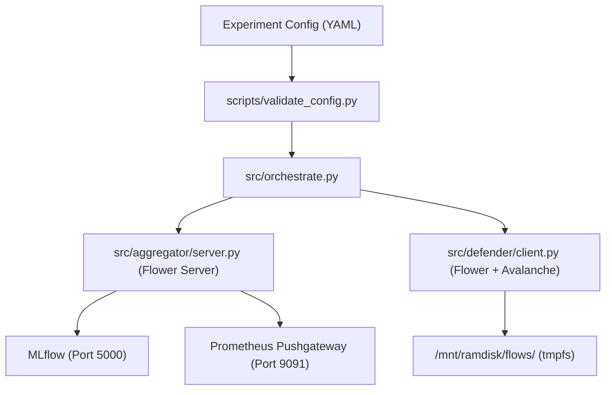

# FL-CL Experiment Runner Skill

This skill guides agents through configuring, validating, running, and diagnosing Federated Learning (FL) and Continual Learning (CL) experiments within the `fl-cl` cybersecurity research codebase.

---

## 1. Experiment Architecture Overview

Experiments are declared in YAML files under `configs/experiments/` and validated against `configs/experiment.yaml`.



---

## 2. Standard Workflow

### Step 1: Validate Experiment Configuration
Always validate configuration syntax and constraints before launching:
```bash
python .agents/skills/fl-cl-experiment-runner/scripts/validate_config.py --config configs/experiments/scenario_baseline.yaml
```

### Step 2: Choose Execution Mode

#### A. Local Simulation (Default for Development / CI)
Executes Flower FL server and client instances in-process using synthetic or RAMDisk traffic:
```bash
python src/orchestrate.py --config configs/experiments/scenario_baseline.yaml --mode simulation
```

#### B. Live Distributed Cluster (Production Proxmox Testbed)
Deploys and coordinates across LXC 300 (`fl-aggregator`), VM 310 (`defender-a`), and VM 320 (`defender-b`):
```bash
python src/orchestrate.py --config configs/experiments/scenario_baseline.yaml --mode live
```

### Step 3: Inspect Logs & Metrics
- Set log verbosity via environment variable:
  ```bash
  export FL_LOG_LEVEL=DEBUG  # or INFO, WARNING, ERROR
  ```
- View MLflow tracking UI at `http://10.10.130.10:5000` (or `http://localhost:5000` locally).
- Prometheus real-time metrics available at `http://10.10.130.10:9091/metrics`.

---

## 3. Configuration Reference

Key parameters in `configs/experiments/*.yaml`:

| Section | Parameter | Default | Range / Allowed Values | Description |
| :--- | :--- | :---: | :--- | :--- |
| `fl` | `rounds` | `20` | `1..100` | Number of global aggregation rounds |
| `fl` | `fraction_fit` | `1.0` | `0.1..1.0` | Client selection fraction per round |
| `cl` | `strategy` | `"EWC"` | `"EWC"`, `"GEM"` | Continual Learning algorithm |
| `cl` | `ewc_lambda` | `1.0` | `0.1..10.0` | Regularization penalty strength |
| `cl` | `gem_memory_strength`| `0.2`| `0.05..0.5` | GEM projection strength |
| `security`| `aggregation_strategy`| `"TrimmedMean"`| `"FedAvg"`, `"TrimmedMean"`, `"FedMedian"`, `"Krum"` | Aggregator algorithm |
| `security`| `dp_enabled` | `false`| `true`, `false` | Enable Opacus DP-SGD |
| `security`| `dp_noise_multiplier`| `0.30` | `0.1..1.5` | Gaussian noise scale ($\sigma$) |
| `model` | `type` | `"cnn"` | `"mlp"`, `"cnn"`, `"transformer"` | Backbone architecture |
| `training`| `lr` | `0.003`| `0.0001..0.05` | Optimizer learning rate |

---

## 4. Troubleshooting & Best Practices

1. **JSD Drift-Triggered Retraining**:
   When client data drift exceeds `drift_jsd_threshold: 0.15`, the orchestrator automatically re-executes local client adaptation.
2. **Dimension Constraints**:
   - `model.input_dim` must be `32`.
   - `model.num_classes` must be `5` (`0: Normal, 1: Botnet, 2: Exfil, 3: BruteForce, 4: DoS`).
   - If using `transformer`, `token_len * token_dim == 32` (e.g. 8 tokens of dim 4).
3. **RAMDisk Access**:
   Never write raw flow batches to root disk. Verify `/mnt/ramdisk/` is mounted as `tmpfs`.
