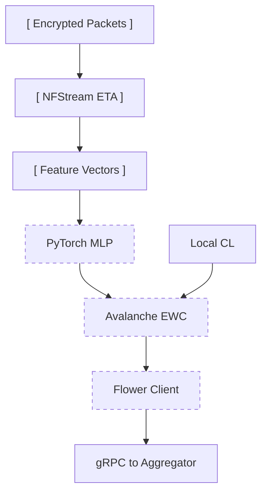
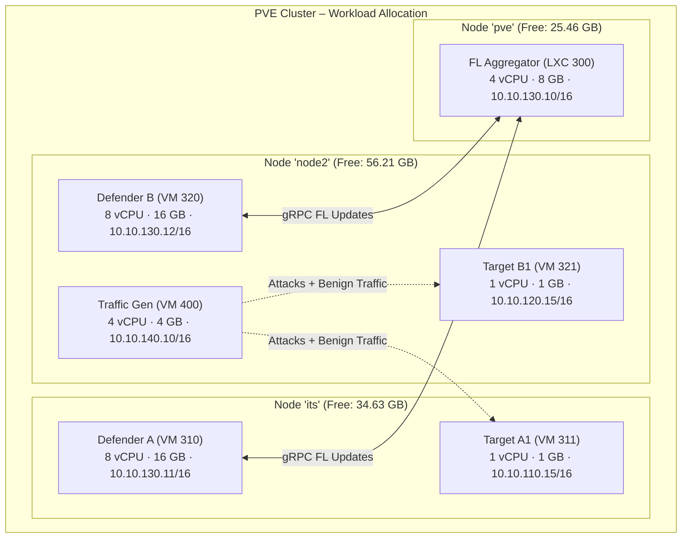
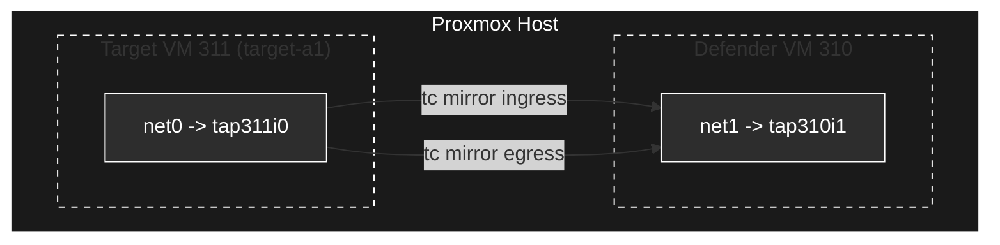
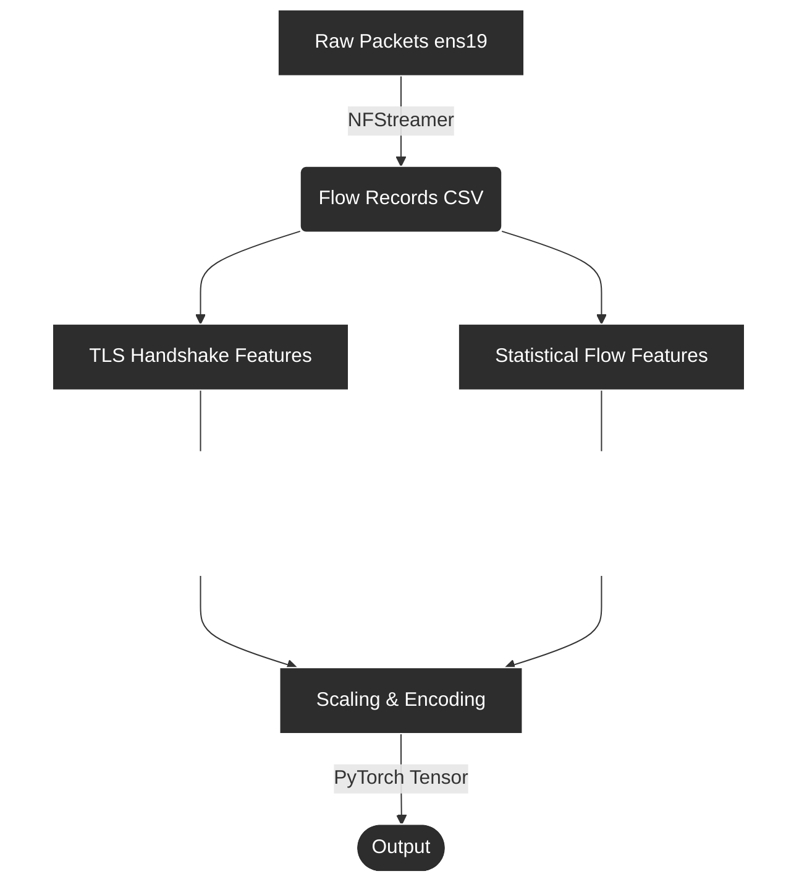
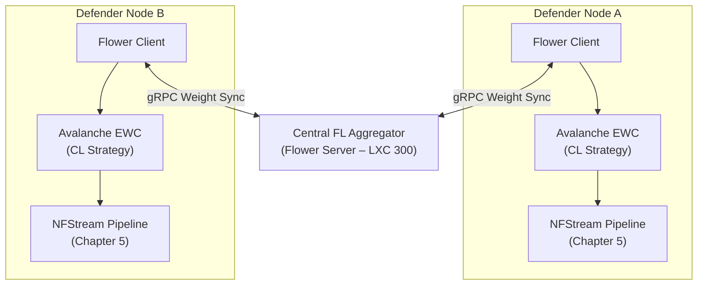

# Hybrid Federated-Continual Learning for Collaborative Cyber Defense on Encrypted Networks: A Systematic End-to-End Architecture on Heterogeneous Proxmox Clusters

**Authors**: Lead Research Architect, Collaborative Cyber Defense Initiative
**Date**: June 2026
**Version**: 2.0.0

---

### Abstract

The convergence of pervasive end-to-end encryption (TLS 1.3, HTTPS, DoH) and strict data-privacy regulation (GDPR, HIPAA) creates a dual constraint for network security: deep packet inspection is no longer viable, and raw traffic logs cannot be shared across organizational boundaries. Simultaneously, the threat landscape is non-stationary—novel attack vectors emerge continuously, causing static machine-learning classifiers to degrade through catastrophic forgetting. This paper addresses these converging challenges through a unified **Hybrid Federated-Continual Learning (FL-CL)** framework. Federated Learning enables multiple organizations to collaboratively train a shared threat-detection model without exchanging raw data; Continual Learning ensures each local model adapts to new attack streams without losing knowledge of previously encountered threats.

We present the complete system from first principles through deployment. Chapter 1 establishes the research problem and the gap that a hybrid FL-CL approach fills. Chapter 2 surveys the theoretical foundations—Encrypted Traffic Analysis (ETA), Federated Learning, and Continual Learning—and motivates their integration. Chapter 3 translates these concepts into a concrete testbed architecture on a heterogeneous 3-node Proxmox VE cluster, detailing the hardware prerequisites, the network audit required to reconcile inconsistent bridge and DNS configurations, and the resource allocation strategy across nodes of unequal capacity. Chapter 4 addresses the critical infrastructure layer: Flat L2 network configuration and a hookscript-based port-mirroring workaround that survives VM reboots. Chapter 5 defines the end-to-end data pipeline—from raw encrypted packets, through NFStream feature extraction, to labeled training-ready tensors—including the traffic generation and dataset replay strategy that feeds it. Chapter 6 details the software engine integrating PyTorch, Avalanche (EWC), and Flower. Chapter 7 provides the sequential deployment workflow. Chapter 8 defines the evaluation methodology and MLOps observability stack. Chapter 9 concludes with future directions.

---

## Chapter 1: Introduction

### 1.1 Problem Statement

Modern enterprise networks encrypt upwards of 95% of their traffic. While encryption protects user privacy, it simultaneously blinds traditional intrusion detection systems (IDS) that rely on signature-based Deep Packet Inspection (DPI). Security teams must therefore shift to **Encrypted Traffic Analysis (ETA)**—classifying flows by their metadata (handshake fingerprints, packet-size sequences, timing patterns) rather than by payload content.

Even when an organization develops an effective ETA classifier, two structural problems remain. First, isolated organizations see only their own traffic; a zero-day that appears on one network remains invisible to others until it is independently discovered. Sharing raw captures would improve collective defense, but privacy regulation forbids it. Second, network traffic is inherently non-stationary. A model trained on today's threat landscape becomes stale as adversaries evolve their tooling—and naively retraining on new data causes the model to forget previously learned attack signatures, a phenomenon termed **catastrophic forgetting**.

### 1.2 Research Gap and Proposed Approach

The Hybrid FL-CL framework addresses both problems simultaneously:

*   **Federated Learning (FL)** enables cross-organizational model collaboration by exchanging only model weight updates—never raw data—through a central aggregation server.
*   **Continual Learning (CL)** equips each local node with regularization strategies (specifically Elastic Weight Consolidation) that preserve knowledge of older threats while integrating new attack streams.

The combination produces a system where each defender node continuously adapts to its local threat environment through CL, while periodically synchronizing with a global model through FL. The result is a privacy-preserving, forgetting-resistant, collaboratively intelligent cyber defense network.

### 1.3 Contributions

This paper makes four concrete contributions:

1.  **Integrated FL-CL Architecture**: A systematic design unifying Flower (FL), Avalanche (CL), and NFStream (ETA) into a single coherent pipeline from packet capture to federated aggregation.
2.  **Heterogeneous Proxmox Testbed**: A fully specified virtual lab deployed across a 3-node PVE cluster with documented workarounds for real-world infrastructure inconsistencies (VLAN mismatch, DNS conflicts, LACP asymmetry).
3.  **Hookscript-Based Port Mirroring**: A Proxmox lifecycle-aware solution to the problem of ephemeral TAP interfaces that would otherwise break traffic capture on every VM reboot.
4.  **End-to-End Reproducibility**: Complete provisioning commands, implementation code, traffic generation strategy, and an MLOps evaluation methodology sufficient to reproduce the testbed from bare metal.

### 1.4 Paper Organization

The remainder of this paper follows the logical dependency chain of the system: theoretical foundations (Chapter 2) inform the testbed design (Chapter 3), which requires network infrastructure (Chapter 4), which feeds the data pipeline (Chapter 5), which is consumed by the software engine (Chapter 6), which is deployed through a sequential workflow (Chapter 7), and validated through structured evaluation (Chapter 8).

---

## Chapter 2: Theoretical Foundations

This chapter establishes the three pillars—ETA, FL, and CL—and motivates their integration into a single hybrid framework. Each pillar addresses one dimension of the problem: ETA handles encrypted visibility, FL handles cross-organizational collaboration, and CL handles temporal adaptation.

### 2.1 Encrypted Traffic Analysis (ETA)

Since TLS 1.3 renders payload content opaque, ETA extracts discriminative features from the observable metadata of encrypted flows:

*   **JA3/JA4 Fingerprints**: Deterministic hashes of the TLS Client Hello parameters (protocol version, cipher suites, extensions, elliptic curves). These fingerprints uniquely identify client applications—including specific malware strains and C2 frameworks like Metasploit or Cobalt Strike—regardless of destination IP or domain rotation.
*   **JA3S/JA4S Server Fingerprints**: The server-side counterpart, hashing the Server Hello response. Combined with JA3, this creates a bidirectional handshake signature.
*   **SPLT (Sequence of Packet Lengths and Times)**: An ordered list of the first *N* packet sizes and their inter-arrival times, annotated with direction (client→server or server→client). SPLT patterns are highly predictive: an SSH brute-force attempt produces regular, small-packet bursts, while a file download shows large unidirectional payloads.
*   **Flow Entropy**: The Shannon entropy $H(X) = -\sum_{i=1}^{n} P(x_i) \log_2 P(x_i)$ computed over payload byte distributions. Standard HTTPS traffic exhibits moderate entropy; encrypted tunneling or data exfiltration tends toward maximal entropy, providing a statistical discriminator.

These features are extracted without decryption, preserving the end-to-end encryption guarantee while enabling classification.

### 2.2 Federated Learning (FL)

Federated Learning decouples model training from data centralization. In each aggregation round:

1.  The central server distributes the current global model weights $\theta_G$ to all participating client nodes.
2.  Each client $k$ trains on its local dataset $D_k$, producing updated local weights $\theta_k$.
3.  The server aggregates client weights using **Federated Averaging (FedAvg)**: $\theta_G^{t+1} = \sum_{k=1}^{K} \frac{n_k}{n} \theta_k^{t+1}$, where $n_k / n$ is the fraction of total training examples contributed by client $k$.

Raw network captures never leave their originating organization. Only model parameters—which cannot be trivially reverse-engineered into individual flow records—traverse the network.

### 2.3 Continual Learning (CL) and Catastrophic Forgetting

When a neural network trained on Task $A$ (e.g., detecting SSH brute-force attacks) is subsequently trained on Task $B$ (e.g., detecting HTTPS C2 beaconing), the weights optimized for $A$ are overwritten, causing accuracy on $A$ to collapse. This is **catastrophic forgetting**.

**Elastic Weight Consolidation (EWC)** mitigates this by computing the Fisher Information Matrix $F$ after training on Task $A$, quantifying each parameter's importance. When training on Task $B$, a penalty term discourages large changes to important parameters:

$$L(\theta) = L_B(\theta) + \sum_{i} \frac{\lambda}{2} F_i (\theta_i - \theta_{A,i}^*)^2$$

This allows the model to learn new threats while preserving its competence on previously learned ones—exactly the property needed for a network sensor operating on a non-stationary traffic stream.

### 2.4 The Hybrid FL-CL Integration

The three pillars compose naturally. Each defender node runs an ETA pipeline that extracts metadata features from its local encrypted traffic. These features feed into a PyTorch model wrapped by an Avalanche CL strategy (EWC), which trains locally on each new batch of flows without forgetting older attack signatures. Periodically, the locally updated model weights are transmitted via gRPC to a central Flower aggregator, which merges them with weights from other organizations and redistributes the improved global model.



This integration is the core contribution: CL prevents each node from forgetting locally, while FL prevents each organization from being blind globally.

---

## Chapter 3: Testbed Architecture and Resource Planning

Translating the theoretical framework into a working research environment requires physical infrastructure, careful resource allocation, and a storage strategy that can sustain continuous training workloads. This chapter bridges the conceptual architecture from Chapter 2 into the concrete cluster design.

### 3.1 Hardware Prerequisites

The testbed demands sufficient compute, memory, and I/O bandwidth to run simultaneous traffic capture, feature extraction, and deep learning training across multiple VMs:

*   **CPU**: Modern multi-core processors (e.g., Intel Xeon or AMD EPYC) to provide the 26+ vCPUs required across all VMs.
*   **GPU Passthrough (Recommended)**: Deep learning models—particularly 1D-CNNs or LSTMs for advanced ETA—train significantly faster on GPUs. An NVIDIA RTX 3060/4060 or Tesla T4/P4 can be passed through to defender VMs via PCIe passthrough using `vfio` drivers on the PVE host.
*   **RAM**: Minimum 32 GB per node; recommended 64 GB+. PyTorch datasets loaded in-memory for training require at least 16 GB per defender VM.
*   **Storage**: NVMe SSDs or SSD RAID arrays exclusively. Continuous flow extraction and model checkpointing create sustained I/O load that spinning disks cannot service without becoming a system-wide bottleneck.

For labs that extend beyond synthetic virtual traffic to defend real physical network segments:

*   **Managed Switch**: An L2-managed switch supporting **802.1Q VLANs** and **SPAN port mirroring** (e.g., Ubiquiti UniFi, TP-Link JetStream, Cisco Catalyst) to mirror physical network traffic into the Proxmox host.
*   **Multi-Port NIC**: An Intel-based quad-port Gigabit card (e.g., Intel i350-T4) providing dedicated physical interfaces for each VLAN.
*   **Hardware TAP (Optional)**: An inline network TAP (e.g., Throwing Star LAN Tap) for passive capture between router and modem without switch-level configuration.

### 3.2 Cluster Topology and Network Audit

The testbed is deployed across a heterogeneous 3-node Proxmox VE cluster. Before any VMs can be provisioned, three infrastructure inconsistencies must be reconciled to prevent cluster instability:

#### A. Hostname Resolution Conflict
Node `pve` resolves cluster members via management IPs on `192.168.x.x`, while nodes `its` and `node2` resolve via the secondary network `10.10.10.x`. This mismatch causes Corosync—which requires consistent, low-latency routing—to lose quorum or enter split-brain states.

**Resolution**: Standardize `/etc/hosts` across all three hypervisors. Route all cluster-internal and FL-CL training traffic over the secondary network (`10.10.10.x`), which benefits from physical LACP bonds on `its` and `node2`. Reserve `vmbr0` management IPs for out-of-band access only:

```text
127.0.0.1       localhost

# Cluster & FL-CL Traffic (vmbr1 – Secondary Network)
10.10.10.11     its
10.10.10.12     node2
10.10.10.13     pve

# Out-of-Band Management (vmbr0)
192.168.10.2    its-mgmt
192.168.20.2    node2-mgmt
192.168.30.2    pve-mgmt
```

#### B. Split DNS for `its.ac.id`
Node `its` maps `its.ac.id` to `10.3.132.7`; node `node2` maps it to `192.168.18.199`. VMs querying this domain for package mirrors or dataset hosting will experience host-dependent routing failures.

**Resolution**: Remove all static `its.ac.id` entries from host files. Deploy a centralized DNS forwarder (e.g., `dnsmasq` on the aggregator LXC) to resolve this domain uniformly across all VMs.

#### C. VLAN Mismatch & Switch Restrictions
Initially, the research architecture isolated nodes using tagged VLANs (110, 120, 130, 140) on `vmbr1`. However, Node `node2` was configured with a VLAN-aware `vmbr1` bridge, whereas `its` and `pve` were not. Crucially, the physical unmanaged switch connecting the three Proxmox hosts does not support 802.1Q VLAN trunking, causing tagged VLAN frames to be silently dropped during cross-host communication.

**Resolution**: Keep VLAN awareness enabled on `vmbr1` on all nodes to allow for host-level tagging experiments if needed, but migrate the primary network to a flat, untagged Layer 2 topology using a `/16` subnet mask (`10.10.0.0/16`). This bypasses physical switch limitations while preserving logical subnet groupings.

### 3.3 Workload Placement Strategy

With the network harmonized, VMs are distributed across nodes based on available capacity. The two high-memory compute nodes (`its`: 34.63 GB free; `node2`: 56.21 GB free) host the resource-intensive defender VMs and traffic generators. The lighter node (`pve`: 25.46 GB free) hosts only the aggregator, which performs no training—only weight averaging.



| Hypervisor | ID | Hostname | OS | vCPU | RAM | Disk | Flat L2 IP Address | Role |
|:---|:---|:---|:---|:---|:---|:---|:---|:---|
| **pve** | 300 | `fl-aggregator` | Ubuntu 24.04 | 4 | 8 GB | 50 GB | 10.10.130.10/16 | Flower server, global model checkpoints |
| **its** | 310 | `defender-a` | Ubuntu 24.04 | 8 | 16 GB | 100 GB | 10.10.130.11/16 | NFStream capture, PyTorch/Avalanche training, Flower client |
| **its** | 311 | `target-a1` | Alpine Linux | 1 | 1 GB | 10 GB | 10.10.110.15/16 | Receives benign/malicious traffic from traffic generator |
| **node2** | 320 | `defender-b` | Ubuntu 24.04 | 8 | 16 GB | 100 GB | 10.10.130.12/16 | Parallel defender simulating a separate organization |
| **node2** | 321 | `target-b1` | Alpine Linux | 1 | 1 GB | 10 GB | 10.10.120.15/16 | Receives benign/malicious traffic from traffic generator |
| **node2** | 400 | `traffic-gen` | Kali Linux | 4 | 4 GB | 50 GB | 10.10.140.10/16 | Metasploit C2, Hydra brute-force, Selenium benign browsing |

The placement ensures that each defender VM resides on the same hypervisor as its corresponding target VM. This co-location is critical because port mirroring (Chapter 4) operates on hypervisor-local TAP interfaces—traffic cannot be mirrored across physical hosts without SDN overlay encapsulation.

### 3.4 Storage Architecture

All three nodes use a **Dell PERC H755 Adp** RAID controller presenting a 1.20 TB logical volume (`/dev/sda3`) mapped to LVM.

**LVM-Thin Provisioning**: The storage pool must be configured as LVM-Thin (`local-lvm`) rather than traditional LVM. Thin provisioning allocates physical blocks only as data is written, and—critically—enables fast, space-efficient VM snapshots. Snapshots allow researchers to checkpoint defender VMs before experimental training sessions (e.g., data poisoning tests) and roll back cleanly, a workflow that would be prohibitively expensive with thick provisioning.

**RAM Disk for Capture I/O**: Continuous NFStream extraction generates thousands of small writes per second. Routing these directly to the RAID controller creates I/O contention that degrades all VMs on the host. The solution—detailed in Chapter 5—is to buffer flow records in a `tmpfs` RAM disk inside each defender VM, batching writes to persistent storage at controlled intervals.

---

## Chapter 4: Network Infrastructure and Traffic Capture

The network infrastructure serves a single purpose in this architecture: delivering a copy of every packet traversing the target VMs' network interfaces to the defender VMs' capture interfaces, without disrupting normal traffic flow. This chapter details the flat L2 network design that provides logical separation of organizational zones and the port-mirroring mechanism that feeds the ETA pipeline described in Chapter 5.

### 4.1 Flat L2 Network and Logical Subnetting

To bypass the physical unmanaged switch constraints (lack of 802.1Q trunking support) while maintaining the logical separation of the testbed, the network utilizes a flat, untagged Layer 2 topology on the `vmbr1` bridge with a `/16` subnet mask (`10.10.0.0/16`).

Logical segmentation is enforced via IP range assignments:

| Subnet Prefix | Assigned Group | Members |
|:---|:---|:---|
| 10.10.110.0/24 | Organization A | `target-a1` (10.10.110.15) |
| 10.10.120.0/24 | Organization B | `target-b1` (10.10.120.15) |
| 10.10.130.0/24 | Aggregator & Defenders | `fl-aggregator` (10.10.130.10), `defender-a` (10.10.130.11), `defender-b` (10.10.130.12) |
| 10.10.140.0/24 | Traffic Generation | `traffic-gen` (10.10.140.10) |

This setup ensures that all nodes communicate directly over the flat L2 bridge. The traffic generator on `10.10.140.10` can directly access target hosts on `10.10.110.15` and `10.10.120.15` for replay/attacks, while the defender nodes communicate with the aggregator on `10.10.130.10` for Federated Learning weight updates. This layout retains the organizational separation design conceptually, while solving the physical networking constraints.

### 4.2 Port Mirroring via Linux Traffic Control (`tc`)

To feed the ETA pipeline, every packet to and from a target VM must be copied to the defender VM's capture interface. Proxmox does not natively support SPAN ports, so we configure mirroring at the Linux bridge level using the `tc` (traffic control) utility on the hypervisor host.

Each defender VM has two network interfaces: `net0` on `vmbr0` (management/internet) and `net1` on `vmbr1` (capture). The target VM's `net0` on `vmbr1` is the mirror source. On the hypervisor, these map to TAP interfaces named `tap<VMID>i<NET_INDEX>`:



The mirroring commands configure both ingress and egress duplication:

```bash
ip link set dev tap311i0 promisc on
ip link set dev tap310i1 promisc on

# Ingress mirror
tc qdisc add dev tap311i0 handle ffff: ingress
tc filter add dev tap311i0 parent ffff: protocol all u32 match u32 0 0 \
  action mirred egress mirror dev tap310i1

# Egress mirror
tc qdisc add dev tap311i0 root handle 1: prio
tc filter add dev tap311i0 parent 1: protocol all u32 match u32 0 0 \
  action mirred egress mirror dev tap310i1
```

### 4.3 The Hookscript Workaround for Ephemeral TAP Interfaces

A critical operational problem: Proxmox creates TAP interfaces dynamically when a VM starts and destroys them when it stops. Any `tc` rules applied manually are lost on VM reboot, silently breaking the entire capture pipeline.

The workaround leverages Proxmox's **hookscript** mechanism—a shell script bound to a VM that fires at lifecycle events (`pre-start`, `post-start`, `pre-stop`, `post-stop`). By binding a hookscript to the target VM, the hypervisor automatically re-applies `tc` mirroring rules every time the target VM boots, ensuring the capture pipeline is always active without manual intervention.

```bash
#!/bin/bash
# /var/lib/vz/snippets/mirror-hook.sh
vmid=$1; phase=$2

if [ "$vmid" = "311" ] && [ "$phase" = "post-start" ]; then
    SOURCE="tap311i0"; MIRROR="tap310i1"
    sleep 3  # Allow TAP interfaces to register in the bridge
    ip link set dev $SOURCE promisc on
    ip link set dev $MIRROR promisc on
    tc qdisc add dev $SOURCE handle ffff: ingress
    tc filter add dev $SOURCE parent ffff: protocol all u32 match u32 0 0 \
      action mirred egress mirror dev $MIRROR
    tc qdisc add dev $SOURCE root handle 1: prio
    tc filter add dev $SOURCE parent 1: protocol all u32 match u32 0 0 \
      action mirred egress mirror dev $MIRROR
fi
```

Bind the hookscript to the target VM: `qm set 311 --hookscript local:snippets/mirror-hook.sh`. Repeat on node `node2` for VM 321→VM 320.

This hookscript is the linchpin connecting the network infrastructure (this chapter) to the data pipeline (Chapter 5): without reliable mirroring, the defender nodes receive no traffic, and the entire downstream pipeline—feature extraction, CL training, FL aggregation—has no input.

---

## Chapter 5: Data Pipeline — From Encrypted Packets to Training-Ready Tensors

With the network infrastructure delivering mirrored packets to each defender node (Chapter 4), this chapter defines the complete data pipeline that transforms raw encrypted traffic into labeled feature vectors suitable for the PyTorch model described in Chapter 6. The pipeline has three stages: traffic generation (producing the raw signal), feature extraction (parsing that signal into structured metadata), and I/O optimization (ensuring the extraction process does not destabilize the host).

### 5.1 Traffic Generation and Dataset Strategy

The quality of the ML model depends entirely on the quality and diversity of its training data. The testbed employs two complementary data sources:

#### A. Established Benchmark Datasets (Offline Replay)
For reproducible baseline experiments, pre-labeled PCAP datasets are replayed over the virtual bridge interfaces using `tcpreplay`:

*   **USTC-TFC2016**: 10 categories of encrypted malware traffic and 10 categories of benign traffic. Provides the foundational multi-class classification baseline.
*   **CIC-IDS2017 / CIC-IDS2018**: Multi-day network captures with structured labels for DoS, DDoS, brute force, and web-based attacks. The temporal span enables realistic CL task sequencing.
*   **CIRA-CIC-DoHBrw-2020**: Specialized dataset for DNS-over-HTTPS exfiltration—a particularly challenging encrypted channel to detect.

Replay command on the traffic generator VM:
```bash
tcpreplay --intf1=eth0 --multiplier=2.0 --loop=5 /datasets/CIC-IDS2017-Friday.pcap
```

#### B. Live Synthetic Traffic (Online Generation)
For dynamic training that exercises the full CL adaptation loop, the traffic generator VM produces both benign and malicious flows in real-time:

*   **Benign Background**: Headless browser scripts (Selenium/Puppeteer) running on target VMs simulate human browsing patterns—search queries, streaming, social media—generating realistic TLS flow metadata with natural timing jitter.
*   **Automated Attacks**: The Kali-based traffic generator executes coordinated attack campaigns:
    *   **SSH Brute Force**: `hydra -l root -P wordlist.txt ssh://target-a1` generates rapid, small-packet authentication flows.
    *   **HTTP Flood / Slowloris**: `slowloris target-a1 -p 80 -s 100` creates distinctive long-held connection patterns.
    *   **C2 Beaconing**: Metasploit reverse HTTPS shells produce periodic, regular-interval encrypted callbacks that generate characteristic SPLT signatures.
*   **High-Volume Load**: Cisco T-Rex or Locust for stateful L4–L7 encrypted stream generation at scale.

Each attack campaign constitutes a distinct **CL task**. By running SSH brute force first, then pivoting to C2 beaconing, then introducing DoH exfiltration, the testbed creates the sequential, non-stationary data stream that exercises the EWC anti-forgetting mechanism.

### 5.2 Feature Extraction with NFStream

The defender VM's capture interface (`net1`, mapped to `ens19` or `ens20` inside the guest OS) receives the mirrored packets from Chapter 4's port mirroring. NFStream aggregates these raw packets into bidirectional flows and extracts the ETA features defined in Chapter 2:

```python
from nfstream import NFStreamer
import pandas as pd

streamer = NFStreamer(
    source="ens19",          # Mirrored capture interface
    promiscuous_mode=True,
    snapshot_length=1536,
    idle_timeout=10,         # Quick flow emission for live detection
    active_timeout=60,       # Force-flush long-lived connections
    n_dissections=20         # Deep packet inspection for TLS metadata
)

for flow in streamer:
    if flow.requested_server_name:  # TLS SNI present
        features = {
            "ja3_hash": flow.src_to_dst_ja3,
            "ja3s_hash": flow.dst_to_src_ja3,
            "sni": flow.requested_server_name,
            "bidirectional_packets": flow.bidirectional_packets,
            "bidirectional_bytes": flow.bidirectional_bytes,
            "duration_ms": flow.bidirectional_duration_ms,
            "src2dst_packets": flow.src2dst_packets,
            "dst2src_packets": flow.dst2src_packets,
        }
        # Write to RAM disk (see Section 5.3)
```

The complete feature pipeline:


### 5.3 I/O Optimization: RAM Disk Buffering

NFStream's continuous extraction generates thousands of small file writes per second. On a shared RAID controller (Dell PERC H755), this I/O pressure competes with VM disk operations across the entire hypervisor, degrading performance for all workloads.

The mitigation is a `tmpfs` RAM disk inside each defender VM that absorbs the write burst:

```bash
sudo mkdir -p /mnt/ramdisk
sudo mount -t tmpfs -o size=4G tmpfs /mnt/ramdisk
echo "tmpfs /mnt/ramdisk tmpfs size=4G 0 0" | sudo tee -a /etc/fstab
```

Flow records are written to `/mnt/ramdisk/flows/` at capture speed, then directly loaded into PyTorch tensors in-memory for training. Batched CSV files decouple capture throughput from disk I/O constraints and preserve the RAID controller's queue for VM operations.

This completes the data pipeline. The output—scaled, encoded feature vectors stored on the RAM disk—is the direct input to the Flower/Avalanche software engine described in Chapter 6.

---

## Chapter 6: Software Engine — PyTorch, Avalanche, and Flower

This chapter presents the software layer that consumes the feature vectors produced by the data pipeline (Chapter 5) and orchestrates the hybrid FL-CL training loop. The architecture comprises four components: a PyTorch neural network, an Avalanche CL strategy wrapping that network, a Flower client exposing the CL-equipped model to federated aggregation, and a Flower server performing the global weight merge.



### 6.1 Neural Network (`model.py`)

A multi-layer perceptron mapping 32 ETA features to 5 threat classes:

```python
import torch.nn as nn

class CyberDefenseNet(nn.Module):
    def __init__(self, input_dim=32, num_classes=5):
        super().__init__()
        self.fc = nn.Sequential(
            nn.Linear(input_dim, 64), nn.ReLU(), nn.Dropout(0.2),
            nn.Linear(64, 32), nn.ReLU(),
            nn.Linear(32, num_classes)  # [Normal, Botnet, Exfiltration, BruteForce, DoS]
        )
    def forward(self, x):
        return self.fc(x)
```

The 32-dimensional input corresponds to the scaled feature vector from Chapter 5's extraction pipeline. The 5 output classes align with the attack categories generated by the traffic strategy in Section 5.1.

### 6.2 Continual Learning Strategy (`cl_strategy.py`)

The EWC wrapper prevents catastrophic forgetting as the model trains on sequential attack tasks:

```python
from torch.optim import SGD
from torch.nn import CrossEntropyLoss
from avalanche.training.supervised import EWC

def get_continual_learner(model, device, ewc_lambda=0.4, class_weights=None):
    if class_weights is None:
        class_weights = [12.0, 3.0, 3.0, 15.0, 1.0]  # Overridden by experiment.yaml
    weights_tensor = torch.tensor(class_weights, dtype=torch.float32).to(device)
    return EWC(
        model=model,
        optimizer=SGD(model.parameters(), lr=0.01, momentum=0.9),
        criterion=CrossEntropyLoss(weight=weights_tensor),
        ewc_lambda=ewc_lambda,
        train_mb_size=32, train_epochs=1, eval_mb_size=32,
        device=device
    )
```

The `ewc_lambda` default of `0.4` in code is overridden at runtime by `configs/experiment.yaml` (currently set to `0.25`). This coefficient balances plasticity (ability to learn new attacks) against stability (retention of old attack knowledge) and should be tuned during evaluation (Chapter 8).

### 6.3 Flower Client (`client.py`)

The Flower client bridges the local CL training loop to the global FL aggregation. During each federated round: (1) global weights are received and injected, (2) local CL training runs on the latest captured flows from `/mnt/ramdisk/flows/`, and (3) updated weights are returned.

```python
import flwr as fl
import torch
from collections import OrderedDict
from model import CyberDefenseNet
from cl_strategy import get_continual_learner

device = torch.device("cuda" if torch.cuda.is_available() else "cpu")
net = CyberDefenseNet().to(device)
cl = get_continual_learner(net, device)

class CyberDefenseClient(fl.client.NumPyClient):
    def get_parameters(self, config):
        return [v.cpu().numpy() for _, v in net.state_dict().items()]

    def set_parameters(self, params):
        state = OrderedDict(
            {k: torch.tensor(v) for k, v in zip(net.state_dict().keys(), params)}
        )
        net.load_state_dict(state, strict=True)

    def fit(self, parameters, config):
        self.set_parameters(parameters)
        dataset = load_ramdisk_flows()   # From Chapter 5 pipeline
        cl.train(dataset)
        return self.get_parameters(config={}), len(dataset), {}

    def evaluate(self, parameters, config):
        self.set_parameters(parameters)
        test = load_validation_set()
        results = cl.eval(test)
        return float(results['Loss']), len(test), {"accuracy": float(results['Top1_Acc'])}

if __name__ == "__main__":
    fl.client.start_numpy_client(
        server_address="10.10.130.10:8080",
        client=CyberDefenseClient()
    )
```

Note that `server_address` points to the aggregator's flat L2 IP (`10.10.130.10`), matching the network layout from Chapter 3's allocation matrix.

### 6.4 Flower Aggregator (`server.py`)

The aggregator performs weighted averaging of client model updates:

```python
import flwr as fl

def weighted_avg(metrics):
    accs = [n * m["accuracy"] for n, m in metrics]
    total = [n for n, _ in metrics]
    return {"accuracy": sum(accs) / sum(total)}

strategy = fl.server.strategy.FedAvg(
    fraction_fit=1.0, fraction_evaluate=1.0,
    min_fit_clients=2, min_evaluate_clients=2, min_available_clients=2,
    evaluate_metrics_aggregation_fn=weighted_avg,
)

if __name__ == "__main__":
    fl.server.start_server(
        server_address="0.0.0.0:8080",
        config=fl.server.ServerConfig(num_rounds=100),  # Configurable via experiment.yaml
        strategy=strategy
    )
```

---

## Chapter 7: Deployment Workflow

This chapter sequences the provisioning steps from Chapters 3–6 into a linear execution order. Each phase depends on the completion of the previous one.

### Phase 1: Host-Level Configuration (All Hypervisors)

**Step 1.1 — Synchronize `/etc/hosts`**: Apply the standardized template from Section 3.2A to all three nodes.

**Step 1.2 — Enable VLAN awareness**: On nodes `its` and `pve` (already enabled on `node2`):
```bash
if ! grep -q "bridge-vlan-aware yes" /etc/network/interfaces; then
    sed -i '/iface vmbr1 inet manual/a \        bridge-vlan-aware yes' /etc/network/interfaces
    ifup --force vmbr1
fi
```

**Step 1.3 — Enable snippet storage**: Allow hookscripts on all nodes:
```bash
pvesm set local --content backup,vztmpl,iso,snippets
```

### Phase 2: VM Provisioning (Hypervisor Shells)

Deploy in dependency order: aggregator first (so clients can resolve it), then defenders, then targets, then traffic generator.

**Aggregator (Node `pve`):**
```bash
pct create 300 local:vztmpl/ubuntu-24.04-standard_24.04-1_amd64.tar.zst \
  -cores 4 -memory 8192 -swap 2048 -hostname fl-aggregator \
  -rootfs local:50 \
  -net0 name=eth0,bridge=vmbr0,ip=dhcp \
  -net1 name=eth1,bridge=vmbr1,ip=10.10.130.10/16 \
  -onboot 1 -start 1
```

**Defender A (Node `its`):**
```bash
qm create 310 --name defender-a --cores 8 --memory 16384 --balloon 8192 \
  --cpu host --sockets 1 --ostype l26 \
  --net0 virtio,bridge=vmbr0 --net1 virtio,bridge=vmbr1 \
  --scsihw virtio-scsi-pci --scsi0 local:100,discard=on \
  --boot order=scsi0 --onboot 1
```

**Target A1 (Node `its`):**
```bash
qm create 311 --name target-a1 --cores 1 --memory 1024 \
  --net0 virtio,bridge=vmbr1 \
  --scsihw virtio-scsi-pci --scsi0 local:10,discard=on
```

`target-a1` (VM 311) and `defender-a` (VM 310) are both placed on node `its`; `target-b1` (VM 321) and `defender-b` (VM 320) are both on node `node2`.

### Phase 3: Hookscript Deployment (Hypervisor Shells)

Create and bind the port-mirroring hookscript from Section 4.3 on each hypervisor hosting a target VM:
```bash
mkdir -p /var/lib/vz/snippets
# Write mirror-hook.sh (see Section 4.3)
chmod +x /var/lib/vz/snippets/mirror-hook.sh
qm set 311 --hookscript local:snippets/mirror-hook.sh  # Node its
qm set 321 --hookscript local:snippets/mirror-hook.sh  # Node node2
```

### Phase 4: Software Provisioning (Inside Guest VMs)

**Aggregator (LXC 300):**
```bash
apt update && apt install -y python3-pip python3-venv git
python3 -m venv /opt/flower-env
source /opt/flower-env/bin/activate
pip install --upgrade pip && pip install flwr
```

**Defender VMs (310 & 320):**
```bash
sudo apt update && sudo apt install -y python3-pip python3-venv libpcap-dev git
sudo mkdir -p /mnt/ramdisk
sudo mount -t tmpfs -o size=4G tmpfs /mnt/ramdisk
echo "tmpfs /mnt/ramdisk tmpfs size=4G 0 0" | sudo tee -a /etc/fstab

python3 -m venv ~/fl-cl-env && source ~/fl-cl-env/bin/activate
pip install --upgrade pip
pip install torch torchvision torchaudio --index-url https://download.pytorch.org/whl/cpu
pip install avalanche-lib flwr nfstream scikit-learn pandas numpy
```

### Phase 5: Execution Sequence

The startup order mirrors the data flow: aggregator → flow extraction → traffic generation → FL clients.

1.  **Start Flower Server** (Aggregator, LXC 300):
    ```bash
    source /opt/flower-env/bin/activate && python3 server.py
    ```
2.  **Start NFStream Capture** (Defender VMs):
    ```bash
    source ~/fl-cl-env/bin/activate
    python3 extractor.py --interface ens19 --out-dir /mnt/ramdisk/flows/
    ```
3.  **Validate Mirroring** — confirm packets arrive on the capture interface:
    ```bash
    sudo tcpdump -i ens19 -c 10
    ```
4.  **Start Traffic Generation** (VM 400): Launch attack campaigns and benign browsing scripts.
5.  **Start FL-CL Clients** (Defender VMs):
    ```bash
    source ~/fl-cl-env/bin/activate
    python3 client.py --server 10.10.130.10:8080 --client-id A
    ```

---

## Chapter 8: Evaluation Methodology and Observability

Validating the hybrid FL-CL system requires both operational verification (confirming the infrastructure works) and research evaluation (measuring the model's learning properties). This chapter defines both.

### 8.1 Operational Verification Checklist

Before initiating training, execute these infrastructure checks:

**Cluster Quorum**: Confirm Corosync sees all three nodes via the secondary network:
```bash
pvecm status
corosync-cfgtool -s
```

**Flat L2 Bridge Verification**: Confirm direct communication over the secondary network bond:
```bash
# From node 'its' (10.10.10.11) to 'node2' (10.10.10.12)
ping -c 3 10.10.10.12
```

**Flat L2 VM Connectivity**: Confirm that guest VMs on different nodes can communicate directly on the flat `10.10.0.0/16` subnet:
```bash
# From Target VM 311 (10.10.110.15 on node 'its') → Target VM 321 (10.10.120.15 on node 'node2')
# Ping should succeed with 0% packet loss
ping -c 3 10.10.120.15
```

**Hookscript Execution**: Verify mirroring activates on VM boot:
```bash
journalctl -u pvedaemon | grep "mirror-hook"
```

**Port Mirror Integrity**: On the defender VM, confirm captured packets match traffic on the target:
```bash
sudo tcpdump -i ens19 -c 10  # Should show target-a1's traffic
```

### 8.2 Research Evaluation Metrics

#### Backward Transfer (BWT) — Catastrophic Forgetting Resistance
After training on $K$ sequential attack tasks, BWT measures how much accuracy on earlier tasks has degraded:

$$\text{BWT} = \frac{1}{K-1} \sum_{i=1}^{K-1} (A_{K,i} - A_{i,i})$$

$A_{K,i}$ is accuracy on Task $i$ after completing Task $K$. BWT ≈ 0 indicates successful forgetting resistance; BWT ≪ 0 indicates severe forgetting.

#### Collaborative Generalization — Cross-Organization Knowledge Transfer
After a federated aggregation round, test whether Defender A (which has only seen SSH brute-force locally) can detect the HTTPS C2 beaconing that only Defender B observed. Improvement in cross-domain accuracy after aggregation directly measures the value of federated collaboration.

#### Classification Performance — ETA Accuracy
Network traffic classes are inherently imbalanced (benign flows vastly outnumber attacks). Report Precision, Recall, and F1-Score per class:

$$\text{F1} = 2 \cdot \frac{\text{Precision} \cdot \text{Recall}}{\text{Precision} + \text{Recall}}$$

#### Communication Overhead
Monitor gRPC payload sizes between clients and aggregator to quantify the bandwidth cost of federated synchronization. This metric informs decisions about aggregation frequency and gradient compression.

### 8.3 MLOps Observability Stack

Tracking model behavior across distributed, continually-learning nodes requires centralized experiment tracking:

*   **MLflow**: Deploy a local MLflow tracking server on the aggregator LXC. Each defender VM logs per-round metrics (loss, accuracy per task, BWT) to the central server. The aggregator automatically aggregates 5x5 confusion matrix counts returned by clients and logs styled heatmap figures to MLflow every round.
*   **Evaluation & Benchmarking Utilities**: Standalone validation scripts augment the runtime telemetry:
    *   `tools/bwt_eval_suite.py` calculates overall and class-wise performance, hashes model weights and dataset states, and generates cryptographically signed CSV reports for audit provenance.
    *   `tools/cross_dataset_benchmark.py` validates model generalization on target distributions (e.g., USTC-TFC2016) by applying a covariate shift simulation engine if physical datasets are offline.
*   **Weights & Biases (W&B)**: Alternative cloud-hosted tracker for teams preferring managed infrastructure. Particularly useful for visualizing how Client A's accuracy on Task 1 changes when Client B introduces Task 2 through federated aggregation.
*   **TensorBoard**: Standard local visualizer for monitoring weight distributions, gradient norms, and per-layer activation statistics during CL training.


The observability stack closes the feedback loop: metrics from Chapter 8 inform tuning decisions (e.g., adjusting `ewc_lambda` in Chapter 6, modifying aggregation frequency in Chapter 6.4, or rebalancing training data ratios in Chapter 5.1).

---

## Chapter 9: Conclusion and Future Directions

This paper has presented a complete, end-to-end architecture for Hybrid Federated-Continual Learning applied to collaborative cyber defense on encrypted networks. The system was designed as an integrated pipeline where each layer depends on and feeds into the next:

1.  **Theoretical foundations** (Chapter 2) identified the three converging challenges—encrypted visibility, organizational isolation, and temporal non-stationarity—and showed how ETA, FL, and CL respectively address them.
2.  **Testbed architecture** (Chapter 3) translated these requirements into a concrete 3-node Proxmox cluster, reconciling real-world infrastructure inconsistencies that would otherwise prevent distributed training.
3.  **Network infrastructure** (Chapter 4) established the Flat L2 network and hookscript-based port mirroring that reliably delivers traffic to defender nodes despite Proxmox's ephemeral TAP interface limitation.
4.  **Data pipeline** (Chapter 5) defined the traffic generation strategy—combining benchmark dataset replay with live synthetic attacks—and the NFStream extraction process that converts raw encrypted packets into training-ready feature vectors, buffered through RAM disks to avoid I/O contention.
5.  **Software engine** (Chapter 6) integrated PyTorch, Avalanche EWC, and Flower into a unified training loop where local continual learning prevents forgetting and federated aggregation distributes knowledge.
6.  **Deployment workflow** (Chapter 7) sequenced these components into an executable provisioning and startup procedure.
7.  **Evaluation methodology** (Chapter 8) established metrics for forgetting resistance (BWT), collaborative knowledge transfer, classification accuracy (F1), and communication overhead, supported by centralized MLOps tracking.

### Future Directions

Three extensions would strengthen the framework's security and scalability:

1.  **Secure Aggregation via Homomorphic Encryption**: The current FedAvg strategy transmits model weights in cleartext over gRPC/TLS. While TLS protects the transport layer, a compromised aggregator could reconstruct information about client training data from the weights themselves. Integrating homomorphic encryption or secure multi-party computation into the aggregation protocol would provide cryptographic guarantees against this vector.

2.  **Differential Privacy**: Adding calibrated noise to client weight updates before transmission would provide a formal $(\epsilon, \delta)$-privacy guarantee, bounding the information leakage per aggregation round regardless of aggregator trustworthiness.

3.  **Hardware-Accelerated Trusted Execution Environments**: Leveraging AMD SEV-SNP or Intel SGX/TDX within Proxmox VMs would protect the training process itself—ensuring that even a compromised hypervisor cannot inspect model weights or training data in memory.

These extensions would elevate the testbed from a research prototype to a deployment-ready framework for production multi-tenant cyber defense.
