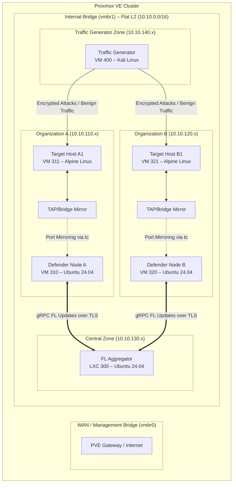

# Proxmox Testbed Architecture: Hybrid FL-CL Collaborative Cyber Defense

> **Role in the documentation set**: This document provides the *conceptual blueprint* for the virtualized testbed. It defines what each component does and why it exists. For the cluster-specific workarounds required to deploy this blueprint on a heterogeneous 3-node cluster, see [03_workarounds.md](03_workarounds.md). For the hardware, dataset, and tooling prerequisites, see [01_prerequisites.md](01_prerequisites.md). For the fully integrated research paper, see [00_research_paper.md](00_research_paper.md).

---

## 1. Conceptual Framework & Research Challenges

The testbed is designed to investigate **Hybrid Federated-Continual Learning (FL-CL)** for **Collaborative Cyber Defense** on **Encrypted Networks**, deployed on **Proxmox Virtual Environment (PVE)**. The architecture addresses three converging challenges:

*   **Encrypted Traffic Analysis (ETA):** Since payloads are encrypted (TLS 1.3, HTTPS, SSH, VPN), detection models cannot use Deep Packet Inspection (DPI). Instead, they extract metadata—cipher suites, packet sizes, inter-arrival times, TLS handshakes (JA3/JA4 fingerprints), and flow statistics—to classify traffic types. *(Paper: Chapter 2, Section 2.1)*
*   **Federated Learning (FL):** Multiple decentralized organizations train a shared threat detection model collaboratively without sharing raw traffic logs, preserving privacy and regulatory compliance (GDPR/HIPAA). Only model weight updates traverse the network. *(Paper: Chapter 2, Section 2.2)*
*   **Continual Learning (CL):** Local models continuously adapt to new, evolving attack signatures over a streaming data pipeline without forgetting previously learned attacks (**catastrophic forgetting**). Elastic Weight Consolidation (EWC) penalizes changes to parameters important for prior tasks. *(Paper: Chapter 2, Section 2.3)*
*   **Hybrid FL-CL Integration:** Defender nodes stream local network traffic and train their models continually using CL algorithms while periodically engaging in Federated aggregation rounds to synchronize global threat intelligence. CL prevents forgetting locally; FL prevents blindness globally. *(Paper: Chapter 2, Section 2.4)*

---

## 2. Proxmox VE Lab Architecture

To simulate a multi-tenant collaborative defense environment while bypassing physical switch VLAN constraints, the testbed utilizes a flat, untagged Layer 2 network on `vmbr1` using a `/16` subnet (`10.10.0.0/16`). Logical separation between organizational zones is maintained using dedicated IP prefixes within the `/16` range (Organization A: `10.10.110.x`, Organization B: `10.10.120.x`, Aggregator: `10.10.130.x`, Traffic Gen: `10.10.140.x`). Management and internet access flow through a separate bridge (`vmbr0`).



### VM / Container Breakdown

Each VM's resources, IP assignment, and role are designed to match the workload placement strategy defined in [03_workarounds.md](03_workarounds.md) Section 2.

| VM ID | Hostname | Type | OS | Resources | IP Address (vmbr1) | Role |
| :--- | :--- | :--- | :--- | :--- | :--- | :--- |
| **300** | `fl-aggregator` | LXC | Ubuntu Server 24.04 | 4 vCPU, 8 GB RAM, 50 GB Disk | `10.10.130.10/16` | Runs the Flower server, orchestrates FedAvg aggregation, and manages global model checkpoints. |
| **310** | `defender-a` | VM (GPU-passthrough optional) | Ubuntu Server 24.04 | 8 vCPU, 16 GB RAM, 100 GB Disk | `10.10.130.11/16` | Runs NFStream (ETA), PyTorch (model), Avalanche (CL), and Flower client (FL). |
| **320** | `defender-b` | VM | Ubuntu Server 24.04 | 8 vCPU, 16 GB RAM, 100 GB Disk | `10.10.130.12/16` | Parallel defender node simulating a separate organization. |
| **311** | `target-a1` | VM | Alpine Linux | 1 vCPU, 1 GB RAM, 10 GB Disk | `10.10.110.15/16` | Receives benign browsing and malicious attack traffic from the traffic generator. |
| **321** | `target-b1` | VM | Alpine Linux | 1 vCPU, 1 GB RAM, 10 GB Disk | `10.10.120.15/16` | Receives benign browsing and malicious attack traffic from the traffic generator. |
| **400** | `traffic-gen` | VM | Kali Linux | 4 vCPU, 4 GB RAM, 50 GB Disk | `10.10.140.10/16` | Generates benign SSL/TLS traffic (Selenium/Locust) and malicious encrypted channels (Metasploit C2, Hydra SSH brute-force, Slowloris). |

---

## 3. Network Configuration & Traffic Mirroring on PVE

To capture traffic on the private cluster without interfering with production networks, we configure Linux Bridges with virtual SPAN (port mirroring) using the `tc` (traffic control) utility. This is the infrastructure layer that feeds the ETA pipeline (Section 4).

### 3.1 Port Mirroring via `tc` on Linux Bridge

Each defender VM has two network interfaces: `net0` on `vmbr0` (management/internet) and `net1` on `vmbr1` (dedicated capture interface). The target VM's `net0` on `vmbr1` is the mirror source. On the hypervisor host, these map to TAP interfaces named `tap<VMID>i<NET_INDEX>`.

1. Ensure `vmbr1` is configured as a VLAN-aware bridge on all hypervisors. *(See [03_workarounds.md](03_workarounds.md) Section 1.C for reconciliation details.)*
2. Attach the target VM's NIC (`tap311i0`) and the defender VM's capture NIC (`tap310i1`) to `vmbr1`.
3. Apply the following `tc` rules on the hypervisor host to mirror all traffic from the target to the defender:

```bash
# Enable promiscuous mode on both interfaces
ip link set dev tap311i0 promisc on
ip link set dev tap310i1 promisc on

# Mirror all incoming (ingress) traffic from target to defender
tc qdisc add dev tap311i0 handle ffff: ingress
tc filter add dev tap311i0 parent ffff: protocol all u32 match u32 0 0 \
  action mirred egress mirror dev tap310i1

# Mirror all outgoing (egress) traffic from target to defender
tc qdisc add dev tap311i0 root handle 1: prio
tc filter add dev tap311i0 parent 1: protocol all u32 match u32 0 0 \
  action mirred egress mirror dev tap310i1
```

> **Critical limitation:** Proxmox destroys TAP interfaces when a VM shuts down, erasing all `tc` rules. The hookscript workaround that solves this is documented in [03_workarounds.md](03_workarounds.md) Section 4, Phase 3.

### 3.2 Multi-Node Considerations (SDN/VXLAN)

If the cluster spans multiple physical Proxmox nodes (as ours does), mirrored traffic cannot cross physical hosts natively. Each target VM must reside on the **same hypervisor** as its corresponding defender VM. The workload placement in [03_workarounds.md](03_workarounds.md) Section 2 enforces this co-location: `target-a1` (VM 311) and `defender-a` (VM 310) are both placed on node `its`; `target-b1` (VM 321) and `defender-b` (VM 320) are both on node `node2`.

For future deployments requiring cross-host mirroring, the PVE SDN feature with EVPN/VXLAN can route encapsulated span traffic across hosts.

---

## 4. Encrypted Traffic Analysis (ETA) Pipeline

With port mirroring delivering packets to the defender nodes (Section 3), this section defines the feature extraction pipeline that converts raw encrypted traffic into training-ready vectors for the ML model (Section 5).

```
Raw Packets (ens19) ──► [ NFStream ] ──► Flow Records (CSV) ──► [ Scaling & Encoding ] ──► PyTorch Tensor
```

### 4.1 Feature Extraction with NFStream

`NFStream` is a high-performance, Python-based network analysis library that aggregates raw packets into bidirectional flows and automatically extracts TLS handshake details (JA3 fingerprints) and statistical flow metrics.

**Install on Defender Nodes:**
```bash
pip install nfstream pandas scikit-learn
```

**Feature Extraction Script (`extractor.py`):**

This script captures traffic on the mirrored capture interface in real-time, generating tabular feature vectors for the neural network. Output is directed to the RAM disk buffer (see [03_workarounds.md](03_workarounds.md) Section 3.B for I/O optimization rationale).

```python
from nfstream import NFStreamer
import pandas as pd

# Listen on the mirrored capture interface (net1 inside the defender VM)
streamer = NFStreamer(
    source="ens19",          # Mirrored capture interface
    promiscuous_mode=True,
    snapshot_length=1536,
    idle_timeout=10,         # Quick flow emission (optimized for live detection)
    active_timeout=60,       # Force-flush long-lived connections
    n_dissections=20         # Enable deep packet inspection for TLS metadata
)

for flow in streamer:
    features = {
        "ja3_hash": flow.src_to_dst_ja3,
        "ja3s_hash": flow.dst_to_src_ja3,
        "sni": flow.requested_server_name,
        "application": flow.application_name,
        "bidirectional_packets": flow.bidirectional_packets,
        "bidirectional_bytes": flow.bidirectional_bytes,
        "duration_ms": flow.bidirectional_duration_ms,
        "src2dst_packets": flow.src2dst_packets,
        "dst2src_packets": flow.dst2src_packets,
        "src_ip": flow.src_ip, "dst_ip": flow.dst_ip,
        "src_port": flow.src_port, "dst_port": flow.dst_port,
    }
    # Batch and write to /mnt/ramdisk/flows/ as CSV for downstream training
```

### 4.2 Critical ETA Feature Set

These features are extracted without decryption, preserving end-to-end encryption guarantees:

*   **JA3/JA4 Client Fingerprint:** Hashes of the TLS Client Hello parameters (version, cipher suites, extensions, elliptic curves). Identifies specific malware clients (Metasploit beacons, Cobalt Strike implants) regardless of destination IP or domain rotation.
*   **JA3S/JA4S Server Fingerprint:** Hashes of the TLS Server Hello. Combined with JA3, creates a bidirectional handshake signature.
*   **SPLT (Sequence of Packet Lengths and Times):** Ordered list of the first *N* packet sizes and inter-arrival times, annotated with direction. SSH brute-force produces regular small-packet bursts; file downloads show large unidirectional payloads.
*   **Flow Entropy:** Shannon entropy of payload byte distributions: $H(X) = -\sum P(x_i) \log_2 P(x_i)$. Standard HTTPS shows moderate entropy; encrypted tunneling or exfiltration tends toward maximal entropy.

---

## 5. Software Stack: Integrating Flower (FL) and Avalanche (CL)

The core innovation is combining **Flower** (a lightweight FL framework) with **Avalanche** (the leading library for Continual Learning). This section presents the four code components that together implement the hybrid FL-CL training loop, consuming the ETA features from Section 4.

```
         +-------------------------------------------------+
         |             Central FL Aggregator               |
         |         (Flower Server – LXC 300)               |
         +------------------------+------------------------+
                                  | gRPC Weight Sync
              +-------------------+-------------------+
              |                                       |
    +---------v---------+                   +---------v---------+
    |  Defender Node A  |                   |  Defender Node B  |
    | (Flower Client)   |                   | (Flower Client)   |
    +---------+---------+                   +---------+---------+
              |                                       |
    +---------v---------+                   +---------v---------+
    | Avalanche EWC     |                   | Avalanche EWC     |
    | (CL Strategy)     |                   | (CL Strategy)     |
    +---------+---------+                   +---------+---------+
              |                                       |
    +---------v---------+                   +---------v---------+
    | NFStream Pipeline |                   | NFStream Pipeline |
    | (Section 4)       |                   | (Section 4)       |
    +-------------------+                   +-------------------+
```

### 5.1 PyTorch Neural Network (`model.py`)

A multi-layer perceptron mapping 32 scaled ETA features to 5 network threat categories. The 32-dimensional input corresponds to the feature vector from Section 4; the 5 output classes align with the attack categories generated by the traffic strategy in [01_prerequisites.md](01_prerequisites.md) Section 4.

```python
import torch.nn as nn

class CyberDefenseNet(nn.Module):
    def __init__(self, input_dim=32, num_classes=5):
        super().__init__()
        self.fc = nn.Sequential(
            nn.Linear(input_dim, 64), nn.ReLU(), nn.Dropout(0.2),
            nn.Linear(64, 32), nn.ReLU(),
            nn.Linear(32, num_classes)  # [Normal, Botnet, Exfiltration, BruteForce, DoS]
        )

    def forward(self, x):
        return self.fc(x)
```

### 5.2 Continual Learning Strategy (`cl_strategy.py`)

EWC prevents catastrophic forgetting by penalizing changes to parameters important for previously learned attack tasks:

$$L(\theta) = L_B(\theta) + \sum_{i} \frac{\lambda}{2} F_i (\theta_i - \theta_{A,i}^*)^2$$

```python
from torch.optim import SGD
from torch.nn import CrossEntropyLoss
from avalanche.training.supervised import EWC
import torch

def get_continual_learner(model, device, ewc_lambda=0.25, class_weights=None):
    if class_weights is None:
        class_weights = [8.0, 20.0, 3.0, 15.0, 10.0]
    weights_tensor = torch.tensor(class_weights, dtype=torch.float32).to(device)
    return EWC(
        model=model,
        optimizer=SGD(model.parameters(), lr=0.01, momentum=0.9),
        criterion=CrossEntropyLoss(weight=weights_tensor),
        ewc_lambda=ewc_lambda,  # Balance plasticity vs. stability
        train_mb_size=32, train_epochs=1, eval_mb_size=32,
        device=device
    )
```

### 5.3 Flower FL Client (`client.py`)

The Flower client bridges the local CL training loop to the global FL aggregation. During each federated round: (1) global weights are received and injected, (2) local CL training runs on the latest captured flows from `/mnt/ramdisk/flows/`, and (3) updated weights are returned.

```python
import flwr as fl
import torch
from collections import OrderedDict
from model import CyberDefenseNet
from cl_strategy import get_continual_learner

device = torch.device("cuda" if torch.cuda.is_available() else "cpu")
net = CyberDefenseNet().to(device)
cl = get_continual_learner(net, device)

class CyberDefenseClient(fl.client.NumPyClient):
    def get_parameters(self, config):
        return [v.cpu().numpy() for _, v in net.state_dict().items()]

    def set_parameters(self, params):
        state = OrderedDict(
            {k: torch.tensor(v) for k, v in zip(net.state_dict().keys(), params)}
        )
        net.load_state_dict(state, strict=True)

    def fit(self, parameters, config):
        self.set_parameters(parameters)
        dataset = load_ramdisk_flows()   # From Section 4 pipeline
        cl.train(dataset)
        return self.get_parameters(config={}), len(dataset), {}

    def evaluate(self, parameters, config):
        self.set_parameters(parameters)
        test = load_validation_set()
        results = cl.eval(test)
        return float(results['Loss']), len(test), {"accuracy": float(results['Top1_Acc'])}

if __name__ == "__main__":
    fl.client.start_numpy_client(
        server_address="10.10.130.10:8080",  # Aggregator Flat L2 IP
        client=CyberDefenseClient()
    )
```

### 5.4 Flower Aggregator Server (`server.py`)

The aggregator runs on LXC 300, combining parameters from all defender nodes via weighted FedAvg:

```python
import flwr as fl

def weighted_avg(metrics):
    accs = [n * m["accuracy"] for n, m in metrics]
    total = [n for n, _ in metrics]
    return {"accuracy": sum(accs) / sum(total)}

strategy = fl.server.strategy.FedAvg(
    fraction_fit=1.0, fraction_evaluate=1.0,
    min_fit_clients=2, min_evaluate_clients=2, min_available_clients=2,
    evaluate_metrics_aggregation_fn=weighted_avg,
)

if __name__ == "__main__":
    fl.server.start_server(
        server_address="0.0.0.0:8080",
        config=fl.server.ServerConfig(num_rounds=100),  # Configurable via experiment.yaml
        strategy=strategy
    )
```

### 5.5 Local LLM Reporting Engine (`generate_llm_report.py`)

To close the MLOps loop, the pipeline triggers an automated post-training analysis workflow upon completion:

```
[ orchestrate.py ] ──► [ generate_llm_report.py ] ──► Nginx Proxy ──► [ Ollama (qwen2.5-coder:1.5b) ]
                                                            │
                                                            ▼ (markdown report)
                                                     [ MLflow Runs / Artifacts ]
```

1. **Analytical Assessment**: The aggregator collects the training results (validation losses, final class-specific detection accuracies, and EWC backward transfer metrics).
2. **CPU-Bound Completion Inference**: The report engine interfaces with a local Ollama endpoint secured by an Nginx reverse proxy. To accommodate the base (non-instruct) model `qwen2.5-coder:1.5b-base`, the query is structured as a markdown completion prompt. It configures controlled thread concurrency (`num_thread: 4`) and a strict limit on generated tokens (`num_predict: 384`) to prevent timeouts and enforce high-quality, structured output.
3. **Artifact Registration**: The engine appends the generated security threat report directly to the run's `run_summary.md` and uploads it to the active MLflow run tracking database as an artifact.

---


## 6. Setup Workflow (Step-by-Step)

This section provides the generic execution sequence. For cluster-specific provisioning commands (including exact `qm create` / `pct create` flags, hookscript deployment, and software installation), see [03_workarounds.md](03_workarounds.md) Section 4.

### Phase 1: Proxmox Virtual Networks Setup
1. Log into your Proxmox server console.
2. Ensure `vmbr1` is configured as a VLAN-aware bridge on all nodes. *(See [03_workarounds.md](03_workarounds.md) Section 1.C.)*
3. Apply the standardized `/etc/hosts` template. *(See [03_workarounds.md](03_workarounds.md) Section 1.A.)*

### Phase 2: VM & Container Provisioning
1. Deploy LXC 300 (`fl-aggregator`) on node `pve` with dual NICs (`vmbr0` + `vmbr1` Flat L2 Network).
2. Deploy VM 310 (`defender-a`) on node `its` with dual NICs (`vmbr0` + `vmbr1` Flat L2 Network).
3. Deploy VM 320 (`defender-b`) on node `node2` with dual NICs (`vmbr0` + `vmbr1` Flat L2 Network).
4. Deploy target VMs 311 and 321, and traffic generator VM 400.
5. Bind hookscripts to target VMs for automatic port mirroring. *(See [03_workarounds.md](03_workarounds.md) Section 4, Phase 3.)*

### Phase 3: Traffic Generation & Data Collection
1. **Benign Background**: On target VMs, run headless browser scripts (Selenium) simulating human HTTPS browsing. *(See [01_prerequisites.md](01_prerequisites.md) Section 4.)*
2. **Benchmark Replay**: On the traffic generator VM, replay labeled PCAPs (CIC-IDS2017, USTC-TFC2016) using `tcpreplay`. *(See [01_prerequisites.md](01_prerequisites.md) Section 3.)*
3. **Live Attacks**: On the traffic generator VM, execute coordinated attack campaigns:
   * SSH brute force via `hydra` against target hosts.
   * HTTPS flood / Slowloris attacks.
   * Encrypted C2 beaconing via Metasploit reverse HTTPS shells.
4. Keep the `extractor.py` script running on defender nodes to capture flows into `/mnt/ramdisk/flows/`, labeling them based on active attack scripts.

### Phase 4: Model Execution and Verification
1. Start the Flower aggregator server on LXC 300:
   ```bash
   source /opt/flower-env/bin/activate && python3 server.py
   ```
2. Start the NFStream capture on each defender VM:
   ```bash
   source ~/fl-cl-env/bin/activate
   python3 extractor.py --interface ens19 --out-dir /mnt/ramdisk/flows/
   ```
3. Start FL-CL clients on each defender VM:
   ```bash
   python3 client.py --server 10.10.130.10:8080 --client-id A
   ```
4. Monitor training rounds via MLflow/TensorBoard. *(See [01_prerequisites.md](01_prerequisites.md) Section 5.B.)*

---

## 7. Evaluation Metrics

These metrics validate the hybrid FL-CL system's performance. For detailed evaluation methodology and the MLOps observability stack, see the research paper Chapter 8.

1. **Backward Transfer (BWT):** Measures catastrophic forgetting resistance—how much accuracy on older attack tasks degrades after training on newer ones. BWT ≈ 0 indicates successful retention.
2. **Collaborative Generalization:** Evaluates whether Defender A can detect attack variants (e.g., SSH brute force) that only occurred in Defender B's network after Federated Aggregation.
3. **Communication Overhead:** Monitors gRPC weight update payload sizes between clients and aggregator, informing decisions about aggregation frequency.
4. **ETA Classification Performance:** Tracks Precision, Recall, and F1-Score per attack class, accounting for class imbalance between benign and malicious flows.
