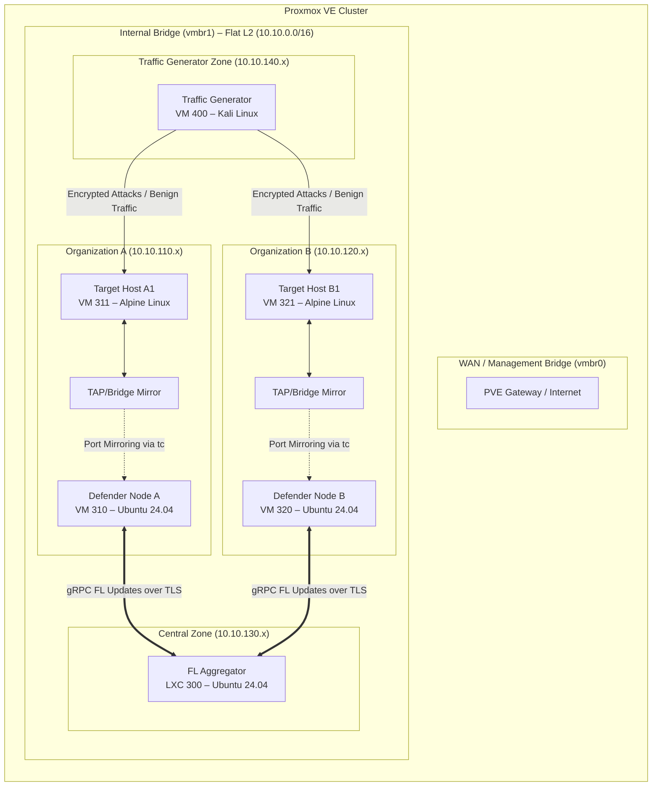
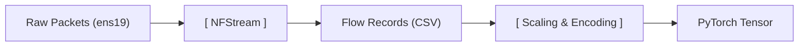
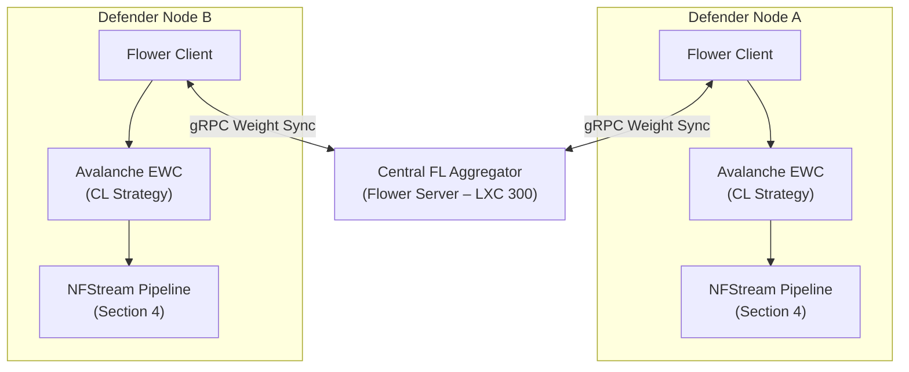
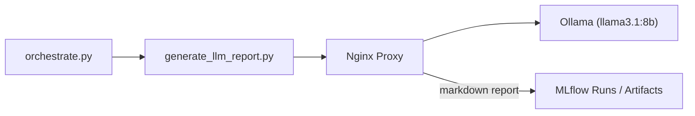

# Proxmox Testbed Architecture: Hybrid FL-CL Collaborative Cyber Defense

> **Role in the documentation set**: This document provides the *conceptual blueprint* for the virtualized testbed. It defines what each component does and why it exists. For the cluster-specific workarounds required to deploy this blueprint on a heterogeneous 3-node cluster, see [07_troubleshooting.md](07_troubleshooting.md). For the hardware, dataset, and tooling prerequisites, see [01_prerequisites.md](01_prerequisites.md). For the fully integrated research paper, see [paper/manuscript.md](paper/manuscript.md).

---

## 1. Conceptual Framework & Research Challenges

The testbed is designed to investigate **Hybrid Federated-Continual Learning (FL-CL)** for **Collaborative Cyber Defense** on **Encrypted Networks**, deployed on **Proxmox Virtual Environment (PVE)**. The architecture addresses three converging challenges:

* **Encrypted Traffic Analysis (ETA):** Since payloads are encrypted (TLS 1.3, HTTPS, SSH, VPN), detection models cannot use Deep Packet Inspection (DPI). Instead, they extract metadata—cipher suites, packet sizes, inter-arrival times, TLS handshakes (JA3/JA4 fingerprints), and flow statistics—to classify traffic types. *(Paper: Chapter 2, Section 2.1)*
* **Federated Learning (FL):** Multiple decentralized organizations train a shared threat detection model collaboratively without sharing raw traffic logs, preserving privacy and regulatory compliance (GDPR/HIPAA). Only model weight updates traverse the network. *(Paper: Chapter 2, Section 2.2)*
* **Continual Learning (CL):** Local models continuously adapt to new, evolving attack signatures over a streaming data pipeline without forgetting previously learned attacks (**catastrophic forgetting**). While Elastic Weight Consolidation (EWC) penalizes changes to parameters via Fisher Information, Gradient Episodic Memory (GEM) enforces hard geometric gradient projection constraints ($\langle g, g_k \rangle \ge s \|g_k\|_2^2$) to eliminate Fisher diagonal collapse on minority threat classes. *(Paper: Chapter 2, Section 2.3)*
* **Byzantine Robustness (FL):** Secure aggregation rules (coordinate-wise TrimmedMean and adaptive FedMedian) filter out adversarial gradient corruption and label poisoning attacks from compromised nodes. *(Paper: Chapter 2, Section 2.4)*
* **Hybrid FL-CL Integration:** Defender nodes stream local network traffic and train their models continually using CL algorithms while periodically engaging in Federated aggregation rounds to synchronize global threat intelligence. CL prevents forgetting locally; FL-CL robust aggregation prevents poisoning and blindness globally. *(Paper: Chapter 2, Section 2.5)*

---

## 2. Proxmox VE Lab Architecture

To simulate a multi-tenant collaborative defense environment while bypassing physical switch VLAN constraints, the testbed utilizes a flat, untagged Layer 2 network on `vmbr1` using a `/16` subnet (`10.10.0.0/16`). Logical separation between organizational zones is maintained using dedicated IP prefixes within the `/16` range (Organization A: `10.10.110.x`, Organization B: `10.10.120.x`, Aggregator: `10.10.130.x`, Traffic Gen: `10.10.140.x`). Management and internet access flow through a separate bridge (`vmbr0`).


```mermaid
flowchart TD
    subgraph PVE_Cluster ["Proxmox VE Cluster"]
        direction TB
        subgraph WAN_Mgmt ["WAN / Management Bridge (vmbr0)"]
            Router["PVE Gateway / Internet"]
        end

        subgraph SDN ["Internal Bridge (vmbr1) – Flat L2 (10.10.0.0/16)"]
            direction TB
            subgraph CentralZone ["Central Zone (10.10.130.x)"]
                Aggregator["FL Aggregator<br/>LXC 300 – Ubuntu 24.04"]
            end

            subgraph OrgA ["Organization A (10.10.110.x)"]
                direction TB
                DefenderA["Defender Node A<br/>VM 310 – Ubuntu 24.04"]
                TargetA["Target Host A1<br/>VM 311 – Alpine Linux"]
                MirrorA["TAP/Bridge Mirror"]
            end

            subgraph OrgB ["Organization B (10.10.120.x)"]
                direction TB
                DefenderB["Defender Node B<br/>VM 320 – Ubuntu 24.04"]
                TargetB["Target Host B1<br/>VM 321 – Alpine Linux"]
                MirrorB["TAP/Bridge Mirror"]
            end

            subgraph TrafficZone ["Traffic Generator Zone (10.10.140.x)"]
                Attacker["Traffic Generator<br/>VM 400 – Kali Linux"]
            end
        end
    end

    Attacker -->|Encrypted Attacks / Benign Traffic| TargetA
    Attacker -->|Encrypted Attacks / Benign Traffic| TargetB

    TargetA <--> MirrorA
    TargetB <--> MirrorB

    MirrorA -.->|Port Mirroring via tc| DefenderA
    MirrorB -.->|Port Mirroring via tc| DefenderB

    DefenderA <==>|gRPC FL Updates over TLS| Aggregator
    DefenderB <==>|gRPC FL Updates over TLS| Aggregator
```

### VM / Container Breakdown

Each VM's resources, IP assignment, and role are designed to match the workload placement strategy defined in [07_troubleshooting.md](07_troubleshooting.md) Section 2.

| VM ID | Hostname | Type | OS | Resources | IP Address (vmbr1) | Role |
| :--- | :--- | :--- | :--- | :--- | :--- | :--- |
| **300** | `fl-aggregator` | LXC | Ubuntu Server 24.04 | 4 vCPU, 8 GB RAM, 50 GB Disk | `10.10.130.10/16` | Runs the Flower server, orchestrates FedAvg aggregation, and manages global model checkpoints. |
| **310** | `defender-a` | VM (GPU-passthrough optional) | Ubuntu Server 24.04 | 8 vCPU, 16 GB RAM, 100 GB Disk | `10.10.130.11/16` | Runs NFStream (ETA), PyTorch (model), Avalanche (CL), and Flower client (FL). |
| **320** | `defender-b` | VM | Ubuntu Server 24.04 | 8 vCPU, 16 GB RAM, 100 GB Disk | `10.10.130.12/16` | Parallel defender node simulating a separate organization. |
| **311** | `target-a1` | VM | Alpine Linux | 1 vCPU, 1 GB RAM, 10 GB Disk | `10.10.110.15/16` | Receives benign browsing and malicious attack traffic from the traffic generator. |
| **321** | `target-b1` | VM | Alpine Linux | 1 vCPU, 1 GB RAM, 10 GB Disk | `10.10.120.15/16` | Receives benign browsing and malicious attack traffic from the traffic generator. |
| **400** | `traffic-gen` | VM | Kali Linux | 4 vCPU, 4 GB RAM, 50 GB Disk | `10.10.140.10/16` | Generates benign SSL/TLS traffic (Selenium/Locust) and malicious encrypted channels (Metasploit C2, Hydra SSH brute-force, Slowloris). |

---

## 3. Network Configuration & Traffic Mirroring on PVE

To capture traffic on the private cluster without interfering with production networks, we configure Linux Bridges with virtual SPAN (port mirroring) using the `tc` (traffic control) utility. This is the infrastructure layer that feeds the ETA pipeline (Section 4).

### 3.1 Port Mirroring via `tc` on Linux Bridge

Each defender VM has two network interfaces: `net0` on `vmbr0` (management/internet) and `net1` on `vmbr1` (dedicated capture interface). The target VM's `net0` on `vmbr1` is the mirror source. On the hypervisor host, these map to TAP interfaces named `tap<VMID>i<NET_INDEX>`.

1. Ensure `vmbr1` is configured as a VLAN-aware bridge on all hypervisors. *(See [07_troubleshooting.md](07_troubleshooting.md) Section 1.C for reconciliation details.)*
2. Attach the target VM's NIC (`tap311i0`) and the defender VM's capture NIC (`tap310i1`) to `vmbr1`.
3. Apply the following `tc` rules on the hypervisor host to mirror all traffic from the target to the defender:

```bash
# Enable promiscuous mode on both interfaces
ip link set dev tap311i0 promisc on
ip link set dev tap310i1 promisc on

# Mirror all incoming (ingress) traffic from target to defender
tc qdisc add dev tap311i0 handle ffff: ingress
tc filter add dev tap311i0 parent ffff: protocol all u32 match u32 0 0 \
 action mirred egress mirror dev tap310i1

# Mirror all outgoing (egress) traffic from target to defender
tc qdisc add dev tap311i0 root handle 1: prio
tc filter add dev tap311i0 parent 1: protocol all u32 match u32 0 0 \
 action mirred egress mirror dev tap310i1
```

> **Critical limitation:** Proxmox destroys TAP interfaces when a VM shuts down, erasing all `tc` rules. The hookscript workaround that solves this is documented in [07_troubleshooting.md](07_troubleshooting.md) Section 4, Phase 3.

### 3.2 Multi-Node Considerations (SDN/VXLAN)

If the cluster spans multiple physical Proxmox nodes (as ours does), mirrored traffic cannot cross physical hosts natively. Each target VM must reside on the **same hypervisor** as its corresponding defender VM. The workload placement in [07_troubleshooting.md](07_troubleshooting.md) Section 2 enforces this co-location: `target-a1` (VM 311) and `defender-a` (VM 310) are both placed on node `its`; `target-b1` (VM 321) and `defender-b` (VM 320) are both on node `node2`.

For future deployments requiring cross-host mirroring, the PVE SDN feature with EVPN/VXLAN can route encapsulated span traffic across hosts.

---

## 4. Encrypted Traffic Analysis (ETA) Pipeline

With port mirroring delivering packets to the defender nodes (Section 3), this section defines the feature extraction pipeline that converts raw encrypted traffic into training-ready vectors for the ML model (Section 5).


```mermaid
flowchart LR
    Raw["Raw Packets (ens19)"] --> NFStream["[ NFStream ]"]
    NFStream --> CSV["Flow Records (CSV)"]
    CSV --> Scale["[ Scaling & Encoding ]"]
    Scale --> Tensor["PyTorch Tensor"]
```

### 4.1 Feature Extraction with NFStream

`NFStream` is a high-performance, Python-based network analysis library that aggregates raw packets into bidirectional flows and automatically extracts TLS handshake details (JA3 fingerprints) and statistical flow metrics.

**Install on Defender Nodes:**

```bash
pip install nfstream pandas scikit-learn
```

**Feature Extraction Script (`extractor.py`):**

This script captures traffic on the mirrored capture interface in real-time, generating tabular feature vectors for the neural network. Output is directed to the RAM disk buffer (see [07_troubleshooting.md](07_troubleshooting.md) Section 3.B for I/O optimization rationale).

```python
from nfstream import NFStreamer
import pandas as pd

# Listen on the mirrored capture interface (net1 inside the defender VM)
streamer = NFStreamer(
 source="ens19", # Mirrored capture interface
 promiscuous_mode=True,
 snapshot_length=1536,
 idle_timeout=10, # Quick flow emission (optimized for live detection)
 active_timeout=60, # Force-flush long-lived connections
 n_dissections=20 # Enable deep packet inspection for TLS metadata
)

for flow in streamer:
 features = {
 "ja3_hash": flow.src_to_dst_ja3,
 "ja3s_hash": flow.dst_to_src_ja3,
 "sni": flow.requested_server_name,
 "application": flow.application_name,
 "bidirectional_packets": flow.bidirectional_packets,
 "bidirectional_bytes": flow.bidirectional_bytes,
 "duration_ms": flow.bidirectional_duration_ms,
 "src2dst_packets": flow.src2dst_packets,
 "dst2src_packets": flow.dst2src_packets,
 "src_ip": flow.src_ip, "dst_ip": flow.dst_ip,
 "src_port": flow.src_port, "dst_port": flow.dst_port,
 }
 # Batch and write to /mnt/ramdisk/flows/ as CSV for downstream training
```

### 4.2 Critical ETA Feature Set

These features are extracted without decryption, preserving end-to-end encryption guarantees:

* **JA3/JA4 Client Fingerprint:** Hashes of the TLS Client Hello parameters (version, cipher suites, extensions, elliptic curves). Identifies specific malware clients (Metasploit beacons, Cobalt Strike implants) regardless of destination IP or domain rotation.
* **JA3S/JA4S Server Fingerprint:** Hashes of the TLS Server Hello. Combined with JA3, creates a bidirectional handshake signature.
* **SPLT (Sequence of Packet Lengths and Times):** Ordered list of the first *N* packet sizes and inter-arrival times, annotated with direction. SSH brute-force produces regular small-packet bursts; file downloads show large unidirectional payloads.
* **Flow Entropy:** Shannon entropy of payload byte distributions: $H(X) = -\sum P(x_i) \log_2 P(x_i)$. Standard HTTPS shows moderate entropy; encrypted tunneling or exfiltration tends toward maximal entropy.

---

## 5. Software Stack: Integrating Flower (FL) and Avalanche (CL)

The core innovation is combining **Flower** (a lightweight FL framework) with **Avalanche** (the leading library for Continual Learning). This section presents the four code components that together implement the hybrid FL-CL training loop, consuming the ETA features from Section 4.


```mermaid
flowchart TD
    Aggregator["Central FL Aggregator<br/>(Flower Server – LXC 300)"]

    subgraph DefenderA ["Defender Node A"]
        direction TB
        ClientA["Flower Client"]
        CL_A["Avalanche EWC<br/>(CL Strategy)"]
        PipeA["NFStream Pipeline<br/>(Section 4)"]

        ClientA --> CL_A
        CL_A --> PipeA
    end

    subgraph DefenderB ["Defender Node B"]
        direction TB
        ClientB["Flower Client"]
        CL_B["Avalanche EWC<br/>(CL Strategy)"]
        PipeB["NFStream Pipeline<br/>(Section 4)"]

        ClientB --> CL_B
        CL_B --> PipeB
    end

    ClientA <-->|gRPC Weight Sync| Aggregator
    ClientB <-->|gRPC Weight Sync| Aggregator
```

### 5.1 PyTorch Neural Network Architectures (`model.py`)

The repository supports multiple model architectures for network threat classification on 32 scaled ETA features (yielding 5 output classes: Normal, Botnet, Exfiltration, BruteForce, DoS). These are instantiated dynamically via the `get_model` factory, supporting tunable hyperparameters (hidden dimensions, channels, heads, dropout rates) passed as keyword arguments.

#### 1. Multi-Layer Perceptron (`mlp` / `CyberDefenseNet`)

A 3-layer MLP that acts as the baseline backbone.

```python
class CyberDefenseNet(nn.Module):
 def __init__(self, input_dim=32, num_classes=5, hidden_dim1=64, hidden_dim2=32, dropout=0.2):
 super().__init__()
 self.fc = nn.Sequential(
 nn.Linear(input_dim, hidden_dim1), nn.ReLU(), nn.Dropout(dropout),
 nn.Linear(hidden_dim1, hidden_dim2), nn.ReLU(),
 nn.Linear(hidden_dim2, num_classes)
 )
 def forward(self, x):
 return self.fc(x)
```

#### 2. 1D Convolutional Neural Network (`cnn` / `CyberDefenseCNN`)

Treats the 32 input dimensions as a sequence, reshaping to `(batch, 1, 32)`. The fully connected layer input size is dynamically resolved to prevent mismatch errors.

```python
class CyberDefenseCNN(nn.Module):
 def __init__(self, input_dim=32, num_classes=5, conv_channels1=16, conv_channels2=32, kernel_size=3, fc_dim=64, dropout=0.2):
 super().__init__()
 self.conv = nn.Sequential(
 nn.Conv1d(1, conv_channels1, kernel_size=kernel_size, padding=kernel_size//2), nn.ReLU(), nn.MaxPool1d(2),
 nn.Conv1d(conv_channels1, conv_channels2, kernel_size=kernel_size, padding=kernel_size//2), nn.ReLU(), nn.MaxPool1d(2)
 )
 with torch.no_grad():
 dummy_out = self.conv(torch.zeros(1, 1, input_dim))
 self.fc_input_dim = dummy_out.numel()
 self.fc = nn.Sequential(
 nn.Linear(self.fc_input_dim, fc_dim), nn.ReLU(), nn.Dropout(dropout),
 nn.Linear(fc_dim, num_classes)
 )
 def forward(self, x):
 x = x.unsqueeze(1)
 x = self.conv(x)
 x = x.view(x.size(0), -1)
 return self.fc(x)
```

#### 3. Transformer Classifier (`transformer` / `CyberDefenseTransformer`)

Reshapes the input to `token_len` tokens of dimension `token_dim`, applies linear projection, positional encoding, and self-attention.

```python
class CyberDefenseTransformer(nn.Module):
 def __init__(self, input_dim=32, num_classes=5, token_len=8, token_dim=4, d_model=32, nhead=4, dim_feedforward=64, num_layers=2, fc_dim=32, dropout=0.1):
 super().__init__()
 assert token_len * token_dim == input_dim
 self.token_len, self.token_dim, self.d_model = token_len, token_dim, d_model
 self.input_projection = nn.Linear(self.token_dim, self.d_model)
 self.pos_encoder = nn.Parameter(torch.randn(1, self.token_len, self.d_model))
 encoder_layer = nn.TransformerEncoderLayer(
 d_model=self.d_model, nhead=nhead, dim_feedforward=dim_feedforward, dropout=dropout, batch_first=True
 )
 self.transformer = nn.TransformerEncoder(encoder_layer, num_layers=num_layers)
 self.fc = nn.Sequential(
 nn.Linear(self.d_model, fc_dim), nn.ReLU(), nn.Dropout(dropout),
 nn.Linear(fc_dim, num_classes)
 )
 def forward(self, x):
 x = x.view(x.size(0), self.token_len, self.token_dim)
 x = self.input_projection(x) + self.pos_encoder
 x = self.transformer(x).mean(dim=1)
 return self.fc(x)
```

#### 4. Model Factory

```python
def get_model(model_type="mlp", input_dim=32, num_classes=5, **kwargs):
 m_type = model_type.lower()
 if m_type == "mlp": return CyberDefenseNet(input_dim, num_classes, **kwargs)
 elif m_type == "cnn": return CyberDefenseCNN(input_dim, num_classes, **kwargs)
 elif m_type == "transformer": return CyberDefenseTransformer(input_dim, num_classes, **kwargs)
 else: raise ValueError(f"Unknown model type: {model_type}")
```

### 5.2 Continual Learning Strategy (`cl_strategy.py`)

Under extreme class imbalance, standard EWC suffers Fisher Information Matrix collapse on minority classes ($F_{\text{Botnet}} \approx 0$). FL-CL provides both EWC and Gradient Episodic Memory (GEM) strategies. GEM maintains an episodic exemplary cache ($P=512$ patterns per class, $327.68\,\text{KB}$) and projects gradients via dual Quadratic Programming:

$$\min_{\tilde{g}} \frac{1}{2} \|\tilde{g} - g\|_2^2 \quad \text{s.t.} \quad \langle \tilde{g}, g_k \rangle \ge s \|g_k\|_2^2$$

where $s=0.2$ bounds the gradient divergence angle to $\theta \le \arccos(0.2) \approx 78.46^\circ$, guaranteeing non-negative transfer ($\text{BWT} = 0.0000$) and $100\%$ minority recall.

```python
from torch.optim import SGD, Adam
from torch.nn import CrossEntropyLoss
from avalanche.training.supervised import EWC, GEM
import torch

def get_continual_learner(model, device, strategy_type="gem", ewc_lambda=0.8, patterns_per_exp=512, margin=0.2):
    criterion = CrossEntropyLoss()
    optimizer = Adam(model.parameters(), lr=0.001)
    
    if strategy_type.lower() == "gem":
        return GEM(
            model=model,
            optimizer=optimizer,
            criterion=criterion,
            patterns_per_exp=patterns_per_exp,
            memory_strength=margin,
            train_mb_size=32, train_epochs=1, eval_mb_size=32,
            device=device
        )
    else:
        return EWC(
            model=model,
            optimizer=optimizer,
            criterion=criterion,
            ewc_lambda=ewc_lambda,
            train_mb_size=32, train_epochs=1, eval_mb_size=32,
            device=device
        )
```

### 5.3 Flower FL Client (`client.py`)

The Flower client bridges the local CL training loop to the global FL aggregation. During each federated round: (1) global weights are received and injected, (2) local CL training runs on the latest captured flows from `/mnt/ramdisk/flows/`, and (3) updated weights are returned.

```python
import flwr as fl
import torch
from collections import OrderedDict
from model import get_model
from cl_strategy import get_continual_learner

device = torch.device("cuda" if torch.cuda.is_available() else "cpu")
net = get_model("cnn").to(device)
cl = get_continual_learner(net, device, strategy_type="gem", patterns_per_exp=512, margin=0.2)

class CyberDefenseClient(fl.client.NumPyClient):
    def get_parameters(self, config):
        return [v.cpu().numpy() for _, v in net.state_dict().items()]

    def set_parameters(self, params):
        state = OrderedDict(
            {k: torch.tensor(v) for k, v in zip(net.state_dict().keys(), params)}
        )
        net.load_state_dict(state, strict=True)

    def fit(self, parameters, config):
        self.set_parameters(parameters)
        dataset = load_ramdisk_flows() # From Section 4 pipeline
        cl.train(dataset)
        return self.get_parameters(config={}), len(dataset), {}

    def evaluate(self, parameters, config):
        self.set_parameters(parameters)
        test = load_validation_set()
        results = cl.eval(test)
        return float(results['Loss']), len(test), {"accuracy": float(results['Top1_Acc'])}

if __name__ == "__main__":
    fl.client.start_numpy_client(
        server_address="10.10.130.10:8080", # Aggregator Flat L2 IP
        client=CyberDefenseClient()
    )
```

### 5.4 Byzantine-Robust Aggregator Server (`server.py`)

The aggregator runs on LXC 300, deploying coordinate-wise TrimmedMean ($\beta=0.10$) with adaptive FedMedian fallback on 2-node topologies to neutralize adversarial label poisoning attacks:

```python
import flwr as fl

def weighted_avg(metrics):
    accs = [n * m["accuracy"] for n, m in metrics]
    total = [n for n, _ in metrics]
    return {"accuracy": sum(accs) / sum(total)}

# In production, TrimmedMean with beta=0.10 or FedMedian isolates Byzantine nodes
strategy = fl.server.strategy.FedTrimmedAvg(
    beta=0.10,
    fraction_fit=1.0, fraction_evaluate=1.0,
    min_fit_clients=2, min_evaluate_clients=2, min_available_clients=2,
    evaluate_metrics_aggregation_fn=weighted_avg,
)

if __name__ == "__main__":
    fl.server.start_server(
        server_address="0.0.0.0:8080",
        config=fl.server.ServerConfig(num_rounds=100),
        strategy=strategy
    )
```

### 5.5 Local LLM Reporting Engine (`generate_llm_report.py`)

To close the MLOps loop, the pipeline triggers an automated post-training analysis workflow upon completion:


```mermaid
flowchart LR
    Orchestrate["orchestrate.py"] --> Report["generate_llm_report.py"]
    Report --> Proxy["Nginx Proxy"]
    Proxy --> Ollama["Ollama (llama3.1:8b)"]
    Proxy -->|markdown report| MLflow["MLflow Runs / Artifacts"]
```

1. **Analytical Assessment**: The aggregator collects the training results (validation losses, final class-specific detection accuracies, and EWC backward transfer metrics).
2. **CPU-Bound Instruct Inference**: The report engine interfaces with a local Ollama endpoint secured by an Nginx reverse proxy. It queries the instruct-capable `llama3.1:8b` model using a highly structured prompt to produce an executive summary and actionable recommendations. It configures controlled thread concurrency (`num_thread: 4`) and a strict limit on generated tokens (`num_predict: 512`) to prevent timeouts and enforce high-quality, structured output.
3. **Artifact Registration**: The engine appends the generated security threat report directly to the run's `run_summary.md` and uploads it to the active MLflow run tracking database as an artifact.

## 6. Setup Workflow (Step-by-Step)

This section provides the generic execution sequence. For cluster-specific provisioning commands (including exact `qm create` / `pct create` flags, hookscript deployment, and software installation), see [07_troubleshooting.md](07_troubleshooting.md) Section 4.

### Phase 1: Proxmox Virtual Networks Setup

1. Log into your Proxmox server console.
2. Ensure `vmbr1` is configured as a VLAN-aware bridge on all nodes. *(See [07_troubleshooting.md](07_troubleshooting.md) Section 1.C.)*
3. Apply the standardized `/etc/hosts` template. *(See [07_troubleshooting.md](07_troubleshooting.md) Section 1.A.)*

### Phase 2: VM & Container Provisioning

1. Deploy LXC 300 (`fl-aggregator`) on node `pve` with dual NICs (`vmbr0` + `vmbr1` Flat L2 Network).
2. Deploy VM 310 (`defender-a`) on node `its` with dual NICs (`vmbr0` + `vmbr1` Flat L2 Network).
3. Deploy VM 320 (`defender-b`) on node `node2` with dual NICs (`vmbr0` + `vmbr1` Flat L2 Network).
4. Deploy target VMs 311 and 321, and traffic generator VM 400.
5. Bind hookscripts to target VMs for automatic port mirroring. *(See [07_troubleshooting.md](07_troubleshooting.md) Section 4, Phase 3.)*

### Phase 3: Traffic Generation & Data Collection

1. **Benign Background**: On target VMs, run headless browser scripts (Selenium) simulating human HTTPS browsing. *(See [01_prerequisites.md](01_prerequisites.md) Section 4.)*
2. **Benchmark Replay**: On the traffic generator VM, replay labeled PCAPs (CIC-IDS2017, USTC-TFC2016) using `tcpreplay`. *(See [01_prerequisites.md](01_prerequisites.md) Section 3.)*
3. **Live Attacks**: On the traffic generator VM, execute coordinated attack campaigns:
 * SSH brute force via `hydra` against target hosts.
 * HTTPS flood / Slowloris attacks.
 * Encrypted C2 beaconing via Metasploit reverse HTTPS shells.
4. Keep the `extractor.py` script running on defender nodes to capture flows into `/mnt/ramdisk/flows/`, labeling them based on active attack scripts.

### Phase 4: Model Execution and Verification

1. Start the Flower aggregator server on LXC 300:

 ```bash
 source /opt/flower-env/bin/activate && python3 server.py
 ```

2. Start the NFStream capture on each defender VM:

 ```bash
 source ~/fl-cl-env/bin/activate
 python3 extractor.py --interface ens19 --out-dir /mnt/ramdisk/flows/
 ```

3. Start FL-CL clients on each defender VM:

 ```bash
 python3 client.py --server 10.10.130.10:8080 --client-id A
 ```

4. Monitor training rounds via MLflow/TensorBoard. *(See [01_prerequisites.md](01_prerequisites.md) Section 5.B.)*

## 7. Evaluation Metrics & Benchmarking Suite

The hybrid FL-CL system's performance, stability, and resistance to catastrophic forgetting are validated using a three-tier benchmarking suite:

1. **Client-Side Plasticity Evaluation (80/20 Ephemeral Split):**
 * **Mechanism:** Defender clients automatically split their incoming ephemeral RAM disk batch holding out 20% for local validation.
 * **Metrics:** This enables real-time evaluation of plasticity (ability to learn the current task) immediately after the EWC training hook.

2. **Per-Round Confusion Matrix Tracking (I3):**
 * **Mechanism:** Defender clients compute local 5x5 confusion matrices on their 20% validation sets and return flattened counts (`cm_t_p`) to the aggregator.
 * **Aggregation & Visualization:** The aggregator server sums the counts in `weighted_avg` and automatically plots a styled, headless `matplotlib` heatmap logged under `confusion_matrices/confusion_round_{round}.png` in MLflow for every round.

3. **Standardized BWT Evaluation Suite & Cryptographic Lineage (I1):**
 * **Tool:** `tools/validate_bwt.py` evaluates candidate TorchScript checkpoints (`.pt`) against ground-truth validation datasets.
 * **Metrics:** Computes overall accuracy, macro/class-wise F1, and Backward Transfer (BWT) delta profiles relative to historical peak performance.
 * **Governance:** Signs the results cryptographically with a SHA-256 signature chain combining the model binary hash, the validation dataset flow hash, and the evaluation performance stats, exporting them as a signed CSV to MLflow.

4. **Cross-Dataset Generalization Benchmark (I2):**
 * **Tool:** `tools/benchmark_cross_dataset.py` measures model transferability and generalization gaps across heterogeneous flow domains (e.g., training on `CIC-IDS2017` and evaluating on `USTC-TFC2016`).
 * **Covariate Shift Simulator:** Uses a mathematical feature-shift engine (offset and scaling adjustments) to simulate the distribution of the secondary dataset if local raw pcap directories are unavailable, outputting comparative matrices and uploading generalization logs to MLflow.
