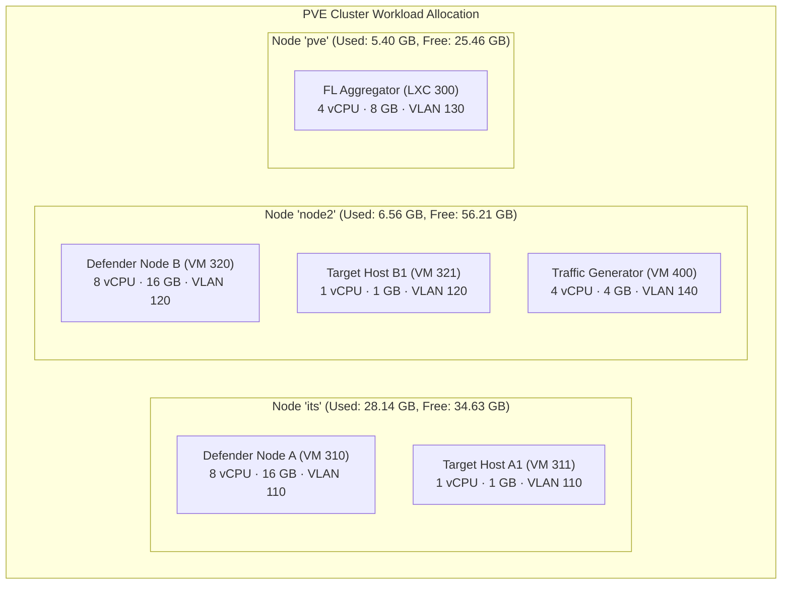

# Implementation Workaround & Resource Allocation Plan
## Hybrid Federated-Continual Learning (FL-CL) Cyber Defense Lab

> **Role in the documentation set**: This document defines the cluster-specific workarounds, network reconciliation steps, and hardware resource allocation required to deploy the conceptual architecture from [research_architecture.md](research_architecture.md) on the actual 3-node Proxmox VE cluster. For hardware prerequisites and dataset preparation, see [prerequisites_and_tooling.md](prerequisites_and_tooling.md). For the fully integrated research paper, see [fl_cl_research_paper.md](fl_cl_research_paper.md) (this document corresponds to Paper Chapters 3, 4, and 7).

---

## 1. Technical Audit & Inconsistency Reconciliation

Before any VMs can be provisioned, three infrastructure inconsistencies must be reconciled to prevent cluster instability, split-brain Corosync behavior, and routing failures. *(Paper: Chapter 3, Section 3.2)*

### A. Hostname and Network Resolution (`/etc/hosts`)
* **The Conflict:** Node `pve` maps cluster hosts using management network IPs (naming the first node `node1` at `192.168.10.2`). Nodes `its` and `node2` map cluster entries to the secondary network range `10.10.10.x` (naming the first node `its` at `10.10.10.11`).
* **The Impact:** Corosync requires consistent latency and routing. A mismatch in cluster IP resolution will cause the cluster to lose quorum or split-brain.
* **The Workaround:** Synchronize the hosts mapping across all three nodes. Route all cluster operations, Corosync rings, and high-throughput FL-CL training payloads on the low-latency secondary network (`10.10.10.x`), utilizing the physical LACP bonds on `its` and `node2`. Reserve `vmbr0` management IPs for out-of-band SSH access only.
* **Action:** Update `/etc/hosts` on all three hypervisors to match the template below:

```text
127.0.0.1       localhost

# Cluster & FL-CL Traffic (vmbr1 – Secondary Network)
10.10.10.11     its
10.10.10.12     node2
10.10.10.13     pve

# Out-of-Band Management (vmbr0)
192.168.10.2    its-mgmt
192.168.20.2    node2-mgmt
192.168.30.2    pve-mgmt
```

### B. Mismapped Domain Resolver (`its.ac.id`)
* **The Conflict:** Node `its` points `its.ac.id` to `10.3.132.7`, while Node `node2` points it to `192.168.18.199`.
* **The Impact:** VMs or FL clients querying `its.ac.id` for updates, dataset hosting, or package mirrors will experience routing failures depending on which hypervisor they reside on.
* **The Workaround:** Remove static mappings for `its.ac.id` from all host files. Deploy a centralized DNS forwarder (e.g., `dnsmasq` or `CoreDNS` on the aggregator LXC 300) to resolve this domain uniformly across all VMs.

### C. Bridge Properties & VLAN Awareness
* **The Conflict:** Node `node2` has a **VLAN-aware** `vmbr1` bridge. Nodes `its` and `pve` have standard, non-VLAN-aware bridges. Additionally, `its` and `node2` use link aggregation (`bond0` with LACP), while `pve` runs a single physical NIC to `vmbr1`.
* **The Impact:** Tagged VLAN traffic (VLAN 110 for Organization A, VLAN 120 for Organization B, VLAN 130 for aggregation, VLAN 140 for traffic generation) will be stripped or dropped on non-VLAN-aware bridges, breaking the network isolation design from [research_architecture.md](research_architecture.md) Section 2.
* **The Workaround:** Enable **VLAN Awareness** on `vmbr1` across all three nodes.
* **Action:** 
  1. Open the Proxmox Web GUI on `its` and `pve`.
  2. Navigate to **System → Network**, select `vmbr1`, and check the **VLAN Aware** box.
  3. Apply network configuration (requires `ifupdown2` installed on hosts) or reboot.

---

## 2. Optimized Resource Placement Matrix

The lab requires approximately **26 vCPUs, 46 GB RAM, and 320 GB Disk** to run 1 Flower Server, 2 PyTorch/Avalanche defender VMs, 2 target VMs, and 1 traffic generator VM. Workloads are distributed based on available capacity, with a critical constraint: **each target VM must reside on the same hypervisor as its corresponding defender VM** because port mirroring (Section 4, Phase 3) operates on hypervisor-local TAP interfaces. *(Paper: Chapter 3, Section 3.3)*



### VM Resource Allocations

| Hypervisor | VM ID | Hostname | OS | vCPU | RAM | Disk | VLAN | Role |
| :--- | :--- | :--- | :--- | :--- | :--- | :--- | :--- | :--- |
| **pve** | 300 | `fl-aggregator` | Ubuntu Server 24.04 | 4 | 8 GB | 50 GB | 130 | Flower server orchestration & global model checkpoints. |
| **its** | 310 | `defender-a` | Ubuntu Server 24.04 | 8 | 16 GB | 100 GB | 110 | NFStream capture, PyTorch/Avalanche training, Flower client. |
| **its** | 311 | `target-a1` | Alpine Linux | 1 | 1 GB | 10 GB | 110 | Receives benign/malicious traffic from traffic generator. |
| **node2** | 320 | `defender-b` | Ubuntu Server 24.04 | 8 | 16 GB | 100 GB | 120 | Parallel defender node simulating a separate organization. |
| **node2** | 321 | `target-b1` | Alpine Linux | 1 | 1 GB | 10 GB | 120 | Receives benign/malicious traffic from traffic generator. |
| **node2** | 400 | `traffic-gen` | Kali Linux | 4 | 4 GB | 50 GB | 140 | Metasploit C2, Hydra brute-force, Selenium benign browsing, tcpreplay dataset replay. |

---

## 3. Storage Architecture Optimization

All three nodes leverage an identical local hardware layout: a **Dell PERC H755 Adp** RAID controller presenting a 1.20 TB logical volume `/dev/sda` partition `/dev/sda3` mapped to LVM. *(Paper: Chapter 3, Section 3.4)*

### A. LVM-Thin Provisioning
Ensure that `/dev/sda3` is configured as an **LVM-Thin** pool (mapped by default in Proxmox installations as `local-lvm`). 
* **Reasoning:** Traditional LVM pre-allocates block space completely upon VM creation. LVM-Thin allows thin-provisioning (only consuming physical blocks as data is written) and fast, space-efficient VM snapshots. This is critical for **rolling back defender nodes** after experimental training sessions (e.g., data poisoning tests or EWC hyperparameter sweeps)—a workflow that would be prohibitively expensive with thick provisioning.

### B. Mitigate Capture Disk I/O Bottlenecks
Continual traffic capture via NFStream (see [research_architecture.md](research_architecture.md) Section 4) generates thousands of small writes per second, loading the RAID controller queue and degrading all VMs on the host. *(Paper: Chapter 5, Section 5.3)*
* **Workaround:** Buffer flow records in a memory-mapped RAM disk (`tmpfs`) inside each defender VM. Batch writes to persistent storage at controlled intervals.
* **Mounting a RAM disk (inside Defender VMs):**
  ```bash
  sudo mkdir -p /mnt/ramdisk
  sudo mount -t tmpfs -o size=4G tmpfs /mnt/ramdisk
  echo "tmpfs /mnt/ramdisk tmpfs size=4G 0 0" | sudo tee -a /etc/fstab
  ```
  Configure the `extractor.py` capture script to dump temporary `.csv` or `.parquet` flows to `/mnt/ramdisk/flows/` to spare the Dell PERC controller.

---

## 4. Phase-by-Phase Setup & Implementation Guide

Follow this step-by-step roadmap to provision and configure the cluster. Each phase depends on the completion of the previous one. *(Paper: Chapter 7)*

### Phase 1: Host-Level Configuration (Execute on PVE Hypervisors)

Run these steps in the root shell of each respective Proxmox host.

#### Step 1.1: Harmonize Domain Names & Corosync Rings
Update `/etc/hosts` on all three hosts so they share an identical hostname translation:
```bash
nano /etc/hosts
```
*Remove any references to `node1` or conflicting IPs for `its.ac.id`, and paste the standardized block from Section 1.A.*

#### Step 1.2: Enable VLAN Awareness on vmbr1
For **Node `its`** and **Node `pve`** (already enabled on `node2`):
```bash
if ! grep -q "bridge-vlan-aware yes" /etc/network/interfaces; then
    sed -i '/iface vmbr1 inet manual/a \        bridge-vlan-aware yes' /etc/network/interfaces
    ifup --force vmbr1
fi
```
*Verify with `bridge vlan show vmbr1`.*

#### Step 1.3: Enable Snippet Storage
Allow hookscripts on all nodes:
```bash
pvesm set local --content backup,vztmpl,iso,snippets
```

---

### Phase 2: VM & Container Provisioning (PVE Shells)

Deploy in dependency order: aggregator first, then defenders, then targets, then traffic generator.

#### Step 2.1: Deploy FL Aggregator (On Node `pve`)
```bash
pveam update
pveam download local ubuntu-24.04-standard_24.04-1_amd64.tar.zst

pct create 300 local:vztmpl/ubuntu-24.04-standard_24.04-1_amd64.tar.zst \
  -cores 4 -memory 8192 -swap 2048 \
  -hostname fl-aggregator -ostype ubuntu -rootfs local:50 \
  -net0 name=eth0,bridge=vmbr0,ip=dhcp \
  -net1 name=eth1,bridge=vmbr1,tag=130,ip=10.10.10.130/24 \
  -onboot 1 -start 1
```

#### Step 2.2: Deploy Defender Nodes (On Nodes `its` and `node2`)
Each defender has **two** network interfaces: `net0` on `vmbr0` (management/internet) and `net1` on `vmbr1` (VLAN-tagged capture interface).

**On Node `its` (Defender A – VM 310):**
```bash
qm create 310 --name defender-a --cores 8 --memory 16384 --balloon 8192 \
  --cpu host --sockets 1 --ostype l26 \
  --net0 virtio,bridge=vmbr0 \
  --net1 virtio,bridge=vmbr1,tag=110 \
  --scsihw virtio-scsi-pci --scsi0 local:100,discard=on \
  --boot order=scsi0 --onboot 1 --start 0
```

**On Node `node2` (Defender B – VM 320):**
```bash
qm create 320 --name defender-b --cores 8 --memory 16384 --balloon 8192 \
  --cpu host --sockets 1 --ostype l26 \
  --net0 virtio,bridge=vmbr0 \
  --net1 virtio,bridge=vmbr1,tag=120 \
  --scsihw virtio-scsi-pci --scsi0 local:100,discard=on \
  --boot order=scsi0 --onboot 1 --start 0
```

#### Step 2.3: Deploy Target Hosts and Traffic Generator

**On Node `its` (Target A1 – VM 311):**
```bash
qm create 311 --name target-a1 --cores 1 --memory 1024 \
  --net0 virtio,bridge=vmbr1,tag=110 \
  --scsihw virtio-scsi-pci --scsi0 local:10,discard=on --start 0
```

**On Node `node2` (Target B1 – VM 321):**
```bash
qm create 321 --name target-b1 --cores 1 --memory 1024 \
  --net0 virtio,bridge=vmbr1,tag=120 \
  --scsihw virtio-scsi-pci --scsi0 local:10,discard=on --start 0
```

**On Node `node2` (Traffic Generator – VM 400):**
```bash
qm create 400 --name traffic-gen --cores 4 --memory 4096 \
  --net0 virtio,bridge=vmbr1,tag=140 \
  --scsihw virtio-scsi-pci --scsi0 local:50,discard=on --start 0
```
> **Inter-VLAN routing note:** The traffic generator on VLAN 140 must reach target hosts on VLANs 110 and 120. Configure static routes on your gateway router, or assign target interfaces additional VLAN tags to span the test ranges.

---

### Phase 3: Proxmox Automatic Port Mirroring Workaround

Proxmox destroys virtual TAP interfaces when a VM shuts down, erasing all `tc` mirroring rules. This hookscript workaround re-applies port mirroring automatically on every target VM boot, ensuring the capture pipeline from [research_architecture.md](research_architecture.md) Section 3 always has input. *(Paper: Chapter 4, Section 4.3)*

#### Step 3.1: Create the Hookscript (Run on Node `its`)
```bash
mkdir -p /var/lib/vz/snippets
cat << 'EOF' > /var/lib/vz/snippets/mirror-hook.sh
#!/bin/bash
vmid=$1; phase=$2

# Target A1 (vmid 311) → Defender A (vmid 310)
if [ "$vmid" = "311" ] && [ "$phase" = "post-start" ]; then
    SOURCE="tap311i0"; MIRROR="tap310i1"
    echo "Hook: VM 311 started. Configuring mirroring $SOURCE → $MIRROR..."
    sleep 3  # Allow TAP interfaces to register in the bridge
    ip link set dev $SOURCE promisc on
    ip link set dev $MIRROR promisc on
    tc qdisc add dev $SOURCE handle ffff: ingress
    tc filter add dev $SOURCE parent ffff: protocol all u32 match u32 0 0 \
      action mirred egress mirror dev $MIRROR
    tc qdisc add dev $SOURCE root handle 1: prio
    tc filter add dev $SOURCE parent 1: protocol all u32 match u32 0 0 \
      action mirred egress mirror dev $MIRROR
    echo "Hook: Port mirroring activated successfully."
fi
EOF
chmod +x /var/lib/vz/snippets/mirror-hook.sh
```

#### Step 3.2: Bind the Hookscript to the Target VM
```bash
qm set 311 --hookscript local:snippets/mirror-hook.sh
```
> **Repeat on Node `node2`** for target VM 321 mapping to defender VM 320 (adjust `vmid`, `SOURCE=tap321i0`, `MIRROR=tap320i1`).

---

### Phase 4: Software Stack Provisioning (Inside VMs)

Install the Python environments that run the code from [research_architecture.md](research_architecture.md) Section 5. *(Paper: Chapter 7, Phase 4)*

#### Step 4.1: Aggregator Node (LXC 300)
```bash
pct enter 300

apt update && apt install -y python3-pip python3-venv git
python3 -m venv /opt/flower-env
source /opt/flower-env/bin/activate
pip install --upgrade pip && pip install flwr
```

#### Step 4.2: Defender VMs (VM 310 & 320)
```bash
sudo apt update && sudo apt install -y python3-pip python3-venv libpcap-dev git

# Setup RAM disk buffer (see Section 3.B)
sudo mkdir -p /mnt/ramdisk
sudo mount -t tmpfs -o size=4G tmpfs /mnt/ramdisk
echo "tmpfs /mnt/ramdisk tmpfs size=4G 0 0" | sudo tee -a /etc/fstab

# Python environment
python3 -m venv ~/fl-cl-env
source ~/fl-cl-env/bin/activate
pip install --upgrade pip
pip install torch torchvision torchaudio --index-url https://download.pytorch.org/whl/cpu
pip install avalanche-lib flwr nfstream scikit-learn pandas numpy
```

---

### Phase 5: Executing the Training Run

The startup order mirrors the data flow: aggregator → flow extraction → traffic generation → FL clients. *(Paper: Chapter 7, Phase 5)*

#### Step 5.1: Launch Flower Server (LXC 300)
```bash
source /opt/flower-env/bin/activate && python3 server.py
```
*Binds to port 8080 on the VLAN 130 interface (`10.10.10.130`).*

#### Step 5.2: Start Flow Extraction (Defender VMs)
```bash
source ~/fl-cl-env/bin/activate
python3 extractor.py --interface ens19 --out-dir /mnt/ramdisk/flows/
```

#### Step 5.3: Validate Mirroring
Confirm packets from the target VM appear on the defender's capture interface:
```bash
sudo tcpdump -i ens19 -c 10
```

#### Step 5.4: Start Traffic Generation (VM 400)
Launch attack campaigns and benign browsing scripts per [prerequisites_and_tooling.md](prerequisites_and_tooling.md) Sections 3–4.

#### Step 5.5: Start FL-CL Clients (Defender VMs)
```bash
source ~/fl-cl-env/bin/activate
python3 client.py --server 10.10.10.130:8080 --client-id A
```

---

## 5. Operational Verification Checklist

Execute these checks before kicking off Federated training to confirm all workaround mitigations are successful. *(Paper: Chapter 8, Section 8.1)*

### 1. Cluster Quorum & Resolution Check
Confirm Corosync resolves all members via the secondary network:
```bash
pvecm status
corosync-cfgtool -s
```

### 2. VLAN Awareness Check
Verify bridge forwarding and tagged VLAN propagation across hypervisors:
```bash
bridge vlan show vmbr1
```
Run a temporary tagged test interface on each node to verify L2 crossing:
```bash
ip link add link vmbr1 name vmbr1.110 type vlan id 110
ip addr add 10.10.100.11/24 dev vmbr1.110
ip link set dev vmbr1.110 up
# Repeat on node2 with IP 10.10.100.12, then ping to verify
ping -c 3 10.10.100.12
```
*Clean up:*
```bash
ip link delete vmbr1.110
```

### 3. VLAN Isolation Check
Confirm VMs on different VLANs cannot communicate without explicit routing:
```bash
# From VM 311 (VLAN 110) → should fail (100% packet loss)
ping -c 3 10.10.20.201
```

### 4. Hookscript Execution Check
Verify mirroring activates on target VM boot:
```bash
journalctl -u pvedaemon | grep "mirror-hook"
```

### 5. Port Mirror Integrity Check
On the defender VM, confirm captured packets match target VM traffic:
```bash
sudo tcpdump -i ens19 -c 10
```
