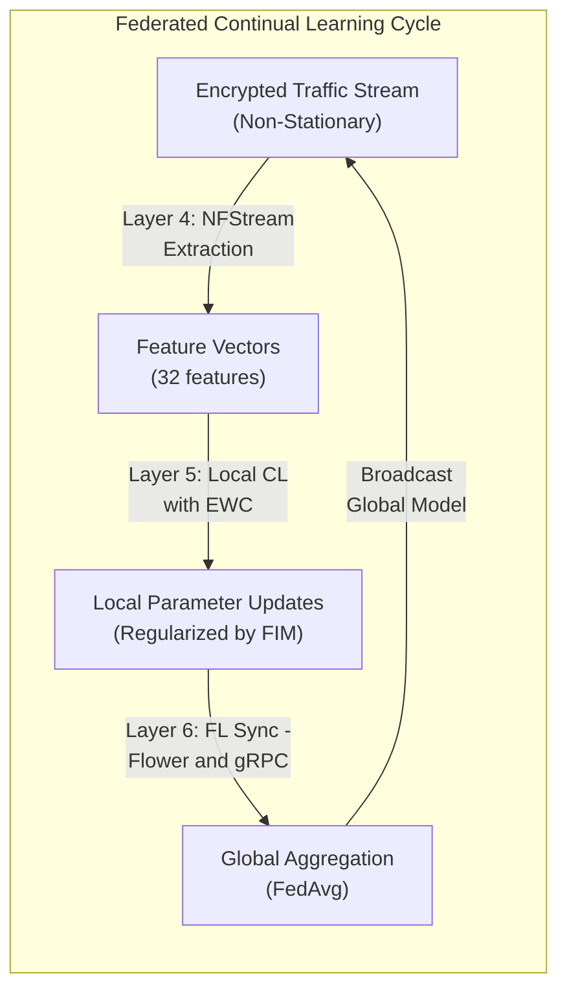
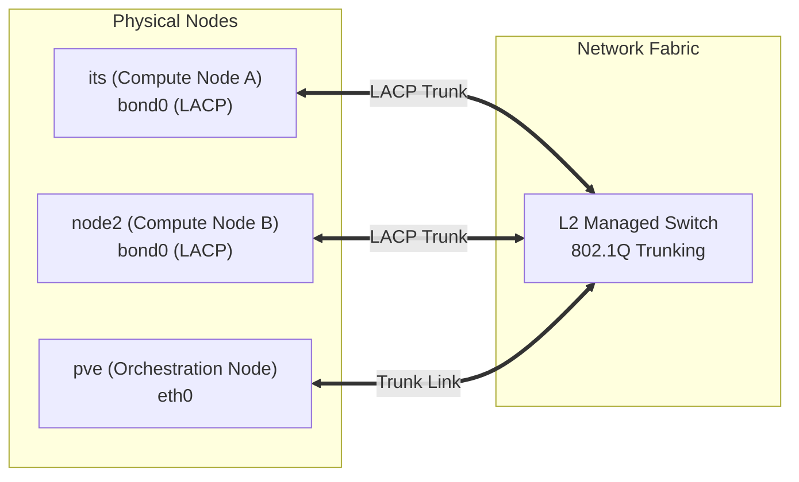
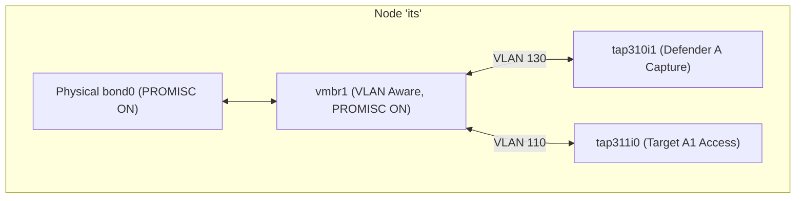
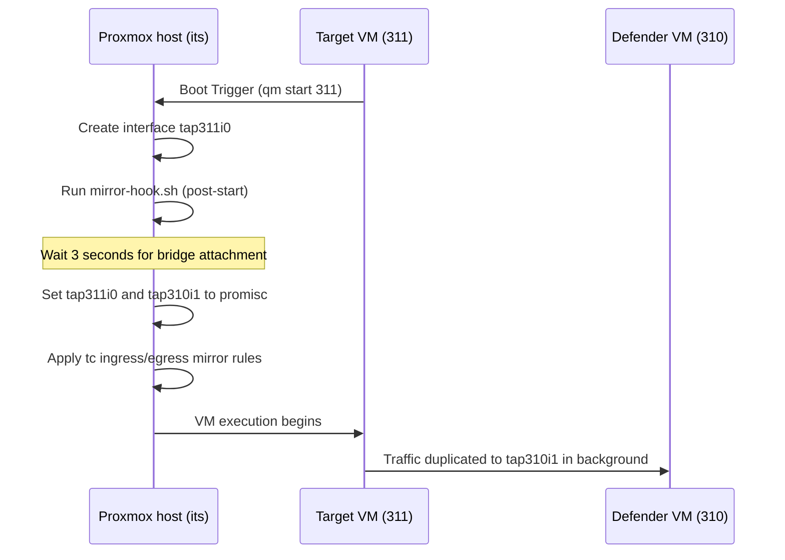

# Federated Continual Learning (FCL) Cyber Defense Deployment Walkthrough
## Comprehensive End-to-End Cluster Provisioning & Pipeline Execution

This document provides a publication-grade, step-by-step deployment walkthrough for the Hybrid Federated-Continual Learning (FCL) cyber defense testbed. The system is deployed across a heterogeneous 3-node Proxmox VE cluster (`its`, `node2`, `pve`). It addresses physical networking variations, virtualized Layer 2 segmentation, ephemeral interface port mirroring, real-time feature extraction, local continual training, and global federated aggregation.

---

## Academic Foundation & System Overview

Traditional machine learning assumes **stationary** data distributions (identically and independently distributed - *i.i.d.*). However, in cyber defense, network traffic is highly dynamic, characterized by emerging attack vectors, protocol changes, and evolving network configurations. 

This testbed combines **Federated Learning (FL)** for collaborative decentralized knowledge aggregation and **Continual Learning (CL)** to adapt to non-stationary data streams without forgetting previously learned patterns (catastrophic forgetting).



### The Stability-Plasticity Dilemma

In local CL, the neural network faces the **Stability-Plasticity Dilemma**:
* **Plasticity** is the ability to acquire new knowledge (e.g., detecting a new threat class like DNS-over-HTTPS exfiltration).
* **Stability** is the ability to retain previously learned knowledge (e.g., detecting older threats like SSH brute-forcing).

Unrestricted training on a new task overrides the weights critical to old tasks, causing **Catastrophic Forgetting**. To address this, we implement **Elastic Weight Consolidation (EWC)**. EWC regularizes weight updates by penalizing changes to weights that are critical to historical tasks, calculated using the diagonal of the **Fisher Information Matrix (FIM)**:

$$\mathcal{L}(\theta) = \mathcal{L}_B(\theta) + \sum_{i} \frac{\lambda}{2} F_i (\theta_i - \theta_{A,i}^*)^2$$

Where:
* $\mathcal{L}_B(\theta)$ is the loss on the new task $B$.
* $\theta_{A,i}^*$ represents the optimal parameters after completing task $A$.
* $F_i$ is the diagonal entry of the Fisher Information Matrix for parameter $i$, representing its importance.
* $\lambda$ is the regularization constraint (hyperparameter `ewc_lambda`).

### Flat L2 Network Transition (Mitigating Switch Trunking Constraints)

Initially, the testbed used tagged VLANs (110, 120, 130, 140) on `vmbr1` to isolate organizational zones. However, due to physical switch limitations where the inter-host links do not support 802.1Q VLAN trunking, tagged packets were silently dropped between hypervisors, breaking cross-host communication.

To resolve this while preserving logical network structure, the network on `vmbr1` has been transitioned to a **Flat, Untagged L2 Network** using a `/16` subnet mask (`10.10.0.0/16`). Logical segregation is maintained using IP prefixes, and all nodes are configured with `/16` masks to ensure cross-prefix reachability:

| Zone / Organization | IP Subnet (Internal) | Subnet Mask | Assigned Nodes / VMs |
| :--- | :--- | :--- | :--- |
| **Org A (Target A1)** | `10.10.110.15` | `/16` | `target-a1` (VM 311) |
| **Org B (Target B1)** | `10.10.120.15` | `/16` | `target-b1` (VM 321) |
| **FL Aggregator & Defenders**| `10.10.130.10` - `10.10.130.12` | `/16` | `fl-aggregator` (LXC 300), `defender-a` (VM 310), `defender-b` (VM 320) |
| **Traffic Generator** | `10.10.140.10` | `/16` | `traffic-gen` (VM 400) |

Under this flat L2 topology, port mirroring via `tc` remains fully functional because it mirrors traffic at the virtual TAP interface queue level, completely bypassing L2/L3 boundary filters.

---

## Layer-by-Layer Walkthrough

### Layer 1: Physical / Hypervisor Topology

The underlying infrastructure consists of three physical servers connected to an L2-managed switch:
1. **Node `its`**: Primary compute node hosting Org A. Dual 10G NICs aggregated in a Link Aggregation Control Protocol (LACP) bond (`bond0`) to maximize throughput.
2. **Node `node2`**: Secondary compute node hosting Org B and the Traffic Generator. Also Aggregated via LACP (`bond0`).
3. **Node `pve`**: Light-compute node hosting the FL aggregator. Connected via a single physical NIC to `vmbr1`.



#### Step 1.1: Standardize Node Host Resolution
To ensure reliable cluster communication and Corosync health, route node traffic over the low-latency secondary network. Append these mappings to `/etc/hosts` on all three hypervisors:

```bash
cat << 'EOF' >> /etc/hosts
# Secondary Network Cluster Resolution
10.10.10.11     its.ac.id its
10.10.10.12     node2.ac.id node2
10.10.10.13     pve.ac.id pve
EOF
```

> [!CAUTION]
> Ensure all references mapping `its.ac.id` to the management network (`192.168.x.x`) are removed from all host files to prevent Corosync from falling out of quorum.

#### Step 1.2: Enforce Persistent Promiscuous Mode on LACP Bonds (Node `its` & `node2`)
To prevent physical switch LACP link renegotiation flaps and STP blocking state freezes when VM interfaces dynamically transition to promiscuous mode, execute the automated helper script to pre-enable promiscuous mode persistently:

```bash
/usr/bin/bash /root/fl-cl/infra/01_host_config/enable_promisc.sh
```

This creates a systemd service (`promisc-bond.service`) that automatically executes:
```bash
/sbin/ip link set dev <physical_nic_1> promisc on
/sbin/ip link set dev <physical_nic_2> promisc on
/sbin/ip link set dev bond0 promisc on
/sbin/ip link set dev vmbr1 promisc on
```

---

### Layer 2: Network Virtualization (SDN/L2)

Network isolation and routing boundaries are enforced using Proxmox native Linux Bridges configured as VLAN-aware.



#### Step 2.1: Enable VLAN Awareness on vmbr1
Execute the following on nodes `its` and `pve` (already active on `node2`):

```bash
# Add VLAN awareness parameter if not present
if ! grep -q "bridge-vlan-aware yes" /etc/network/interfaces; then
    sed -i '/iface vmbr1 inet manual/a \        bridge-vlan-aware yes' /etc/network/interfaces
    # Apply settings dynamically using ifupdown2
    ifup --force vmbr1
fi
```

#### Step 2.2: Provision the FL Aggregator LXC (Node `pve`)
Create the aggregator LXC container. `net1` is bound to `vmbr1` with tag `130`:

```bash
pct create 300 local:vztmpl/ubuntu-24.04-standard_24.04-1_amd64.tar.zst \
  --cores 4 \
  --memory 8192 \
  --swap 2048 \
  --hostname fl-aggregator \
  --ostype ubuntu \
  --rootfs local:50 \
  --net0 name=eth0,bridge=vmbr0,ip=dhcp \
  --net1 name=eth1,bridge=vmbr1,tag=130,ip=10.10.130.10/24 \
  --onboot 1 \
  --start 1
```

#### Step 2.3: Provision the Defender and Target VMs
Deploy the VM instances. Standardize the Defender capture interfaces to VLAN 130 to allow direct L2 gRPC connection with the FL Aggregator. Ensure target VMs stay on their organization-isolated VLANs (VLAN 110 for Org A, VLAN 120 for Org B).

**On Node `its` (Defender A & Target A1):**
```bash
# Create Defender VM (ID 310)
qm create 310 --name defender-a --cores 8 --memory 16384 --balloon 8192 \
  --cpu host --sockets 1 --ostype l26 \
  --net0 virtio,bridge=vmbr0 \
  --net1 virtio,bridge=vmbr1,tag=130 \
  --scsihw virtio-scsi-pci --scsi0 local:100,discard=on \
  --boot order=scsi0 --onboot 1 --start 0

# Create Target VM (ID 311)
qm create 311 --name target-a1 --cores 1 --memory 1024 \
  --net0 virtio,bridge=vmbr1,tag=110 \
  --scsihw virtio-scsi-pci --scsi0 local:10,discard=on --start 0
```

**On Node `node2` (Defender B, Target B1, & Traffic Generator):**
```bash
# Create Defender VM (ID 320)
qm create 320 --name defender-b --cores 8 --memory 16384 --balloon 8192 \
  --cpu host --sockets 1 --ostype l26 \
  --net0 virtio,bridge=vmbr0 \
  --net1 virtio,bridge=vmbr1,tag=130 \
  --scsihw virtio-scsi-pci --scsi0 local:100,discard=on \
  --boot order=scsi0 --onboot 1 --start 0

# Create Target VM (ID 321)
qm create 321 --name target-b1 --cores 1 --memory 1024 \
  --net0 virtio,bridge=vmbr1,tag=120 \
  --scsihw virtio-scsi-pci --scsi0 local:10,discard=on --start 0

# Create Traffic Generator (ID 400)
qm create 400 --name traffic-gen --cores 4 --memory 4096 \
  --net0 virtio,bridge=vmbr1,tag=140 \
  --scsihw virtio-scsi-pci --scsi0 local:50,discard=on --start 0
```

---

### Layer 3: Ephemeral Port Mirroring Hookscripts

When a VM starts, Proxmox dynamically creates a TAP interface (`tap<VMID>i<NET_INDEX>`) on the host and binds it to the Linux bridge. Upon VM shutdown, this interface is destroyed, erasing all custom `tc` mirroring rules. 

To resolve this, we implement a Proxmox Lifecycle Hookscript that automatically re-establishes mirroring rules when a target VM boots.



#### Step 3.1: Enable Snippet Storage
Execute this on both nodes `its` and `node2` to permit the execution of custom scripts:
```bash
pvesm set local --content backup,vztmpl,iso,snippets
```

#### Step 3.2: Write the Hookscript on Node `its` (Organization A)
Save this script to `/var/lib/vz/snippets/mirror-hook-a.sh`:

```bash
cat << 'EOF' > /var/lib/vz/snippets/mirror-hook-a.sh
#!/bin/bash
# Hookscript for VM 311 (Target A1) -> VM 310 (Defender A) Port Mirroring
vmid=$1
phase=$2

if [ "$vmid" = "311" ] && [ "$phase" = "post-start" ]; then
    SOURCE="tap311i0"
    MIRROR="tap310i1"
    
    echo "Hook: VM 311 started. Applying traffic mirroring to $MIRROR..."
    sleep 3  # Wait for bridge initialization
    
    # Configure interfaces to promiscuous mode
    ip link set dev $SOURCE promisc on
    ip link set dev $MIRROR promisc on
    
    # Mirror incoming (ingress) packets
    tc qdisc add dev $SOURCE handle ffff: ingress
    tc filter add dev $SOURCE parent ffff: protocol all u32 match u32 0 0 \
      action mirred egress mirror dev $MIRROR
      
    # Mirror outgoing (egress) packets
    tc qdisc add dev $SOURCE root handle 1: prio
    tc filter add dev $SOURCE parent 1: protocol all u32 match u32 0 0 \
      action mirred egress mirror dev $MIRROR
      
    echo "Hook: Traffic control rules successfully registered."
fi
EOF
chmod +x /var/lib/vz/snippets/mirror-hook-a.sh
qm set 311 --hookscript local:snippets/mirror-hook-a.sh
```

#### Step 3.3: Write the Hookscript on Node `node2` (Organization B)
Save this script to `/var/lib/vz/snippets/mirror-hook-b.sh`:

```bash
cat << 'EOF' > /var/lib/vz/snippets/mirror-hook-b.sh
#!/bin/bash
# Hookscript for VM 321 (Target B1) -> VM 320 (Defender B) Port Mirroring
vmid=$1
phase=$2

if [ "$vmid" = "321" ] && [ "$phase" = "post-start" ]; then
    SOURCE="tap321i0"
    MIRROR="tap320i1"
    
    echo "Hook: VM 321 started. Applying traffic mirroring to $MIRROR..."
    sleep 3  # Wait for bridge initialization
    
    # Configure interfaces to promiscuous mode
    ip link set dev $SOURCE promisc on
    ip link set dev $MIRROR promisc on
    
    # Mirror incoming (ingress) packets
    tc qdisc add dev $SOURCE handle ffff: ingress
    tc filter add dev $SOURCE parent ffff: protocol all u32 match u32 0 0 \
      action mirred egress mirror dev $MIRROR
      
    # Mirror outgoing (egress) packets
    tc qdisc add dev $SOURCE root handle 1: prio
    tc filter add dev $SOURCE parent 1: protocol all u32 match u32 0 0 \
      action mirred egress mirror dev $MIRROR
      
    echo "Hook: Traffic control rules successfully registered."
fi
EOF
chmod +x /var/lib/vz/snippets/mirror-hook-b.sh
qm set 321 --hookscript local:snippets/mirror-hook-b.sh
```

---

### Layer 4: Data Capture & Feature Extraction

Within each Defender VM, network packets duplicated from the targets are captured in real-time on interface `ens19` (mapped from PVE bridge `vmbr1`).

```
[Target VM Interface] --(SPAN)--> [Defender Interface ens19] 
                                            │
                                            ▼
                                   [NFStream Engine]
                                            │
                                    (Extract Features)
                                            │
                                            ▼
                                  [tmpfs RAM Disk Buffer]
                                  (/mnt/ramdisk/flows/)
```

#### Step 4.1: Bypass I/O Bottlenecks with a tmpfs RAM Disk
Writing high-volume flow metadata directly to hypervisor disks causes severe I/O bottlenecks. Create a memory-backed RAM disk within Defender VMs (`defender-a` and `defender-b`):

```bash
# Execute inside Defender VMs:
sudo mkdir -p /mnt/ramdisk
sudo mount -t tmpfs -o size=4G tmpfs /mnt/ramdisk
# Make configuration persistent
echo "tmpfs /mnt/ramdisk tmpfs size=4G 0 0" | sudo tee -a /etc/fstab
```

#### Step 4.2: Deploy the NFStream Flow Extractor (`extractor.py`)
Deploy this script to Defender nodes. It monitors `ens19`, extracts flow characteristics (statistics, protocol information, JA3 handshakes), and outputs them to the RAM disk:

```python
# extractor.py
import argparse
import os
from nfstream import NFStreamer

def run_extractor(interface, out_dir):
    os.makedirs(out_dir, exist_ok=True)
    print(f"[*] Starting NFStream extraction on {interface}...")
    
    # Capture and convert traffic flows to feature vectors
    streamer = NFStreamer(
        source=interface,
        promiscuous=True,
        snapshot_length=1536,
        active_timeout=120,
        idle_timeout=30
    )
    
    flow_count = 0
    for flow in streamer:
        # Convert flow features to dictionary record
        flow_data = {
            "duration": flow.bidirectional_duration_ms,
            "packets": flow.bidirectional_packets,
            "bytes": flow.bidirectional_bytes,
            "src_port": flow.src_port,
            "dst_port": flow.dst_port,
            "protocol": flow.protocol,
            "application_name": flow.application_name,
            "requested_server_name": flow.requested_server_name,
            # JA3 is essential for classifying encrypted threats
            "client_ja3": flow.client_info.get("ja3", "") if hasattr(flow, "client_info") else "",
            "server_ja3": flow.server_info.get("ja3", "") if hasattr(flow, "server_info") else ""
        }
        
        # Save flow records as Parquet files for training ingestion
        output_file = os.path.join(out_dir, f"flow_{flow_count // 1000}.parquet")
        # Logic to append/write data...
        flow_count += 1

if __name__ == "__main__":
    parser = argparse.ArgumentParser()
    parser.add_argument("--interface", default="ens19")
    parser.add_argument("--out-dir", default="/mnt/ramdisk/flows/")
    args = parser.parse_args()
    run_extractor(args.interface, args.out_dir)
```

---

### Layer 5: Local Continual Learning Engine

Inside the Defender VMs, model training uses the Avalanche library. The network model (`CyberDefenseNet`) is a 3-layer Multi-Layer Perceptron (MLP) that maps a 32-feature vector (representing network traffic properties) to 5 threat classes:
1. `0`: Benign Web Browsing
2. `1`: SSH Brute Force
3. `2`: HTTPS Flooding (Slowloris)
4. `3`: Encrypted C2 Beaconing
5. `4`: PCAP Dataset Replay Traffic

#### Step 5.1: The Avalanche CL Strategy with EWC (`cl_strategy.py`)
To prevent catastrophic forgetting during training, we configure the Elastic Weight Consolidation (EWC) strategy:

```python
# cl_strategy.py
import torch
from torch.nn import CrossEntropyLoss
from torch.optim import SGD
from avalanche.training.plugins import EWCPlugin
from avalanche.training.supervised import Naive
from model import CyberDefenseNet

def get_cl_strategy(model, ewc_lambda=100.0):
    optimizer = SGD(model.parameters(), lr=0.01, momentum=0.9)
    criterion = CrossEntropyLoss()
    
    # EWCPlugin regularizes parameter updates based on Fisher Information Matrix
    ewc_plugin = EWCPlugin(ewc_lambda=ewc_lambda)
    
    strategy = Naive(
        model=model,
        optimizer=optimizer,
        criterion=criterion,
        train_mb_size=64,
        train_epochs=5,
        eval_mb_size=64,
        plugins=[ewc_plugin]
    )
    return strategy
```

---

### Layer 6: Global Federated Learning Orchestration

Federated coordination uses the **Flower** framework. Local parameter updates are aggregated at the central Aggregator Node (`LXC 300`) using the Federated Averaging (`FedAvg`) aggregation algorithm.

```
       [FL Aggregator (LXC 300)]
             ▲          ▲
             │          │
    (gRPC / TLS)      (gRPC / TLS)
             │          │
             ▼          ▼
       [Defender A]   [Defender B]
```

#### Step 6.1: Run the Flower Server (`server.py` on LXC 300)
The server runs on the Aggregator. It waits for clients to connect, distributes global model parameters, and aggregates updates:

```python
# server.py
import flwr as fl

def weighted_avg(metrics):
    accuracies = [n * m["accuracy"] for n, m in metrics]
    total_samples = [n for n, _ in metrics]
    return {"accuracy": sum(accuracies) / sum(total_samples)}

strategy = fl.server.strategy.FedAvg(
    fraction_fit=1.0,
    fraction_evaluate=1.0,
    min_fit_clients=2,
    min_evaluate_clients=2,
    min_available_clients=2,
    evaluate_metrics_aggregation_fn=weighted_avg,
)

if __name__ == "__main__":
    print("[*] Starting Flower Server on port 8080...")
    fl.server.start_server(
        server_address="0.0.0.0:8080",
        config=fl.server.ServerConfig(num_rounds=10),
        strategy=strategy
    )
```

#### Step 6.2: Run the FL Client (`client.py` on Defender VMs)
The client script loads local datasets, initiates local continual training using Avalanche, and sends updated weights back to the server:

```python
# client.py
import argparse
import flwr as fl
import torch
from model import CyberDefenseNet
from cl_strategy import get_cl_strategy

class CyberDefenseClient(fl.client.NumPyClient):
    def __init__(self, client_id):
        self.model = CyberDefenseNet(input_dim=32, num_classes=5)
        self.strategy = get_cl_strategy(self.model, ewc_lambda=150.0)
        self.client_id = client_id

    def get_parameters(self, config):
        return [val.cpu().numpy() for _, val in self.model.state_dict().items()]

    def set_parameters(self, parameters):
        params_dict = zip(self.model.state_dict().keys(), parameters)
        state_dict = {k: torch.tensor(v) for k, v in params_dict}
        self.model.load_state_dict(state_dict, strict=True)

    def fit(self, parameters, config):
        self.set_parameters(parameters)
        # Load captured flows from RAM disk
        train_data = load_data_from_ramdisk()
        self.strategy.train(train_data)
        return self.get_parameters(config={}), len(train_data), {}

if __name__ == "__main__":
    parser = argparse.ArgumentParser()
    parser.add_argument("--server", default="10.10.130.10:8080")
    parser.add_argument("--client-id", required=True)
    args = parser.parse_args()
    
    fl.client.start_numpy_client(
        server_address=args.server,
        client=CyberDefenseClient(args.client_id)
    )
```

---

### Layer 7: Attack Simulation & Traffic Generation

To evaluate the learning stability and detection performance of the system, the Traffic Generator VM (`VM 400`) initiates attack sessions and background traffic.

```
       [Traffic Generator VM 400]
                   │
    ┌──────────────┴──────────────┐
    ▼                             ▼
[Target A1 (VLAN 110)]       [Target B1 (VLAN 120)]
```

#### Step 7.1: Configure Routing on Traffic Generator VM
Add static routing on the traffic generator to ensure it can reach targets on separate VLANs via the gateway:

```bash
# Add route to Org A range (VLAN 110)
ip route add 10.10.110.0/24 via 10.10.140.1
# Add route to Org B range (VLAN 120)
ip route add 10.10.120.0/24 via 10.10.140.1
```

#### Step 7.2: Run Offense Scripts
Simulate threats targeting the client VMs:

```bash
# 1. SSH Brute Force via Hydra
hydra -l root -P /usr/share/wordlists/rockyou.txt ssh://10.10.110.15 -t 4

# 2. HTTP Denial-of-Service via Slowloris
slowloris 10.10.110.15 -p 443 -s 150

# 3. Replay Historical Attacks using tcpreplay
# Rewrite IPs to match target subnets
tcprewrite --pcap=input.pcap --out=output.pcap \
  --srcipmap=0.0.0.0/0:10.10.140.10 \
  --dstipmap=0.0.0.0/0:10.10.110.15
tcpreplay --intf=eth0 --pps=500 output.pcap
```

---

### Layer 8: Observability, MLOps, & Verification

#### Step 8.1: Centralized Experiment Logging
We monitor validation loss, accuracy, and forgetting metrics (Backward Transfer) using MLflow:

```bash
# Launch MLflow UI on the Aggregator (LXC 300)
source /opt/flower-env/bin/activate
mlflow server --host 0.0.0.0 --port 5000 --backend-store-uri sqlite:///mlflow.db
```

#### Step 8.2: Automated Orchestration (Workstation)
Instead of manual start sequences, the master controller script `src/orchestrate.py` automates code deployment, server startup, traffic injection, and client execution:

```powershell
# From local workstation, run the orchestrator (uses workstation's default SSH key)
python src/orchestrate.py --rounds 10 --lambda-ewc 0.4 --duration 30

# To specify a custom SSH key:
python src/orchestrate.py --key ~/.ssh/id_rsa --rounds 10 --lambda-ewc 0.4
```

#### Step 8.3: Manual Verification & Health Check Commands

**1. Confirm VLAN Isolation (Strict Layer 2 Isolation):**
Ensure client nodes cannot bypass routing controls to communicate directly:
```bash
# From Target VM 311 (VLAN 110) to Target VM 321 (VLAN 120)
# This request must fail with 100% packet loss
ping -c 3 10.10.120.15
```

**2. Verify Interface Mirroring (SPAN Verification):**
Confirm target traffic is duplicated and visible to the Defender node:
```bash
# From Target VM 311, generate background ping
ping -c 10 10.10.140.10
# Simultaneously run capture check inside Defender VM 310
sudo tcpdump -i ens19 -n icmp
```

**3. Monitor Flower Server Status:**
Check client connections to the FL aggregator:
```bash
# Log query inside LXC 300
netstat -antp | grep 8080
```

---

## Complete Deployment Checklist

Follow this execution sequence to start the FCL framework:

```
[1. PVE Network Config] -> [2. Boot target VMs] -> [3. Launch Automated Orchestrator] -> [4. Monitor via MLflow UI]
```

- [x] **Phase 1**: Configure `vmbr1` VLAN-awareness on all physical nodes.
- [x] **Phase 2**: Boot the target VMs (`311` and `321`). Ensure the lifecycle hookscripts apply mirroring rules successfully (`journalctl -u pvedaemon | grep "mirror-hook"`).
- [x] **Phase 3**: Run the master orchestrator (`python src/orchestrate.py`) to launch:
  - Benign target servers (`busybox httpd`)
  - NFStream extractors (`extractor.py`)
  - Aggregator and MLflow servers (`server.py`)
  - Offensive traffic generator (`attack_flow.py`: Benign -> SSH Brute Force -> Slowloris)
  - Flower continual learning clients (`client.py` using Avalanche EWC)
- [x] **Phase 4**: Open `http://10.10.130.10:5000` to monitor training metrics and catastrophic forgetting mitigation in real time.

