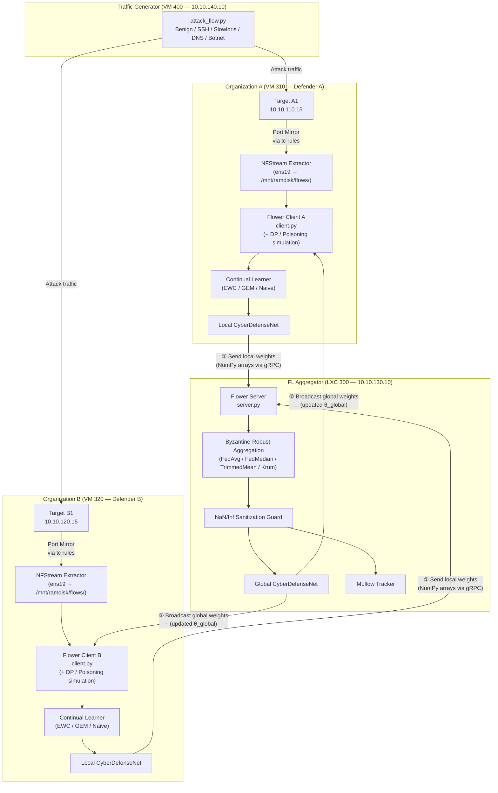
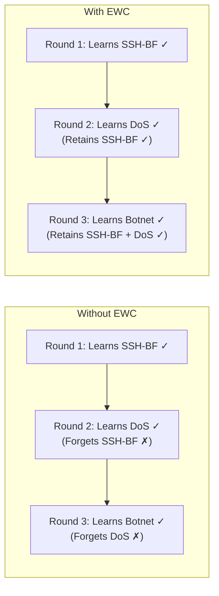
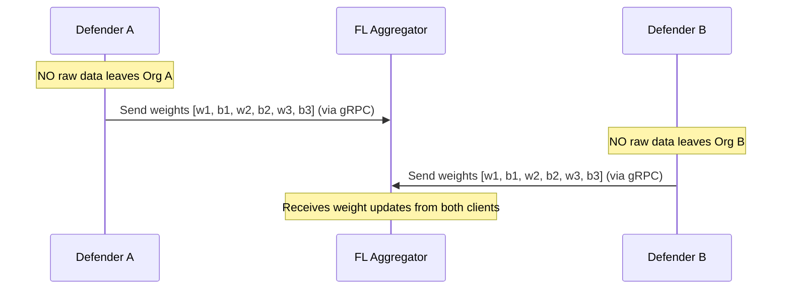
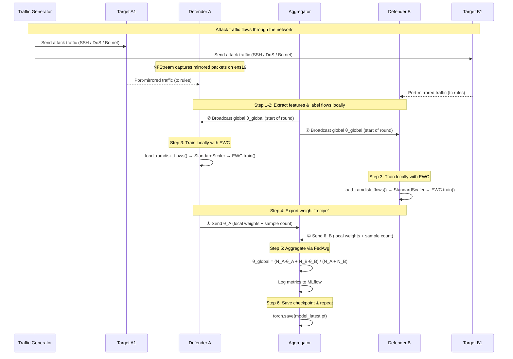

# How Federated Continual Learning Works — End-to-End Technical Explanation

> **Role in the documentation set**: This document provides a thorough, conceptual-to-code explanation of how the Federated Continual Learning (FCL) pipeline operates in this repository. It traces the complete lifecycle of a single federated round — from raw network traffic on a local defender node, through local EWC-regularized training, to global weight aggregation, and back to model redistribution. For infrastructure deployment, see [04_deployment.md](04_deployment.md). For orchestration details, see [05_orchestration.md](05_orchestration.md).

---

## 1. The Core Problem: Why FCL?

Traditional machine learning assumes that all training data is available in one place and that the data distribution doesn't change over time. In cyber defense, neither assumption holds:

- **Data is distributed**: Network traffic is captured at multiple organizational endpoints (Org A and Org B), and sharing raw packet data between organizations violates privacy, compliance, and operational security policies.
- **Data is non-stationary**: Attack patterns evolve. New threat vectors appear (e.g., a novel C2 beaconing protocol), and the model must adapt without forgetting how to detect historical threats (e.g., SSH brute force).

**Federated Continual Learning (FCL)** solves both problems simultaneously:

| Challenge | Solution | Implementation |
|:----------|:---------|:---------------|
| Distributed data silos | **Federated Learning** — share model weights, not raw data | Flower framework (`FedAvg`) |
| Evolving attack landscape | **Continual Learning** — regularize weight updates to prevent forgetting | Avalanche EWC strategy |

---

## 2. System Architecture Overview



---

## 3. Step-by-Step: A Single Federated Round

Each federated round follows a precise sequence. Below is the complete lifecycle, traced through the actual source code.

### 3.1 Step 1 — Raw Traffic Capture & Feature Extraction

**Where:** Defender A (`10.10.130.11`) and Defender B (`10.10.130.12`)
**Script:** [`src/defender/extractor.py`](../src/defender/extractor.py)

The defender VMs have a second network interface (`ens19`) that receives a port-mirrored copy of all traffic flowing through the target VM's interface. This is set up via `tc` mirroring rules applied by Proxmox hookscripts (see [04_deployment.md](04_deployment.md)).

The `extractor.py` script runs as a background daemon:
```bash
~/fl-cl-env/bin/python3 extractor.py --interface ens19 --out-dir /mnt/ramdisk/flows/ --batch-size 500
```

It uses **NFStream** to reconstruct raw packets into bidirectional network flows and extracts statistical features:

| Feature | Description |
|:--------|:------------|
| `bidirectional_packets` | Total packets in both directions |
| `bidirectional_bytes` | Total bytes in both directions |
| `duration_ms` | Flow duration in milliseconds |
| `src2dst_packets` / `dst2src_packets` | Directional packet counts |
| `src2dst_bytes` / `dst2src_bytes` | Directional byte volumes |
| `src2dst_mean_piat_ms` / `dst2src_mean_piat_ms` | Mean packet inter-arrival times |
| `dst_port` | Destination port (critical for class separation) |

These features are written as CSV files to a **tmpfs RAM disk** (`/mnt/ramdisk/flows/`) to avoid disk I/O bottleneck during high-throughput capture.

> **Key point:** Raw packets and payloads are **never stored**. Only statistical flow metadata is retained. This is the first layer of privacy preservation.

---

### 3.2 Step 2 — High-Performance NumPy Vectorized Labeling

**Where:** Defender A and Defender B (at training time and in real-time inference)
**Script:** [`src/defender/client.py`](../src/defender/client.py) → `assign_labels_vectorized()` function

When the Flower client or real-time inference loop loads flow CSVs, it uses a vectorized NumPy-based classification routing to assign labels simultaneously across the entire batch, achieving a **~850x speedup** compared to row-by-row loops:

```python
def assign_labels_vectorized(df, dos_threshold_ms=2000, traffic_gen_ip=None):
    if df.empty:
        return np.array([], dtype=np.int64)

    if traffic_gen_ip is None:
        traffic_gen_ip = os.environ.get("TRAFFIC_GEN_IP", "10.10.140.10")

    src_ips = df["src_ip"].astype(str).values
    dst_ips = df["dst_ip"].astype(str).values
    src_ports = pd.to_numeric(df["src_port"], errors="coerce").fillna(0).astype(int).values
    dst_ports = pd.to_numeric(df["dst_port"], errors="coerce").fillna(0).astype(int).values
    durations = pd.to_numeric(df["duration_ms"], errors="coerce").fillna(0).astype(float).values

    is_from_tg = (src_ips == traffic_gen_ip)
    is_to_tg = (dst_ips == traffic_gen_ip)
    is_tg = is_from_tg | is_to_tg

    labels = np.zeros(len(df), dtype=np.int64)

    # BruteForce (SSH on port 22)
    bf_mask = is_tg & ((src_ports == 22) | (dst_ports == 22))
    labels[bf_mask] = 3

    # Botnet (C2 on ports 8080, 8888, 9000)
    botnet_mask = is_tg & (~bf_mask) & (np.isin(src_ports, [8080, 8888, 9000]) | np.isin(dst_ports, [8080, 8888, 9000]))
    labels[botnet_mask] = 1

    # Exfiltration (DNS on port 53)
    exfil_mask = is_tg & (~bf_mask) & (~botnet_mask) & ((src_ports == 53) | (dst_ports == 53))
    labels[exfil_mask] = 2

    # DoS (volumetric HTTP floods on 80/443 exceeding duration threshold)
    web_ports = [80, 443]
    web_mask = is_tg & (~bf_mask) & (~botnet_mask) & (~exfil_mask) & (np.isin(src_ports, web_ports) | np.isin(dst_ports, web_ports))
    dos_web_mask = web_mask & (durations > dos_threshold_ms)
    labels[dos_web_mask] = 4

    # Default attack label for other TG traffic
    default_attack_mask = is_tg & (~bf_mask) & (~botnet_mask) & (~exfil_mask) & (~web_mask)
    labels[default_attack_mask] = 4

    return labels
```

This dynamic labeling matches offensive simulated target traffic identifiers and constructs target tensors on-the-fly without persistent raw packet logging.

---

### 3.3 Step 3 — Local Model Training with EWC

**Where:** Defender A and Defender B
**Scripts:** [`src/defender/client.py`](../src/defender/client.py) → `fit()` method, [`src/defender/cl_strategy.py`](../src/defender/cl_strategy.py)

This is the core of the Continual Learning component. When Flower calls `fit()` on each client:

#### 3.3.1 Data Loading Pipeline

```python
def fit(self, parameters, config):
    # 1. Inject the latest global model weights into the local network
    self.set_parameters(parameters)

    # 2. Load fresh flow CSVs from the RAM disk
    X, y = load_ramdisk_flows(self.flows_dir)

    # 3. Wrap into an Avalanche "experience" for CL training
    experience = get_experience(X, y)

    # 4. Train using EWC-regularized strategy
    self.cl.train(experience)

    # 5. Return updated weights (the "recipe") to the aggregator
    return self.get_parameters(config={}), len(X), {}
```

The `load_ramdisk_flows()` function:
1. Reads all CSV files from `/mnt/ramdisk/flows/`
2. Selects the 10 numeric feature columns
3. Applies fixed baseline Z-score scaling (utilizing mean/std statistics from class 0 baseline configurations) to prevent covariate shift across client dynamic updates
4. Pads or truncates to 32 dimensions (matching `CyberDefenseNet`'s input layer)
5. Classifies whole batches using high-speed vectorized labeling (`assign_labels_vectorized`)

#### 3.3.2 The EWC Regularization Mechanism

The EWC strategy is configured in [`cl_strategy.py`](../src/defender/cl_strategy.py):

```python
def get_continual_learner(model, device, ewc_lambda=0.4, class_weights=None):
    if class_weights is None:
        class_weights = [12.0, 3.0, 3.0, 15.0, 1.0]  # Overridden by configs/experiment.yaml
    weights_tensor = torch.tensor(class_weights, dtype=torch.float32).to(device)
    return EWC(
        model=model,
        optimizer=SGD(model.parameters(), lr=0.01, momentum=0.9),
        criterion=CrossEntropyLoss(weight=weights_tensor),
        ewc_lambda=ewc_lambda,
        train_mb_size=32,
        train_epochs=1,
        device=device,
    )
```

**How EWC prevents catastrophic forgetting:**

After training on historical attack data (e.g., SSH brute force), EWC computes the **Fisher Information Matrix (FIM)** — a measure of how important each weight is for classifying those attacks. When new attack data arrives (e.g., DoS traffic), the training loss is augmented with a penalty term:

$$\mathcal{L}(\theta) = \mathcal{L}_{\text{new}}(\theta) + \frac{\lambda}{2} \sum_{i} F_i (\theta_i - \theta_i^*)^2$$

Where:
- $\mathcal{L}_{\text{new}}(\theta)$ is the cross-entropy loss on the new attack data
- $\theta_i^*$ are the optimal weights from the previous task
- $F_i$ is the Fisher Information for weight $i$ (how important it is)
- $\lambda$ (`ewc_lambda`) controls the penalty strength

**In plain English:** If a weight was critical for detecting SSH brute force, EWC makes it expensive to change that weight while learning DoS patterns. The model finds alternative weights to represent the new knowledge.



#### 3.3.3 Class Weighting for Imbalanced Traffic

The `CrossEntropyLoss` is configured with per-class weights from the experiment config:

```yaml
# configs/experiment.yaml
training:
  class_weights: [8.0, 20.0, 3.0, 15.0, 10.0]
```

This tells the optimizer to pay **20× more attention** to misclassifying Botnet (class 1) compared to **3× for Exfiltration** (class 2). Without these weights, the model would ignore rare attack classes in favor of maximizing accuracy on the dominant Normal class.

---

### 3.4 Step 4 — Extracting the "Recipe" (Weight Sharing)

**Where:** Defender A and Defender B → Aggregator
**Protocol:** Flower gRPC (port 8080)

After local training completes, the client exports the model's mathematical representation — not the raw data:

```python
def get_parameters(self, config):
    return [v.cpu().numpy() for _, v in self.net.state_dict().items()]
```

This returns a list of NumPy arrays representing:
- Layer 1 weights: `(32 × 64)` matrix + `(64,)` bias vector
- Layer 2 weights: `(64 × 32)` matrix + `(32,)` bias vector
- Output layer weights: `(32 × 5)` matrix + `(5,)` bias vector

**Total data transmitted per client per round:** ~11,397 floating-point numbers (~45 KB).

> **This is the fundamental privacy mechanism of Federated Learning.** The aggregator never sees raw traffic, raw packets, IP addresses, or any organizational data. It only receives abstract mathematical weight matrices.



---

### 3.5 Step 5 — Global Model Aggregation & Robust Security Guards

**Where:** FL Aggregator (LXC 300, `10.10.130.10`)
**Script:** [`src/aggregator/server.py`](../src/aggregator/server.py) → `MLflowFedAvg` strategy

The aggregator receives weight updates from connected clients and combines them using the selected **Aggregation Strategy** (defaulting to baseline `FedAvg`).

#### Aggregation Strategies
*   **Federated Averaging (FedAvg)**:
    Computes a weighted average based on client training set sizes:
    $$\theta_{\text{global}} = \sum_{c=1}^{C} \frac{N_c}{N_{\text{total}}} \cdot \theta_c$$
*   **Federated Coordinate-wise Median (FedMedian)**:
    Computes the median independently for each coordinate across client weight updates:
    $$\theta_{\text{global}, i} = \text{median}(\{\theta_{c, i}\}_{c=1}^{C})$$
    Highly effective at neutralizing extreme model poisoning or arbitrary weight replacements.
*   **Coordinate-wise Trimmed Mean (TrimmedMean)**:
    Sorts parameters coordinate-wise and trims a fraction $\beta$ of values from each tail before computing the mean:
    $$\theta_{\text{global}, i} = \frac{1}{C - 2k} \sum_{c=k+1}^{C-k} \theta_{(c), i}$$
    Where $k = \lfloor \beta \cdot C \rfloor$, and $\theta_{(c), i}$ represents sorted coordinate updates.
*   **Krum (Consensus Client Selection)**:
    Selects a single representative client update that minimizes the sum of squared distances to its $C - f - 2$ nearest updates (where $f$ is the assumed number of Byzantine attackers):
    $$c^* = \arg\min_{c} \sum_{c' \in \mathcal{N}_c} \|\theta_c - \theta_{c'}\|^2$$
    Guarantees that the chosen client update lies within the convex hull of clean updates.

#### NaN/Inf Sanitization Guard
To prevent Byzantine clients from crashing the training cycle using NaN/Inf weight injection (model collapse attack), the server sanitizes all aggregated parameters:
```python
# Replace NaN and Inf parameters with 0.0 prior to model assembly and serialization
clean_ndarrays = []
for arr in ndarrays:
    clean_arr = np.nan_to_num(arr, nan=0.0, posinf=0.0, neginf=0.0)
    clean_ndarrays.append(clean_arr)
```

The aggregation and checkpointing happens in `aggregate_fit()`:

```python
def aggregate_fit(self, server_round, results, failures):
    # Triggers robust aggregation strategy on results
    aggregated = super().aggregate_fit(server_round, results, failures)

    if aggregated is not None:
        parameters, config = aggregated
        ndarrays = fl.common.parameters_to_ndarrays(parameters)

        # Apply NaN/Inf sanitization
        ndarrays = [np.nan_to_num(arr, nan=0.0, posinf=0.0, neginf=0.0) for arr in ndarrays]

        # Reconstruct the global model from sanitized parameters
        model = CyberDefenseNet()
        state_dict = OrderedDict(
            {k: torch.tensor(v) for k, v in zip(model.state_dict().keys(), ndarrays)}
        )
        model.load_state_dict(state_dict, strict=True)

        # Save checkpoint
        torch.save(model.state_dict(), f"model_round_{server_round:04d}.pt")

    return aggregated
```

After aggregation, the server also runs a global evaluation round:

```python
@mlflow.trace(name="aggregate_evaluate")
def aggregate_evaluate(self, server_round, results, failures):
    aggregated_result = super().aggregate_evaluate(server_round, results, failures)
    if aggregated_result:
        loss, metrics = aggregated_result
        accuracy = metrics.get("accuracy", 0.0)
        self.latest_loss = loss
        self.latest_accuracy = accuracy
        self.latest_metrics = metrics

        print(f"[server] Round {server_round} Aggregated Loss: {loss:.4f} | Accuracy: {accuracy:.4f}")
        mlflow.log_metric("loss", loss, step=server_round)
        for k, v in metrics.items():
            mlflow.log_metric(k, v, step=server_round)

        # Checkpoint best model
        if loss < self.best_loss:
            self.best_loss = loss
            self.best_round = server_round
            self.best_accuracy = accuracy
            self.best_metrics = metrics.copy()
            mlflow.log_metric("best_loss", loss, step=server_round)
            mlflow.log_metric("best_round", server_round, step=server_round)
            print(f"[server] ★ New best model at round {server_round} (loss={loss:.4f})")

    return aggregated_result
```

The per-class accuracy aggregation uses `weighted_avg()`, which weights each client's class accuracy by its sample count while skipping clients that had no samples for a given class (reported as sentinel value `-1.0`):

```python
def weighted_avg(metrics):
    total_samples = sum([n for n, _ in metrics])
    accs = [n * m["accuracy"] for n, m in metrics]
    avg_accuracy = sum(accs) / total_samples

    aggregated_metrics = {"accuracy": avg_accuracy}
    for i in range(5):
        class_key = f"accuracy_class_{i}"
        class_vals = [(n, m[class_key]) for n, m in metrics if m.get(class_key, -1.0) >= 0.0]
        if class_vals:
            aggregated_metrics[class_key] = sum(w * v for w, v in class_vals) / sum(w for w, _ in class_vals)

    return aggregated_metrics
```

### 3.5.2 Post-Training: Registration, Datasets, and Governance
Once training completes (all rounds finished), the server executes the final pipeline integration steps:

1. **Log Model Artifact**: The PyTorch model is registered to MLflow using `mlflow.pytorch.log_model(..., registered_model_name="CyberDefenseNet")`.
2. **Link Training Dataset**: The aggregator documents training context using an MLflow `Dataset` entity:
   ```python
   dataset_summary = pd.DataFrame([
       {"class": "Normal", "defender_a": 22, "defender_b": 10},
       # ... other classes
   ])
   train_dataset = mlflow.data.from_pandas(dataset_summary, name="aggregated_training_flows")
   mlflow.log_metrics(..., model_id=logged_model.model_id, dataset=train_dataset)
   ```
3. **Structured Markdown Note**: The `mlflow.note.content` tag is updated programmatically to display execution metadata and final best class-wise metrics inside the MLflow UI.
4. **Log Evaluation Table**: Detailed per-class accuracies and sample counts are saved as a structured JSON table artifact (`evaluation_metrics_summary.json` via `mlflow.log_table()`).
5. **Enforce Version Aliases**: Using `MlflowClient`, the new version is registered and promoted to:
   - **`champion`** (in `production` mode), replacing any old champion.
   - **`challenger`** (in `experimental` mode).
6. **Local LLM Post-Run Analysis**: The orchestrator triggers `tools/generate_llm_report.py`, querying a local CPU-bound Ollama service (`llama3.1:8b`) via an Nginx authentication proxy. The query uses an instruct-style prompt structure and a strict `"num_predict": 512` token cap to generate a structured markdown threat analysis without CPU hangs or timeouts. The resulting report is appended to `run_summary.md` and registered in MLflow under the current run as an experiment artifact.

---

### 3.6 Step 6 — Global Model Redistribution

**Where:** Aggregator → Defender A and Defender B
**Protocol:** Flower gRPC (automatic)

At the start of the **next** federated round, the Flower server automatically broadcasts the updated global model weights to all connected clients. Each client receives them and injects them into their local network:

```python
def set_parameters(self, params):
    state = OrderedDict(
        {k: torch.tensor(v) for k, v in zip(self.net.state_dict().keys(), params)}
    )
    self.net.load_state_dict(state, strict=True)
```

After this call, the local model on each defender is now synchronized with the global model — containing knowledge from **both** organizations' traffic patterns — without either organization having exposed its raw data to the other.

---

## 4. The Complete Round Lifecycle (Summary)



---

## 5. What Each Node Sees (Privacy Boundary)

| Node | Has access to | Does NOT have access to |
|:-----|:-------------|:-----------------------|
| **Defender A** | Its own raw packets, flow CSVs, local labels, local model weights, EWC Fisher matrix | Defender B's raw data, Defender B's labels, Defender B's local weights |
| **Defender B** | Its own raw packets, flow CSVs, local labels, local model weights, EWC Fisher matrix | Defender A's raw data, Defender A's labels, Defender A's local weights |
| **Aggregator** | Aggregated weight matrices from both clients, sample counts, evaluation metrics | Raw packets, flow CSVs, IP addresses, or any per-flow data from either client |
| **Orchestrator** | SSH access to start/stop processes, experiment config, MLflow metrics DB | Raw training data (never transferred to workstation) |

---

## 6. Configuration Levers

All tunable parameters are centralized in [`configs/experiment.yaml`](../configs/experiment.yaml):

### Federated Learning & Aggregation Parameters

| Parameter | Config Path | Default | Effect |
|:----------|:-----------|:--------|:-------|
| FL Rounds | `fl.rounds` | 100 | More rounds = longer training, better convergence |
| Min Clients | `fl.min_clients` | 2 | Wait for at least N clients per round |
| Aggregation Strategy | `fl.strategy` | `FedAvg` | Dynamic selection of `FedAvg`, `FedMedian`, `TrimmedMean`, or `Krum` |
| Trimmed Mean Beta | `fl.trimmed_mean_beta` | `0.2` | Tail trimming fraction for TrimmedMean strategy |

### Continual Learning Parameters

| Parameter | Config Path | Default | Effect |
|:----------|:-----------|:--------|:-------|
| Strategy | `cl.strategy` | `EWC` | Dynamic selection of `EWC`, `GEM`, or `Naive` |
| EWC Lambda | `cl.ewc_lambda` | 0.25 | Penalty scale for deviation from older parameters (EWC specific) |
| Patterns Per Experience | `cl.patterns_per_exp` | 256 | Replay buffer pattern limit (GEM specific) |
| Memory Strength | `cl.memory_strength` | 0.5 | Strength of memory constraint (GEM specific) |

### Security & Privacy Parameters

| Parameter | Config Path | Default | Effect |
|:----------|:-----------|:--------|:-------|
| Poison Enabled | `security.poison_enabled` | `false` | Simulated adversarial label poisoning on client side |
| Poison Rate | `security.poison_rate` | `0.2` | Fraction of dataset targets poisoned |
| Poison Client IDs | `security.poison_client_ids` | `"1"` | String containing client IDs targeted for poisoning |
| DP Enabled | `security.dp_enabled` | `false` | Enable client-side differential privacy (DP-SGD) via Opacus |
| DP Noise Multiplier | `security.dp_noise_multiplier` | `1.0` | Noise parameter added to training gradients |
| DP Max Grad Norm | `security.dp_max_grad_norm` | `1.0` | Maximum L2 clipping norm bound for gradients |

### Training Parameters

| Parameter | Config Path | Default | Effect |
|:----------|:-----------|:--------|:-------|
| Learning Rate | `training.lr` | 0.01 | Step size for SGD optimizer |
| Batch Size | `training.batch_size` | 32 | Samples per mini-batch |
| Epochs/Round | `training.epochs_per_round` | 1 | Local epochs before sending weights |
| Class Weights | `training.class_weights` | `[8.0, 20.0, 3.0, 15.0, 10.0]` | Loss multiplier per class |

### Tuning Guidelines

```
Class 1 (Botnet) accuracy too low?
  → Increase class_weights[1] (currently 20.0)
  → Ensure attack_flow.py --mode botnet is running long enough

Class 3 (BruteForce) accuracy dropping after new attacks?
  → Increase ewc_lambda (e.g., 0.3 → 0.5) for more stability
  → This trades off plasticity for new attack learning

Byzantine/Poisoned client corrupting the global model?
  → Change fl.strategy to FedMedian or TrimmedMean
  → Adjust fl.trimmed_mean_beta to account for the expected fraction of malicious clients

Training gradients exploding or crashing with NaN?
  → Double check that the Gradient Safety clip_grad_norm_ is active (cl_strategy.py automatically clips at 1.0)
  → The server's NaN/Inf Sanitization Guard will intercept anomalies and replace them with zero.
```

---

## 7. Running the Complete Pipeline

### Prerequisites
1. All target VMs (`311`, `321`) are booted with port mirroring hookscripts applied
2. SSH key is authorized on all 6 nodes (`ssh root@10.10.130.10` must work without password)
3. Python environments are installed on remote nodes (see [04_deployment.md](04_deployment.md))

### Execute

```powershell
# Option A: Experimental mode (Cold start, registers model to Registry under 'challenger' alias)
python src/orchestrate.py --key "~/.ssh/id_ed25519" --config configs/experiment.yaml --mlops-mode experimental

# Option B: Production mode with Resume strategy (Warm-starts from the latest registered 'champion' version weights)
python src/orchestrate.py --key "~/.ssh/id_ed25519" --config configs/experiment.yaml --mlops-mode production --production-strategy resume

# Option C: Production mode with Fresh strategy (Cold starts a new model version and promotes it to 'champion' alias on finish)
python src/orchestrate.py --key "~/.ssh/id_ed25519" --config configs/experiment.yaml --mlops-mode production --production-strategy fresh
```

### What Happens Automatically

| Phase | Description | Duration |
|:------|:------------|:---------|
| 1 | Kill stale processes on all nodes | ~5s |
| 2 | SCP latest code to all nodes | ~10s |
| 3 | Boot target HTTP servers | ~2s |
| 4 | Start NFStream extractors on defenders | ~3s |
| 5 | Start MLflow + Flower server on aggregator | ~5s |
| 6 | Run sequential attack stages (benign → SSH → slowloris → DNS → botnet) | ~2.5 min |
| 6b | Wait for flow CSVs to appear on ramdisk | up to 120s |
| 6c | Data quality gate — check label distribution | ~5s |
| 7 | Launch Flower clients on both defenders | ~3s |
| 8 | Monitor convergence (wait for all rounds) | depends on `fl.rounds` |
| 8b | Pull MLflow DB, generate plots & report | ~30s |
| 9 | Cleanup all remote processes | ~10s |

### Monitor Results

- **MLflow Dashboard:** `http://10.10.130.10:5000` → Experiment `FL-CL-CyberDefense`
- **Auto-generated Report:** `exports/run_summary.md`
- **Convergence Plots:** `exports/plots/class_*.png`

---

## 8. Advanced MLOps Features: Sweeps, Lineage, and Validation

To transition from basic collaborative training to a highly robust enterprise deployment, the FCL framework integrates three production MLOps capabilities.

### 8.1 Automated Hyperparameter Sweep Controller
- **Purpose**: Systematically evaluates multiple config scenarios (e.g. searching over $\lambda_{\text{EWC}}$ to balance stability vs plasticity).
- **Execution**: Run `python src/sweep.py --config configs/sweep_grid.yaml`.
- **Implementation**: The sweep controller runs a grid search, launching `orchestrate.py` inside distinct runs nested under a parent MLflow experiment, ensuring complete logging and convergence evaluation across different configurations.

### 8.2 Cryptographic Data Lineage Tracking
- **Purpose**: Establishes immutable dataset provenance to guarantee training reproducibility and compliance audits.
- **Execution**: The orchestrator automatically computes SHA-256 digests of the active CSV flows on client RAM disks prior to client execution.
- **Lineage Registry**: The client-side digests are registered as MLflow parameters, and a merged graph checksum $\text{SHA-256}(\text{hash\\_A} \mathbin{\Vert} \text{hash\\_B})$ is registered alongside a structured `dataset_lineage.json` artifact containing system configurations, git commit SHAs, and timestamped statistics.

### 8.3 Automated Registry Governance & Validation Gates
- **Purpose**: Restricts automated Model Registry promotions to only candidate models that satisfy strict continual learning performance and communication constraints.
- **Gates Enforced**:
  1. **Per-Class F1 Thresholds**:
     - Class 0 (Normal) $\ge 0.50$
     - Class 1 (Botnet) $\ge 0.60$
     - Class 2 (Exfiltration) $\ge 0.70$
     - Class 3 (BruteForce) $\ge 0.50$
     - Class 4 (DoS) $\ge 0.70$
  2. **No Forgetting Regression**: Per-class Backward Transfer (BWT) $\ge 0.0$ (ensuring no forgetting regression for any individual class).
  3. **Communication Budget**: Total communication overhead $\le$ budget (default: 200,000,000 bytes).
- **Promotion Control**: If the candidate fails any check, the registry alias remains on the current `champion`, and the failure reason is registered as an MLflow run tag. If all checks pass, the model is atomically promoted to `champion`, exported as a TorchScript model artifact, and `mlflow.note.content` is updated.
- **Real-Time Telegram Alerts**: Triggers real-time alerts with detailed HTML formatting for successful promotions or failure details (specifically listing which class F1, BWT, or communication budget was violated).
- **First-Class CL Metadata**: Registered models are annotated with task sequence attributes (`cl_task_sequence`, `cl_complexity_score`) for lineage auditability.
- **L2 Client Weight Drift Monitoring**: During aggregation, the server computes L2 parameter drift between each client and the global model, monitoring client divergence and detecting anomalies using a 3-sigma rule logged directly to MLflow.

### 8.4 Byzantine-Robust Aggregation & Privacy Guarantees (Theme E)
- **Objective**: Protect the collaborative model from malicious poisoning attacks, guarantee privacy against membership inference via differential privacy, and ensure computational safety against exploding/NaN parameters.
- **Robust Aggregation**:
  - **FedMedian**: Computes the coordinate-wise median, preventing single-client extreme updates from influencing the global model.
  - **TrimmedMean**: Trims configured tails from sorted parameters coordinate-wise to compute a clean average, neutralizing bounded attackers.
  - **Krum**: Restricts updates to a single consensus client that minimizes distance to neighboring updates.
- **Client-Side Differential Privacy (DP-SGD)**: Optionally wraps PyTorch data loaders and model parameters with **Opacus** at the client, enforcing strict differential privacy bounds via noise injection and per-sample gradient clipping.
- **NaN/Inf Sanitization**: Aggregator scans updates for invalid parameters (`NaN` or `Inf`), replacing them with `0.0` to preserve training loop continuity.
