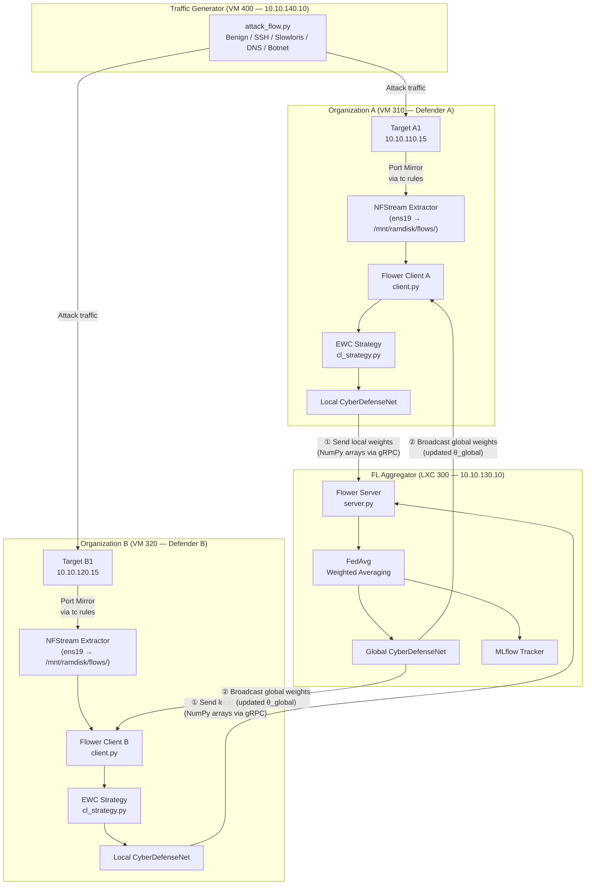
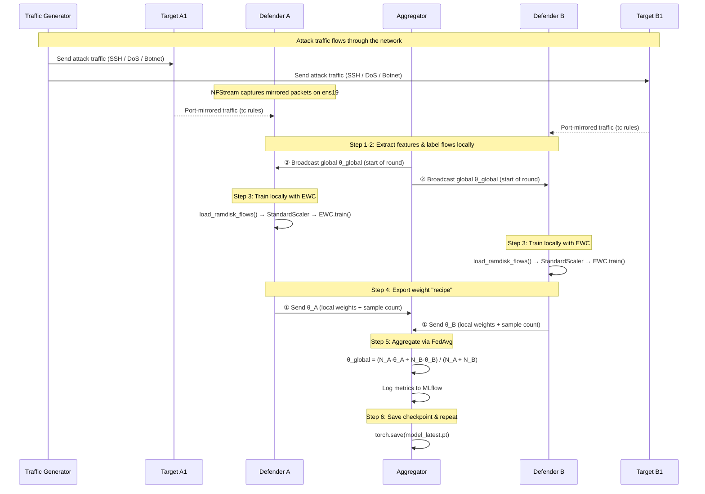

# How Federated Continual Learning Works — End-to-End Technical Explanation

> **Role in the documentation set**: This document provides a thorough, conceptual-to-code explanation of how the Federated Continual Learning (FCL) pipeline operates in this repository. It traces the complete lifecycle of a single federated round — from raw network traffic on a local defender node, through local EWC-regularized training, to global weight aggregation, and back to model redistribution. For infrastructure deployment, see [04_deployment.md](04_deployment.md). For orchestration details, see [05_orchestration.md](05_orchestration.md).

---

## 1. The Core Problem: Why FCL?

Traditional machine learning assumes that all training data is available in one place and that the data distribution doesn't change over time. In cyber defense, neither assumption holds:

- **Data is distributed**: Network traffic is captured at multiple organizational endpoints (Org A and Org B), and sharing raw packet data between organizations violates privacy, compliance, and operational security policies.
- **Data is non-stationary**: Attack patterns evolve. New threat vectors appear (e.g., a novel C2 beaconing protocol), and the model must adapt without forgetting how to detect historical threats (e.g., SSH brute force).

**Federated Continual Learning (FCL)** solves both problems simultaneously:

| Challenge | Solution | Implementation |
|:----------|:---------|:---------------|
| Distributed data silos | **Federated Learning** — share model weights, not raw data | Flower framework (`FedAvg`) |
| Evolving attack landscape | **Continual Learning** — regularize weight updates to prevent forgetting | Avalanche EWC strategy |

---

## 2. System Architecture Overview



---

## 3. Step-by-Step: A Single Federated Round

Each federated round follows a precise sequence. Below is the complete lifecycle, traced through the actual source code.

### 3.1 Step 1 — Raw Traffic Capture & Feature Extraction

**Where:** Defender A (`10.10.130.11`) and Defender B (`10.10.130.12`)
**Script:** [`src/defender/extractor.py`](../src/defender/extractor.py)

The defender VMs have a second network interface (`ens19`) that receives a port-mirrored copy of all traffic flowing through the target VM's interface. This is set up via `tc` mirroring rules applied by Proxmox hookscripts (see [04_deployment.md](04_deployment.md)).

The `extractor.py` script runs as a background daemon:
```bash
~/fl-cl-env/bin/python3 extractor.py --interface ens19 --out-dir /mnt/ramdisk/flows/ --batch-size 500
```

It uses **NFStream** to reconstruct raw packets into bidirectional network flows and extracts statistical features:

| Feature | Description |
|:--------|:------------|
| `bidirectional_packets` | Total packets in both directions |
| `bidirectional_bytes` | Total bytes in both directions |
| `duration_ms` | Flow duration in milliseconds |
| `src2dst_packets` / `dst2src_packets` | Directional packet counts |
| `src2dst_bytes` / `dst2src_bytes` | Directional byte volumes |
| `src2dst_mean_piat_ms` / `dst2src_mean_piat_ms` | Mean packet inter-arrival times |
| `dst_port` | Destination port (critical for class separation) |

These features are written as CSV files to a **tmpfs RAM disk** (`/mnt/ramdisk/flows/`) to avoid disk I/O bottleneck during high-throughput capture.

> **Key point:** Raw packets and payloads are **never stored**. Only statistical flow metadata is retained. This is the first layer of privacy preservation.

---

### 3.2 Step 2 — Dynamic Threat Labeling

**Where:** Defender A and Defender B (at training time)
**Script:** [`src/defender/client.py`](../src/defender/client.py) → `assign_label()` function

When the Flower client loads flow CSVs for training, each flow record is dynamically assigned a threat label based on IP/port heuristics:

```python
def assign_label(row):
    """
    Assigns threat labels based on flow metadata:
        0: Normal (benign traffic)
        1: Botnet (C2 on ports 8080/8888/9000)
        2: Exfiltration (DNS on port 53)
        3: BruteForce (SSH on port 22)
        4: DoS (HTTP floods on port 80/443)
    """
    traffic_gen_ip = "10.10.140.10"
    is_from_traffic_gen = (src_ip == traffic_gen_ip)

    if is_from_traffic_gen:
        if dst_port == 22:     return 3  # BruteForce
        if dst_port in [80, 443]: return 4  # DoS
        if dst_port in [8080, 8888, 9000]: return 1  # Botnet
        if dst_port == 53:     return 2  # Exfiltration
    return 0  # Normal
```

This produces labeled tensors without requiring a pre-labeled dataset — the label is derived from the network context itself.

---

### 3.3 Step 3 — Local Model Training with EWC

**Where:** Defender A and Defender B
**Scripts:** [`src/defender/client.py`](../src/defender/client.py) → `fit()` method, [`src/defender/cl_strategy.py`](../src/defender/cl_strategy.py)

This is the core of the Continual Learning component. When Flower calls `fit()` on each client:

#### 3.3.1 Data Loading Pipeline

```python
def fit(self, parameters, config):
    # 1. Inject the latest global model weights into the local network
    self.set_parameters(parameters)

    # 2. Load fresh flow CSVs from the RAM disk
    X, y = load_ramdisk_flows(self.flows_dir)

    # 3. Wrap into an Avalanche "experience" for CL training
    experience = get_experience(X, y)

    # 4. Train using EWC-regularized strategy
    self.cl.train(experience)

    # 5. Return updated weights (the "recipe") to the aggregator
    return self.get_parameters(config={}), len(X), {}
```

The `load_ramdisk_flows()` function:
1. Reads all CSV files from `/mnt/ramdisk/flows/`
2. Selects the 10 numeric feature columns
3. Applies `StandardScaler` normalization
4. Pads or truncates to 32 dimensions (matching `CyberDefenseNet`'s input layer)
5. Calls `assign_label()` on each row to generate threat labels

#### 3.3.2 The EWC Regularization Mechanism

The EWC strategy is configured in [`cl_strategy.py`](../src/defender/cl_strategy.py):

```python
def get_continual_learner(model, device, ewc_lambda=0.4, class_weights=None):
    if class_weights is None:
        class_weights = [12.0, 3.0, 3.0, 15.0, 1.0]  # Overridden by configs/experiment.yaml
    weights_tensor = torch.tensor(class_weights, dtype=torch.float32).to(device)
    return EWC(
        model=model,
        optimizer=SGD(model.parameters(), lr=0.01, momentum=0.9),
        criterion=CrossEntropyLoss(weight=weights_tensor),
        ewc_lambda=ewc_lambda,
        train_mb_size=32,
        train_epochs=1,
        device=device,
    )
```

**How EWC prevents catastrophic forgetting:**

After training on historical attack data (e.g., SSH brute force), EWC computes the **Fisher Information Matrix (FIM)** — a measure of how important each weight is for classifying those attacks. When new attack data arrives (e.g., DoS traffic), the training loss is augmented with a penalty term:

$$\mathcal{L}(\theta) = \mathcal{L}_{\text{new}}(\theta) + \frac{\lambda}{2} \sum_{i} F_i (\theta_i - \theta_i^*)^2$$

Where:
- $\mathcal{L}_{\text{new}}(\theta)$ is the cross-entropy loss on the new attack data
- $\theta_i^*$ are the optimal weights from the previous task
- $F_i$ is the Fisher Information for weight $i$ (how important it is)
- $\lambda$ (`ewc_lambda`) controls the penalty strength

**In plain English:** If a weight was critical for detecting SSH brute force, EWC makes it expensive to change that weight while learning DoS patterns. The model finds alternative weights to represent the new knowledge.

```
                    Without EWC                          With EWC
              ┌─────────────────────┐         ┌─────────────────────────┐
  Round 1:    │ Learns SSH-BF ✓     │         │ Learns SSH-BF ✓         │
  Round 2:    │ Learns DoS ✓        │         │ Learns DoS ✓            │
              │ Forgets SSH-BF ✗    │         │ Retains SSH-BF ✓        │
  Round 3:    │ Learns Botnet ✓     │         │ Learns Botnet ✓         │
              │ Forgets DoS ✗       │         │ Retains SSH-BF + DoS ✓  │
              └─────────────────────┘         └─────────────────────────┘
```

#### 3.3.3 Class Weighting for Imbalanced Traffic

The `CrossEntropyLoss` is configured with per-class weights from the experiment config:

```yaml
# configs/experiment.yaml
training:
  class_weights: [8.0, 20.0, 3.0, 15.0, 10.0]
```

This tells the optimizer to pay **20× more attention** to misclassifying Botnet (class 1) compared to **3× for Exfiltration** (class 2). Without these weights, the model would ignore rare attack classes in favor of maximizing accuracy on the dominant Normal class.

---

### 3.4 Step 4 — Extracting the "Recipe" (Weight Sharing)

**Where:** Defender A and Defender B → Aggregator
**Protocol:** Flower gRPC (port 8080)

After local training completes, the client exports the model's mathematical representation — not the raw data:

```python
def get_parameters(self, config):
    return [v.cpu().numpy() for _, v in self.net.state_dict().items()]
```

This returns a list of NumPy arrays representing:
- Layer 1 weights: `(32 × 64)` matrix + `(64,)` bias vector
- Layer 2 weights: `(64 × 32)` matrix + `(32,)` bias vector
- Output layer weights: `(32 × 5)` matrix + `(5,)` bias vector

**Total data transmitted per client per round:** ~11,397 floating-point numbers (~45 KB).

> **This is the fundamental privacy mechanism of Federated Learning.** The aggregator never sees raw traffic, raw packets, IP addresses, or any organizational data. It only receives abstract mathematical weight matrices.

```
  Defender A                          Aggregator                         Defender B
  ┌────────┐                         ┌──────────┐                       ┌────────┐
  │ Local   │   [w1, b1, w2, b2,    │ Receives │   [w1, b1, w2, b2,   │ Local   │
  │ Model   │──  w3, b3]  ────────►│ weight   │◄──── w3, b3]  ──────│ Model   │
  │ Weights │   (NumPy arrays       │ updates  │   (NumPy arrays      │ Weights │
  └────────┘    via gRPC)           │ from     │    via gRPC)         └────────┘
                                     │ both     │
                NO raw data          │ clients  │          NO raw data
                leaves Org A         └──────────┘          leaves Org B
```

---

### 3.5 Step 5 — Global Model Aggregation (FedAvg)

**Where:** FL Aggregator (LXC 300, `10.10.130.10`)
**Script:** [`src/aggregator/server.py`](../src/aggregator/server.py) → `MLflowFedAvg` strategy

The aggregator receives weight updates from both clients and combines them using the **Federated Averaging (FedAvg)** algorithm:

$$\theta_{\text{global}} = \sum_{c=1}^{C} \frac{N_c}{N_{\text{total}}} \cdot \theta_c$$

Where:
- $\theta_c$ is the weight update from client $c$
- $N_c$ is the number of training samples client $c$ used
- $N_{\text{total}} = \sum N_c$ is the total samples across all clients

**In plain English:** If Defender A trained on 3,000 flows and Defender B trained on 1,500 flows, the aggregated model weights Defender A's contribution twice as heavily. This ensures clients with more data have proportionally more influence.

The aggregation happens in `aggregate_fit()`:

```python
def aggregate_fit(self, server_round, results, failures):
    aggregated = super().aggregate_fit(server_round, results, failures)

    if aggregated is not None:
        parameters, config = aggregated
        ndarrays = fl.common.parameters_to_ndarrays(parameters)

        # Reconstruct the global model from aggregated parameters
        model = CyberDefenseNet()
        state_dict = OrderedDict(
            {k: torch.tensor(v) for k, v in zip(model.state_dict().keys(), ndarrays)}
        )
        model.load_state_dict(state_dict, strict=True)

        # Save checkpoint
        torch.save(model.state_dict(), f"model_round_{server_round:04d}.pt")

    return aggregated
```

After aggregation, the server also runs a global evaluation round:

```python
def aggregate_evaluate(self, server_round, results, failures):
    aggregated_result = super().aggregate_evaluate(server_round, results, failures)
    loss, metrics = aggregated_result
    accuracy = metrics.get("accuracy", 0.0)

    # Log to MLflow for tracking
    mlflow.log_metric("loss", loss, step=server_round)
    mlflow.log_metric("accuracy", accuracy, step=server_round)

    # Per-class accuracy tracking
    for k, v in metrics.items():
        mlflow.log_metric(k, v, step=server_round)
```

The per-class accuracy aggregation uses `weighted_avg()`, which weights each client's class accuracy by its sample count while skipping clients that had no samples for a given class (reported as sentinel value `-1.0`):

```python
def weighted_avg(metrics):
    total_samples = sum([n for n, _ in metrics])
    accs = [n * m["accuracy"] for n, m in metrics]
    avg_accuracy = sum(accs) / total_samples

    aggregated_metrics = {"accuracy": avg_accuracy}
    for i in range(5):
        class_key = f"accuracy_class_{i}"
        class_vals = [(n, m[class_key]) for n, m in metrics if m.get(class_key, -1.0) >= 0.0]
        if class_vals:
            aggregated_metrics[class_key] = sum(w * v for w, v in class_vals) / sum(w for w, _ in class_vals)

    return aggregated_metrics
```

---

### 3.6 Step 6 — Global Model Redistribution

**Where:** Aggregator → Defender A and Defender B
**Protocol:** Flower gRPC (automatic)

At the start of the **next** federated round, the Flower server automatically broadcasts the updated global model weights to all connected clients. Each client receives them and injects them into their local network:

```python
def set_parameters(self, params):
    state = OrderedDict(
        {k: torch.tensor(v) for k, v in zip(self.net.state_dict().keys(), params)}
    )
    self.net.load_state_dict(state, strict=True)
```

After this call, the local model on each defender is now synchronized with the global model — containing knowledge from **both** organizations' traffic patterns — without either organization having exposed its raw data to the other.

---

## 4. The Complete Round Lifecycle (Summary)



---

## 5. What Each Node Sees (Privacy Boundary)

| Node | Has access to | Does NOT have access to |
|:-----|:-------------|:-----------------------|
| **Defender A** | Its own raw packets, flow CSVs, local labels, local model weights, EWC Fisher matrix | Defender B's raw data, Defender B's labels, Defender B's local weights |
| **Defender B** | Its own raw packets, flow CSVs, local labels, local model weights, EWC Fisher matrix | Defender A's raw data, Defender A's labels, Defender A's local weights |
| **Aggregator** | Aggregated weight matrices from both clients, sample counts, evaluation metrics | Raw packets, flow CSVs, IP addresses, or any per-flow data from either client |
| **Orchestrator** | SSH access to start/stop processes, experiment config, MLflow metrics DB | Raw training data (never transferred to workstation) |

---

## 6. Configuration Levers

All tunable parameters are centralized in [`configs/experiment.yaml`](../configs/experiment.yaml):

### Federated Learning Parameters

| Parameter | Config Path | Default | Effect |
|:----------|:-----------|:--------|:-------|
| FL Rounds | `fl.rounds` | 100 | More rounds = longer training, better convergence |
| Min Clients | `fl.min_clients` | 2 | Wait for at least N clients per round |

### Continual Learning Parameters

| Parameter | Config Path | Default | Effect |
|:----------|:-----------|:--------|:-------|
| EWC Lambda | `cl.ewc_lambda` | 0.25 | Higher = more stability (less forgetting), lower = more plasticity |
| Strategy | `cl.strategy` | EWC | Currently only EWC is implemented |

### Training Parameters

| Parameter | Config Path | Default | Effect |
|:----------|:-----------|:--------|:-------|
| Learning Rate | `training.lr` | 0.01 | Step size for SGD optimizer |
| Batch Size | `training.batch_size` | 32 | Samples per mini-batch |
| Epochs/Round | `training.epochs_per_round` | 1 | Local epochs before sending weights |
| Class Weights | `training.class_weights` | `[8.0, 20.0, 3.0, 15.0, 10.0]` | Loss multiplier per class |

### Tuning Guidelines

```
Class 1 (Botnet) accuracy too low?
  → Increase class_weights[1] (currently 20.0)
  → Ensure attack_flow.py --mode botnet is running long enough

Class 3 (BruteForce) accuracy dropping after new attacks?
  → Increase ewc_lambda (e.g., 0.3 → 0.5) for more stability
  → This trades off plasticity for new attack learning

Overall accuracy plateauing?
  → Increase fl.rounds (e.g., 100 → 200)
  → Decrease ewc_lambda to allow more adaptation
```

---

## 7. Running the Complete Pipeline

### Prerequisites
1. All target VMs (`311`, `321`) are booted with port mirroring hookscripts applied
2. SSH key is authorized on all 6 nodes (`ssh root@10.10.130.10` must work without password)
3. Python environments are installed on remote nodes (see [04_deployment.md](04_deployment.md))

### Execute

```powershell
python src/orchestrate.py --key "~/.ssh/id_ed25519" --config configs/experiment.yaml
```

### What Happens Automatically

| Phase | Description | Duration |
|:------|:------------|:---------|
| 1 | Kill stale processes on all nodes | ~5s |
| 2 | SCP latest code to all nodes | ~10s |
| 3 | Boot target HTTP servers | ~2s |
| 4 | Start NFStream extractors on defenders | ~3s |
| 5 | Start MLflow + Flower server on aggregator | ~5s |
| 6 | Run sequential attack stages (benign → SSH → slowloris → DNS → botnet) | ~2.5 min |
| 6b | Wait for flow CSVs to appear on ramdisk | up to 120s |
| 6c | Data quality gate — check label distribution | ~5s |
| 7 | Launch Flower clients on both defenders | ~3s |
| 8 | Monitor convergence (wait for all rounds) | depends on `fl.rounds` |
| 8b | Pull MLflow DB, generate plots & report | ~30s |
| 9 | Cleanup all remote processes | ~10s |

### Monitor Results

- **MLflow Dashboard:** `http://10.10.130.10:5000` → Experiment `FL-CL-CyberDefense`
- **Auto-generated Report:** `exports/run_summary.md`
- **Convergence Plots:** `exports/plots/class_*.png`
