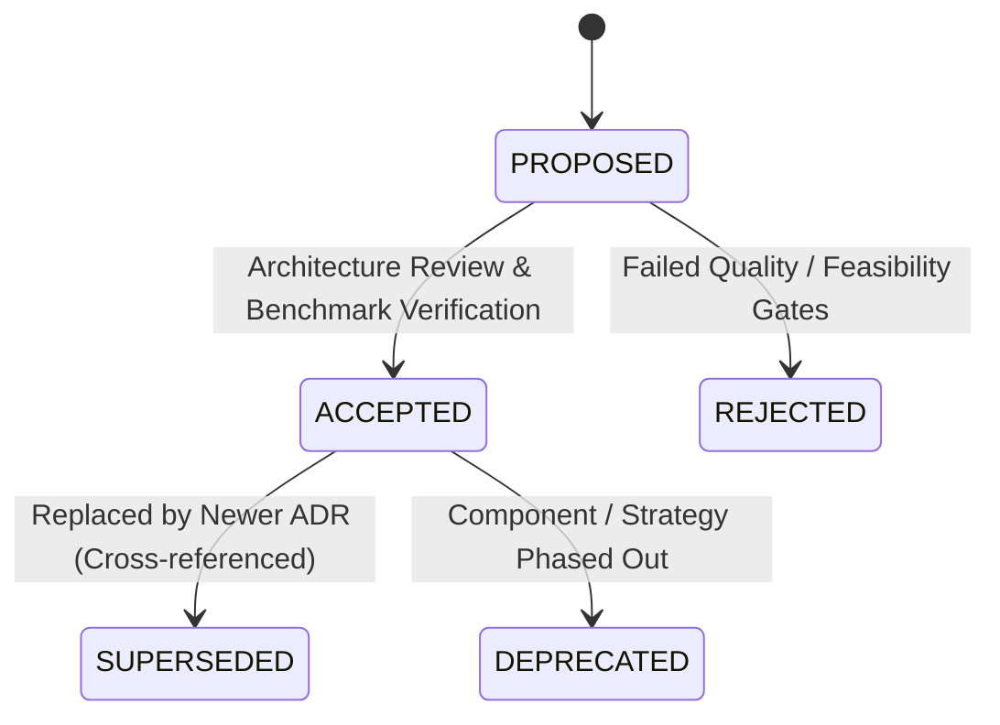

# Architecture Decision Records (ADRs)

This directory contains the formal architectural decision records for the `fl-cl` (Federated & Continual Learning for Encrypted Traffic Intrusion Detection) project.

---

## ADR Index

| ADR | Title | Status | Date | Primary Component |
| :--- | :--- | :---: | :---: | :--- |
| [ADR-001](file:///e:/Projects/fl-cl/docs/decisions/ADR-001_avalanche_continual_learning_ewc_gem.md) | Continual Learning Strategy — Avalanche EWC and GEM Integration | **Accepted** | 2026-08-15 | `src/defender/cl_strategy.py` |
| [ADR-002](file:///e:/Projects/fl-cl/docs/decisions/ADR-002_multi_backbone_model_factory.md) | Dynamic Multi-Backbone Model Architecture Factory | **Accepted** | 2026-08-15 | `src/defender/model.py` |
| [ADR-003](file:///e:/Projects/fl-cl/docs/decisions/ADR-003_nfstream_tmpfs_flow_extraction.md) | NFStream Encrypted Traffic Feature Extraction & tmpfs RAMDisk Storage | **Accepted** | 2026-08-15 | `src/defender/extractor.py` |
| [ADR-004](file:///e:/Projects/fl-cl/docs/decisions/ADR-004_flower_federated_aggregation_robust_trimmed_mean.md) | Flower Federated Learning Architecture & Robust TrimmedMean Aggregation | **Accepted** | 2026-08-15 | `src/aggregator/server.py` |
| [ADR-005](file:///e:/Projects/fl-cl/docs/decisions/ADR-005_mlflow_registry_promotion_quantization.md) | Automated CI/CD Model Promotion Gate, Backward Transfer Tracking, and INT8 Quantization | **Accepted** | 2026-08-15 | `tools/ci_cd_promote.py` |

---

## ADR Lifecycle

All decisions follow the standard ADR lifecycle:

1. **PROPOSED**: Under active evaluation in experimental branches or testbed runs.
2. **ACCEPTED**: Validated on physical Proxmox VE cluster and merged into master codebase.
3. **SUPERSEDED**: Replaced by a newer decision (e.g., when baseline EWC was augmented with GEM memory in ADR-001).
4. **DEPRECATED**: Phased out or no longer active.
