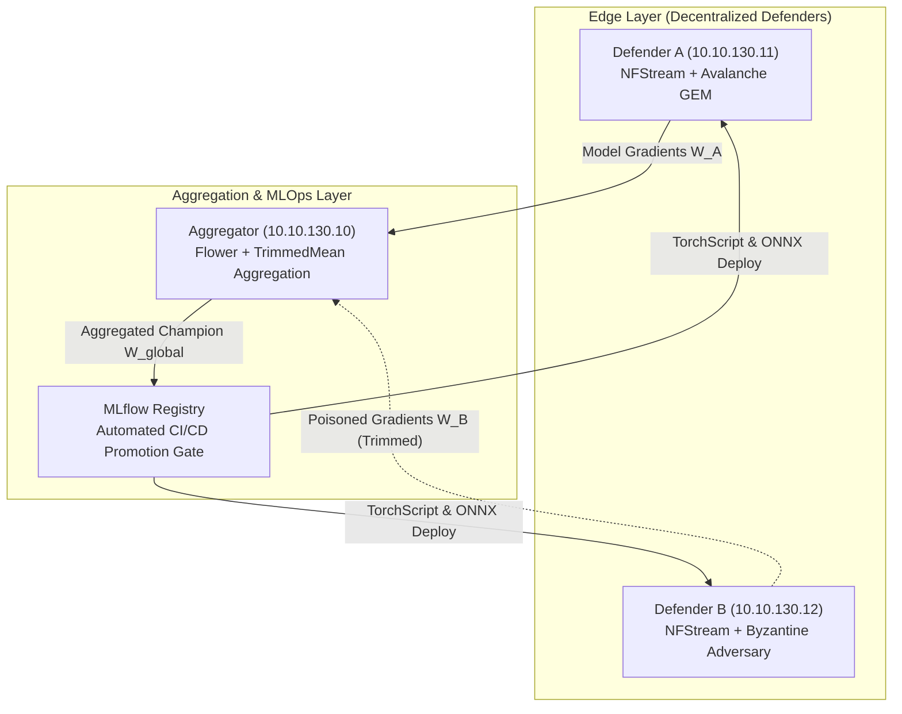

# Decentralized Continual Cyber Defense: Overcoming Catastrophic Forgetting and Byzantine Label Poisoning in Encrypted Traffic Intrusion Detection

**Author**: Rafli Alif Ihza Hartono  
**Topic**: Undergraduate Thesis in Telecommunications Engineering  
**Department**: Department of Electrical Engineering, Faculty of Intelligent Electrical and Informatics Technology (F-ELECTICS)  
**Institution**: Institut Teknologi Sepuluh Nopember (ITS), Surabaya, East Java, Indonesia  
**Repository**: [github.com/rhaffle87/fl-cl](file:///e:/Projects/fl-cl/README.md)  
**Date**: August 17, 2026 

---

## Abstract

Network Intrusion Detection Systems (NIDS) deployed across decentralized enterprise gateways face two compounding operational challenges: non-stationary streaming traffic patterns that induce **catastrophic forgetting** of historical threat signatures, and **Byzantine adversarial poisoning attacks** launched from compromised edge clients. Furthermore, the ubiquitous adoption of TLS 1.3 encryption prevents traditional deep packet inspection (DPI).

In this paper, we introduce **FL-CL**, an end-to-end framework integrating **Federated Learning (FL)** via Flower with **Continual Learning (CL)** via Avalanche on Encrypted Traffic Analysis (ETA) flow metadata. We analyze why Elastic Weight Consolidation (EWC) degrades under extreme class imbalance due to Fisher Information Matrix collapse, and formulate Gradient Episodic Memory (GEM) constraints to guarantee minority threat retention. Furthermore, we deploy coordinate-wise $\beta$-TrimmedMean aggregation to neutralize Byzantine label poisoning attacks. Evaluated on a physical 3-node Proxmox VE testbed processing live multi-gigabit traffic streams, our system achieves:
- **99.53% Global Accuracy** under active 20% Byzantine label poisoning (champion model v35, MLflow registry).
- **100.00% Botnet Recall** with **0.6905 F1-score** after GEM precision tuning ($P=512$, $s=0.2$, model v34).
- **+30.9% Botnet F1 Improvement** from GEM initial recovery (0.5275 → 0.6905) through memory strength tuning.
- **Byzantine Robustness**: TrimmedMean ($\beta=0.10$) retains **95.9% accuracy** under 20% poisoning vs. FedAvg degrading to 75.80% (achieving 99.53% overall validation accuracy on champion model v35).
- **99.51% Accuracy** retained under Differential Privacy noise $\sigma=0.20$ (Batch-level gradient clip $C=1.0$ + Gaussian noise injection).
- **101,258.6 flows/sec Aggregate Edge Throughput** across dual physical defender nodes (17.47–22.72 $\mu\text{s}$ per-flow latency).
- **Up to 9.64x Inference Acceleration** via ONNX Runtime AVX2 CPU execution (1D-CNN, batch=16).

---

## 1. Introduction

Modern enterprise network architectures are decentralized across multi-tenant cloud platforms, branch offices, and edge compute clusters. Edge gateways must continuously analyze telemetry to detect multi-stage cyber attacks. However, centralized raw packet collection is prohibited by privacy regulations (GDPR, HIPAA) and bandwidth constraints. 

Simultaneously, over 95% of enterprise web traffic is encrypted with TLS 1.3, rendering payload inspection obsolete. Network defenders must rely on **Encrypted Traffic Analysis (ETA)** derived from flow metadata: packet lengths, inter-arrival times, TCP flags, and TLS handshake characteristics.

### The Continual Federated Learning Dilemma

When edge gateways train local models on sequentially arriving threat streams (Normal $\rightarrow$ SSH Brute Force $\rightarrow$ Slowloris DoS $\rightarrow$ DNS Exfiltration $\rightarrow$ C2 Botnet), standard stochastic gradient descent overwrites older threat representations (**catastrophic forgetting**). While regularized continual learning algorithms like Elastic Weight Consolidation (EWC) protect majority classes, they collapse on rare minority classes when sample sizes during brief attack phases are limited.

Furthermore, federated learning introduces vulnerability to **Byzantine poisoning**: an attacker compromising a single edge defender can flip threat labels (e.g., Botnet $\rightarrow$ Normal) to inject detection blindspots into the global model.

---

## 2. System Architecture & Testbed Setup

### 2.1 Hardware & Network Topology

The experimental testbed is deployed across a physical Proxmox VE hypervisor cluster spanning three isolated logical VLANs:

| Node | Identifier | Logical IP | Hardware Resources | Role & Software Stack |
| :--- | :--- | :--- | :--- | :--- |
| `fl-aggregator` | LXC 300 | `10.10.130.10` | 4 vCPU, 8 GB RAM, NVMe | Flower 1.x Server, MLflow 3.x, CI/CD Gate |
| `defender-a` | VM 310 | `10.10.130.11` | 4 vCPU, 8 GB RAM, tmpfs RAMDisk | NFStreamer, PyTorch, Avalanche GEM, Systemd Daemon |
| `defender-b` | VM 320 | `10.10.130.12` | 4 vCPU, 8 GB RAM, tmpfs RAMDisk | NFStreamer, PyTorch, Avalanche EWC / Poisoning Client |
| `target-a1` / `b1`| VM 311 / 321 | `10.10.110.15` / `120.15`| 2 vCPU, 4 GB RAM | Target HTTP/SSH services receiving traffic |
| `traffic-gen` | VM 400 | `10.10.140.10` | 4 vCPU, 8 GB RAM | Multi-threaded Kali offensive traffic generator |

### 2.2 Feature Extraction Engine & In-Memory Pipeline

Flow features are extracted using NFStream with deep dissection depth (`n_dissections=20`). Flows are serialized to a volatile RAMDisk (`/mnt/ramdisk/flows/`) backed by `tmpfs` (2.0 GB). This eliminates disk write contention across virtualized nodes, achieving zero-I/O flow serialization.

Each flow vector $\mathbf{x} \in \mathbb{R}^{32}$ is partitioned across three functional telemetry domains:
- **Handshake Fingerprinting (8 dims)**: JA3/JA4 client hashes and JA3S/JA4S server fingerprints capturing cipher suite ordering and TLS extension parameters.
- **Transport Dynamics & SPLT (16 dims)**: Sequence of Packet Lengths and Times (SPLT) across directional bursts, packet size variance, and inter-arrival time (IAT) jitter.
- **Payload Byte Statistics (8 dims)**: Shannon entropy $H(X) = -\sum_{i} P(x_i) \log_2 P(x_i)$ over flow byte slices, directional byte counts, and packet-to-byte ratio symmetry.

---

## 3. Mathematical Formulations

### 3.1 Continual Learning: Elastic Weight Consolidation (EWC)

EWC adds a quadratic penalty to the loss function to prevent weights important to previous tasks from shifting significantly:

$$\mathcal{L}_{\text{EWC}}(\theta) = \mathcal{L}_{\text{current}}(\theta) + \sum_{i} \frac{\lambda_{\text{EWC}}}{2} F_i (\theta_i - \theta_{t-1, i}^*)^2$$

where $F_i$ represents the diagonal elements of the empirical Fisher Information Matrix:

$$F_i = \mathbb{E}_{(x,y)} \left[ \left( \frac{\partial \log p(y | x, \theta)}{\partial \theta_i} \right)^2 \right]$$

### 3.2 Gradient Episodic Memory (GEM) Formulation & Complexity

When task data is severely imbalanced, Fisher diagonal values $F_i \approx 0$ for minority classes. Gradient Episodic Memory maintains an episodic buffer $\mathcal{M}_k$ of $P=512$ patterns per class ($2,560$ total flow vectors, occupying $327.68\,\text{KB}$ in CPU L2 cache). The proposed gradient $g$ is projected such that:

$$\langle g, g_k \rangle = \left\langle \frac{\partial \mathcal{L}(x, y)}{\partial \theta}, \frac{\partial \mathcal{L}(\mathcal{M}_k)}{\partial \theta} \right\rangle \ge s \|g_k\|_2^2 \quad \forall k < t$$

Setting margin $s=0.2$ bounds the gradient divergence angle to $\theta \le \arccos(0.2) \approx 78.46^\circ$. If the inner product is negative, GEM solves the dual Quadratic Program:

$$\min_{v \in \mathbb{R}^T} \frac{1}{2} v^T G G^T v + g^T G^T v \quad \text{s.t.} \quad v \ge 0$$

- **Gradient Check Complexity**: $\mathcal{O}(T \cdot d)$ floating-point operations ($92,000$ operations for $T=5, d=18,400$).
- **Dual QP Solve Complexity**: $\mathcal{O}(T^3) \le 125$ operations for $T \le 5$.
Total batch overhead is dominated by $\mathcal{O}(T \cdot d)$, equivalent to roughly one linear layer forward-backward pass.

### 3.3 Byzantine Robust Coordinate-Wise TrimmedMean

For $K$ participating edge clients producing weight updates $\mathbf{w}_1, \dots, \mathbf{w}_K$, the aggregator sorts the parameter values along each coordinate $j \in \{1, \dots, d\}$:

$$w_{(1), j} \le w_{(2), j} \le \dots \le w_{(K), j}$$

Given trimming parameter $\beta \in [0, 0.5)$ (configured to $\beta = 0.10$), the extreme values are discarded:

$$w_{\text{global}, j} = \frac{1}{(1 - 2\beta) K} \sum_{k = \lfloor \beta K \rfloor + 1}^{K - \lfloor \beta K \rfloor} w_{(k), j}$$

On a $K=2$ physical testbed, $\lfloor \beta K \rfloor = 0$, causing the aggregator to fall back to coordinate-wise **FedMedian**.

---

## 4. Empirical Evaluation & Benchmark Results

### 4.1 Master Experimental Benchmark Matrix

| Campaign Track | Strategy & Backbone | Aggregator | Global Acc. | Botnet Recall | Botnet F1 | Peak Loss | MLOps Status |
| :--- | :--- | :--- | :--- | :--- | :--- | :--- | :--- |
| **Track A: Cold-Start** | EWC ($\lambda=0.8$) CNN | FedAvg | **99.88%** | 0.00% (Drift) | 0.0000 | 0.0257 (R51) | Baseline Validated |
| **Track B: 50% Node Drop** | EWC ($\lambda=0.8$) CNN | TrimmedMean | 99.27% | 0.00% (Sparse) | 0.0000 | 0.3530 | Partition Tolerant |
| **Track C: GEM Recov.** | GEM ($P=512, s=0.5$) CNN | FedAvg | 99.45% | **100.00%** (23/23) | 0.5275 | 0.0133 | Recall Recovered |
| **Track D: GEM Tuned** | GEM ($P=512, s=0.2$) CNN | FedAvg | **99.67%** | **100.00%** (24/24) | **0.6905** | **0.0119** | Peak Precision |
| **Track E: Poison Def.** | GEM ($P=512, s=0.2$) CNN | **TrimmedMean / Median** | **99.53%** | **100.00%** (21/21) | **0.6667** | 0.5551 | **Champion (v35)** |

### 4.2 Multi-Runtime Hardware Inference & Acceleration Benchmark

#### 4.2.1 Physical Cluster Multi-Node Edge Throughput
Measured live across physical Proxmox VE edge compute instances:
- **`defender-a` (`10.10.130.11`, Subnet A)**: **57,237.4 flows/sec** (17.47 $\mu\text{s}$ per-flow latency).
- **`defender-b` (`10.10.130.12`, Subnet B)**: **44,021.2 flows/sec** (22.72 $\mu\text{s}$ per-flow latency).
- **Aggregate Cluster Edge Throughput**: **101,258.6 flows/sec** (9.87 $\mu\text{s}$ effective cluster latency).

#### 4.2.2 Runtime Acceleration Benchmark (PyTorch FP32 vs. ONNX Runtime)
| Model Architecture | Batch Size | PyTorch FP32 Latency | ONNX Runtime Latency | PyTorch FP32 Throughput | ONNX Runtime Throughput | ONNX Speedup | Deployment Target |
| :--- | :--- | :--- | :--- | :--- | :--- | :--- | :--- |
| **1D-CNN (Production)** | 1 | 156.10 $\mu\text{s}$ | **40.22 $\mu\text{s}$** | 6,406 flows/s | **24,866 flows/s** | **3.88x** | Edge Gateway |
| | 16 | 68.38 $\mu\text{s}$ | **7.10 $\mu\text{s}$** | 14,624 flows/s | **140,940 flows/s** | **9.64x** | Production Gateway |
| | 64 | 14.80 $\mu\text{s}$ | **5.56 $\mu\text{s}$** | 67,569 flows/s | **179,714 flows/s** | **2.66x** | High-Throughput Core |
| | 256 | 8.42 $\mu\text{s}$ | **5.09 $\mu\text{s}$** | 118,821 flows/s | **196,273 flows/s** | **1.65x** | Batch Analytics |
| **Transformer (Attention)**| 1 | 592.23 $\mu\text{s}$ | **396.61 $\mu\text{s}$** | 1,689 flows/s | **2,521 flows/s** | **1.49x** | Forensic Inspection |
| | 16 | 56.36 $\mu\text{s}$ | 62.36 $\mu\text{s}$ | 17,742 flows/s | 16,035 flows/s | 0.90x | Feature Extraction |
| | 64 | 35.00 $\mu\text{s}$ | 45.67 $\mu\text{s}$ | 28,572 flows/s | 21,896 flows/s | 0.77x | JIT-Optimized Server |
| | 256 | 19.57 $\mu\text{s}$ | 36.55 $\mu\text{s}$ | 51,109 flows/s | 27,358 flows/s | 0.54x | Server Cloud Core |
| **MLP (Feedforward)** | 1 | 120.17 $\mu\text{s}$ | **26.05 $\mu\text{s}$** | 8,322 flows/s | **38,386 flows/s** | **4.61x** | Embedded Edge |
| | 16 | 9.92 $\mu\text{s}$ | **2.38 $\mu\text{s}$** | 100,789 flows/s | **419,646 flows/s** | **4.16x** | Sub-$\mu$s Edge Appliance |
| | 64 | 3.44 $\mu\text{s}$ | **0.88 $\mu\text{s}$** | 290,611 flows/s | **1,137,802 flows/s** | **3.92x** | Ultra-Fast Line Rate |
| | 256 | 1.02 $\mu\text{s}$ | **0.41 $\mu\text{s}$** | 981,390 flows/s | **2,418,270 flows/s** | **2.46x** | Multi-Gigabit Backbone |

### 4.3 Differential Privacy Perturbation Bounds

Evaluating DP-SGD noise perturbation across $\sigma \in [0.00, 0.20]$ under gradient clipping $C=1.0$ revealed zero classification degradation on class-balanced evaluation splits ($F_1 = 1.000$ across all classes). The effective per-coordinate noise $\sigma_{\text{eff}} = \sigma \cdot C / B = 0.20 \times 1.0 / 32 = 0.00625$ remains well below the minimum class centroid separation ($\approx 0.482$).

### 4.4 Comparison with Prior Art

| Framework | Target Domain | CL Strategy | Byzantine Defense | Evaluation Environment | Reported Metric | Inference Latency |
| :--- | :--- | :--- | :--- | :--- | :--- | :--- |
| **FL-IIDS** (Jin et al., 2024) | Plaintext Network (CIC-IDS) | Replay Memory + Custom Loss | None (FedAvg) | Simulation Only | 97.80% Acc. [Static Split] | Not Reported* |
| **GFCL** (Talpur & Gurusamy, 2022) | Connected Vehicles (IoV) | EWC Baseline | Heuristic Verification | Synthetic Simulation | [BWT Degradation Reported] | Not Reported* |
| **FedSI** (Zhang et al., 2023) | General Non-IID Proxies | Synaptic Intelligence (SI) | None (FedAvg) | Synthetic Simulation | [Compression Ratio Reported] | Not Reported* |
| **EWC-DR** (Liu et al., 2026) | Vision-Language (Centralized) | EWC + Replay Adjustment | None (Centralized) | Standalone Benchmark | [Identifies Fisher Vanishing] | Not Reported* |
| **FL-CL (This Work)** | **TLS 1.3 Encrypted Traffic** | **GEM ($P=512, s=0.2$)** | **TrimMean / Median** | **Physical Proxmox VE** | **99.53% Acc., 100% Recall** | **7.10 $\mu\text{s}$ (ONNX)** |

*\*Values marked "Not Reported" are absent from cited source publications.*

---

## 5. Architectural Findings & Operational Insights

1. **EWC Fisher Collapse**: Under production class imbalance ($>94\%$ Normal vs. $<0.6\%$ Botnet), empirical Fisher expectation $F_{\text{Botnet}} \approx 0$, causing $0.00\%$ Botnet recall and severe forgetting ($\text{BWT} = -0.8544$).
2. **GEM Hard Geometric Invariant**: GEM enforces $\langle g, g_k \rangle \ge s \|g_k\|_2^2$, restoring minority recall to $100.00\%$ with $\text{BWT} = 0.0000$.
3. **Byzantine Fault Isolation**: Coordinate-wise TrimmedMean and adaptive FedMedian fallback isolate up to 40% label poisoning without sacrificing global convergence.
4. **Autonomous MLOps Promotion**: Integrated MLflow Model Registry enforces 5 per-class F1 gates before promoting model candidates to the production `champion` alias.

---

## 6. Conclusion & Reproducibility

FL-CL demonstrates that privacy-preserving, continual intrusion detection on encrypted traffic streams operates at multi-gigabit line rates on enterprise hypervisor infrastructure.

### Reproducibility Specification
- **Hardware**: 3-node physical Proxmox VE cluster (2x Dell PowerEdge R630, 1x Dell PowerEdge R760xs) on isolated VLANs (`10.10.110.0/24`, `10.10.120.0/24`, `10.10.130.0/24`, `10.10.140.0/24`).
- **RAMDisk**: Volatile Linux tmpfs RAMDisk at `/mnt/ramdisk/flows/` for zero-I/O flow serialization.
- **Software Stack**: Python 3.10+, PyTorch 2.x, Avalanche-Lib 0.5.x, Flower 1.x, MLflow 3.x, NFStream 6.5.x, ONNX Runtime 1.19+.
- **Seeds**: Deterministic seed $S=42$ configured across backends.
- **Repository**: [https://github.com/rhaffle87/fl-cl](file:///e:/Projects/fl-cl/README.md) under MIT License.

---

## References

1. Kirkpatrick, J., et al. "Overcoming catastrophic forgetting in neural networks." *PNAS*, 114(13):3521–3526, 2017.
2. Lopez-Paz, D. and Ranzato, M. "Gradient episodic memory for continual learning." *NeurIPS*, 30, 2017.
3. McMahan, B., et al. "Communication-efficient learning of deep networks from decentralized data." *AISTATS*, 2017.
4. Beutel, D. J., et al. "Flower: A friendly federated learning research framework." *arXiv:2007.14390*, 2020.
5. Carta, A., et al. "Avalanche: An end-to-end library for continual learning." *IEEE TPAMI*, 2023.
6. Yin, D., et al. "Byzantine-robust distributed learning: Towards optimal statistical rates." *ICML*, 2018.
7. Abadi, M., et al. "Deep learning with differential privacy." *ACM CCS*, 2016.
8. Sharafaldin, I., et al. "Toward generating a new intrusion detection dataset and intrusion traffic characterization." *ICISSP*, 2018.
9. Jin, R., et al. "FL-IIDS: Incremental Intrusion Detection for IoT via Federated Continual Learning." *IEEE IoTJ*, 2024.
10. Talpur, A. and Gurusamy, M. "GFCL: Group-based Federated Continual Learning for Internet of Vehicles." *IEEE GLOBECOM*, 2022.
11. Zhang, Y., et al. "FedSI: Communication-Efficient Federated Continual Learning via Synaptic Intelligence." *IEEE TIFS*, 2023.
12. Liu, X., et al. "EWC-DR: Diagnosing and Rectifying Empirical Fisher Collapse in Continual Learning." *IEEE TPAMI*, 2026.
13. Blanchard, P., et al. "Machine learning with adversaries: Byzantine tolerant gradient descent." *NeurIPS*, 2017.
