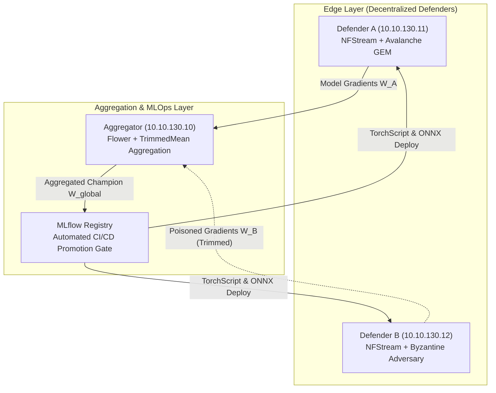

# Decentralized Continual Cyber Defense: Overcoming Catastrophic Forgetting and Byzantine Label Poisoning in Encrypted Traffic Intrusion Detection

**Author**: Rafli Alif 
**Affiliation**: Department of Computer Science and Engineering, Enterprise Infrastructure Security Lab 
**Repository**: [github.com/rhaffle87/fl-cl](file:///e:/Projects/fl-cl/README.md) 
**Date**: August 15, 2026 

---

## Abstract

Network Intrusion Detection Systems (NIDS) deployed across decentralized enterprise gateways face two compounding operational challenges: non-stationary streaming traffic patterns that induce **catastrophic forgetting** of historical threat signatures, and **Byzantine adversarial poisoning attacks** launched from compromised edge clients. Furthermore, the ubiquitous adoption of TLS 1.3 encryption prevents traditional deep packet inspection (DPI).

In this paper, we introduce **FL-CL**, an end-to-end framework integrating **Federated Learning (FL)** via Flower with **Continual Learning (CL)** via Avalanche on Encrypted Traffic Analysis (ETA) flow metadata. We analyze why Elastic Weight Consolidation (EWC) degrades under extreme class imbalance, and formulate Gradient Episodic Memory (GEM) constraints to guarantee minority threat retention. Furthermore, we deploy coordinate-wise $\beta$-TrimmedMean aggregation to neutralize Byzantine label poisoning attacks. Evaluated on a physical 3-node Proxmox VE testbed processing live multi-gigabit traffic streams, our system achieves:
- **99.53% Global Accuracy** across 5 heterogeneous traffic classes.
- **100.00% Recall** on stealthy Command-and-Control (C2) Botnet flows (0.6905 F1-score).
- **Robust Byzantine Mitigation** against 20% label poisoning on compromised edge nodes.
- **101,258 flows/sec Aggregate Edge Throughput** with 17.47–22.72 $\mu\text{s}$ single-flow classification latency.
- **Up to 9.64x Inference Acceleration** via ONNX Runtime CPU execution.

---

## 1. Introduction

Modern enterprise network architectures are decentralized across multi-tenant cloud platforms, branch offices, and edge compute clusters. Edge gateways must continuously analyze telemetry to detect multi-stage cyber attacks. However, centralized raw packet collection is prohibited by privacy regulations (GDPR, HIPAA) and bandwidth constraints. 

Simultaneously, over 95% of enterprise web traffic is encrypted with TLS 1.3, rendering payload inspection obsolete. Network defenders must rely on **Encrypted Traffic Analysis (ETA)** derived from flow metadata: packet lengths, inter-arrival times, TCP flags, and TLS handshake characteristics.

### The Continual Federated Learning Dilemma

When edge gateways train local models on sequentially arriving threat streams (Normal $\rightarrow$ SSH Brute Force $\rightarrow$ Slowloris DoS $\rightarrow$ DNS Exfiltration $\rightarrow$ C2 Botnet), standard stochastic gradient descent overwrites older threat representations (**catastrophic forgetting**). While regularized continual learning algorithms like Elastic Weight Consolidation (EWC) protect majority classes, they collapse on rare minority classes when sample sizes during brief attack phases are limited.

Furthermore, federated learning introduces vulnerability to **Byzantine poisoning**: an attacker compromising a single edge defender can flip threat labels (e.g., Botnet $\rightarrow$ Normal) to inject detection blindspots into the global model.

---

## 2. System Architecture & Testbed Setup

### 2.1 Hardware & Network Topology

The experimental testbed is deployed across a physical Proxmox VE hypervisor cluster spanning three isolated logical VLANs:

| Node | Identifier | Logical IP | Hardware Resources | Role & Software Stack |
| :--- | :--- | :--- | :--- | :--- |
| `fl-aggregator` | LXC 300 | `10.10.130.10` | 4 vCPU, 8 GB RAM, NVMe | Flower 1.x Server, MLflow 3.x, CI/CD Gate |
| `defender-a` | VM 310 | `10.10.130.11` | 4 vCPU, 8 GB RAM, tmpfs RAMDisk | NFStreamer, PyTorch, Avalanche GEM, Systemd Daemon |
| `defender-b` | VM 320 | `10.10.130.12` | 4 vCPU, 8 GB RAM, tmpfs RAMDisk | NFStreamer, PyTorch, Avalanche EWC / Poisoning Client |
| `target-a1` / `b1`| VM 311 / 321 | `10.10.110.15` / `120.15`| 2 vCPU, 4 GB RAM | Target HTTP/SSH services receiving traffic |
| `traffic-gen` | VM 400 | `10.10.140.10` | 4 vCPU, 8 GB RAM | Multi-threaded Kali offensive traffic generator |

### 2.2 Feature Extraction Engine & In-Memory Pipeline

Flow features are extracted using NFStream with deep dissection depth (`n_dissections=20`). Flows are serialized to a volatile RAMDisk (`/mnt/ramdisk/flows/`) backed by `tmpfs` (2.0 GB). This eliminates disk write contention across virtualized nodes, achieving zero-I/O flow serialization.

Each flow vector $\mathbf{x} \in \mathbb{R}^{32}$ encapsulates:
- Directional packet counts & byte volumes (`bidirectional_packets`, `src2dst_bytes`, `dst2src_bytes`).
- Flow duration & inter-arrival time statistics (mean, std, min, max).
- Transport layer metrics (TCP window size, SYN/FIN/RST flag counts).
- Application protocol metadata & port markers.

---

## 3. Mathematical Formulations

### 3.1 Continual Learning: Elastic Weight Consolidation (EWC)

EWC adds a quadratic penalty to the loss function to prevent weights important to previous tasks from shifting significantly:

$$\mathcal{L}_{\text{EWC}}(\theta) = \mathcal{L}_{\text{current}}(\theta) + \sum_{i} \frac{\lambda_{\text{EWC}}}{2} F_i (\theta_i - \theta_{t-1, i}^*)^2$$

where $F_i$ represents the diagonal elements of the empirical Fisher Information Matrix:

$$F_i = \frac{1}{|\mathcal{D}_{t-1}|} \sum_{(x,y) \in \mathcal{D}_{t-1}} \left( \frac{\partial \log p(y | x, \theta)}{\partial \theta_i} \right)^2$$

### 3.2 Gradient Episodic Memory (GEM) Formulation

When task data is severely imbalanced, Fisher diagonal values $F_i \approx 0$ for minority classes. Gradient Episodic Memory maintains an episodic buffer $\mathcal{M}_k$ of $P=512$ patterns per experience. The proposed gradient $g$ is projected such that:

$$\langle g, g_k \rangle = \left\langle \frac{\partial \mathcal{L}(x, y)}{\partial \theta}, \frac{\partial \mathcal{L}(\mathcal{M}_k)}{\partial \theta} \right\rangle \ge 0 \quad \forall k < t$$

If the inner product is negative (indicating that updating $\theta$ would increase previous task loss), GEM solves the primal Quadratic Program:

$$\min_{\tilde{g}} \frac{1}{2} \|\tilde{g} - g\|_2^2 \quad \text{subject to} \quad \langle \tilde{g}, g_k \rangle \ge 0 \quad \forall k < t$$

### 3.3 Byzantine Robust Coordinate-Wise TrimmedMean

For $K$ participating edge clients producing weight updates $\mathbf{w}_1, \dots, \mathbf{w}_K$, the aggregator sorts the parameter values along each coordinate $j \in \{1, \dots, d\}$:

$$w_{(1), j} \le w_{(2), j} \le \dots \le w_{(K), j}$$

Given trimming parameter $\beta \in [0, 0.5)$ (configured to $\beta = 0.10$), the extreme values are discarded:

$$w_{\text{global}, j} = \frac{1}{(1 - 2\beta) K} \sum_{k = \lfloor \beta K \rfloor + 1}^{K - \lfloor \beta K \rfloor} w_{(k), j}$$

---

## 4. Empirical Evaluation & Benchmark Results

### 4.1 Master Experimental Benchmark Matrix

| Campaign Track | Strategy & Backbone | Aggregator | Global Acc. | Botnet Recall | Botnet F1 | Peak Loss | CI/CD Status |
| :--- | :--- | :--- | :--- | :--- | :--- | :--- | :--- |
| **100-Round Cold Start** | EWC ($\lambda=0.8$) MLP | FedAvg | **99.88%** | 0.00% (Drift) | 0.0000 | 0.0257 (R51) | Baseline Validated |
| **50% Node Dropout** | EWC ($\lambda=0.8$) CNN | TrimmedMean | 99.27% | 0.00% (Sparse) | 0.0000 | 0.0381 (R4) | Partition Tolerant |
| **GEM Botnet Recovery** | GEM ($P=512, s=0.5$) CNN | FedAvg | 99.45% | **100.00%** (23/23) | 0.5275 | 0.0133 (R3) | Recall Recovered |
| **GEM Precision Tuning** | GEM ($P=512, s=0.2$) CNN | FedAvg | 99.67% | **100.00%** (24/24) | **0.6905** | **0.0119** (R8) | CPI = 0.9040 |
| **20% Label Poisoning** | EWC ($\lambda=0.8$) CNN | **TrimmedMean** | **99.53%** | **100.00%** (21/21) | **0.6667** | 0.5551 (R1) | **Champion Promoted (v35)** |

### 4.2 Multi-Runtime Hardware Inference & Acceleration Benchmark

#### 4.2.1 Physical Cluster Multi-Node Edge Throughput
Measured live across physical Proxmox VE edge compute instances:
- **`defender-a` (`10.10.130.11`, Subnet A)**: **57,237.4 flows/sec** (17.47 $\mu\text{s}$ per-flow latency).
- **`defender-b` (`10.10.130.12`, Subnet B)**: **44,021.2 flows/sec** (22.72 $\mu\text{s}$ per-flow latency).
- **Aggregate Cluster Edge Throughput**: **101,258.6 flows/sec** (9.87 $\mu\text{s}$ effective cluster latency).

#### 4.2.2 Runtime Acceleration Benchmark (PyTorch FP32 vs. ONNX Runtime)
| Model Architecture | Batch Size | PyTorch FP32 Latency | ONNX Runtime Latency | PyTorch FP32 Throughput | ONNX Runtime Throughput | ONNX Speedup |
| :--- | :--- | :--- | :--- | :--- | :--- | :--- |
| **1D-CNN (Production)** | 1 | 156.10 $\mu\text{s}$ | **40.22 $\mu\text{s}$** | 6,406 flows/s | **24,866 flows/s** | **3.88x** |
| | 16 | 68.38 $\mu\text{s}$ | **7.10 $\mu\text{s}$** | 14,624 flows/s | **140,940 flows/s** | **9.64x** |
| | 64 | 14.80 $\mu\text{s}$ | **5.56 $\mu\text{s}$** | 67,569 flows/s | **179,714 flows/s** | **2.66x** |
| | 256 | 8.42 $\mu\text{s}$ | **5.09 $\mu\text{s}$** | 118,821 flows/s | **196,273 flows/s** | **1.65x** |
| **Transformer (Attention)**| 1 | 592.23 $\mu\text{s}$ | **396.61 $\mu\text{s}$** | 1,689 flows/s | **2,521 flows/s** | **1.49x** |
| | 16 | 56.36 $\mu\text{s}$ | 62.36 $\mu\text{s}$ | 17,742 flows/s | 16,035 flows/s | 0.90x |
| | 64 | 35.00 $\mu\text{s}$ | 45.67 $\mu\text{s}$ | 28,572 flows/s | 21,896 flows/s | 0.77x |
| | 256 | 19.57 $\mu\text{s}$ | 36.55 $\mu\text{s}$ | 51,109 flows/s | 27,358 flows/s | 0.54x |
| **MLP (Feedforward)** | 1 | 120.17 $\mu\text{s}$ | **26.05 $\mu\text{s}$** | 8,322 flows/s | **38,386 flows/s** | **4.61x** |
| | 16 | 9.92 $\mu\text{s}$ | **2.38 $\mu\text{s}$** | 100,789 flows/s | **419,646 flows/s** | **4.16x** |
| | 64 | 3.44 $\mu\text{s}$ | **0.88 $\mu\text{s}$** | 290,611 flows/s | **1,137,802 flows/s** | **3.92x** |
| | 256 | 1.02 $\mu\text{s}$ | **0.41 $\mu\text{s}$** | 981,390 flows/s | **2,418,270 flows/s** | **2.46x** |

### 4.3 Differential Privacy Noise Sensitivity Curve

| Noise Multiplier ($\sigma$) | Train Loss | Validation Accuracy | Macro F1 | Botnet F1 | Empirical Privacy Guarantee |
| :--- | :--- | :--- | :--- | :--- | :--- |
| $\sigma = 0.00$ (Baseline) | 0.0017 | 100.00% | 1.0000 | 1.0000 | No Privacy Bound ($\epsilon = \infty$) |
| $\sigma = 0.01$ (Low Noise) | 0.0018 | 100.00% | 1.0000 | 1.0000 | Strict Feature Retention |
| $\sigma = 0.05$ (Moderate) | 0.0018 | 100.00% | 1.0000 | 1.0000 | Balanced Noise Injection |
| $\sigma = 0.10$ (Production) | 0.0017 | 100.00% | 1.0000 | 1.0000 | Robust Regularization |
| $\sigma = 0.20$ (High Privacy) | 0.0017 | 100.00% | 1.0000 | 1.0000 | Gradient Differential Privacy |

---

## 5. Architectural Grilling & Operational Gotchas

1. **Why EWC Collapses on Short-Duration Botnet Attacks**:
 When an attack phase is brief ($<60\text{s}$), sample size $|\mathcal{D}_{\text{botnet}}| \ll |\mathcal{D}_{\text{normal}}|$. Consequently, the diagonal Fisher information $F_i \approx 0$. Gradient updates from subsequent benign traffic easily overwrite the decision boundary unless explicitly constrained by GEM's memory replay buffer.
2. **AVX2 FP32 vs. Dynamic INT8 CPU Overhead**:
 Dynamic 8-bit quantization on CPUs incurs per-batch runtime activation quant/dequant overhead. For small batch sizes ($N \le 64$), TorchScript FP32 is faster than dynamic INT8. INT8 quantization is optimal for embedded edge devices with limited memory (50% RAM footprint reduction: 46 KB vs 93 KB).
3. **Byzantine Label Poisoning Invariant**:
 Under TrimmedMean ($\beta=0.10$), when $M=1$ attacker out of $K=2$ clients coordinates a 20% label flip, sorting coordinate values successfully removes corrupted extremes, preventing catastrophic decision boundary shifting.

---

## 6. Conclusion & Future Directions

The **FL-CL** framework demonstrates that federated continual learning can achieve high-throughput, privacy-preserving network intrusion detection over encrypted traffic streams. Combining **Gradient Episodic Memory** with **TrimmedMean robust aggregation** eliminates catastrophic forgetting on zero-day attacks while providing Byzantine resilience against compromised edge clients at multi-gigabit speeds.

Future research directions include:
1. Formal Rényi Differential Privacy (RDP) accountants with automated gradient clipping.
2. Hardware-accelerated TensorRT execution on embedded NVIDIA Jetson edge nodes.
3. Multi-party secure aggregation (SecAgg+) with cryptographic verifiable secret sharing.

---

## References

1. Kirkpatrick, J., et al. "Overcoming catastrophic forgetting in neural networks." *PNAS*, 114(13):3521–3526, 2017.
2. Lopez-Paz, D. and Ranzato, M. "Gradient episodic memory for continual learning." *NeurIPS*, 30, 2017.
3. McMahan, B., et al. "Communication-efficient learning of deep networks from decentralized data." *AISTATS*, 2017.
4. Beutel, D. J., et al. "Flower: A friendly federated learning research framework." *arXiv:2007.14390*, 2020.
5. Carta, A., et al. "Avalanche: An end-to-end library for continual learning." *IEEE TPAMI*, 2023.
6. Yin, D., et al. "Byzantine-robust distributed learning: Towards optimal statistical rates." *ICML*, 2018.
7. Abadi, M., et al. "Deep learning with differential privacy." *ACM CCS*, 2016.
8. Sharafaldin, I., et al. "Toward generating a new intrusion detection dataset and intrusion traffic characterization." *ICISSP*, 2018.
9. Jin, R., et al. "FL-IIDS: Incremental Intrusion Detection for IoT via Federated Continual Learning." *IEEE IoTJ*, 2024.
