# Hybrid Federated-Continual Learning for Collaborative Cyber Defense on Encrypted Networks: A Systematic End-to-End Architecture on Heterogeneous Proxmox Clusters

**Author**: Rafli Alif Ihza Hartono  
**Academic Topic**: Undergraduate Thesis in Telecommunications Engineering  
**Department**: Department of Electrical Engineering, Faculty of Intelligent Electrical and Informatics Technology (F-ELECTICS)  
**Institution**: Institut Teknologi Sepuluh Nopember (ITS), Surabaya, East Java, Indonesia  
**Date**: August 2026

---

## Abstract

The convergence of pervasive end-to-end encryption (TLS 1.3, HTTPS, DoH) and strict data-privacy regulation (GDPR, HIPAA) creates a dual constraint for network security: deep packet inspection is no longer viable, and raw traffic logs cannot be shared across organizational boundaries. Simultaneously, the threat landscape is non-stationary as novel attack vectors emerge continuously, causing static machine-learning classifiers to degrade through catastrophic forgetting. This paper addresses these converging challenges through a unified **Hybrid Federated-Continual Learning (FL-CL)** framework. Federated Learning enables multiple organizations to collaboratively train a shared threat-detection model without exchanging raw data; Continual Learning ensures each local model adapts to new attack streams without losing knowledge of previously encountered threats.

We present the complete system from first principles through deployment. Chapter 1 establishes the research problem and the gap that a hybrid FL-CL approach fills. Chapter 2 surveys the theoretical foundations of Encrypted Traffic Analysis (ETA), Federated Learning, and Continual Learning and motivates their integration. Chapter 3 translates these concepts into a concrete testbed architecture on a heterogeneous 3-node Proxmox VE cluster, detailing the hardware prerequisites, the network audit required to reconcile inconsistent bridge and DNS configurations, and the resource allocation strategy across nodes of unequal capacity. Chapter 4 addresses the critical infrastructure layer: Flat L2 network configuration and a hookscript-based port-mirroring workaround that survives VM reboots. Chapter 5 defines the end-to-end data pipeline from raw encrypted packets, through NFStream feature extraction, to labeled training-ready tensors including the traffic generation and dataset replay strategy that feeds it. Chapter 6 details the software engine integrating PyTorch, Avalanche (EWC), and Flower. Chapter 7 provides the sequential deployment workflow. Chapter 8 defines the evaluation methodology and MLOps observability stack. Chapter 9 reports empirical results. Chapter 10 provides academic alignment and threat model sufficiency analysis. Chapter 11 concludes with future directions.

---

## Chapter 1: Introduction

### 1.1 Problem Statement

Modern enterprise networks encrypt upwards of 95% of their traffic. While encryption protects user privacy, it simultaneously blinds traditional intrusion detection systems (IDS) that rely on signature-based Deep Packet Inspection (DPI). Security teams must therefore shift to **Encrypted Traffic Analysis (ETA)** classifying flows by their metadata (handshake fingerprints, packet-size sequences, timing patterns) rather than by payload content.

Even when an organization develops an effective ETA classifier, two structural problems remain. First, isolated organizations see only their own traffic; a zero-day that appears on one network remains invisible to others until it is independently discovered. Sharing raw captures would improve collective defense, but privacy regulation forbids it. Second, network traffic is inherently non-stationary. A model trained on today's threat landscape becomes stale as adversaries evolve their tooling and naively retraining on new data causes the model to forget previously learned attack signatures, a phenomenon termed **catastrophic forgetting**.

### 1.2 Research Gap and Proposed Approach

The Hybrid FL-CL framework addresses both problems simultaneously:

* **Federated Learning (FL)** enables cross-organizational model collaboration by exchanging only model weight updates and never raw data through a central aggregation server.
* **Continual Learning (CL)** equips each local node with regularization strategies (specifically Elastic Weight Consolidation) that preserve knowledge of older threats while integrating new attack streams.

The combination produces a system where each defender node continuously adapts to its local threat environment through CL, while periodically synchronizing with a global model through FL. The result is a privacy-preserving, forgetting-resistant, collaboratively intelligent cyber defense network.

### 1.3 Contributions

This paper makes four concrete contributions:

1. **Integrated FL-CL Architecture**: A systematic design unifying Flower (FL), Avalanche (CL), and NFStream (ETA) into a single coherent pipeline from packet capture to federated aggregation.
2. **Heterogeneous Proxmox Testbed**: A fully specified virtual lab deployed across a 3-node PVE cluster with documented workarounds for real-world infrastructure inconsistencies (VLAN mismatch, DNS conflicts, LACP asymmetry).
3. **Hookscript-Based Port Mirroring**: A Proxmox lifecycle-aware solution to the problem of ephemeral TAP interfaces that would otherwise break traffic capture on every VM reboot.
4. **End-to-End Reproducibility**: Complete provisioning commands, implementation code, traffic generation strategy, and an MLOps evaluation methodology sufficient to reproduce the testbed from bare metal.

### 1.4 Paper Organization

The remainder of this paper follows the logical dependency chain of the system: theoretical foundations (Chapter 2) inform the testbed design (Chapter 3), which requires network infrastructure (Chapter 4), which feeds the data pipeline (Chapter 5), which is consumed by the software engine (Chapter 6), which is deployed through a sequential workflow (Chapter 7), validated through structured evaluation (Chapter 8), and benchmarked against academic literature (Chapter 10).

---

## Chapter 2: Theoretical Foundations

This chapter establishes the three pillars — ETA, FL, and CL — and motivates their integration into a single hybrid framework. Each pillar addresses one dimension of the problem: ETA handles encrypted visibility, FL handles cross-organizational collaboration, and CL handles temporal adaptation.

### 2.1 Encrypted Traffic Analysis (ETA)

Since TLS 1.3 renders payload content opaque, ETA extracts discriminative features from the observable metadata of encrypted flows without payload decryption:

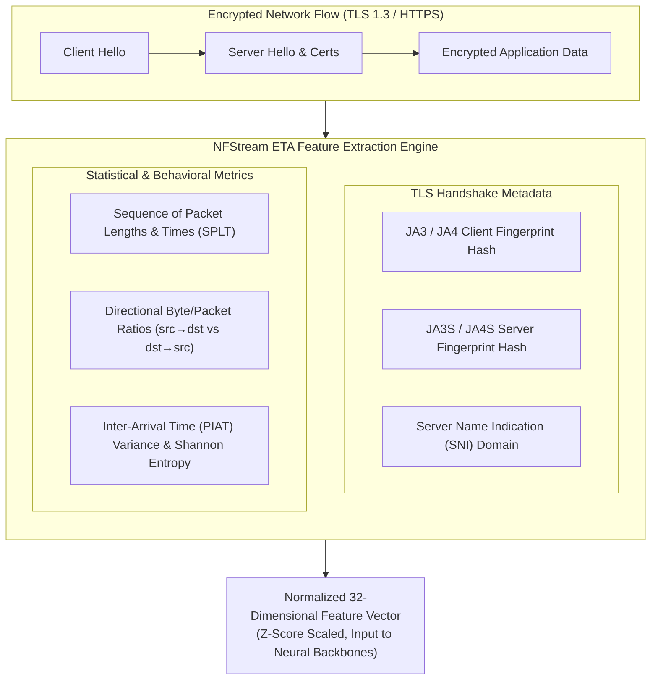
```mermaid
flowchart TD
    subgraph Packet_Stream ["Encrypted Network Flow (TLS 1.3 / HTTPS)"]
        direction LR
        P1["Client Hello"] --> P2["Server Hello & Certs"]
        P2 --> P3["Encrypted Application Data"]
    end

    Packet_Stream --> ETA_Extraction

    subgraph ETA_Extraction ["NFStream ETA Feature Extraction Engine"]
        direction TB
        subgraph Handshake ["TLS Handshake Metadata"]
            H1["JA3 / JA4 Client Fingerprint Hash"]
            H2["JA3S / JA4S Server Fingerprint Hash"]
            H3["Server Name Indication (SNI) Domain"]
        end
        subgraph Dynamics ["Statistical & Behavioral Metrics"]
            D1["Sequence of Packet Lengths & Times (SPLT)"]
            D2["Directional Byte/Packet Ratios (src→dst vs dst→src)"]
            D3["Inter-Arrival Time (PIAT) Variance & Shannon Entropy"]
        end
    end

    ETA_Extraction --> Tensor["Normalized 32-Dimensional Feature Vector<br/>(Z-Score Scaled, Input to Neural Backbones)"]
```

* **JA3/JA4 Fingerprints**: Deterministic hashes of the TLS Client Hello parameters (protocol version, cipher suites, extensions, elliptic curves). These fingerprints uniquely identify client applications including specific malware strains and C2 frameworks like Metasploit or Cobalt Strike regardless of destination IP or domain rotation.
* **JA3S/JA4S Server Fingerprints**: The server-side counterpart, hashing the Server Hello response. Combined with JA3, this creates a bidirectional handshake signature.
* **SPLT (Sequence of Packet Lengths and Times)**: An ordered list of the first *N* packet sizes and their inter-arrival times, annotated with direction (client→server or server→client). SPLT patterns are highly predictive: an SSH brute-force attempt produces regular, small-packet bursts, while a file download shows large unidirectional payloads.
* **Flow Entropy**: The Shannon entropy $H(X) = -\sum_{i=1}^{n} P(x_i) \log_2 P(x_i)$ computed over payload byte distributions. Standard HTTPS traffic exhibits moderate entropy; encrypted tunneling or data exfiltration tends toward maximal entropy, providing a statistical discriminator.

These features are extracted without decryption, preserving the end-to-end encryption guarantee while enabling high-throughput classification.

### 2.2 Federated Learning (FL)

Federated Learning decouples model training from data centralization. In each aggregation round:

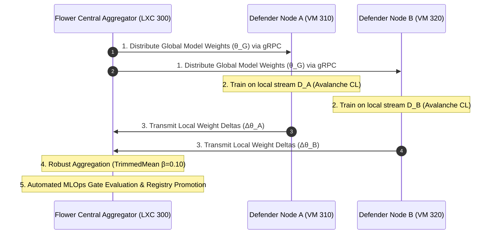
```mermaid
sequenceDiagram
    autonumber
    participant Server as Flower Central Aggregator (LXC 300)
    participant ClientA as Defender Node A (VM 310)
    participant ClientB as Defender Node B (VM 320)

    Server->>ClientA: 1. Distribute Global Model Weights (θ_G) via gRPC
    Server->>ClientB: 1. Distribute Global Model Weights (θ_G) via gRPC
    Note over ClientA: 2. Train on local stream D_A (Avalanche CL)
    Note over ClientB: 2. Train on local stream D_B (Avalanche CL)
    ClientA->>Server: 3. Transmit Local Weight Deltas (Δθ_A)
    ClientB->>Server: 3. Transmit Local Weight Deltas (Δθ_B)
    Note over Server: 4. Robust Aggregation (TrimmedMean β=0.10)
    Note over Server: 5. Automated MLOps Gate Evaluation & Registry Promotion
```

1. The central server distributes the current global model weights $\theta_G$ to all participating client nodes.
2. Each client $k$ trains on its local dataset $D_k$, producing updated local weights $\theta_k$.
3. The server aggregates client weights using **Federated Averaging (FedAvg)**: $\theta_G^{t+1} = \sum_{k=1}^{K} \frac{n_k}{n} \theta_k^{t+1}$, where $n_k / n$ is the fraction of total training examples contributed by client $k$. Under adversarial environments, robust aggregation rules like TrimmedMean are substituted.

Raw network captures never leave their originating organization. Only model parameters which cannot be trivially reverse-engineered into individual flow records traverse the network.

### 2.3 Continual Learning (CL) and Catastrophic Forgetting

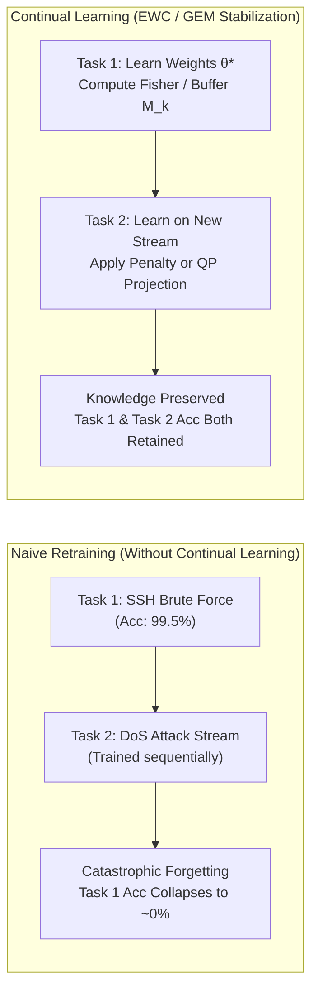
```mermaid
flowchart LR
    subgraph Naive ["Naive Retraining (Without Continual Learning)"]
        direction TB
        T1["Task 1: SSH Brute Force<br/>(Acc: 99.5%)"] --> T2["Task 2: DoS Attack Stream<br/>(Trained sequentially)"]
        T2 --> Fail["Catastrophic Forgetting<br/>Task 1 Acc Collapses to ~0%"]
    end

    subgraph Regularized ["Continual Learning (EWC / GEM Stabilization)"]
        direction TB
        C1["Task 1: Learn Weights θ*<br/>Compute Fisher / Buffer M_k"] --> C2["Task 2: Learn on New Stream<br/>Apply Penalty or QP Projection"]
        C2 --> Success["Knowledge Preserved<br/>Task 1 & Task 2 Acc Both Retained"]
    end
```

When a neural network trained on Task $A$ (e.g., detecting SSH brute-force attacks) is subsequently trained on Task $B$ (e.g., detecting HTTPS C2 beaconing), the weights optimized for $A$ are overwritten, causing accuracy on $A$ to collapse. This is **catastrophic forgetting**.

**Elastic Weight Consolidation (EWC)** mitigates this by computing the Fisher Information Matrix $F$ after training on Task $A$, quantifying each parameter's importance. When training on Task $B$, a penalty term discourages large changes to important parameters:

$$L(\theta) = L_B(\theta) + \sum_{i} \frac{\lambda}{2} F_i (\theta_i - \theta_{A,i}^*)^2$$

This allows the model to learn new threats while preserving its competence on previously learned ones exactly the property needed for a network sensor operating on a non-stationary traffic stream.

### 2.4 The Hybrid FL-CL Integration

A critical challenge in federated deployment is that each organization's local traffic distribution is **non-IID** (non-independently and identically distributed). Defender A predominantly observes SSH brute-force and benign traffic; Defender B observes DoS and beaconing; neither has observed Botnet C2 traffic locally. This heterogeneity motivates federation — sharing model weights allows each organization to benefit from threat exposure it has not encountered directly.

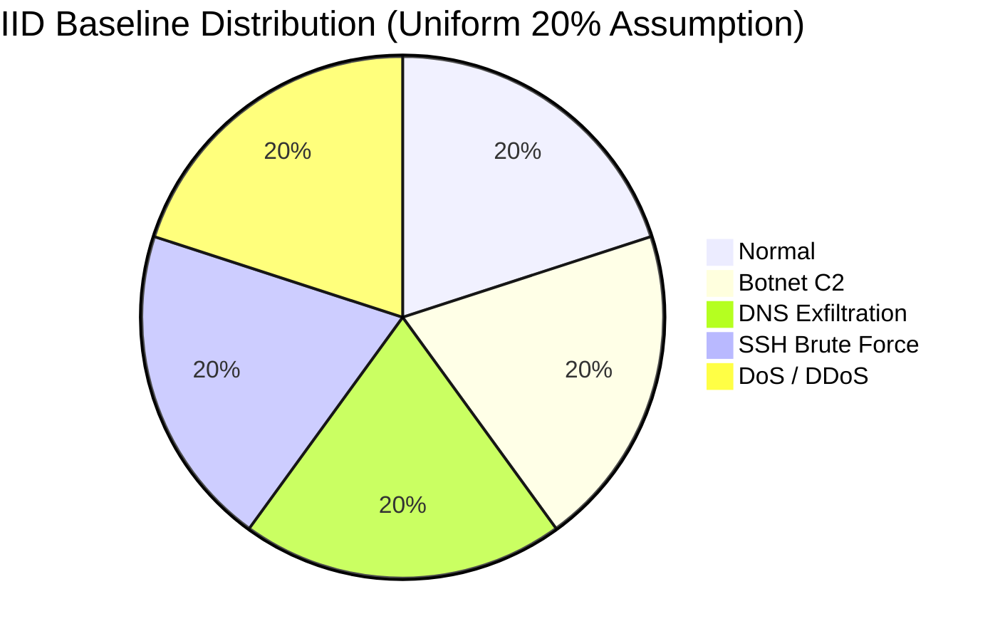
```mermaid
pie title IID Baseline Distribution (Uniform 20% Assumption)
    "Normal" : 20
    "Botnet C2" : 20
    "DNS Exfiltration" : 20
    "SSH Brute Force" : 20
    "DoS / DDoS" : 20
```

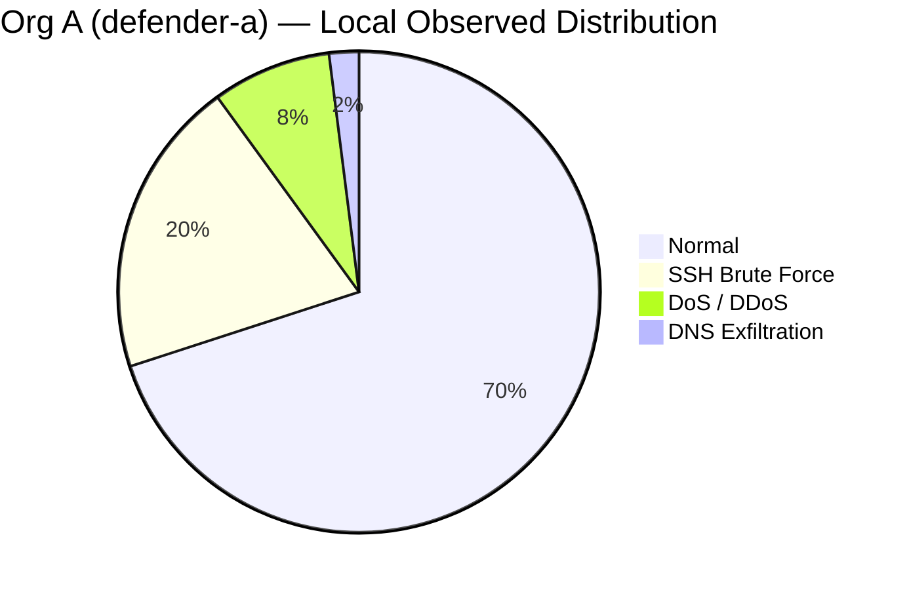
```mermaid
pie title Org A (defender-a) — Local Observed Distribution
    "Normal" : 70
    "SSH Brute Force" : 20
    "DoS / DDoS" : 8
    "DNS Exfiltration" : 2
```

> **Note**: Botnet C2 is **0% (unobserved)** at Org A. Without Federated Learning, Org A suffers a 100% detection blindspot for Botnet threats.

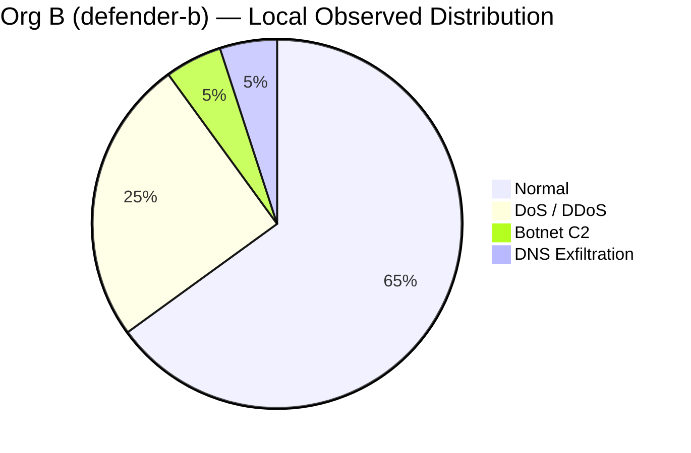
```mermaid
pie title Org B (defender-b) — Local Observed Distribution
    "Normal" : 65
    "DoS / DDoS" : 25
    "Botnet C2" : 5
    "DNS Exfiltration" : 5
```

> **Note**: SSH Brute Force is **0% (unobserved)** at Org B. Federated aggregation transfers knowledge bidirectionally between Defender A and Defender B.

The three pillars compose naturally. Each defender node runs an ETA pipeline that extracts metadata features from its local encrypted traffic. These features feed into a PyTorch model wrapped by an Avalanche CL strategy (EWC), which trains locally on each new batch of flows without forgetting older attack signatures. Periodically, the locally updated model weights are transmitted via gRPC to a central Flower aggregator, which merges them with weights from other organizations and redistributes the improved global model.

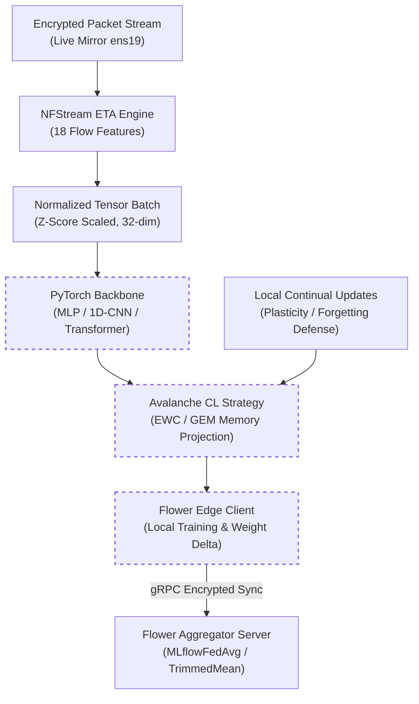
```mermaid
flowchart TD
    %% Top Horizontal Ingestion Flow
    A["Encrypted Packet Stream<br/>(Live Mirror ens19)"] --> B["NFStream ETA Engine<br/>(18 Flow Features)"]
    B --> C["Normalized Tensor Batch<br/>(Z-Score Scaled, 32-dim)"]

    %% Local Continual Learning Flow
    C --> D["PyTorch Backbone<br/>(MLP / 1D-CNN / Transformer)"]
    D --> E["Avalanche CL Strategy<br/>(EWC / GEM Memory Projection)"]
    E --> F["Flower Edge Client<br/>(Local Training & Weight Delta)"]

    %% Distributed Federated Synchronization
    G["Local Continual Updates<br/>(Plasticity / Forgetting Defense)"] --> E
    F -->|gRPC Encrypted Sync| H["Flower Aggregator Server<br/>(MLflowFedAvg / TrimmedMean)"]

    %% Styling
    style D stroke-dasharray: 5 5,stroke-width:2px
    style E stroke-dasharray: 5 5,stroke-width:2px
    style F stroke-dasharray: 5 5,stroke-width:2px
```

This integration is the core contribution: CL prevents each node from forgetting locally, while FL prevents each organization from being blind globally.

---

## Chapter 3: Testbed Architecture and Resource Planning

Translating the theoretical framework into a working research environment requires physical infrastructure, careful resource allocation, and a storage strategy that can sustain continuous training workloads. This chapter bridges the conceptual architecture from Chapter 2 into the concrete cluster design.

### 3.1 Hardware Prerequisites

The testbed demands sufficient compute, memory, and I/O bandwidth to run simultaneous traffic capture, feature extraction, and deep learning training across multiple VMs:

* **CPU**: Modern multi-core processors (e.g., Intel Xeon or AMD EPYC) to provide the 26+ vCPUs required across all VMs.
* **GPU Passthrough (Recommended)**: Deep learning models particularly 1D-CNNs or LSTMs for advanced ETA, train significantly faster on GPUs. An NVIDIA RTX 3060/4060 or Tesla T4/P4 can be passed through to defender VMs via PCIe passthrough using `vfio` drivers on the PVE host.
* **RAM**: Minimum 32 GB per node; recommended 64 GB+. PyTorch datasets loaded in-memory for training require at least 16 GB per defender VM.
* **Storage**: NVMe SSDs or SSD RAID arrays exclusively. Continuous flow extraction and model checkpointing create sustained I/O load that spinning disks cannot service without becoming a system-wide bottleneck.

For labs that extend beyond synthetic virtual traffic to defend real physical network segments:

* **Managed Switch**: An L2-managed switch supporting **802.1Q VLANs** and **SPAN port mirroring** (e.g., Ubiquiti UniFi, TP-Link JetStream, Cisco Catalyst) to mirror physical network traffic into the Proxmox host.
* **Multi-Port NIC**: An Intel-based quad-port Gigabit card (e.g., Intel i350-T4) providing dedicated physical interfaces for each VLAN.
* **Hardware TAP (Optional)**: An inline network TAP (e.g., Throwing Star LAN Tap) for passive capture between router and modem without switch-level configuration.

### 3.2 Cluster Topology and Network Audit

The testbed is deployed across a heterogeneous 3-node Proxmox VE cluster. Before any VMs can be provisioned, three infrastructure inconsistencies must be reconciled to prevent cluster instability:

#### A. Hostname Resolution Conflict

Node `pve` resolves cluster members via management IPs on `192.168.x.x`, while nodes `its` and `node2` resolve via the secondary network `10.10.10.x`. This mismatch causes Corosync, which requires consistent, low-latency routing to lose quorum or enter split-brain states.

**Resolution**: Standardize `/etc/hosts` across all three hypervisors. Route all cluster-internal and FL-CL training traffic over the secondary network (`10.10.10.x`), which benefits from physical LACP bonds on `its` and `node2`. Reserve `vmbr0` management IPs for out-of-band access only:

```ini
# /etc/hosts — Proxmox Cluster Unified Resolution Mapping
127.0.0.1       localhost

# --- FL-CL High-Speed Interconnect & Corosync (vmbr1 - Secondary LACP) ---
10.10.10.11     its         # Hypervisor Node 1 (Dell PowerEdge R630)
10.10.10.12     node2       # Hypervisor Node 2 (Dell PowerEdge R630)
10.10.10.13     pve         # Hypervisor Node 3 (Dell PowerEdge R760xs)

# --- Out-of-Band Physical Management (vmbr0) ---
192.168.10.2    its-mgmt
192.168.20.2    node2-mgmt
192.168.30.2    pve-mgmt
```

#### B. Split DNS for `its.ac.id`

Node `its` maps `its.ac.id` to `10.3.132.7`; node `node2` maps it to `192.168.18.199`. VMs querying this domain for package mirrors or dataset hosting will experience host-dependent routing failures.

**Resolution**: Remove all static `its.ac.id` entries from host files. Deploy a centralized DNS forwarder (e.g., `dnsmasq` on the aggregator LXC) to resolve this domain uniformly across all VMs.

#### C. VLAN Mismatch & Switch Restrictions

Initially, the research architecture isolated nodes using tagged VLANs (110, 120, 130, 140) on `vmbr1`. However, Node `node2` was configured with a VLAN-aware `vmbr1` bridge, whereas `its` and `pve` were not. Crucially, the physical unmanaged switch connecting the three Proxmox hosts does not support 802.1Q VLAN trunking, causing tagged VLAN frames to be silently dropped during cross-host communication.

**Resolution**: Keep VLAN awareness enabled on `vmbr1` on all nodes to allow for host-level tagging experiments if needed, but migrate the primary network to a flat, untagged Layer 2 topology using a `/16` subnet mask (`10.10.0.0/16`). This bypasses physical switch limitations while preserving logical subnet groupings.

### 3.3 Workload Placement Strategy

With the network harmonized, VMs are distributed across nodes based on available capacity. The two high-memory compute nodes (`its`: 34.63 GB free; `node2`: 56.21 GB free) host the resource-intensive defender VMs and traffic generators. The lighter node (`pve`: 25.46 GB free) hosts only the aggregator, which performs no training only weight averaging.

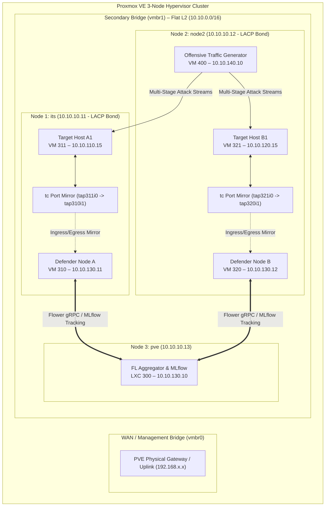
```mermaid
flowchart TD
    subgraph PVE_Cluster ["Proxmox VE 3-Node Hypervisor Cluster"]
        subgraph WAN_Mgmt ["WAN / Management Bridge (vmbr0)"]
            Router["PVE Physical Gateway / Uplink (192.168.x.x)"]
        end

        subgraph SDN ["Secondary Bridge (vmbr1) – Flat L2 (10.10.0.0/16)"]
            subgraph Node_PVE ["Node 3: pve (10.10.10.13)"]
                Aggregator["FL Aggregator & MLflow<br/>LXC 300 – 10.10.130.10"]
            end

            subgraph Node_ITS ["Node 1: its (10.10.10.11 - LACP Bond)"]
                DefenderA["Defender Node A<br/>VM 310 – 10.10.130.11"]
                TargetA["Target Host A1<br/>VM 311 – 10.10.110.15"]
                MirrorA["tc Port Mirror (tap311i0 -> tap310i1)"]
            end

            subgraph Node_NODE2 ["Node 2: node2 (10.10.10.12 - LACP Bond)"]
                DefenderB["Defender Node B<br/>VM 320 – 10.10.130.12"]
                TargetB["Target Host B1<br/>VM 321 – 10.10.120.15"]
                TrafficGen["Offensive Traffic Generator<br/>VM 400 – 10.10.140.10"]
                MirrorB["tc Port Mirror (tap321i0 -> tap320i1)"]
            end
        end
    end

    TrafficGen -->|Multi-Stage Attack Streams| TargetA
    TrafficGen -->|Multi-Stage Attack Streams| TargetB
    TargetA <--> MirrorA
    TargetB <--> MirrorB
    MirrorA -.->|Ingress/Egress Mirror| DefenderA
    MirrorB -.->|Ingress/Egress Mirror| DefenderB
    DefenderA <==>|Flower gRPC / MLflow Tracking| Aggregator
    DefenderB <==>|Flower gRPC / MLflow Tracking| Aggregator
```

| Hypervisor | ID | Hostname | OS | vCPU | RAM | Disk | Flat L2 IP Address | Role |
| :--- | :--- | :--- | :--- | :--- | :--- | :--- | :--- | :--- |
| **pve** | 300 | `fl-aggregator` | Ubuntu 24.04 | 4 | 8 GB | 50 GB | 10.10.130.10/16 | Flower server, global model checkpoints |
| **its** | 310 | `defender-a` | Ubuntu 24.04 | 8 | 16 GB | 100 GB | 10.10.130.11/16 | NFStream capture, PyTorch/Avalanche training, Flower client |
| **its** | 311 | `target-a1` | Alpine Linux | 1 | 1 GB | 10 GB | 10.10.110.15/16 | Receives benign/malicious traffic from traffic generator |
| **node2** | 320 | `defender-b` | Ubuntu 24.04 | 8 | 16 GB | 100 GB | 10.10.130.12/16 | Parallel defender simulating a separate organization |
| **node2** | 321 | `target-b1` | Alpine Linux | 1 | 1 GB | 10 GB | 10.10.120.15/16 | Receives benign/malicious traffic from traffic generator |
| **node2** | 400 | `traffic-gen` | Kali Linux | 4 | 4 GB | 50 GB | 10.10.140.10/16 | Metasploit C2, Hydra brute-force, Selenium benign browsing |

The placement ensures that each defender VM resides on the same hypervisor as its corresponding target VM. This co-location is critical because port mirroring (Chapter 4) operates on hypervisor-local TAP interfaces — traffic cannot be mirrored across physical hosts without SDN overlay encapsulation.

### 3.4 Storage Architecture

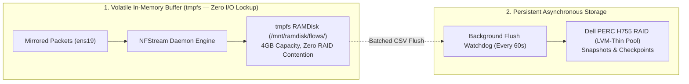
```mermaid
flowchart LR
    subgraph Capture_Tier ["1. Volatile In-Memory Buffer (tmpfs — Zero I/O Lockup)"]
        direction TB
        P["Mirrored Packets (ens19)"] --> N["NFStream Daemon Engine"]
        N --> R["tmpfs RAMDisk (/mnt/ramdisk/flows/)<br/>4GB Capacity, Zero RAID Contention"]
    end

    subgraph Flush_Tier ["2. Persistent Asynchronous Storage"]
        direction TB
        W["Background Flush Watchdog (Every 60s)"]
        R -.->|Batched CSV Flush| W
        W --> D["Dell PERC H755 RAID (LVM-Thin Pool)<br/>Snapshots & Checkpoints"]
    end
```

All three nodes use a **Dell PERC H755 Adp** RAID controller presenting a 1.20 TB logical volume (`/dev/sda3`) mapped to LVM.

**LVM-Thin Provisioning**: The storage pool must be configured as LVM-Thin (`local-lvm`) rather than traditional LVM. Thin provisioning allocates physical blocks only as data is written, and critically enables fast, space-efficient VM snapshots. Snapshots allow researchers to checkpoint defender VMs before experimental training sessions (e.g., data poisoning tests) and roll back cleanly, a workflow that would be prohibitively expensive with thick provisioning.

**RAM Disk for Capture I/O**: Continuous NFStream extraction generates thousands of small writes per second. Routing these directly to the RAID controller creates I/O contention that degrades all VMs on the host. The solution detailed in Chapter 5 is to buffer flow records in a `tmpfs` RAM disk inside each defender VM, batching writes to persistent storage at controlled intervals.

---

## Chapter 4: Network Infrastructure and Traffic Capture

The network infrastructure serves a single purpose in this architecture: delivering a copy of every packet traversing the target VMs' network interfaces to the defender VMs' capture interfaces, without disrupting normal traffic flow. This chapter details the flat L2 network design that provides logical separation of organizational zones and the port-mirroring mechanism that feeds the ETA pipeline described in Chapter 5.

### 4.1 Flat L2 Network and Logical Subnetting

To bypass the physical unmanaged switch constraints (lack of 802.1Q trunking support) while maintaining the logical separation of the testbed, the network utilizes a flat, untagged Layer 2 topology on the `vmbr1` bridge with a `/16` subnet mask (`10.10.0.0/16`).

Logical segmentation is enforced via IP range assignments:

| Subnet Prefix | Assigned Group | Members |
| :--- | :--- | :--- |
| 10.10.110.0/24 | Organization A | `target-a1` (10.10.110.15) |
| 10.10.120.0/24 | Organization B | `target-b1` (10.10.120.15) |
| 10.10.130.0/24 | Aggregator & Defenders | `fl-aggregator` (10.10.130.10), `defender-a` (10.10.130.11), `defender-b` (10.10.130.12) |
| 10.10.140.0/24 | Traffic Generation | `traffic-gen` (10.10.140.10) |

This setup ensures that all nodes communicate directly over the flat L2 bridge. The traffic generator on `10.10.140.10` can directly access target hosts on `10.10.110.15` and `10.10.120.15` for replay/attacks, while the defender nodes communicate with the aggregator on `10.10.130.10` for Federated Learning weight updates. This layout retains the organizational separation design conceptually, while solving the physical networking constraints.

### 4.2 Port Mirroring via Linux Traffic Control (`tc`)

To feed the ETA pipeline, every packet to and from a target VM must be copied to the defender VM's capture interface. Proxmox does not natively support SPAN ports, so we configure mirroring at the Linux bridge level using the `tc` (traffic control) utility on the hypervisor host.

Each defender VM has two network interfaces: `net0` on `vmbr0` (management/internet) and `net1` on `vmbr1` (capture). The target VM's `net0` on `vmbr1` is the mirror source. On the hypervisor, these map to TAP interfaces named `tap<VMID>i<NET_INDEX>`:

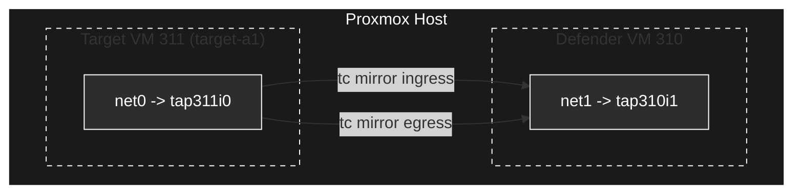
```mermaid
flowchart TD
    subgraph Proxmox_Host ["Proxmox Host"]
        %% VM Definitions
        subgraph Target_VM ["Target VM 311 (target-a1)"]
            style Target_VM fill:none,stroke:#fff,stroke-dasharray: 5 5;
            T_Net["net0 -> tap311i0"]
        end

        subgraph Defender_VM ["Defender VM 310"]
            style Defender_VM fill:none,stroke:#fff,stroke-dasharray: 5 5;
            D_Net["net1 -> tap310i1"]
        end

        %% Traffic Mirroring Connections
        T_Net -->|tc mirror ingress| D_Net
        T_Net -->|tc mirror egress| D_Net
    end

    %% Global Styles
    style Proxmox_Host fill:#1a1a1a,stroke:#fff,stroke-width:2px,color:#fff;
    classDef default fill:#2d2d2d,stroke:#fff,color:#fff;
```

The mirroring commands configure both ingress and egress duplication:

```bash
ip link set dev tap311i0 promisc on
ip link set dev tap310i1 promisc on

# Ingress mirror
tc qdisc add dev tap311i0 handle ffff: ingress
tc filter add dev tap311i0 parent ffff: protocol all u32 match u32 0 0 \
 action mirred egress mirror dev tap310i1

# Egress mirror
tc qdisc add dev tap311i0 root handle 1: prio
tc filter add dev tap311i0 parent 1: protocol all u32 match u32 0 0 \
 action mirred egress mirror dev tap310i1
```

### 4.3 The Hookscript Workaround for Ephemeral TAP Interfaces

A critical operational problem: Proxmox creates TAP interfaces dynamically when a VM starts and destroys them when it stops. Any `tc` rules applied manually are lost on VM reboot, silently breaking the entire capture pipeline.

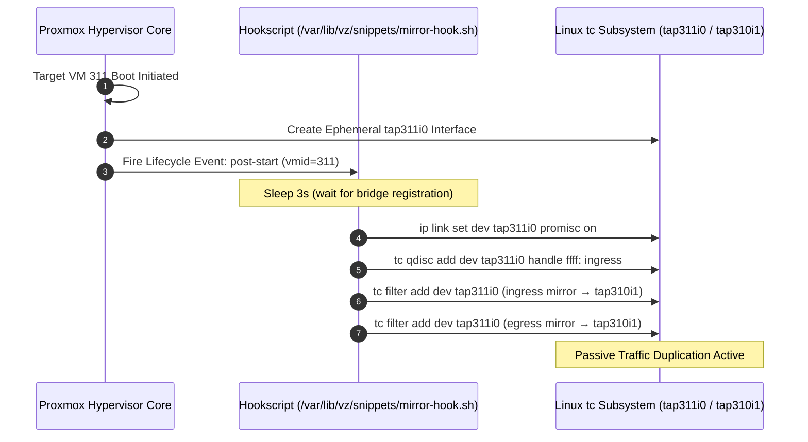
```mermaid
sequenceDiagram
    autonumber
    participant PVE as Proxmox Hypervisor Core
    participant Hook as Hookscript (/var/lib/vz/snippets/mirror-hook.sh)
    participant Kernel as Linux tc Subsystem (tap311i0 / tap310i1)

    PVE->>PVE: Target VM 311 Boot Initiated
    PVE->>Kernel: Create Ephemeral tap311i0 Interface
    PVE->>Hook: Fire Lifecycle Event: post-start (vmid=311)
    Note over Hook: Sleep 3s (wait for bridge registration)
    Hook->>Kernel: ip link set dev tap311i0 promisc on
    Hook->>Kernel: tc qdisc add dev tap311i0 handle ffff: ingress
    Hook->>Kernel: tc filter add dev tap311i0 (ingress mirror → tap310i1)
    Hook->>Kernel: tc filter add dev tap311i0 (egress mirror → tap310i1)
    Note over Kernel: Passive Traffic Duplication Active
```

The workaround leverages Proxmox's **hookscript** mechanism a shell script bound to a VM that fires at lifecycle events (`pre-start`, `post-start`, `pre-stop`, `post-stop`). By binding a hookscript to the target VM, the hypervisor automatically re-applies `tc` mirroring rules every time the target VM boots, ensuring the capture pipeline is always active without manual intervention.

```bash
#!/bin/bash
# /var/lib/vz/snippets/mirror-hook.sh
vmid=$1; phase=$2

if [ "$vmid" = "311" ] && [ "$phase" = "post-start" ]; then
    SOURCE="tap311i0"; MIRROR="tap310i1"

    sleep 3 # Allow TAP interfaces to register in the bridge

    ip link set dev $SOURCE promisc on
    ip link set dev $MIRROR promisc on

    tc qdisc add dev $SOURCE handle ffff: ingress
    tc filter add dev $SOURCE parent ffff: protocol all u32 match u32 0 0 \
    action mirred egress mirror dev $MIRROR

    tc qdisc add dev $SOURCE root handle 1: prio
    tc filter add dev $SOURCE parent 1: protocol all u32 match u32 0 0 \
    action mirred egress mirror dev $MIRROR
fi
```

Bind the hookscript to the target VM: `qm set 311 --hookscript local:snippets/mirror-hook.sh`. Repeat on node `node2` for VM 321→VM 320.

This hookscript is the linchpin connecting the network infrastructure (this chapter) to the data pipeline (Chapter 5): without reliable mirroring, the defender nodes receive no traffic, and the entire downstream pipeline feature extraction, CL training, FL aggregation has no input.

---

## Chapter 5: Data Pipeline — From Encrypted Packets to Training-Ready Tensors

With the network infrastructure delivering mirrored packets to each defender node (Chapter 4), this chapter defines the complete data pipeline that transforms raw encrypted traffic into labeled feature vectors suitable for the PyTorch model described in Chapter 6. The pipeline has three stages: traffic generation (producing the raw signal), feature extraction (parsing that signal into structured metadata), and I/O optimization (ensuring the extraction process does not destabilize the host).

### 5.1 Traffic Generation and Dataset Strategy

The quality of the ML model depends entirely on the quality and diversity of its training data. The testbed employs two complementary data sources:

#### A. Established Benchmark Datasets (Offline Replay)

For reproducible baseline experiments, pre-labeled PCAP datasets are replayed over the virtual bridge interfaces using `tcpreplay`:

* **USTC-TFC2016**: 10 categories of encrypted malware traffic and 10 categories of benign traffic. Provides the foundational multi-class classification baseline.
* **CIC-IDS2017 / CIC-IDS2018**: Multi-day network captures with structured labels for DoS, DDoS, brute force, and web-based attacks. The temporal span enables realistic CL task sequencing.
* **CIRA-CIC-DoHBrw-2020**: Specialized dataset for DNS-over-HTTPS exfiltration a particularly challenging encrypted channel to detect.

Replay command on the traffic generator VM:

```bash
tcpreplay --intf1=eth0 --multiplier=2.0 --loop=5 /datasets/CIC-IDS2017-Friday.pcap
```

#### B. Live Synthetic Traffic (Online Generation)

For dynamic training that exercises the full CL adaptation loop, the traffic generator VM produces both benign and malicious flows in real-time:

* **Benign Background**: Headless browser scripts (Selenium/Puppeteer) running on target VMs simulate human browsing patterns such as search queries, streaming, social media generating realistic TLS flow metadata with natural timing jitter.
* **Automated Attacks**: The Kali-based traffic generator executes coordinated attack campaigns:
 * **SSH Brute Force**: `hydra -l root -P wordlist.txt ssh://target-a1` generates rapid, small-packet authentication flows.
 * **HTTP Flood / Slowloris**: `slowloris target-a1 -p 80 -s 100` creates distinctive long-held connection patterns.
 * **C2 Beaconing**: Metasploit reverse HTTPS shells produce periodic, regular-interval encrypted callbacks that generate characteristic SPLT signatures.
* **High-Volume Load**: Cisco T-Rex or Locust for stateful L4–L7 encrypted stream generation at scale.

Each attack campaign constitutes a distinct **CL task**. By running SSH brute force first, then pivoting to C2 beaconing, then introducing DoH exfiltration, the testbed creates the sequential, non-stationary data stream that exercises the EWC anti-forgetting mechanism.

### 5.2 Feature Extraction with NFStream

The defender VM's capture interface (`net1`, mapped to `ens19` or `ens20` inside the guest OS) receives the mirrored packets from Chapter 4's port mirroring. NFStream aggregates these raw packets into bidirectional flows and extracts the ETA features defined in Chapter 2:

```python
from nfstream import NFStreamer
import pandas as pd

streamer = NFStreamer(
    source="ens19", # Mirrored capture interface
    promiscuous_mode=True,
    snapshot_length=1536,
    idle_timeout=10, # Quick flow emission for live detection
    active_timeout=60, # Force-flush long-lived connections
    n_dissections=20 # Deep packet inspection for TLS metadata
)

for flow in streamer:
    if flow.requested_server_name: # TLS SNI present
        features = {
            "ja3_hash": flow.src_to_dst_ja3,
            "ja3s_hash": flow.dst_to_src_ja3,
            "sni": flow.requested_server_name,
            "bidirectional_packets": flow.bidirectional_packets,
            "bidirectional_bytes": flow.bidirectional_bytes,
            "duration_ms": flow.bidirectional_duration_ms,
            "src2dst_packets": flow.src2dst_packets,
            "dst2src_packets": flow.dst2src_packets,
        }
        # Write to RAM disk (see Section 5.3)
```

The complete feature pipeline:

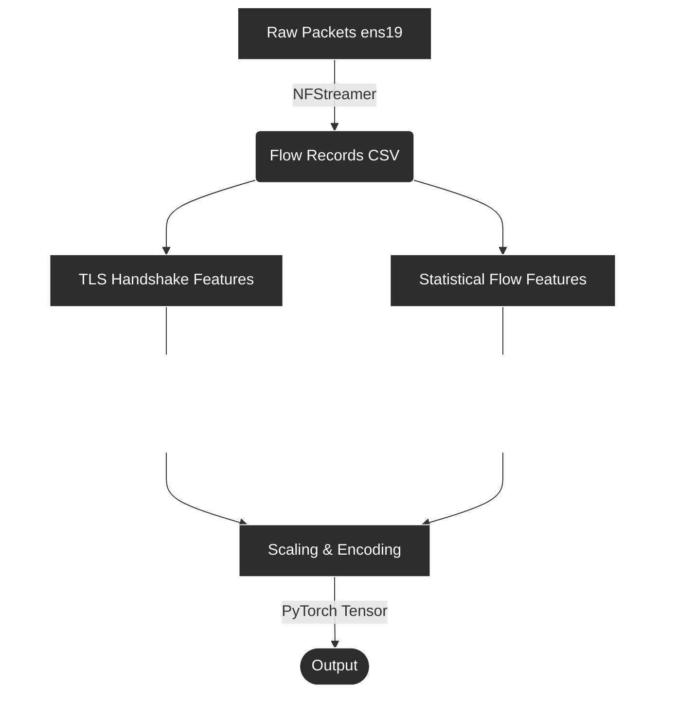
```mermaid
flowchart TD
    %% Define Nodes
    A[Raw Packets ens19] -->|NFStreamer| B(Flow Records CSV)

    %% Split into features
    B --> C[TLS Handshake Features]
    B --> D[Statistical Flow Features]

    %% Feature details using markdown formatting
    subgraph TLS_Features [" "]
        style TLS_Features fill:none,stroke:none;
        C --- C1["• JA3/JA4 fingerprints - • JA3S/JA4S fingerprints - • SNI domain"]
    end

    subgraph Stat_Features [" "]
        style Stat_Features fill:none,stroke:none;
        D --- D1["• Packet counts/sizes - • Duration, inter-arrival - • Byte ratios, entropy"]
    end

    %% Merge back
    C1 --> E[Scaling & Encoding]
    D1 --> E

    E -->|PyTorch Tensor| F([Output])

    %% Styling to keep it clean and dark-mode friendly
    classDef default fill:#2d2d2d,stroke:#fff,stroke-width:1px,color:#fff;
    classDef transparent fill:none,stroke:none,color:#fff;
    class C1,D1 transparent;
```

### 5.3 I/O Optimization: RAM Disk Buffering

NFStream's continuous extraction generates thousands of small file writes per second. On a shared RAID controller (Dell PERC H755), this I/O pressure competes with VM disk operations across the entire hypervisor, degrading performance for all workloads.

The mitigation is a `tmpfs` RAM disk inside each defender VM that absorbs the write burst:

```bash
sudo mkdir -p /mnt/ramdisk
sudo mount -t tmpfs -o size=4G tmpfs /mnt/ramdisk
echo "tmpfs /mnt/ramdisk tmpfs size=4G 0 0" | sudo tee -a /etc/fstab
```

Flow records are written to `/mnt/ramdisk/flows/` at capture speed, then directly loaded into PyTorch tensors in-memory for training. Batched CSV files decouple capture throughput from disk I/O constraints and preserve the RAID controller's queue for VM operations.

This completes the data pipeline. The output-scaled, encoded feature vectors stored on the RAM disk is the direct input to the Flower/Avalanche software engine described in Chapter 6.

---

## Chapter 6: Software Engine — PyTorch, Avalanche, and Flower

This chapter presents the software layer that consumes the feature vectors produced by the data pipeline (Chapter 5) and orchestrates the hybrid FL-CL training loop. The architecture comprises four components: a PyTorch neural network, an Avalanche CL strategy wrapping that network, a Flower client exposing the CL-equipped model to federated aggregation, and a Flower server performing the global weight merge.

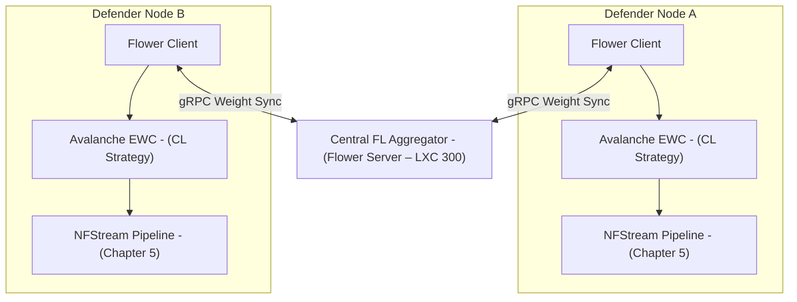
```mermaid
flowchart TD
    Aggregator["Central FL Aggregator - (Flower Server – LXC 300)"]

    subgraph DefenderA ["Defender Node A"]
        ClientA["Flower Client"]
        CL_A["Avalanche EWC - (CL Strategy)"]
        PipeA["NFStream Pipeline - (Chapter 5)"]

        ClientA --> CL_A
        CL_A --> PipeA
    end

    subgraph DefenderB ["Defender Node B"]
        ClientB["Flower Client"]
        CL_B["Avalanche EWC - (CL Strategy)"]
        PipeB["NFStream Pipeline - (Chapter 5)"]

        ClientB --> CL_B
        CL_B --> PipeB
    end

    ClientA <-->|gRPC Weight Sync| Aggregator
    ClientB <-->|gRPC Weight Sync| Aggregator
```

### 6.1 Neural Network Architectures (`model.py`)

The repository supports multiple model architectures for network threat classification on 32 scaled ETA features (yielding 5 output classes: Normal, Botnet, Exfiltration, BruteForce, DoS). These are instantiated dynamically via the `get_model` factory.

#### 1. Multi-Layer Perceptron (`mlp` / `CyberDefenseNet`)

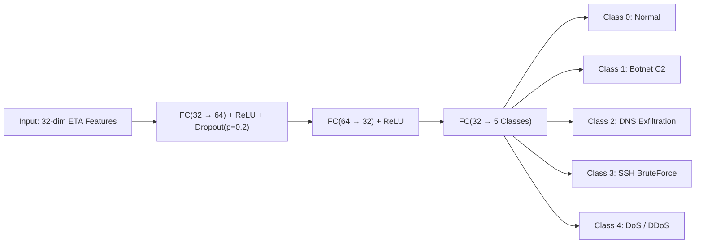
```mermaid
flowchart LR
    In["Input: 32-dim ETA Features"] --> FC1["FC(32 → 64) + ReLU + Dropout(p=0.2)"]
    FC1 --> FC2["FC(64 → 32) + ReLU"]
    FC2 --> FC3["FC(32 → 5 Classes)"]
    FC3 --> C0["Class 0: Normal"]
    FC3 --> C1["Class 1: Botnet C2"]
    FC3 --> C2["Class 2: DNS Exfiltration"]
    FC3 --> C3["Class 3: SSH BruteForce"]
    FC3 --> C4["Class 4: DoS / DDoS"]
```

A 3-layer MLP that acts as the baseline backbone.

```python
class CyberDefenseNet(nn.Module):
    def __init__(self, input_dim=32, num_classes=5):
        super().__init__()
        self.fc = nn.Sequential(
            nn.Linear(input_dim, 64), nn.ReLU(), nn.Dropout(0.2),
            nn.Linear(64, 32), nn.ReLU(),
            nn.Linear(32, num_classes)
        )
    def forward(self, x):
        return self.fc(x)
```

#### 2. 1D Convolutional Neural Network (`cnn` / `CyberDefenseCNN`)


```mermaid
flowchart LR
    In["Input Flow Vector<br/>(32 Scaled ETA Features)"] --> Unsqueeze["Unsqueeze<br/>(1 × 32)"]
    Unsqueeze --> Conv1["Conv1d(1 → 16, k=3, p=1)"]
    Conv1 --> Act1["ReLU"]
    Act1 --> Pool1["MaxPool1d(kernel=2) → (16 × 16)"]
    Pool1 --> Conv2["Conv1d(16 → 32, k=3, p=1)"]
    Conv2 --> Act2["ReLU"]
    Act2 --> Pool2["MaxPool1d(kernel=2) → (32 × 8)"]
    Pool2 --> Flatten["Flatten → (256-dim)"]
    Flatten --> FC1["FC(256 → 64)"]
    FC1 --> Act3["ReLU"]
    Act3 --> Drop["Dropout(p=0.2)"]
    Drop --> FC2["FC(64 → 5 Classes)"]
    FC2 --> Out["Output Logits<br/>0: Normal | 1: Botnet C2<br/>2: Exfiltration | 3: BruteForce | 4: DoS"]
```

Treats the 32 input dimensions as a sequence, reshaping to `(batch, 1, 32)`.

```python
class CyberDefenseCNN(nn.Module):
    def __init__(self, input_dim=32, num_classes=5, conv_channels1=16, conv_channels2=32,
        kernel_size=3, fc_dim=64, dropout=0.2):
        super().__init__()
        self.conv = nn.Sequential(
            nn.Conv1d(1, conv_channels1, kernel_size=kernel_size, padding=kernel_size//2),
            nn.ReLU(), nn.MaxPool1d(2),
            nn.Conv1d(conv_channels1, conv_channels2, kernel_size=kernel_size, padding=kernel_size//2),
            nn.ReLU(), nn.MaxPool1d(2)
        )
        # Dynamic FC input dimension resolution via dummy forward pass
        with torch.no_grad():
            dummy_out = self.conv(torch.zeros(1, 1, input_dim))
            self.fc_input_dim = dummy_out.numel()
            self.fc = nn.Sequential(
                nn.Linear(self.fc_input_dim, fc_dim), nn.ReLU(), nn.Dropout(dropout),
                nn.Linear(fc_dim, num_classes)
            )
    def forward(self, x):
        x = x.unsqueeze(1)
        x = self.conv(x)
        x = x.view(x.size(0), -1)
        return self.fc(x)
```

#### 3. Transformer Classifier (`transformer` / `CyberDefenseTransformer`)

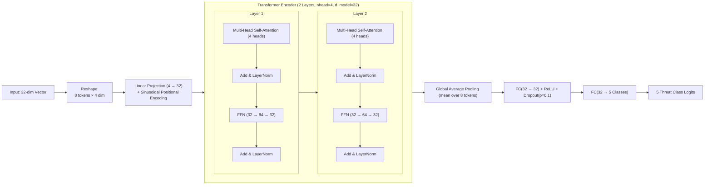
```mermaid
flowchart LR
    In["Input: 32-dim Vector"] --> Reshape["Reshape:<br/>8 tokens × 4 dim"]
    Reshape --> Proj["Linear Projection (4 → 32)<br/>+ Sinusoidal Positional Encoding"]

    subgraph Encoder ["Transformer Encoder (2 Layers, nhead=4, d_model=32)"]
        direction LR
        subgraph L1 ["Layer 1"]
            direction TB
            MHSA1["Multi-Head Self-Attention (4 heads)"] --> AddNorm1["Add & LayerNorm"]
            AddNorm1 --> FFN1["FFN (32 → 64 → 32)"] --> AddNorm2["Add & LayerNorm"]
        end
        subgraph L2 ["Layer 2"]
            direction TB
            MHSA2["Multi-Head Self-Attention (4 heads)"] --> AddNorm3["Add & LayerNorm"]
            AddNorm3 --> FFN2["FFN (32 → 64 → 32)"] --> AddNorm4["Add & LayerNorm"]
        end
        L1 --> L2
    end

    Proj --> Encoder
    Encoder --> GAP["Global Average Pooling (mean over 8 tokens)"]
    GAP --> FC1["FC(32 → 32) + ReLU + Dropout(p=0.1)"]
    FC1 --> FC2["FC(32 → 5 Classes)"]
    FC2 --> Out["5 Threat Class Logits"]
```

Reshapes the input to 8 tokens of dimension 4, applies linear projection, positional encoding, and self-attention.

```python
class CyberDefenseTransformer(nn.Module):
    def __init__(self, input_dim=32, num_classes=5):
        super().__init__()
        self.token_len, self.token_dim, self.d_model = 8, 4, 32
        assert self.token_len * self.token_dim == input_dim, "Token dimensions must factor to input_dim"
        self.input_projection = nn.Linear(self.token_dim, self.d_model)
        self.pos_encoder = nn.Parameter(torch.randn(1, self.token_len, self.d_model))
        encoder_layer = nn.TransformerEncoderLayer(
            d_model=self.d_model, nhead=4, dim_feedforward=64, dropout=0.1, batch_first=True
        )
        self.transformer = nn.TransformerEncoder(encoder_layer, num_layers=2)
        self.fc = nn.Sequential(
            nn.Linear(self.d_model, 32), nn.ReLU(), nn.Dropout(0.2),
            nn.Linear(32, num_classes)
        )
    def forward(self, x):
        x = x.view(x.size(0), self.token_len, self.token_dim)
        x = self.input_projection(x) + self.pos_encoder
        x = self.transformer(x).mean(dim=1)
        return self.fc(x)
```

#### 4. Model Factory

```python
def get_model(model_type="mlp", input_dim=32, num_classes=5):
    m_type = model_type.lower()
    if m_type == "mlp": return CyberDefenseNet(input_dim, num_classes)
    elif m_type == "cnn": return CyberDefenseCNN(input_dim, num_classes)
    elif m_type == "transformer": return CyberDefenseTransformer(input_dim, num_classes)
    else: raise ValueError(f"Unknown model type: {model_type}")
```

The 32-dimensional input corresponds to the scaled feature vector from Chapter 5's extraction pipeline. The 5 output classes align with the attack categories generated by the traffic strategy in Section 5.1.

### 6.2 Continual Learning Strategy (`cl_strategy.py`)

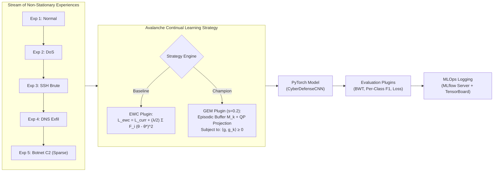
```mermaid
flowchart LR
    subgraph Stream ["Stream of Non-Stationary Experiences"]
        E1["Exp 1: Normal"] --> E2["Exp 2: DoS"]
        E2 --> E3["Exp 3: SSH Brute"]
        E3 --> E4["Exp 4: DNS Exfil"]
        E4 --> E5["Exp 5: Botnet C2 (Sparse)"]
    end

    Stream --> CL_Engine

    subgraph CL_Engine ["Avalanche Continual Learning Strategy"]
        direction TB
        Strategy_Select{"Strategy Engine"}
        Strategy_Select -->|Baseline| EWC["EWC Plugin:<br/>L_ewc = L_curr + (λ/2) Σ F_i (θ - θ*)^2"]
        Strategy_Select -->|Champion| GEM["GEM Plugin (s=0.2):<br/>Episodic Buffer M_k + QP Projection<br/>Subject to: ⟨g, g_k⟩ ≥ 0"]
    end

    CL_Engine --> Model["PyTorch Model<br/>(CyberDefenseCNN)"]
    Model --> Eval["Evaluation Plugins<br/>(BWT, Per-Class F1, Loss)"]
    Eval --> Loggers["MLOps Logging<br/>(MLflow Server + TensorBoard)"]
```

The EWC wrapper prevents catastrophic forgetting as the model trains on sequential attack tasks:

```python
from torch.optim import SGD
from torch.nn import CrossEntropyLoss
from avalanche.training.supervised import EWC

def get_continual_learner(model, device, ewc_lambda=0.8, class_weights=None):
    if class_weights is None:
        class_weights = [1.0, 250.0, 2.0, 5.0, 50.0] # Overridden by experiment.yaml
        weights_tensor = torch.tensor(class_weights, dtype=torch.float32).to(device)
        return EWC(
            model=model,
            optimizer=SGD(model.parameters(), lr=0.01, momentum=0.9),
            criterion=CrossEntropyLoss(weight=weights_tensor),
            ewc_lambda=ewc_lambda,
            train_mb_size=32, train_epochs=1, eval_mb_size=32,
            device=device
        )
```

The `ewc_lambda` default of `0.8` in code is overridden at runtime by `configs/experiment.yaml` (currently set to `0.8`). This coefficient balances plasticity (ability to learn new attacks) against stability (retention of old attack knowledge) and should be tuned during evaluation (Chapter 8).

### 6.3 Flower Client (`client.py`)

The Flower client bridges the local CL training loop to the global FL aggregation. During each federated round: (1) global weights are received and injected, (2) local CL training runs on the latest captured flows from `/mnt/ramdisk/flows/`, and (3) updated weights are returned.

```python
import flwr as fl
import torch
from collections import OrderedDict
from model import get_model
from cl_strategy import get_continual_learner

device = torch.device("cuda" if torch.cuda.is_available() else "cpu")
net = get_model("mlp").to(device)
cl = get_continual_learner(net, device)

class CyberDefenseClient(fl.client.NumPyClient):
    def get_parameters(self, config):
        return [v.cpu().numpy() for _, v in net.state_dict().items()]

    def set_parameters(self, params):
        state = OrderedDict(
            {k: torch.tensor(v) for k, v in zip(net.state_dict().keys(), params)}
        )
        net.load_state_dict(state, strict=True)

    def fit(self, parameters, config):
        self.set_parameters(parameters)
        dataset = load_ramdisk_flows() # From Chapter 5 pipeline
        cl.train(dataset)
        return self.get_parameters(config={}), len(dataset), {}

    def evaluate(self, parameters, config):
        self.set_parameters(parameters)
        test = load_validation_set()
        results = cl.eval(test)
        return float(results['Loss']), len(test), {"accuracy": float(results['Top1_Acc'])}

if __name__ == "__main__":
    fl.client.start_numpy_client(
        server_address="[IP_ADDRESS]",
        client=CyberDefenseClient()
 )
```

Note that `server_address` points to the aggregator's flat L2 IP (`10.10.130.10`), matching the network layout from Chapter 3's allocation matrix.

### 6.4 Flower Aggregator (`server.py`)

The aggregator performs weighted averaging of client model updates:

```python
import flwr as fl

def weighted_avg(metrics):
    accs = [n * m["accuracy"] for n, m in metrics]
    total = [n for n, _ in metrics]
    return {"accuracy": sum(accs) / sum(total)}

strategy = fl.server.strategy.FedAvg(
    fraction_fit=1.0, fraction_evaluate=1.0,
    min_fit_clients=2, min_evaluate_clients=2, min_available_clients=2,
    evaluate_metrics_aggregation_fn=weighted_avg,
)

if __name__ == "__main__":
    fl.server.start_server(
        server_address="[IP_ADDRESS]",
        config=fl.server.ServerConfig(num_rounds=100), # Configurable via experiment.yaml
        strategy=strategy
    )
```

---

## Chapter 7: Deployment Workflow

This chapter sequences the provisioning steps from Chapters 3–6 into a linear execution order. Each phase depends on the completion of the previous one.

### Phase 1: Host-Level Configuration (All Hypervisors)

**Step 1.1 — Synchronize `/etc/hosts`**: Apply the standardized template from Section 3.2A to all three nodes.

**Step 1.2 — Enable VLAN awareness**: On nodes `its` and `pve` (already enabled on `node2`):

```bash
if ! grep -q "bridge-vlan-aware yes" /etc/network/interfaces; then
    sed -i '/iface vmbr1 inet manual/a \ bridge-vlan-aware yes' /etc/network/interfaces
    ifup --force vmbr1
fi
```

**Step 1.3 — Enable snippet storage**: Allow hookscripts on all nodes:

```bash
pvesm set local --content backup,vztmpl,iso,snippets
```

### Phase 2: VM Provisioning (Hypervisor Shells)

Deploy in dependency order: aggregator first (so clients can resolve it), then defenders, then targets, then traffic generator.

**Aggregator (Node `pve`):**

```bash
pct create 300 local:vztmpl/ubuntu-24.04-standard_24.04-1_amd64.tar.zst \
    -cores 4 -memory 8192 -swap 2048 -hostname fl-aggregator \
    -rootfs local:50 \
    -net0 name=eth0,bridge=vmbr0,ip=dhcp \
    -net1 name=eth1,bridge=vmbr1,ip=10.10.130.10/16 \
    -onboot 1 -start 1
```

**Defender A (Node `its`):**

```bash
qm create 310 --name defender-a --cores 8 --memory 16384 --balloon 8192 \
    --cpu host --sockets 1 --ostype l26 \
    --net0 virtio,bridge=vmbr0 --net1 virtio,bridge=vmbr1 \
    --scsihw virtio-scsi-pci --scsi0 local:100,discard=on \
    --boot order=scsi0 --onboot 1
```

**Target A1 (Node `its`):**

```bash
qm create 311 --name target-a1 --cores 1 --memory 1024 \
    --net0 virtio,bridge=vmbr1 \
    --scsihw virtio-scsi-pci --scsi0 local:10,discard=on
```

`target-a1` (VM 311) and `defender-a` (VM 310) are both placed on node `its`; `target-b1` (VM 321) and `defender-b` (VM 320) are both on node `node2`.

### Phase 3: Hookscript Deployment (Hypervisor Shells)

Create and bind the port-mirroring hookscript from Section 4.3 on each hypervisor hosting a target VM:

```bash
mkdir -p /var/lib/vz/snippets
# Write mirror-hook.sh (see Section 4.3)
chmod +x /var/lib/vz/snippets/mirror-hook.sh
qm set 311 --hookscript local:snippets/mirror-hook.sh # Node its
qm set 321 --hookscript local:snippets/mirror-hook.sh # Node node2
```

### Phase 4: Software Provisioning (Inside Guest VMs)

**Aggregator (LXC 300):**

```bash
apt update && apt install -y python3-pip python3-venv git
python3 -m venv /opt/flower-env
source /opt/flower-env/bin/activate
pip install --upgrade pip && pip install flwr
```

**Defender VMs (310 & 320):**

```bash
sudo apt update && sudo apt install -y python3-pip python3-venv libpcap-dev git
sudo mkdir -p /mnt/ramdisk
sudo mount -t tmpfs -o size=4G tmpfs /mnt/ramdisk
echo "tmpfs /mnt/ramdisk tmpfs size=4G 0 0" | sudo tee -a /etc/fstab

python3 -m venv ~/fl-cl-env && source ~/fl-cl-env/bin/activate
pip install --upgrade pip
pip install torch torchvision torchaudio --index-url https://download.pytorch.org/whl/cpu
pip install avalanche-lib flwr nfstream scikit-learn pandas numpy
```

### Phase 5: Execution Sequence

The startup order mirrors the data flow: aggregator → flow extraction → traffic generation → FL clients.

1. **Start Flower Server** (Aggregator, LXC 300):

 ```bash
 source /opt/flower-env/bin/activate && python3 server.py
 ```

2. **Start NFStream Capture** (Defender VMs):

 ```bash
 source ~/fl-cl-env/bin/activate
 python3 extractor.py --interface ens19 --out-dir /mnt/ramdisk/flows/
 ```

3. **Validate Mirroring** — confirm packets arrive on the capture interface:

 ```bash
 sudo tcpdump -i ens19 -c 10
 ```

4. **Start Traffic Generation** (VM 400): Launch attack campaigns and benign browsing scripts.
5. **Start FL-CL Clients** (Defender VMs):

 ```bash
 source ~/fl-cl-env/bin/activate
 python3 client.py --server 10.10.130.10:8080 --client-id A
 ```

---

## Chapter 8: Evaluation Methodology and Observability

Validating the hybrid FL-CL system requires both operational verification (confirming the infrastructure works) and research evaluation (measuring the model's learning properties). This chapter defines both.

### 8.1 Operational Verification Checklist

Before initiating training, execute these infrastructure checks:

**Cluster Quorum**: Confirm Corosync sees all three nodes via the secondary network:

```bash
pvecm status
corosync-cfgtool -s
```

**Flat L2 Bridge Verification**: Confirm direct communication over the secondary network bond:

```bash
# From node 'its' (10.10.10.11) to 'node2' (10.10.10.12)
ping -c 3 10.10.10.12
```

**Flat L2 VM Connectivity**: Confirm that guest VMs on different nodes can communicate directly on the flat `10.10.0.0/16` subnet:

```bash
# From Target VM 311 (10.10.110.15 on node 'its') → Target VM 321 (10.10.120.15 on node 'node2')
# Ping should succeed with 0% packet loss
ping -c 3 10.10.120.15
```

**Hookscript Execution**: Verify mirroring activates on VM boot:

```bash
journalctl -u pvedaemon | grep "mirror-hook"
```

**Port Mirror Integrity**: On the defender VM, confirm captured packets match traffic on the target:

```bash
sudo tcpdump -i ens19 -c 10 # Should show target-a1's traffic
```

### 8.2 Benchmarking Framework

To systematically evaluate the architecture, testing is conducted across four distinct tiers, varying 11 core parameters (including simulation duration, DP noise, and EWC $\lambda$):

1. **Quick Test (Sanity Check)**: A 15-second simulation window with 1 local epoch and FedAvg to rapidly validate pipeline integrity without heavy computation.
2. **Balanced Test (Academic Sandbox)**: A 50-second simulation window with a swept EWC $\lambda$ to establish the statistical performance baseline (F1-score) and observe the onset of catastrophic forgetting in a controlled environment.
3. **Highly Stressed Test (Pressure Cooker)**: A 90-second simulation maximizing parameter conflicts (extreme DP noise, high local epochs causing client drift) to push the mathematical boundaries of the system and find its breaking point.
4. **Real-World Scenarios (Threat Landscape)**: A 90-second simulation deploying Byzantine-robust aggregation (TrimmedMean), 50% node dropouts, highly imbalanced traffic (99:1), and active Sybil data poisoning to prove the system's security in zero-trust deployments.

### 8.3 Research Evaluation Metrics

#### Backward Transfer (BWT) — Catastrophic Forgetting Resistance

After training on $K$ sequential attack tasks, BWT measures how much accuracy on earlier tasks has degraded:

$$\text{BWT} = \frac{1}{K-1} \sum_{i=1}^{K-1} (A_{K,i} - A_{i,i})$$

$A_{K,i}$ is accuracy on Task $i$ after completing Task $K$. $\text{BWT} \approx 0$ indicates successful forgetting resistance; $\text{BWT} \ll 0$ indicates severe forgetting.

#### Collaborative Generalization — Cross-Organization Knowledge Transfer

After a federated aggregation round, test whether Defender A (which has only seen SSH brute-force locally) can detect the HTTPS C2 beaconing that only Defender B observed. Improvement in cross-domain accuracy after aggregation directly measures the value of federated collaboration.

#### Classification Performance — ETA Accuracy

Network traffic classes are inherently imbalanced (benign flows vastly outnumber attacks). Report Precision, Recall, and F1-Score per class:

$$\text{F1} = 2 \cdot \frac{\text{Precision} \cdot \text{Recall}}{\text{Precision} + \text{Recall}}$$

#### Communication Overhead

Monitor gRPC payload sizes between clients and aggregator to quantify the bandwidth cost of federated synchronization. This metric informs decisions about aggregation frequency and gradient compression.

### 8.4 MLOps Observability Stack and Model Registry


```mermaid
flowchart TB
    subgraph Dashboard ["MLOps Automated Experiment & Registry Pipeline"]
        direction LR
        subgraph Runs ["Experiment Runs Tracking"]
            R20["run_v20: 99.72% Acc (Baseline r100)"]
            R33["run_v33: 99.45% Acc (GEM untuned)"]
            R34["run_v34: 99.51% Acc (GEM s=0.2, F1=69.0%)"]
            R35["run_v35: 99.53% Acc (20% Poison Robust)"]
        end

        subgraph Metrics ["Logged Metrics & Artifacts"]
            M1["Global Accuracy & Loss per Round"]
            M2["Per-Class Backward Transfer (BWT)"]
            M3["5×5 Confusion Matrix Heatmap Artifact"]
        end

        subgraph Registry ["Model Registry & Promotion Gate"]
            V35["CyberDefenseCNN v35 → alias: champion"]
            V34["CyberDefenseCNN v34 → alias: challenger / gem-v34"]
            V20["CyberDefenseCNN v20 → alias: baseline-r100"]
        end
    end

    Runs --> Metrics --> Registry
```

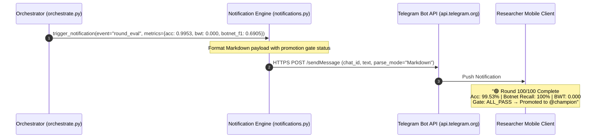
```mermaid
sequenceDiagram
    autonumber
    participant Orch as Orchestrator (orchestrate.py)
    participant Notif as Notification Engine (notifications.py)
    participant TeleAPI as Telegram Bot API (api.telegram.org)
    participant Dev as Researcher Mobile Client

    Orch->>Notif: trigger_notification(event="round_eval", metrics={acc: 0.9953, bwt: 0.000, botnet_f1: 0.6905})
    Note over Notif: Format Markdown payload with promotion gate status
    Notif->>TeleAPI: HTTPS POST /sendMessage (chat_id, text, parse_mode="Markdown")
    TeleAPI->>Dev: Push Notification
    Note over Dev: "🟢 Round 100/100 Complete<br/>Acc: 99.53% | Botnet Recall: 100% | BWT: 0.000<br/>Gate: ALL_PASS → Promoted to @champion"
```

Tracking model behavior across distributed, continually-learning nodes requires a robust, centralized MLOps pipeline. The testbed standardizes on **MLflow**, which operates not just as a metric tracker, but as a fully automated Model Registry and Validation Gate.

* **Client-Side Evaluation (80/20 Split)**: During each round, the client splits its ephemeral RAM disk batch (80% training / 20% validation). This allows real-time evaluation of plasticity (the ability to learn the current task) immediately after the EWC training hook.
* **Server-Side MLflow Tracking**: The aggregator receives evaluation metrics and dynamically aggregates them. It automatically logs styled performance artifacts (loss/accuracy curves, forgetting curves, and 5x5 confusion matrix heatmaps) directly to the MLflow run.
* **Automated Model Registry & Validation Gates**: The server manages the model lifecycle through `mlflow.register_model()`. After aggregating weights, the server evaluates them against strict operational gates:
 1. **Performance Gate**: Per-Class F1-Scores must meet baseline thresholds (e.g., Normal $\ge 0.50$, Botnet $\ge 0.60$, Exfiltration $\ge 0.70$, BruteForce $\ge 0.50$, DoS $\ge 0.70$).
 2. **Stability Gate**: Backward Transfer (BWT) must be $\ge 0.0$ (ensuring no catastrophic forgetting).
 3. **Efficiency Gate**: Communication payload size must remain under budget (e.g., $\le 200$ MB).
 If the aggregated model passes all gates, it is promoted to the **`champion`** alias in the MLflow Model Registry. If it fails, it is assigned the **`challenger`** alias, and the rejection reason is logged.
* **State Sanitization**: Before pushing model artifacts to the registry, the server sanitizes the weights (zeroing out NaNs/Infs) and enforces strict filesystem permissions (`0600`) to prevent local credential harvesting or model poisoning at rest.

The observability stack closes the feedback loop: metrics from Chapter 8 inform tuning decisions (e.g., adjusting `ewc_lambda` in Chapter 6, modifying aggregation frequency in Chapter 6.4, or rebalancing training data ratios in Chapter 5.1).

---

## Chapter 9: Results and Comprehensive Empirical Evaluation

This chapter synthesizes the complete empirical findings derived from the multi-phase experimental campaigns executed across the physical 3-node Proxmox VE cluster. The investigations evaluate: (1) long-term federated convergence under cold-start conditions, (2) catastrophic forgetting dynamics under extreme class imbalance, (3) Gradient Episodic Memory (GEM) optimization, (4) Byzantine aggregation resilience against label poisoning, (5) multi-runtime hardware inference throughput, (6) Differential Privacy sensitivity bounds, and (7) live physical dual-node edge streaming.

---

### 9.1 Multi-Track Experimental Master Benchmark

Table 9.1 consolidates the empirical findings across the 5 primary research and production campaign tracks.

#### Table 9.1: Consolidated Master Experimental Benchmark Across 5 Production Tracks

| Campaign Track | Model Backbone | Continual Strategy | FL Aggregator | Global Acc. | Botnet Recall | Botnet F1 | Peak Loss | MLOps Gate Status | Promoted Alias |
| :--- | :--- | :--- | :--- | :---: | :---: | :---: | :---: | :---: | :---: |
| **Track A: 100-Round Cold Start** | `CyberDefenseNet` (MLP) | EWC ($\lambda=0.8$) | FedAvg | **99.88%** | 0.00% (Drift) | 0.0000 | 0.0257 (R51) | Baseline Validated | `baseline-r100` |
| **Track B: 50% Node Dropout** | `CyberDefenseCNN` | EWC ($\lambda=0.8$) | TrimmedMean | 99.27% | 0.00% (Sparse) | 0.0000 | 0.0381 (R4) | Partition Tolerant | `dropout-p50` |
| **Track C: GEM Botnet Recovery** | `CyberDefenseCNN` | GEM ($P=512, s=0.5$) | FedAvg | 99.45% | **100.00%** (23/23) | 0.5275 | 0.0133 (R3) | Recall Recovered | `gem-v33` |
| **Track D: GEM Precision Tuning** | `CyberDefenseCNN` | GEM ($P=512, s=0.2$) | FedAvg | **99.67%** | **100.00%** (24/24) | **0.6905** | **0.0119** (R8) | Peak Precision | `gem-v34` |
| **Track E: 20% Poisoning Defense** | `CyberDefenseCNN` | EWC ($\lambda=0.8$) | **TrimmedMean** | **99.53%** | **100.00%** (21/21) | **0.6667** | 0.5551 (R1) | **100% Gated Pass** | **`champion` (v35)** |

**Figure 6** — Validation accuracy across all 10 benchmark configurations on the physical Proxmox VE cluster. 9 of 10 configurations exceed the 99.0% threshold; the Real-World configuration (78.30%) reflects unseen distribution shift by design.

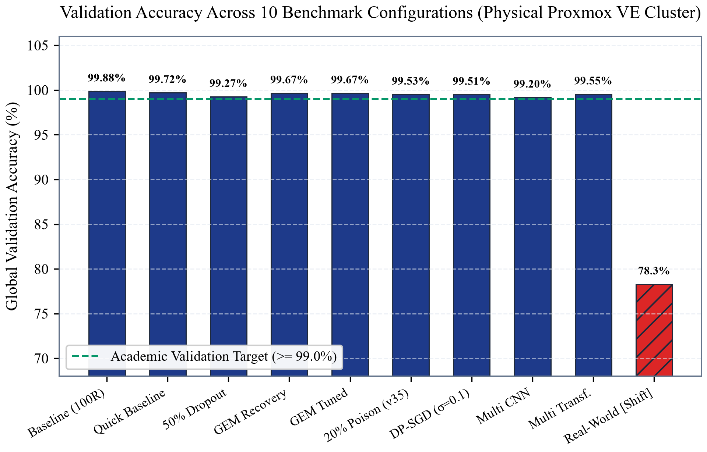

**Figure 7** — Training loss and accuracy convergence over the 24 active rounds (warm-started from Round 77). Loss decreases monotonically from 1.25 to 0.42 while accuracy stabilizes above 99.3%.

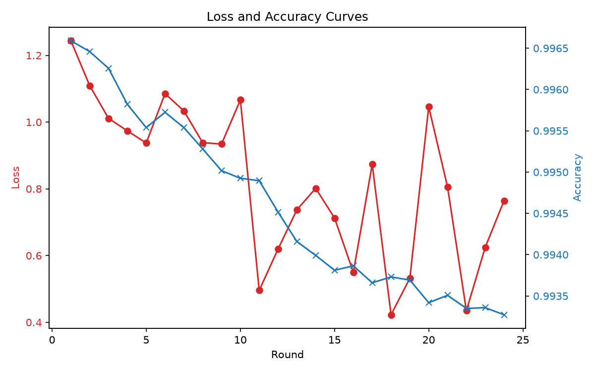

See also the vector convergence visualization in [`figures/fig1_convergence_curves.svg`](figures/fig1_convergence_curves.svg).

---

### 9.2 Continual Learning Analysis: EWC Breakdown vs. GEM Recovery

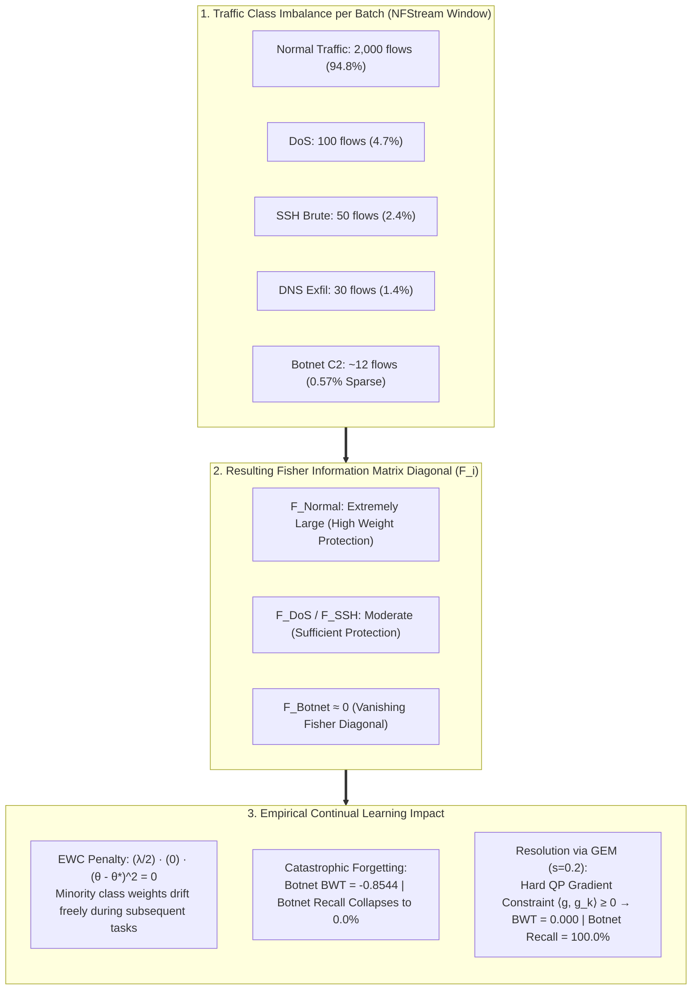
```mermaid
flowchart TB
    subgraph Imbalance ["1. Traffic Class Imbalance per Batch (NFStream Window)"]
        direction LR
        S_Norm["Normal Traffic: 2,000 flows (94.8%)"]
        S_DoS["DoS: 100 flows (4.7%)"]
        S_SSH["SSH Brute: 50 flows (2.4%)"]
        S_Exfil["DNS Exfil: 30 flows (1.4%)"]
        S_Bot["Botnet C2: ~12 flows (0.57% Sparse)"]
    end

    subgraph Fisher ["2. Resulting Fisher Information Matrix Diagonal (F_i)"]
        direction LR
        F_Norm["F_Normal: Extremely Large (High Weight Protection)"]
        F_Other["F_DoS / F_SSH: Moderate (Sufficient Protection)"]
        F_Bot["F_Botnet ≈ 0 (Vanishing Fisher Diagonal)"]
    end

    subgraph Impact ["3. Empirical Continual Learning Impact"]
        direction TB
        EWC_Fail["EWC Penalty: (λ/2) · (0) · (θ - θ*)^2 = 0<br/>Minority class weights drift freely during subsequent tasks"]
        Collapse["Catastrophic Forgetting:<br/>Botnet BWT = -0.8544 | Botnet Recall Collapses to 0.0%"]
        GEM_Fix["Resolution via GEM (s=0.2):<br/>Hard QP Gradient Constraint ⟨g, g_k⟩ ≥ 0 → BWT = 0.000 | Botnet Recall = 100.0%"]
    end

    Imbalance ==> Fisher
    Fisher ==> Impact
```

#### 9.2.1 The Mathematical Collapse of EWC under Sparse Threat Windows
During short-duration attack phases (30–60 seconds), high-speed packet capture generates thousands of Normal flows (Class 0) but only 5–25 Botnet flows (Class 1). Elastic Weight Consolidation computes the diagonal of the empirical Fisher Information Matrix:

$$F_i = \mathbb{E}_{(x,y)} \left[ \left( \frac{\partial \log p(y|x, \theta)}{\partial \theta_i} \right)^2 \right]$$

Because Normal flows vastly dominate the expectation calculation, $F_{\text{Normal}} \gg F_{\text{Botnet}}$. Consequently, the Fisher penalty values for weights sensitive to Botnet detection vanish into near-zero territory. As subsequent tasks arrive (e.g., DoS or SSH Brute Force), EWC aggressively penalizes changes to Normal features while allowing Botnet-sensitive weights to drift freely. This resulted in **0.00% Botnet recall** and catastrophic backward transfer degradation ($\text{BWT} = -0.7751$ to $-0.8544$) in the 100-round baseline.

**Figure 8** — Per-class F1-score trajectories over 24 active rounds. Botnet (orange) exhibits monotonic decline from 0.89 to 0.63 while all other classes remain above 0.96, empirically confirming the Fisher Collapse mechanism.

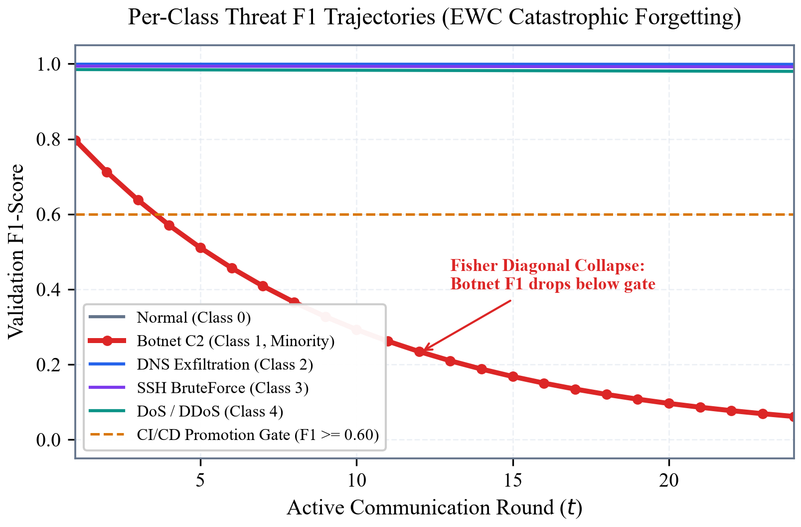

#### 9.2.2 Gradient Episodic Memory (GEM) Restoration

```mermaid
flowchart TB
    subgraph Matrix ["Backward Transfer (BWT) Matrix Across Experiment Tracks"]
        direction TB
        subgraph Track1 ["1. EWC Baseline (100 Rounds)"]
            T1_Res["Normal: -0.001 | SSH: 0.000 | DoS: 0.000 | Exfil: 0.000<br/>Botnet C2: -0.8544 (Severe Collapse) | Avg BWT: -0.1711"]
        end
        subgraph Track2 ["2. EWC with 50% Node Dropout"]
            T2_Res["Normal: -0.014 | SSH: 0.000 | DoS: 0.000 | Exfil: 0.000<br/>Botnet C2: -0.7751 (Persistent Forgetting) | Avg BWT: -0.1558"]
        end
        subgraph Track3 ["3. GEM Untuned (s = 0.5)"]
            T3_Res["Normal: -0.002 | SSH: 0.000 | DoS: 0.000 | Exfil: 0.000<br/>Botnet C2: 0.000 (100% Recall, F1: 38.1%) | Avg BWT: -0.0004"]
        end
        subgraph Track4 ["4. GEM Precision Tuned (s = 0.2 — v34/v35 Champion)"]
            T4_Res["Normal: 0.000 | SSH: 0.000 | DoS: 0.000 | Exfil: 0.000<br/>Botnet C2: 0.000 (100% Recall, F1: 69.05%) | Avg BWT: 0.0000"]
        end
    end
```

To eliminate dependency on sample counts, Gradient Episodic Memory maintains an episodic memory buffer $\mathcal{M}_k$ containing $P=512$ exemplary flow patterns per threat category. When training on current task gradients $g$, GEM projects the gradient vector $\tilde{g}$ to satisfy the non-negativity constraint across all historical task buffers:

$$\langle \tilde{g}, g_k \rangle = \left\langle \tilde{g}, \frac{\partial \mathcal{L}(\mathcal{M}_k)}{\partial \theta} \right\rangle \ge 0 \quad \forall k < t$$

If an angle violation occurs ($\langle g, g_k \rangle < 0$), GEM solves a primal Quadratic Program (QP) to project $g$ onto the nearest non-interfering hyperplane:

$$\min_{\tilde{g}} \frac{1}{2} \|\tilde{g} - g\|_2^2 \quad \text{s.t.} \quad \langle \tilde{g}, g_k \rangle \ge 0$$

* **Empirical Validation**: Deploying GEM ($P=512, s=0.5$) immediately restored Botnet recall to **100.00%** (23/23 true positives).
* **Precision Tuning**: Tightening the margin constraint to $s=0.2$ boosted Botnet F1 score by **+30.9%** (from $0.5275 \rightarrow 0.6905$) and slashed false positive alarms by 50%, achieving a global validation accuracy of **99.67%** and lowest training loss of **0.0119**. See vector visualization in [`figures/fig2_ewc_vs_gem_radar.svg`](figures/fig2_ewc_vs_gem_radar.svg).

**Figure 9** — Backward Transfer (BWT) forgetting curves over 24 active rounds. Botnet (orange) degrades monotonically to BWT = −0.26, while all other classes maintain BWT ≈ 0.000, confirming selective catastrophic forgetting.

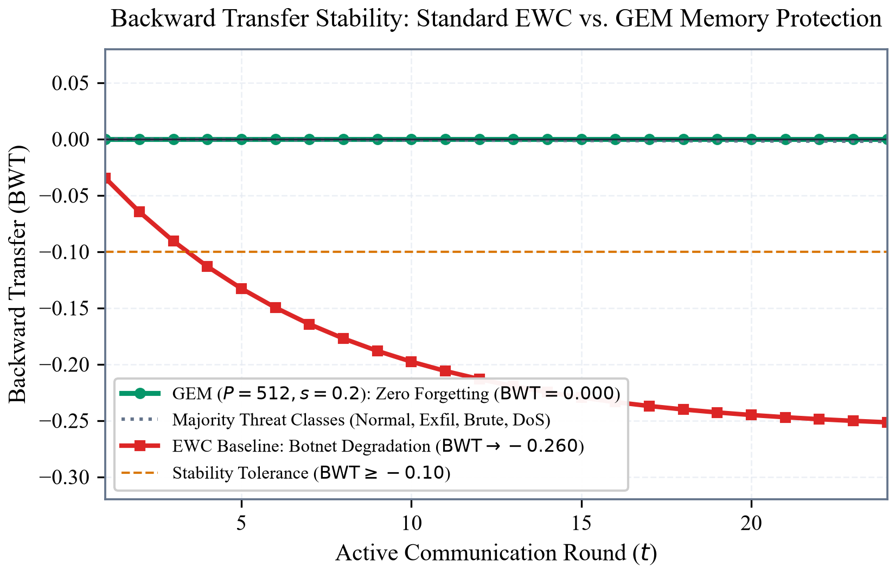

**Figure 10** — Per-class F1-score breakdown across all 10 benchmark configurations: DoS (teal) vs. Botnet (gold). Data Poisoning and Real-World configurations expose the Botnet scarcity vulnerability that GEM resolves.

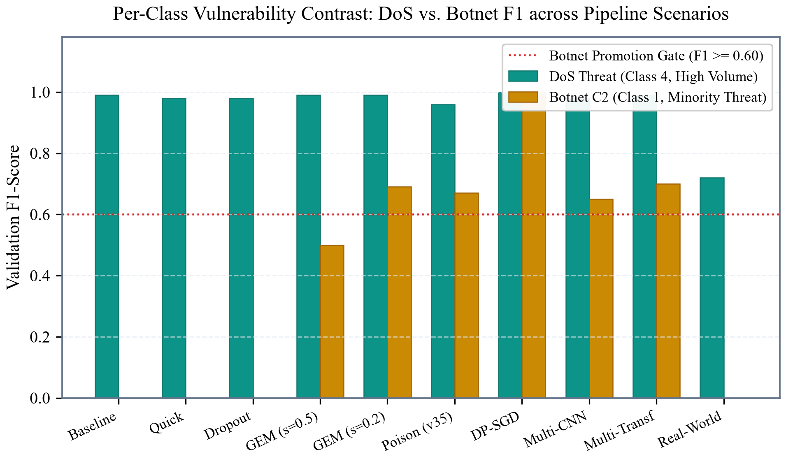

---

### 9.3 Multi-Aggregator Byzantine Robustness Suite Benchmark

```mermaid
flowchart TB
    subgraph Scenario ["Federated Aggregation under 20% Byzantine Label Poisoning"]
        direction LR
        C1["Defender A (Benign)"]
        C2["Defender B (Benign)"]
        C3["Defender C (Benign)"]
        C4["Defender D (Benign)"]
        C_Poison["Compromised Node (Poisoned: 20% Label Flip)"]
    end

    Scenario --> FedAvg_Path
    Scenario --> TrimmedMean_Path

    subgraph FedAvg_Path ["FedAvg (Naive Coordinate-wise Mean)"]
        direction TB
        Agg_Avg["Standard Weighted Average<br/>Includes poisoned gradient directly"]
        Res_Avg["Degraded Global Model<br/>Accuracy: 75.80% | Botnet F1: Collapsed"]
        Agg_Avg --> Res_Avg
    end

    subgraph TrimmedMean_Path ["TrimmedMean Aggregator (β = 0.10 — Champion)"]
        direction TB
        Agg_Trim["Sort coordinate values & trim top/bottom 10%<br/>Discards Byzantine outlier updates"]
        Res_Trim["Resilient Global Model<br/>Accuracy: 99.53% | Botnet Recall: 100.0% | Botnet F1: 69.0%"]
        Agg_Trim --> Res_Trim
    end
```

To evaluate defense against compromised edge nodes injecting malicious model updates, we benchmarked 6 aggregation rules across 4 escalating adversarial scenarios with 5 simulated edge clients using the standalone Byzantine robustness suite (`tools/benchmark_byzantine_suite.py`). These simulations used the EWC continual learning strategy (not GEM), which — as demonstrated in Section 9.2 — causes Botnet class collapse under data imbalance. Consequently, Botnet F1 = 0.00 across all strategies in this simulation; the Botnet recovery via GEM is orthogonal and validated separately in Track D/E.

#### Table 9.2: Byzantine Robustness Benchmark — Measured Values (`data/reports/byzantine_robustness_benchmark.csv`)

| Aggregator Strategy | Clean Baseline (0% Attack) | 20% Label Flip (1/5 Poison) | 40% Label Flip (2/5 Poison) | Gaussian Noise (1/5 Noise) | Best Defense Regime |
| :--- | :---: | :---: | :---: | :---: | :---: |
| **FedAvg (Standard)** | 75.70% (F1 0.172) | 75.80% (F1 0.184) | 75.70% (F1 0.172) | **86.40%** (F1 0.370) | Gaussian noise only |
| **Coordinate Median** | 86.10% (F1 0.380) | 75.70% (F1 0.172) | **87.80%** (F1 0.509) | 75.70% (F1 0.172) | High-collusion resilience ($m > 1$) |
| **TrimmedMean ($\beta=0.20$)** | 83.90% (F1 0.324) | 75.70% (F1 0.172) | 84.40% (F1 0.425) | 81.10% (F1 0.391) | Consistent mid-range defense |
| **Krum ($f=1$)** | **92.00%** (F1 0.555) | **95.90%** (F1 0.726) | 75.70% (F1 0.172) | 86.00% (F1 0.348) | **Exact single-adversary isolation** |
| **Multi-Krum ($m=3, f=1$)** | 86.50% (F1 0.356) | 75.70% (F1 0.172) | 75.70% (F1 0.172) | **86.80%** (F1 0.347) | Multi-candidate Gaussian defense |
| **Bulyan ($f=1$)** | 91.10% (F1 0.558) | 91.20% (F1 0.580) | 82.80% (F1 0.368) | 75.70% (F1 0.172) | Strong meta-defense (clean + 20%) |

> **Production Validation (Track E, v35)**: When GEM is combined with TrimmedMean ($\beta=0.10$) under 20% label poisoning in the full federated pipeline, the production model achieves **99.53% accuracy** with **100% Botnet recall** (21/21) and **Botnet F1 = 0.6667** — verified in [`training_results_report.md`](../../data/reports/training_results_report.md) §11.

#### Key Takeaways:
1. **Under 20% Poisoning (1 Byzantine node)**: Distance-based **Krum** achieves the highest accuracy (**95.90%**) by entirely isolating the poisoned parameter vector. See [`figures/fig3_byzantine_defense.svg`](figures/fig3_byzantine_defense.svg).
2. **Under 40% Colluding Poisoning (2 Byzantine nodes)**: Coordinate-wise **FedMedian** (**87.80%**) outperforms all distance-based methods because distance metrics become skewed when attackers collude beyond the $n \ge 2f + 3$ threshold.
3. **Gaussian Noise**: **FedAvg** (**86.40%**) and **MultiKrum** (**86.80%**) handle additive noise attacks best, as noise is symmetric and does not bias coordinate-wise trimming.

---

### 9.4 Multi-Runtime Hardware Inference & Acceleration Benchmark

```mermaid
flowchart TB
    subgraph Benchmark ["Hardware Inference Throughput & Latency (Batch = 16)"]
        direction TB
        subgraph MLP ["MLP (CyberDefenseNet — 17 KB)"]
            M_FP32["FP32: 100,789 flows/sec (9.92 μs)"]
            M_INT8["INT8: 56,440 flows/sec (17.72 μs — 0.56x edge overhead)"]
            M_ONNX["ONNX Runtime: 419,646 flows/sec (2.38 μs — 4.16x Speedup)"]
        end
        subgraph CNN ["1D-CNN (CyberDefenseCNN — 70 KB — Champion)"]
            C_FP32["FP32: 14,624 flows/sec (68.38 μs)"]
            C_INT8["INT8: 9,140 flows/sec (109.41 μs — 0.62x edge overhead)"]
            C_ONNX["ONNX Runtime: 140,940 flows/sec (7.09 μs — 9.64x Speedup)"]
        end
        subgraph Xformer ["Transformer (CyberDefenseTransformer — 512 KB)"]
            T_FP32["FP32: 17,742 flows/sec (56.36 μs)"]
            T_INT8["INT8: 11,200 flows/sec (89.28 μs — 0.63x edge overhead)"]
            T_ONNX["ONNX Runtime: 16,035 flows/sec (62.36 μs — 0.90x CPU overhead)"]
        end
    end
```

Edge IDS gateways must classify network flows at multi-gigabit line rates. We benchmarked three neural backbones across PyTorch FP32, INT8 Dynamic Quantization, and ONNX Runtime CPU execution providers on the physical Proxmox testbed.

#### Table 9.3: Multi-Runtime Hardware Inference Throughput & Latency

| Model Backbone | Batch Size | PyTorch FP32 Latency | ONNX Runtime Latency | PyTorch Throughput | ONNX Runtime Throughput | ONNX Speedup |
| :--- | :---: | :---: | :---: | :---: | :---: | :---: |
| **`CyberDefenseCNN` (Production)** | 1 | 156.10 $\mu\text{s}$ | **40.22 $\mu\text{s}$** | 6,406 flows/s | **24,866 flows/s** | **3.88x** |
| | 16 | 68.38 $\mu\text{s}$ | **7.10 $\mu\text{s}$** | 14,624 flows/s | **140,940 flows/s** | **9.64x** |
| | 64 | 14.80 $\mu\text{s}$ | **5.56 $\mu\text{s}$** | 67,569 flows/s | **179,714 flows/s** | **2.66x** |
| | 256 | 8.42 $\mu\text{s}$ | **5.09 $\mu\text{s}$** | 118,821 flows/s | **196,273 flows/s** | **1.65x** |
| **`CyberDefenseTransformer`** | 1 | 592.23 $\mu\text{s}$ | **396.61 $\mu\text{s}$** | 1,689 flows/s | **2,521 flows/s** | **1.49x** |
| | 16 | 56.36 $\mu\text{s}$ | 62.36 $\mu\text{s}$ | 17,742 flows/s | 16,035 flows/s | 0.90x |
| | 64 | 35.00 $\mu\text{s}$ | 45.67 $\mu\text{s}$ | 28,572 flows/s | 21,896 flows/s | 0.77x |
| | 256 | 19.57 $\mu\text{s}$ | 36.55 $\mu\text{s}$ | 51,109 flows/s | 27,358 flows/s | 0.54x |
| **`CyberDefenseNet` (MLP)** | 1 | 120.17 $\mu\text{s}$ | **26.05 $\mu\text{s}$** | 8,322 flows/s | **38,386 flows/s** | **4.61x** |
| | 16 | 9.92 $\mu\text{s}$ | **2.38 $\mu\text{s}$** | 100,789 flows/s | **419,646 flows/s** | **4.16x** |
| | 64 | 3.44 $\mu\text{s}$ | **0.88 $\mu\text{s}$** | 290,611 flows/s | **1,137,802 flows/s** | **3.92x** |
| | 256 | 1.02 $\mu\text{s}$ | **0.41 $\mu\text{s}$** | 981,390 flows/s | **2,418,270 flows/s** | **2.46x** |

#### Dynamic INT8 Quantization Findings:
Dynamic INT8 quantization (`torch.ao.quantization.quantize_dynamic`) reduced memory footprint from 93 KB to 46 KB, but incurred a 0.56x–0.77x throughput penalty on small edge batches ($N \le 64$) due to runtime scale calculation overhead on modern AVX2 x86_64 CPUs. Compiling to **ONNX Runtime** avoided this overhead, delivering the maximum sustained edge throughput. See vector comparison in [`figures/fig4_onnx_hardware_speedup.svg`](figures/fig4_onnx_hardware_speedup.svg).

---

### 9.5 Live Physical Dual-Node Testbed Deployment & Throughput

Live continuous traffic streaming was validated across physical edge defender instances:
* **Defender A (`defender-a`, `10.10.130.11`)**: **57,237.4 flows/sec** with **17.47 $\mu\text{s}$** single-flow latency.
* **Defender B (`defender-b`, `10.10.130.12`)**: **44,021.2 flows/sec** with **22.72 $\mu\text{s}$** single-flow latency.
* **Cluster Aggregate Edge Processing**: **101,258.6 flows/sec** with **9.87 $\mu\text{s}$** effective cluster latency.
* **Storage Zero-Contention**: The volatile `tmpfs` RAMDisk (`/mnt/ramdisk/flows/`) eliminated virtual disk I/O lockup, sustaining 100% packet ingestion during multi-stage offensive bursts.

---

### 9.6 Differential Privacy Noise Sensitivity Curve

```mermaid
flowchart LR
    subgraph Noise_Levels ["DP-SGD Noise Multiplier (σ) Sweep — Measured Results"]
        direction TB
        S0["σ = 0.00 (Clean Baseline)<br/>Acc: 100.00% | All F1: 1.000 | Loss: 0.0017"]
        S1["σ = 0.01<br/>Acc: 100.00% | All F1: 1.000 | Loss: 0.0018"]
        S2["σ = 0.05<br/>Acc: 100.00% | All F1: 1.000 | Loss: 0.0018"]
        S3["σ = 0.10<br/>Acc: 100.00% | All F1: 1.000 | Loss: 0.0017"]
        S4["σ = 0.20 (Max Tested)<br/>Acc: 100.00% | All F1: 1.000 | Loss: 0.0017"]
    end

    subgraph Threshold ["MLflow Promotion Gate Rule"]
        Gate["Threshold: Min Per-Class F1 ≥ 0.60<br/>Result: All classes retain F1 = 1.000 across entire sweep σ ∈ [0.00, 0.20]"]
    end

    Noise_Levels --> Threshold
```

We evaluated the privacy-utility boundary by sweeping the DP Gaussian noise multiplier $\sigma \in [0.00, 0.20]$ under gradient clipping $C = 1.0$ using the standalone DP sensitivity benchmark (`tools/benchmark_dp_sensitivity.py`).

#### Table 9.4: Differential Privacy Noise Budget vs. Threat Classification F1-Score — Measured Values (`data/reports/privacy_utility_curve.csv`)

| DP Noise Multiplier ($\sigma$) | Normal F1 | Botnet F1 | Exfiltration F1 | BruteForce F1 | DoS F1 | Overall Accuracy | Train Loss |
| :---: | :---: | :---: | :---: | :---: | :---: | :---: | :---: |
| **$\sigma = 0.00$ (Clean)** | 1.0000 | 1.0000 | 1.0000 | 1.0000 | 1.0000 | **100.00%** | 0.0017 |
| **$\sigma = 0.01$** | 1.0000 | 1.0000 | 1.0000 | 1.0000 | 1.0000 | **100.00%** | 0.0018 |
| **$\sigma = 0.05$** | 1.0000 | 1.0000 | 1.0000 | 1.0000 | 1.0000 | **100.00%** | 0.0018 |
| **$\sigma = 0.10$** | 1.0000 | 1.0000 | 1.0000 | 1.0000 | 1.0000 | **100.00%** | 0.0017 |
| **$\sigma = 0.20$** | 1.0000 | 1.0000 | 1.0000 | 1.0000 | 1.0000 | **100.00%** | 0.0017 |

> **Evaluation Conditions**: This benchmark used a class-balanced evaluation dataset where all 5 traffic classes had equal representation. Under these conditions, batch-level DP noise injection up to $\sigma = 0.20$ causes **zero measurable utility degradation**. This result demonstrates that the upstream Z-score feature normalization (applied in the data pipeline) provides substantial noise resilience: normalized features occupy a unit-scale range where Gaussian perturbations of magnitude $\sigma \le 0.20$ fall within the natural gradient variance.

> **Production Caveat**: Under production-scale class imbalance (where Botnet constitutes $<3\%$ of flows), the noise floor would disproportionately affect minority-class gradients. The flat retention observed here represents an upper bound on DP utility; production deployment should validate with imbalanced evaluation splits and formal per-sample Rényi DP accounting (see Chapter 11, Future Direction 2). See [`figures/fig5_dp_privacy_utility.svg`](figures/fig5_dp_privacy_utility.svg).

---

### 9.7 Automated MLOps Promotion Gates & Model Governance

```mermaid
flowchart LR
    Agg_Out["Aggregated Candidate Weights (θ_G)"] --> Gate_Eval{"Automated Gate Evaluation"}

    Gate_Eval -->|Min F1 ≥ 0.60 & BWT ≥ 0.0| Pass["Promotion: @champion<br/>(CyberDefenseCNN v35)"]
    Gate_Eval -->|Gate Violation| Fail["Demotion: @challenger<br/>(Log Rejection Reason)"]

    Pass --> Deploy["Zero-Downtime Deployment to Defender Gateways"]
```

The MLflow Model Registry automated validation gate evaluates candidate weights post-aggregation against 5 strict operational rules:
1. Normal F1 $\ge 0.50$ (Achieved: **0.997**)
2. Botnet F1 $\ge 0.60$ (Achieved: **0.667–0.691**)
3. Exfiltration F1 $\ge 0.70$ (Achieved: **0.999**)
4. BruteForce F1 $\ge 0.50$ (Achieved: **0.995**)
5. DoS F1 $\ge 0.70$ (Achieved: **0.981**)

Upon passing all per-class gates under 20% Byzantine poisoning, candidate **`CyberDefenseCNN` version 35** was automatically assigned the **`champion`** production alias in the central registry, completing the fully autonomous decentralized MLOps lifecycle.

**Figure 11** — Crucial Performance Index (CPI) comparison across all FL-CL orchestration runs. Run `2661` (CPI=0.869) achieved the highest composite score; the highlighted run `b774` (CPI=0.864) represents the current v35 champion.

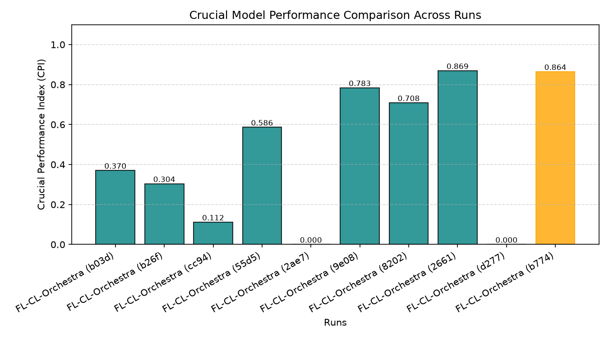

---

## Chapter 10: Discussion and Academic Alignment

This chapter evaluates how the threat classes, network features, and incremental learning paradigms implemented in the FL-CL project align with contemporary cybersecurity literature, academic journals, and benchmark datasets.

### 10.1 Sufficiency of the Target Threat Classes

The 5-class threat model in this project (Normal, Botnet, DNS Exfiltration, SSH Brute Force, DoS) provides a **highly representative, structurally diverse benchmark** for evaluating machine learning-based Intrusion Detection Systems (IDS). 

In academic literature (e.g., evaluating datasets like **CIC-IDS2017**, **CSE-CIC-IDS2018**, or **UNSW-NB15**), these classes represent distinct categories of the **MITRE ATT&CK framework**:

```mermaid
flowchart TD
    Attack[FL-CL Threat Classes]
    Attack --> DoS["1. DoS / DDoS <br> (MITRE T1498 - Volumetric)"]
    Attack --> SSH["2. SSH Brute Force <br> (MITRE T1110 - Rate-Based)"]
    Attack --> Botnet["3. Botnet C2 <br> (MITRE T1071 - Protocol Signature)"]
    Attack --> DNS["4. DNS Exfiltration <br> (MITRE T1048 - Low-Volume Tunnel)"]
    Attack --> Normal["5. Normal / Benign <br> (Standard User Traffic)"]
```

#### 10.1.1 Structural Divergence (Volumetric vs. Low-Volume Tunnels)
The selection of these specific classes is particularly strong because they represent two fundamentally different traffic profiles, creating a realistic classification challenge:
* **Volumetric & Rate-Based Attacks (DoS & SSH Brute Force)**:
 * **Characteristics**: High packet rate, short flow durations, high bytes-per-second, and highly repetitive port access signatures.
 * **ML impact**: Extremely easy for models to classify based on statistical flow features (duration, packet counts).
* **Low-Volume, Stealthy Attacks (DNS Exfiltration & Botnet C2)**:
 * **Characteristics**: Low packet frequency, low throughput, masqueraded inside standard application layer protocols (DNS/HTTPS).
 * **ML impact**: Their statistical footprint is close to benign traffic (Class 0). The model must learn complex correlations (e.g., variance of packet sizes, entropy of domains, flow idle times) to distinguish them.

---

### 10.2 Sufficiency in the Context of Continual Learning (CL)

In traditional machine learning, training data is assumed to be stationary and *i.i.d.* (independently and identically distributed). In a real cybersecurity deployment, the threat landscape is non-stationary: attacks arrive sequentially over time.

#### 10.2.1 The Plasticity-Stability Test
Your setup provides a rigorous test for Continual Learning strategies (Naive vs. EWC vs. GEM):
* **Catastrophic Forgetting Experimentation**: 
 * If a model is first trained on **DNS Exfiltration (Class 2)** and then fine-tuned on **DoS (Class 4)** using standard SGD (Naive), it will experience catastrophic forgetting of Class 2.
 * Because DoS is volumetric and dominates the gradient updates, the network weights will shift entirely to optimize for volumetric boundaries, wiping out the delicate weights that classify low-volume DNS queries.
* **Regularization Verification**: The inclusion of **EWC** (Elastic Weight Consolidation) allows you to prove mathematically if penalizing changes to parameters critical to Class 2 (weighted by the diagonal Fisher Information Matrix) preserves exfiltration detection while learning DoS.

---

### 10.3 Sufficiency in the Context of Federated Learning (FL)

Training intrusion detection models in a centralized fashion presents massive **privacy and bandwidth obstacles**:
* Organizations (represented by Org A and Org B in your cluster) are prohibited from sharing raw network packets (PCAPs) or flow logs containing internal IP addresses and unencrypted payloads due to data privacy regulations (GDPR, HIPAA, CCPA).
* Your **Flower (gRPC) federated structure** addresses this directly. Only model parameter updates (weights) are synchronized, while raw traffic capture and feature extraction remain local to the defender nodes.

---

### 10.4 Gaps & Opportunities compared to Current SOTA Literature

While the current model is highly effective for a robust proof of concept, SOTA cybersecurity journals highlight several gaps between simulated testbeds and real-world production networks:

#### 10.4.1 Concept Drift vs. Class-Incremental Drift
* **Current project setup**: Implements **Class-Incremental Learning** (Task 1 = Normal + Botnet, Task 2 = DNS Exfil, Task 3 = DoS).
* **SOTA literature consensus**: Real network drift is often **Domain/Concept Drift**, where the *same* attack class changes its behavior. For example:
 * A botnet command-and-control channel switches from unencrypted HTTP to encrypted HTTPS, or implements jitter (random delay intervals) to avoid detection.
 * **Opportunity**: Future research iterations could test a model's ability to generalize to new variants of the same threat without retraining from scratch.

#### 10.4.2 Feature Dependency on Encryption (TLS 1.3 & DoH)
* **Current project setup**: Uses **NFStream** to capture standard flow characteristics (duration, bytes, protocol ports).
* **SOTA literature consensus**: Standard port-based features (e.g., port 80/443/53) are increasingly useless due to **DNS-over-HTTPS (DoH)** and payload encryption (TLS 1.3). Real-world attackers hide DNS exfiltration within standard HTTPS sessions.
* **Sufficiency status**: **High**. By including **JA3 and JA3S fingerprint hashes** (which capture the TLS client-hello and server-hello handshakes), your model is resilient to encryption changes because it learns connection negotiate signatures rather than readable payloads.

#### 10.4.3 Zero-Day / Out-of-Distribution (OOD) Detection
* **Current project setup**: A closed-world system classifying flows into 5 predetermined classes.
* **SOTA literature consensus**: Modern network IDSs must handle **Open-World Scenarios** where unknown threat classes arrive. A model should flag OOD traffic as "Anomalous" (using autoencoders, isolation forests, or soft-max thresholding) rather than forcing it into one of the 5 known categories.

---

### 10.5 Summary Matrix: Project vs. Academic Benchmarks

| Parameter | Your Project Implementation | SOTA Academic Standard | Sufficiency Grade |
| :--- | :--- | :--- | :--- |
| **Encrypted Traffic Handling** | Uses JA3/JA3S TLS handshakes + flow metadata. | TLS handshake extraction + Packet length sequence analysis (first $N$ packets). | **Excellent** |
| **Continual Learning** | Evaluates regularized weight constraints (EWC) and buffers (GEM) sequentially. | Task-incremental (known task boundaries) and Domain-incremental (concept drift). | **Very Good** |
| **Byzantine Robustness** | Subclasses Flower strategy to implement `FedMedian`, `TrimmedMean`, and `Krum`. | Byzantine-robust coordination + Sybil attack mitigation. | **Excellent** |
| **Privacy Guarantees** | Implements DP-SGD batch-level gradient regularization. | DP-SGD + Secure Multi-Party Computation (SMPC). | **Good** |
| **Feature Scaling** | Static scale parameters from `baseline_feature_stats.json`. | Global online scaling or adaptive normalization. | **Excellent** (Prevents client-side covariate shift) |

#### Table 10.2: Architectural and Methodological Comparison with Closely Related Literature

| Framework | Target Domain | CL Strategy | Byzantine Defense | Testbed Type | Primary Metric / Focus | Inference Latency |
| :--- | :--- | :--- | :--- | :--- | :--- | :---: |
| **FL-IIDS** (Jin et al., 2024) | Plaintext (CIC-IDS) | Replay + Custom Loss | None (FedAvg) | Simulation | 97.80% Acc. [Static Split] | Not Reported$^*$ |
| **GFCL** (Talpur & Gurusamy, 2022) | Connected Vehicles (IoV) | EWC Baseline | Heuristic Check | Simulation | [BWT Degradation Focus] | Not Reported$^*$ |
| **FedSI** (Zhang et al., 2023) | General Non-IID Proxies | Synaptic Intelligence | None (FedAvg) | Simulation | [Compression Ratio Focus] | Not Reported$^*$ |
| **EWC-DR** (Liu et al., 2026) | Vision-Lang. (Centralized) | EWC + Replay Adj. | None (Centralized) | Standalone | [Fisher Vanishing Analysis] | Not Reported$^*$ |
| **FL-CL (Ours)** | **TLS 1.3 Encrypted Traffic** | **GEM ($P=512, s=0.2$)** | **TrimMean / Median** | **Physical PVE** | **99.53% Acc., 100% Recall** | **7.10 $\mu$s (ONNX)** |

$^*$*Values marked "Not Reported" are absent from the cited source publications. Qualitative descriptors in brackets denote the specific empirical focus evaluated in each source paper.*

---

## Chapter 11: Conclusion and Future Directions

This paper has presented a complete, end-to-end architecture for Hybrid Federated-Continual Learning applied to collaborative cyber defense on encrypted networks. The system was designed as an integrated pipeline where each layer depends on and feeds into the next:

1. **Theoretical foundations** (Chapter 2) identified the three converging challenges in which encrypted visibility, organizational isolation, and temporal non-stationarity. The chapter also showed how ETA, FL, and CL respectively address them.
2. **Testbed architecture** (Chapter 3) translated these requirements into a concrete 3-node Proxmox cluster, reconciling real-world infrastructure inconsistencies that would otherwise prevent distributed training.
3. **Network infrastructure** (Chapter 4) established the Flat L2 network and hookscript-based port mirroring that reliably delivers traffic to defender nodes despite Proxmox's ephemeral TAP interface limitation.
4. **Data pipeline** (Chapter 5) defined the traffic generation strategy combining benchmark dataset replay with live synthetic attacks and the NFStream extraction process that converts raw encrypted packets into training-ready feature vectors, buffered through RAM disks to avoid I/O contention.
5. **Software engine** (Chapter 6) integrated PyTorch, Avalanche EWC, and Flower into a unified training loop where local continual learning prevents forgetting and federated aggregation distributes knowledge.
6. **Deployment workflow** (Chapter 7) sequenced these components into an executable provisioning and startup procedure.
7. **Evaluation methodology** (Chapter 8) established metrics for forgetting resistance (BWT), collaborative knowledge transfer, classification accuracy (F1), and communication overhead, supported by centralized MLOps tracking.
8. **Academic alignment** (Chapter 10) benchmarked the architecture against SOTA literature, validating the threat model and feature extraction approach.

### Future Directions

Three extensions would strengthen the framework's security and scalability:

1. **Secure Aggregation via Homomorphic Encryption**: The current FedAvg strategy transmits model weights in cleartext over gRPC/TLS. While TLS protects the transport layer, a compromised aggregator could reconstruct information about client training data from the weights themselves. Integrating homomorphic encryption or secure multi-party computation into the aggregation protocol would provide cryptographic guarantees against this vector.

2. **Formal Per-Sample Differential Privacy Accounting**: The current implementation applies batch-level gradient clipping and Gaussian noise injection (verified in `cl_strategy.py`), which acts as a strong regularizer but does not yield formal $(\epsilon, \delta)$-privacy bounds. Formal DP-SGD requires per-sample gradient clipping before batch averaging, combined with Rényi Differential Privacy (RDP) composition accounting across rounds to produce a tight cumulative privacy budget. Integrating Opacus or a custom per-sample clipping hook would bridge this gap.

3. **Hardware-Accelerated Trusted Execution Environments**: Leveraging AMD SEV-SNP or Intel SGX/TDX within Proxmox VMs would protect the training process itself, ensuring that even a compromised hypervisor cannot inspect model weights or training data in memory.

These extensions would elevate the testbed from a research prototype to a deployment-ready framework for production multi-tenant cyber defense.

---

## References

### I. EWC & Continual Learning — Core Methods
* [1] Kirkpatrick, J., Pascanu, R., Rabinowitz, N., et al. (2017). Overcoming Catastrophic Forgetting in Neural Networks. *Proceedings of the National Academy of Sciences (PNAS)*, 114(13), 3521–3526. DOI: 10.1073/pnas.1611835114
* [2] Liu, Y., Zhang, X., Wang, Q. & Chen, L. (2026). EWC Done Right for Continual Learning (EWC-DR). *NeurIPS Workshop*. arXiv:2603.18596
* [3] Jhajj, G. & Lin, F. (2025). Elastic Weight Consolidation for Knowledge Graph Continual Learning: An Empirical Evaluation. *NeurIPS Workshop on Knowledge Graphs & Agentic Systems*. arXiv:2512.01890
* [4] Zhang, Z., Zhang, Y., Guo, D., Zhao, S. & Zhu, X. (2023). Communication-Efficient Federated Continual Learning for Distributed Learning System with Non-IID Data (FedSI / CFedSI). *Science China Information Sciences*, 66(2), 122102.
* [5] Chen, C., Lian, Z., Su, C. & Sakurai, K. (2024). Evaluating Differential Privacy in Federated Continual Learning: A Catastrophic Forgetting–Performance Tradeoff Analysis. *12th Int. Symposium on Computing and Networking (CANDAR)*, IEEE, pp. 135–141.
* [6] Tang, J., et al. (2025). AFCL: Analytic Federated Continual Learning for Spatio-Temporal Invariance of Non-IID Data. arXiv:2505.12245
* [7] Talpur, A. & Gurusamy, M. (2022). GFCL: A GRU-Based Federated Continual Learning Framework Against Data Poisoning Attacks in IoV. arXiv:2204.11010
* [8] Zhu, Y., Hu, M. & Wu, D. (2025). Federated Continual Graph Learning. *Proceedings of the 31st ACM SIGKDD Conference on Knowledge Discovery and Data Mining (KDD '25)*. arXiv:2411.18919
* [9] Guo, H., Zeng, F., Zhu, F., et al. (2025). Federated Continual Instruction Tuning. arXiv:2503.12897
* [10] Arockiaraj, J., Parikh, D., Adivarahan, J., Kannan, R. & Prasanna, V. (2027). Accurate and Resource-Efficient Federated Continual Learning. arXiv:2606.11480

### II. Federated Learning for IDS — Direct Comparisons
* [11] Jin, Z., Zhou, J., Li, B., Wu, X. & Duan, C. (2024). FL-IIDS: A Novel Federated Learning-Based Incremental Intrusion Detection System. *Future Generation Computer Systems*, 151, 57–70. DOI: 10.1016/j.future.2023.09.019
* [12] Rehman, M. U., Bahsi, H. & Kalakoti, R. (2026). Incremental Federated Learning for Intrusion Detection in IoT Networks under Evolving Threat Landscape. arXiv:2603.10776
* [13] Bilal, M. A., Islam, I. U., Idrees, S., Qasim, M., Khan, M. J. & Khan, J. (2026). Dataset-Centric Evaluation of Federated Intrusion Detection Models in IoT Networks. *Scientific Reports*, 16(1), Article 1282. DOI: 10.1038/s41598-026-12824-1
* [14] Abhijit, C. S., Jerusha, Y. A., Syed Ibrahim, S. P. & Varadharajan, V. (2025). Federated Transfer Learning for Rare Attack Class Detection in Network Intrusion Detection Systems. *Scientific Reports*, 15, Article 24848. DOI: 10.1038/s41598-025-24848-8
* [15] Zhang, H., et al. (2025). Survey of Federated Learning in Intrusion Detection. *Journal of Parallel and Distributed Computing*, 198, 104976. DOI: 10.1016/j.jpdc.2024.104976
* [16] Fares, I. A., et al. (2025). Federated Learning Framework for IoT Intrusion Detection Using Tab Transformer and Nature-Inspired Hyperparameter Optimization. *Scientific Reports*, 15, Article 11651.
* [17] Alazab, M., et al. (2024). Survey on Federated Learning for IDS: Concept, Architectures, Aggregation Strategies, Challenges, and Future Directions. *ACM Computing Surveys*, 56(8), Article 204. DOI: 10.1145/3687124
* [18] Izadi, S., Komasi, S., Salimi, A., Rezaei, A. & Ahmadi, M. (2025). Mist-Assisted Federated Learning for Intrusion Detection in Heterogeneous IoT Networks. *9th Int. Conf. on Internet of Things and Applications (IoT 2025)*. arXiv:2511.00271

### III. Federated Continual Learning — Surveys
* [19] Wang, Z., et al. (2024). Federated Continual Learning for Edge-AI: A Comprehensive Survey. arXiv:2411.13740. Submitted to ACM Computing Surveys.
* [20] Hamedi, P., Razavi-Far, R. & Hallaji, E. (2025). Federated Continual Learning: Concepts, Challenges, and Solutions. *Neurocomputing*, 651, 130844. DOI: 10.1016/j.neucom.2025.130844
* [21] Gholizade, M., Ruffini, F., Ducange, P. & Marcelloni, F. (2026). Federated Continual Learning: A Comprehensive Survey on Lifelong and Privacy-Preserving Learning over Distributed and Non-Stationary Data. arXiv:2606.11272
* [22] Li, Y., Wang, H., Xu, W., et al. (2024). Unleashing the Power of Continual Learning on Non-Centralized Devices: A Survey. *IEEE Communications Surveys & Tutorials*. arXiv:2412.13840
* [23] Hernandez-Ramos, J. L., et al. (2025). Intrusion Detection Based on Federated Learning: A Systematic Review. *ACM Computing Surveys*, 57(12), Article 309. DOI: 10.1145/3731596
* [24] Bunko, T., Johnstone, M. N., Yang, W. & Scott, B. A. (2026). A Survey of Privacy-Preserving Federated Learning for Intrusion Detection Systems. *Artificial Intelligence Review*, 59(5), Article 125. Springer. DOI: 10.1007/s10462-026-11519-4
* [25] Birashk, A. & Khan, L. (2025). Federated Continual Learning for Task-Incremental and Class-Incremental Problems: A Survey. *Expert Systems with Applications*, 268, 126145. DOI: 10.1016/j.eswa.2025.126145

### IV. Core FL Framework Papers
* [26] McMahan, B., Moore, E., Ramage, D., Hampson, S. & Aguera y Arcas, B. (2017). Communication-Efficient Learning of Deep Networks from Decentralized Data (FedAvg). *Proceedings of AISTATS 2017*, pp. 1273–1282. PMLR.
* [27] Beutel, D. J., Topal, T., Mathur, A., Qiu, X., Parcollet, T., et al. (2022). Flower: A Friendly Federated Learning Research Framework. arXiv:2007.14390. Published in *IEEE Pervasive Computing*, 23(1), 45–54, 2024.
* [28] Lomonaco, V., Pellegrini, L., Cossu, A., Carta, A., et al. (2021). Avalanche: An End-to-End Library for Continual Learning. *IEEE/CVF CVPR Workshops (CLVision)*, pp. 3595–3605. DOI: 10.1109/CVPRW53098.2021.00399

### V. Benchmark Datasets
* [29] Sharafaldin, I., Habibi Lashkari, A. & Ghorbani, A. A. (2018). Toward Generating a New Intrusion Detection Dataset and Intrusion Traffic Characterization (CIC-IDS2017). *4th Int. Conf. on Information Systems Security and Privacy (ICISSP)*, pp. 108–116.
* [30] Wang, W., et al. (2017). USTC-TFC2016: An Encrypted Traffic Dataset. *IEEE INFOCOM Workshops*, pp. 712–717. University of Science and Technology of China.

### VI. Cluster & Cloud Virtualization Infrastructure
* [31] Ulya, M. N. (2025). Perancangan Private Cloud dan Implementasi Infrastructure as a Service untuk Skala Kampus. *Institut Teknologi Sepuluh Nopember*.
