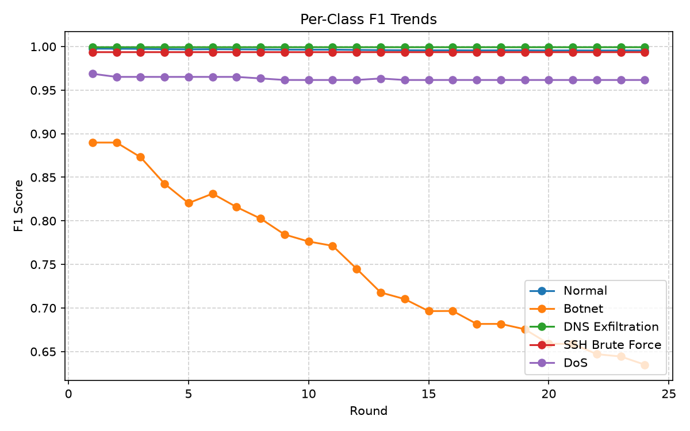
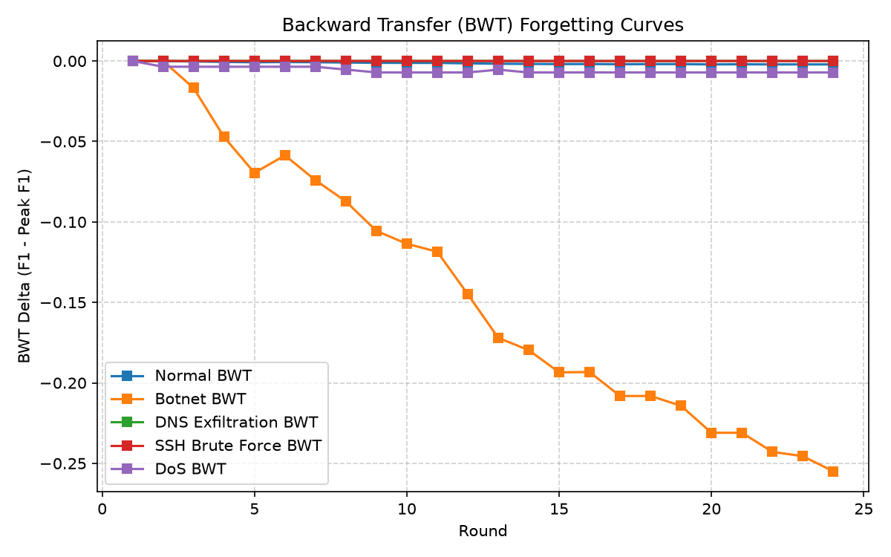

# Federated Continual Learning Post-Training Report

Generated automatically for MLflow Run: `b774d90b4a304dce9ca2393f0af2f4a9`.

## Configuration Parameters

| Parameter | Value |
| :--- | :--- |
| **Model Backbone** | 1D-CNN (`CyberDefenseCNN`) |
| **Model Version** | `16` |
| **CL Strategy** | `EWC` ($\lambda = 0.8$) |
| **MLOps Mode** | `PRODUCTION` |
| **Production Strategy** | `resume` |
| **Total FL Rounds** | `24` (resumed from round 76; 100 total) |
| **Learning Rate** | `0.003` |
| **Batch Size** | `32` |
| **Class Weights** | `[1.0, 250.0, 2.0, 5.0, 50.0]` |
| **Git Commit** | `2ecf09433a53a785884cd66ed4aad0929bc92c58` |
| **Resumed From Run** | `82020f81b9064636aa8d49a5a22d18bf` (v`15`) |

## Performance Summary (Best Round 18)

| Metric | Value |
| :--- | :--- |
| **Global Accuracy** | `99.3730%` |
| **Global Loss** | `0.422477` |
| **Crucial Performance Index (CPI)** | `0.882960` |

## Class-wise Detailed Metrics

| Class | Name | Accuracy | F1-Score | Backward Transfer (BWT) |
| :--- | :--- | :---: | :---: | :---: |
| 0 | Normal | 99.22% | 0.9957 | -0.0019 |
| 1 | Botnet | 100.00% | 0.6817 | -0.2081 |
| 2 | DNS Exfiltration | 99.86% | 0.9993 | -0.0000 |
| 3 | SSH Brute Force | 100.00% | 0.9936 | -0.0000 |
| 4 | DoS | 97.04% | 0.9617 | -0.0071 |

## Visualization Plots

### Training History (Loss & Accuracy)

### Per-Class F1 Trend

### Catastrophic Forgetting Analysis

### Cross-Run Comparison (CPI)

