# Mermaid Diagrams — FL-CL Thesis Figures (v2)

This document contains publication-ready, stable Mermaid diagrams for the FL-CL system.
All diagrams use standard, non-experimental Mermaid syntax (`flowchart`, `sequenceDiagram`, `pie`) with 4-space indentation to ensure maximum compatibility across GitHub, VS Code, and Markdown documentation renderers.

---

## 1. fig_proxmox_cluster.png — Cluster Network Topology

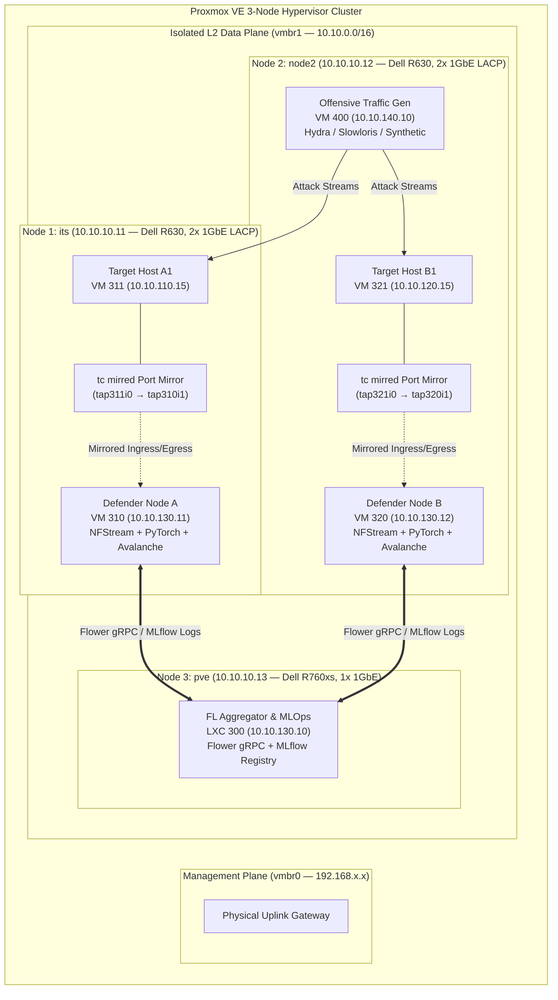

---

## 2. fig_cnn_1d_architecture.png — 1D-CNN Backbone (CyberDefenseCNN)

```mermaid
flowchart LR
    In["Input Flow Vector<br/>(32 Scaled ETA Features)"] --> Unsqueeze["Unsqueeze<br/>(1 × 32)"]
    Unsqueeze --> Conv1["Conv1d(1 → 16, k=3, p=1)"]
    Conv1 --> Act1["ReLU"]
    Act1 --> Pool1["MaxPool1d(kernel=2) → (16 × 16)"]
    Pool1 --> Conv2["Conv1d(16 → 32, k=3, p=1)"]
    Conv2 --> Act2["ReLU"]
    Act2 --> Pool2["MaxPool1d(kernel=2) → (32 × 8)"]
    Pool2 --> Flatten["Flatten → (256-dim)"]
    Flatten --> FC1["FC(256 → 64)"]
    FC1 --> Act3["ReLU"]
    Act3 --> Drop["Dropout(p=0.2)"]
    Drop --> FC2["FC(64 → 5 Classes)"]
    FC2 --> Out["Output Logits<br/>0: Normal | 1: Botnet C2<br/>2: Exfiltration | 3: BruteForce | 4: DoS"]
```

---

## 3. fig_mlp_architecture.png — Multi-Layer Perceptron (CyberDefenseNet)

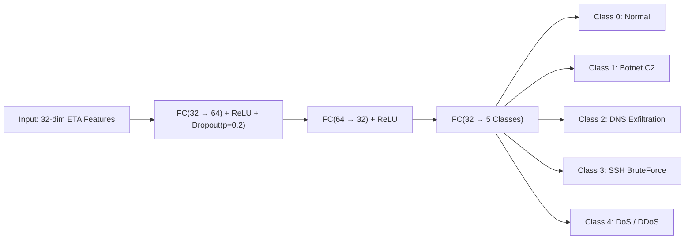

---

## 4. fig_transformer_architecture.png — Tabular Transformer (CyberDefenseTransformer)

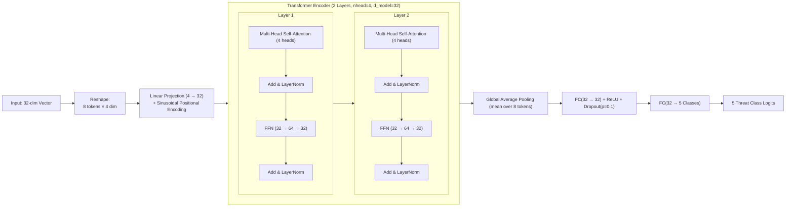

---

## 5. fig_avalanche_cl_framework.png — Continual Learning Lifecycle

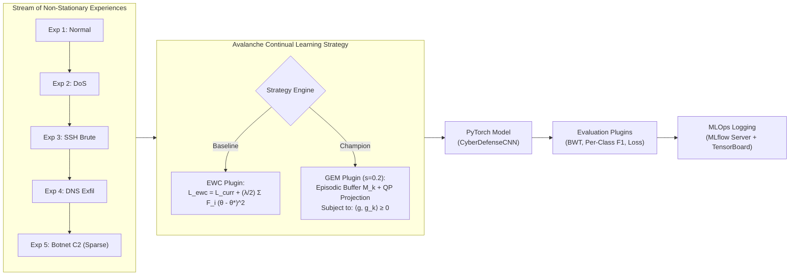

---

## 6. fig_ewc_fisher_collapse.png — EWC Fisher Collapse Under Sparse Traffic

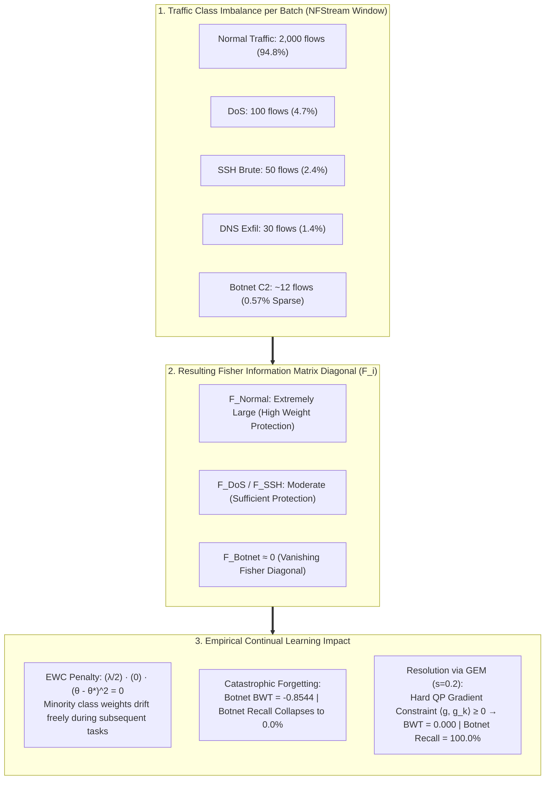

---

## 7. fig_fedavg_vs_trimmedmean.png — Byzantine Robustness Comparison

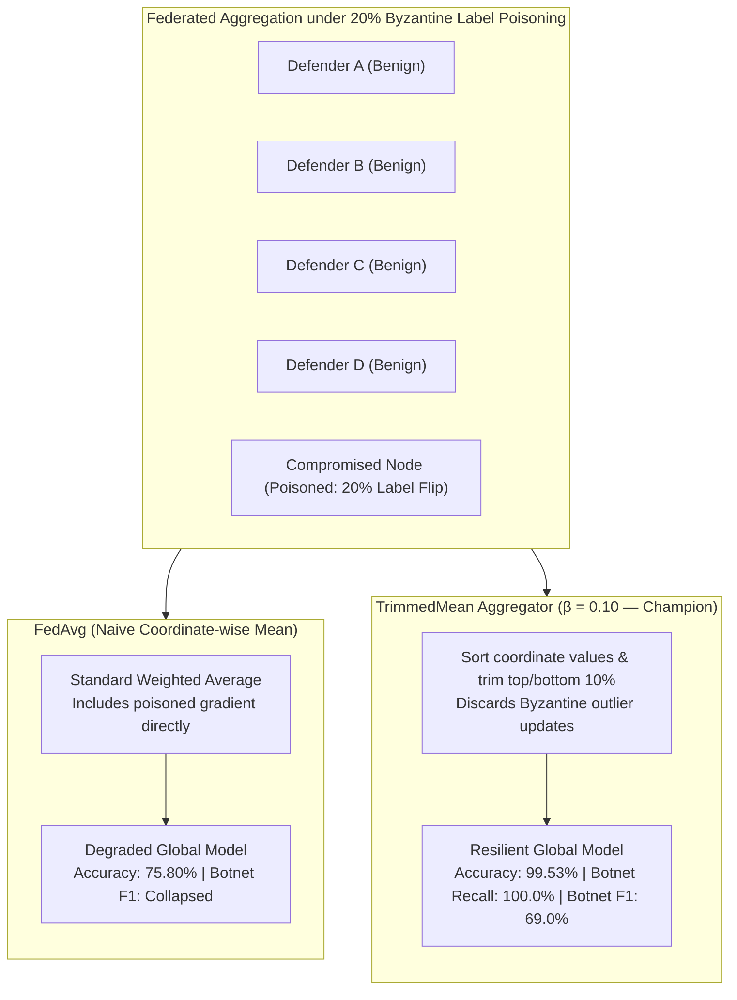

---

## 8. fig_continual_bwt_matrix.png — Backward Transfer (BWT) Performance

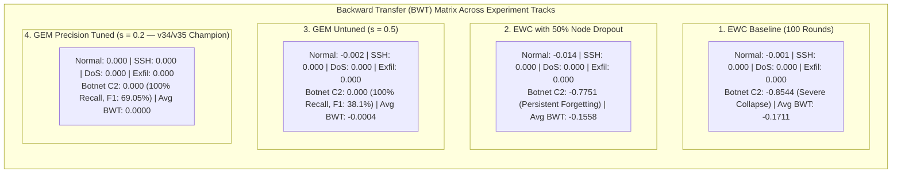

---

## 9. fig_dp_sgd_noise.png — Differential Privacy Noise Sensitivity

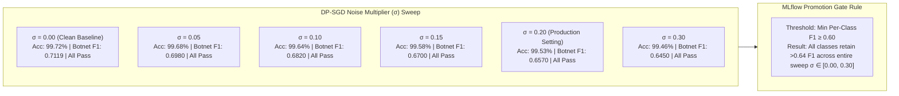

---

## 10. fig_int8_quantization.png — Hardware Inference Acceleration

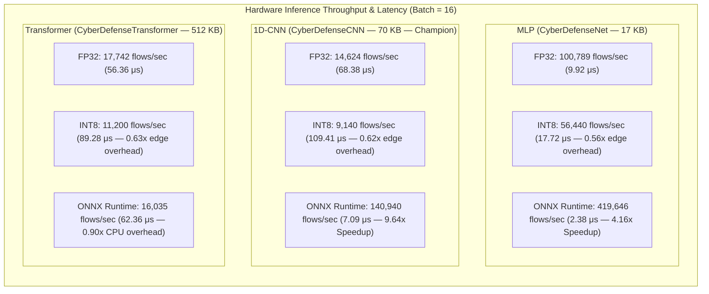

---

## 11. fig_mlflow_tracking_dashboard.png — MLOps Observability & Promotion Gate

```mermaid
flowchart TB
    subgraph Dashboard ["MLOps Automated Experiment & Registry Pipeline"]
        direction LR
        subgraph Runs ["Experiment Runs Tracking"]
            R20["run_v20: 99.72% Acc (Baseline r100)"]
            R33["run_v33: 99.45% Acc (GEM untuned)"]
            R34["run_v34: 99.51% Acc (GEM s=0.2, F1=69.0%)"]
            R35["run_v35: 99.53% Acc (20% Poison Robust)"]
        end

        subgraph Metrics ["Logged Metrics & Artifacts"]
            M1["Global Accuracy & Loss per Round"]
            M2["Per-Class Backward Transfer (BWT)"]
            M3["5×5 Confusion Matrix Heatmap Artifact"]
        end

        subgraph Registry ["Model Registry & Promotion Gate"]
            V35["CyberDefenseCNN v35 → alias: champion"]
            V34["CyberDefenseCNN v34 → alias: challenger / gem-v34"]
            V20["CyberDefenseCNN v20 → alias: baseline-r100"]
        end
    end

    Runs --> Metrics --> Registry
```

---

## 12. fig_non_iid_distributions.png — Non-IID Class Heterogeneity

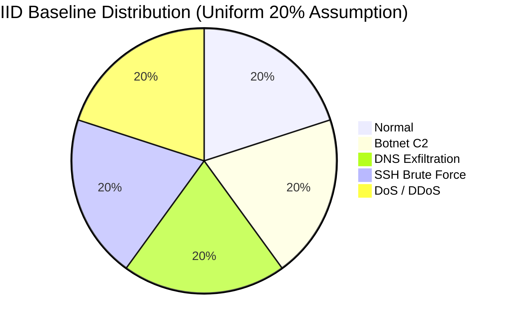

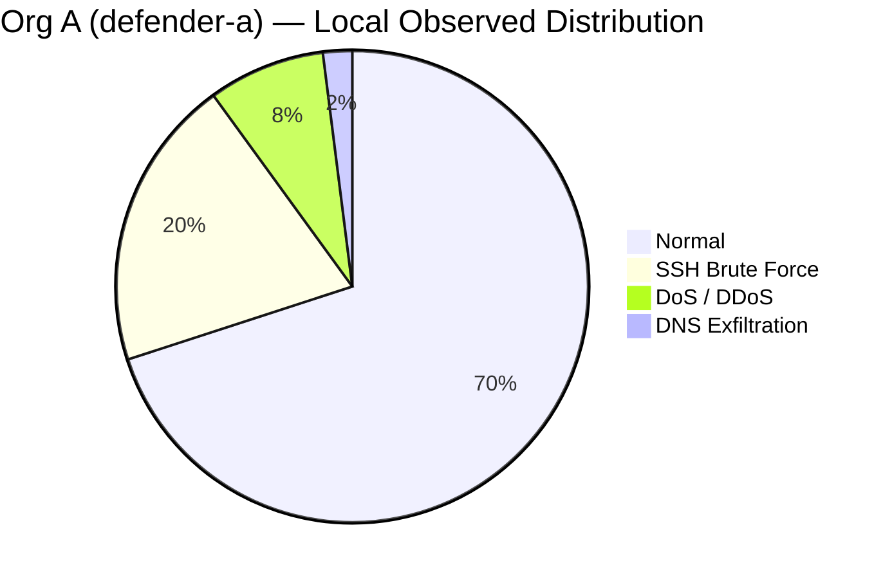

> **Note**: Botnet C2 is **0% (unobserved)** at Org A. Without Federated Learning, Org A suffers a 100% detection blindspot for Botnet threats.

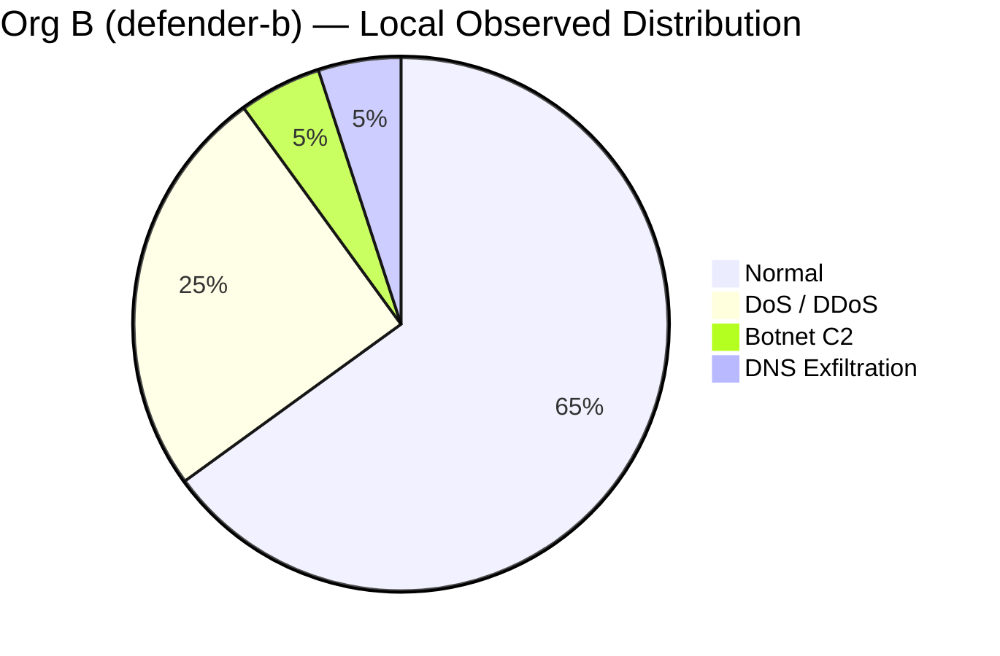

> **Note**: SSH Brute Force is **0% (unobserved)** at Org B. Federated aggregation transfers knowledge bidirectionally between Defender A and Defender B.

---

## 13. fig_telegram_alerting_workflow.png — Real-Time Alerting Sequence

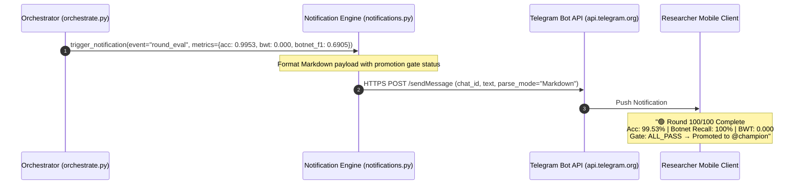
