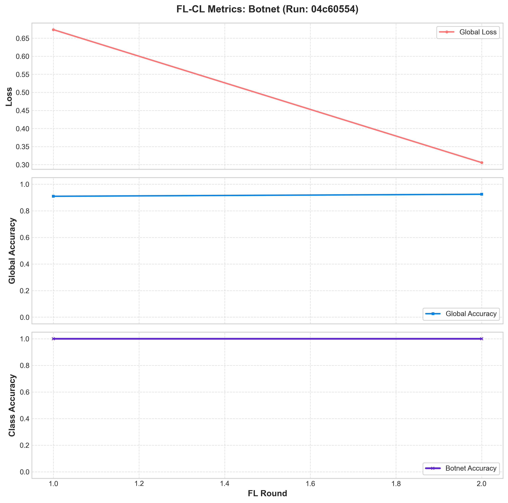
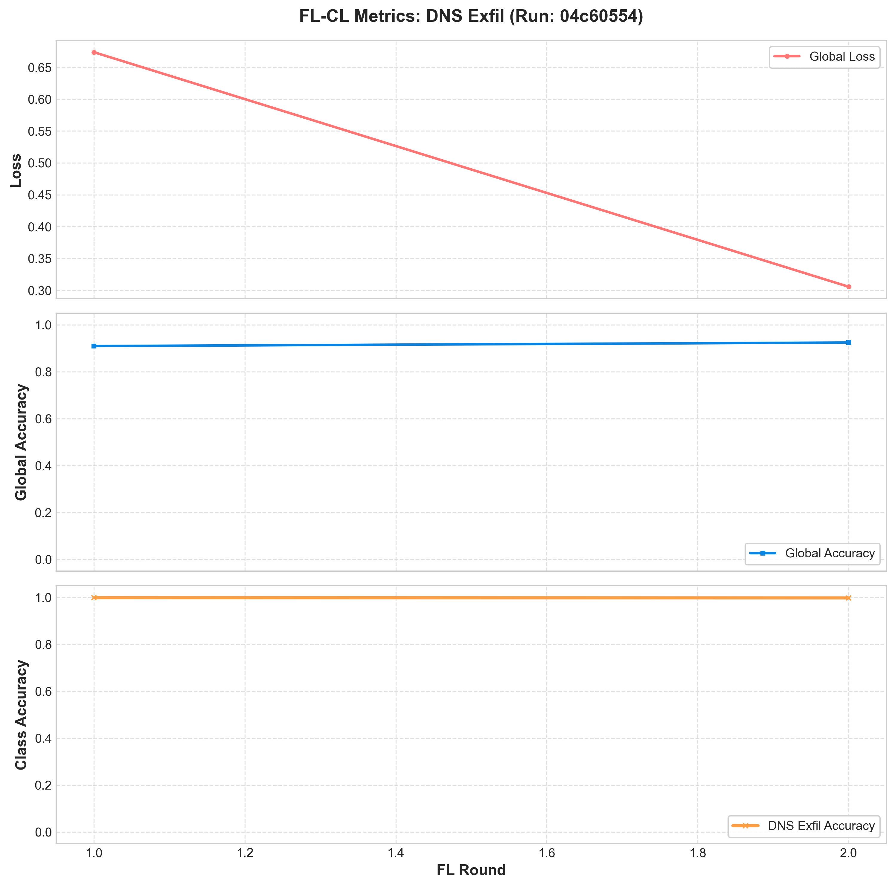
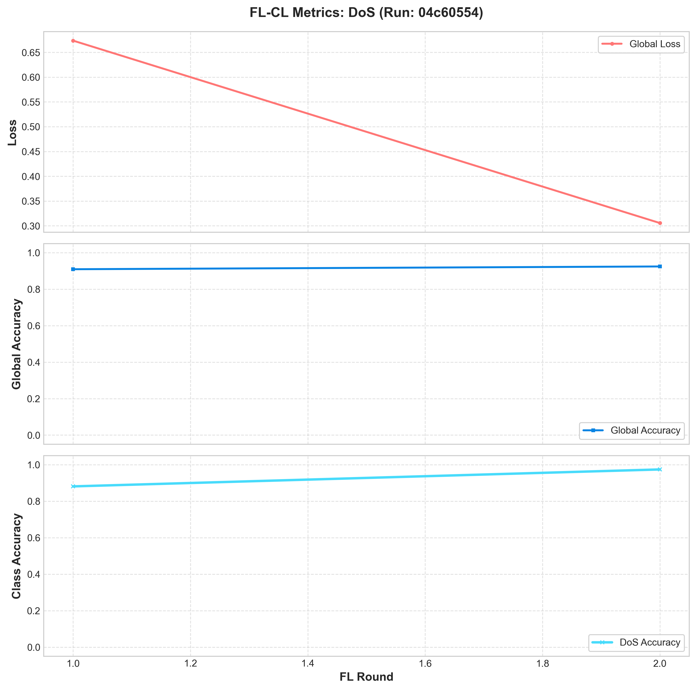
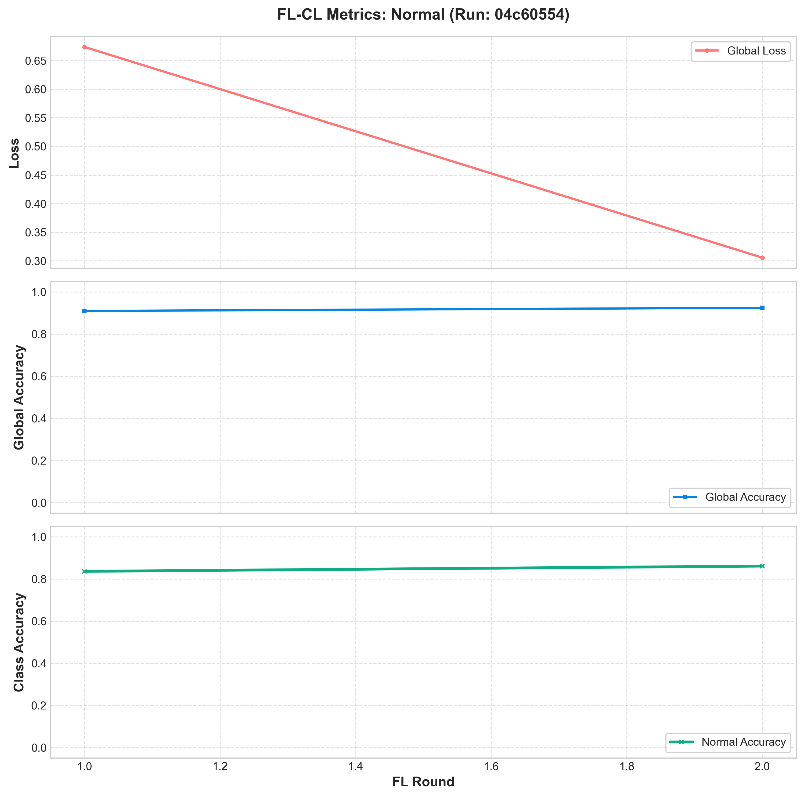
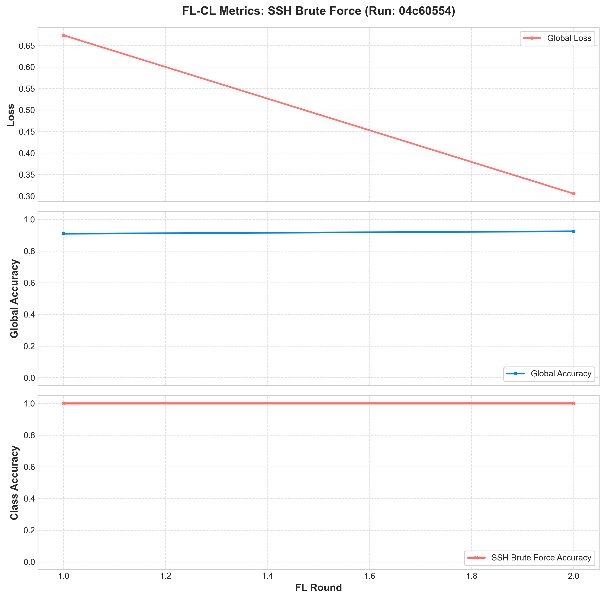

# FL-CL Experiment Run Summary: FL-CL-EWC-Baseline

- **MLflow Run ID**: `04c605546c1f4ff69b0585c775b4ac86`
- **Total FL Rounds**: `2`
- **Continual Learning (EWC) Lambda**: `0.1`
- **Generated At**: 2026-06-29 03:14:47

## Final Metrics Summary
| Metric | Value |
|:---|:---|
| accuracy | 0.924327 |
| accuracy_class_0 | 0.860856 |
| accuracy_class_1 | 1.000000 |
| accuracy_class_2 | 0.997757 |
| accuracy_class_3 | 1.000000 |
| accuracy_class_4 | 0.973996 |
| best_loss | 0.305564 |
| best_round | 2.000000 |
| final_best_loss | 0.305564 |
| final_best_round | 2.000000 |
| loss | 0.305564 |

## Convergence Plots per Traffic Class
Click on each class below to view its convergence plot (incorporating Loss, Global Accuracy, and Class Accuracy):

### Botnet Convergence Plot

### DNS Exfil Convergence Plot

### DoS Convergence Plot

### Normal Convergence Plot

### SSH Brute Force Convergence Plot

