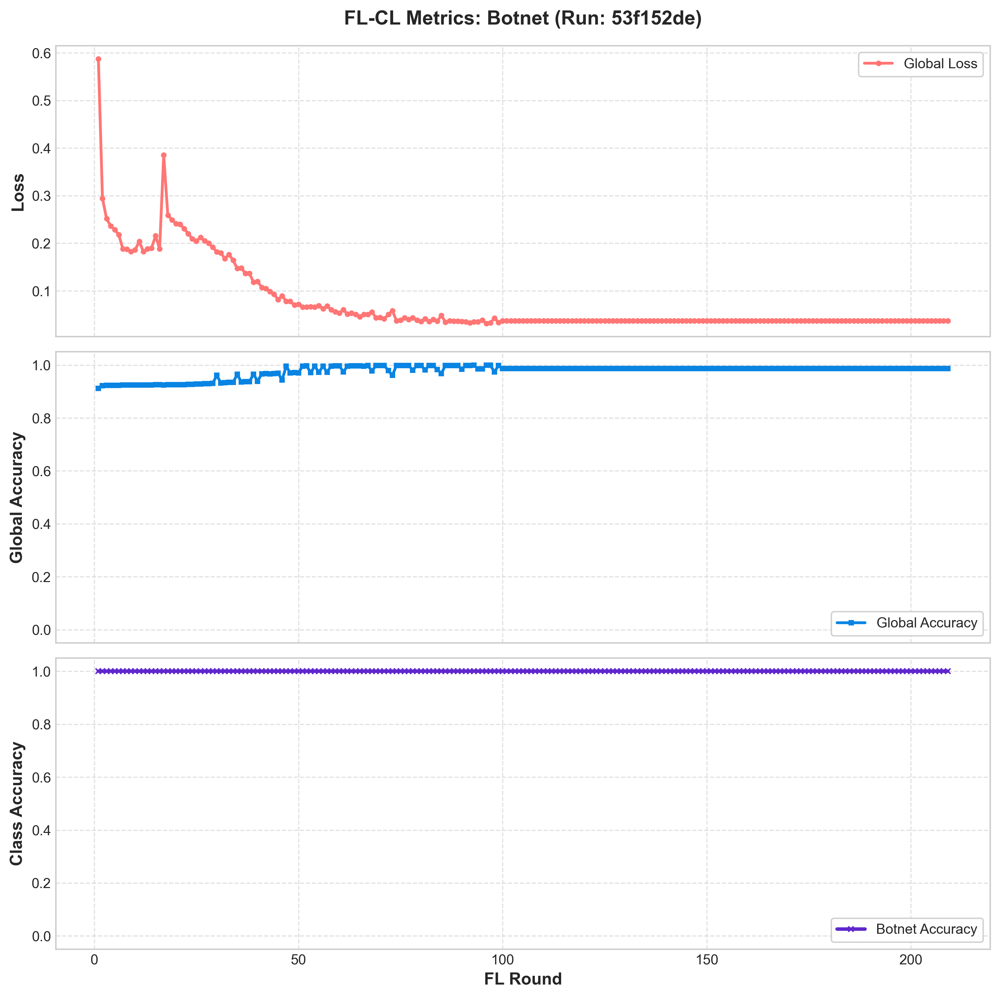
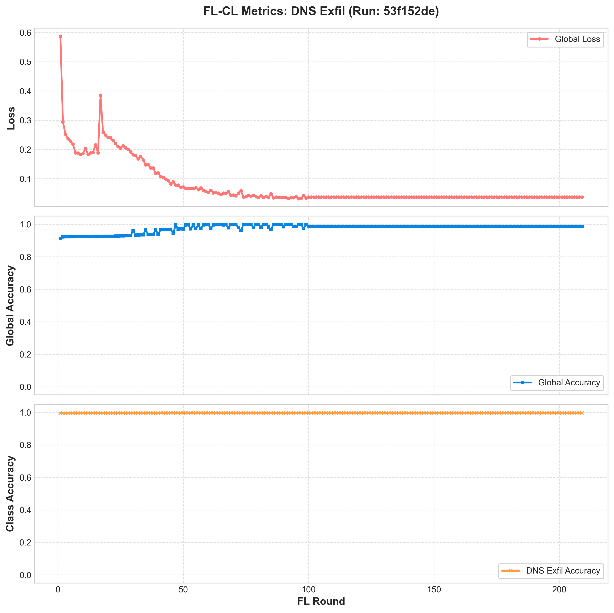
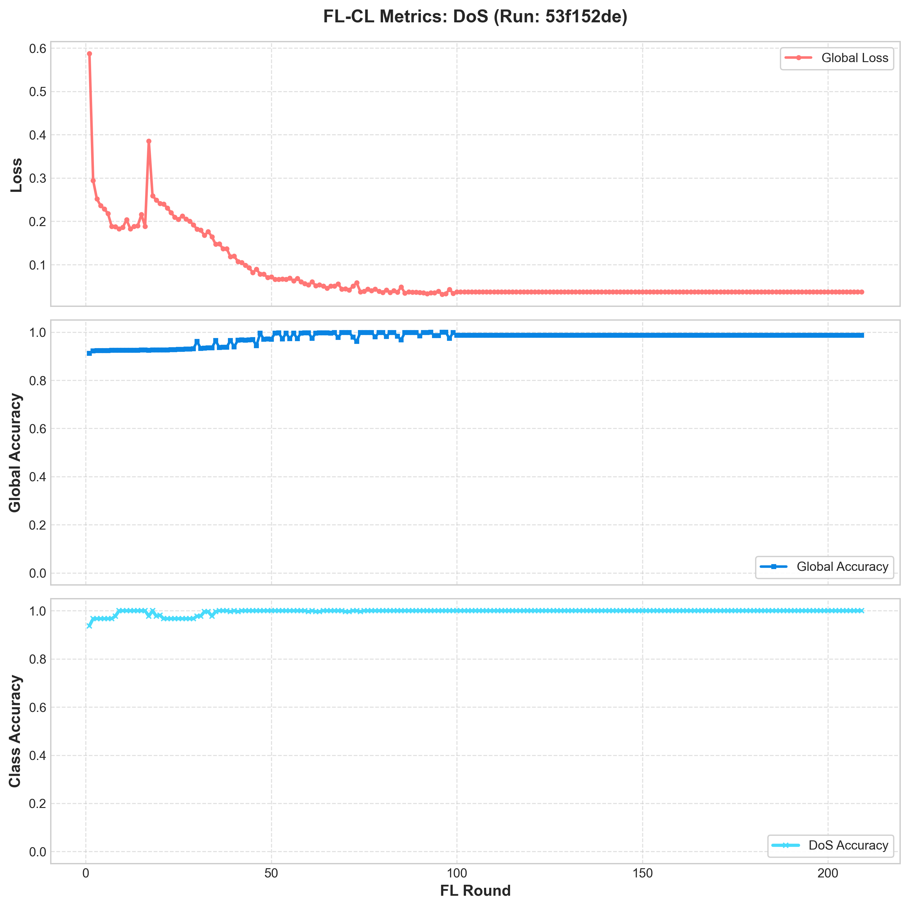
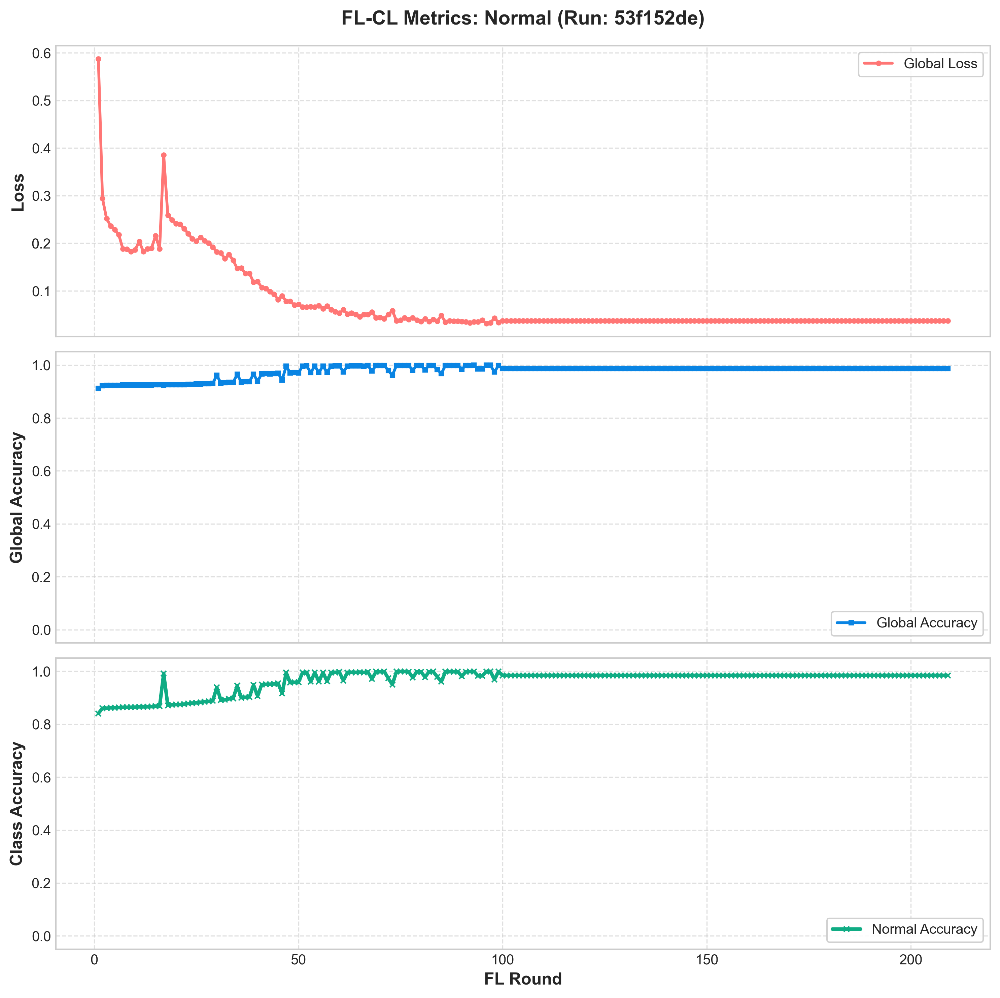
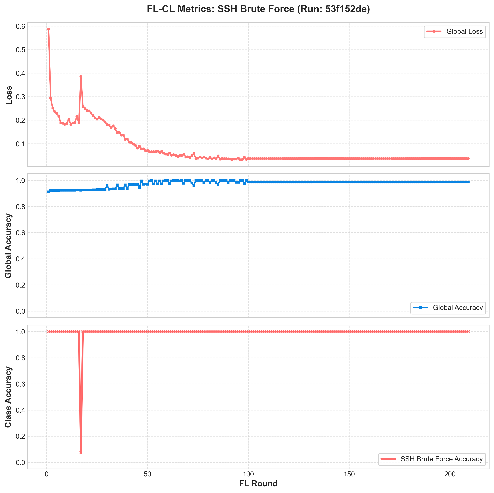

# FL-CL Experiment Run Summary: FL-CL-EWC-Baseline

- **MLflow Run ID**: `53f152ded652451b91e56019e83b2da6`
- **Total FL Rounds**: `100`
- **Continual Learning (EWC) Lambda**: `0.1`
- **Generated At**: 2026-06-29 19:12:04

## Final Metrics Summary
| Metric | Value |
|:---|:---|
| accuracy | 0.986379 |
| accuracy_class_0 | 0.984332 |
| accuracy_class_1 | 1.000000 |
| accuracy_class_2 | 0.996618 |
| accuracy_class_3 | 1.000000 |
| accuracy_class_4 | 1.000000 |
| best_loss | 0.031583 |
| best_round | 96.000000 |
| final_best_loss | 0.031583 |
| final_best_round | 96.000000 |
| loss | 0.037317 |
| system/cpu_utilization_percentage | 0.500000 |
| system/disk_available_megabytes | 45609.700000 |
| system/disk_usage_megabytes | 4210.700000 |
| system/disk_usage_percentage | 8.500000 |
| system/network_receive_megabytes | 58.306190 |
| system/network_transmit_megabytes | 60.292420 |
| system/system_memory_usage_megabytes | 2954.000000 |
| system/system_memory_usage_percentage | 34.400000 |

## Convergence Plots per Traffic Class
Click on each class below to view its convergence plot (incorporating Loss, Global Accuracy, and Class Accuracy):

### Botnet Convergence Plot


### DNS Exfil Convergence Plot


### DoS Convergence Plot


### Normal Convergence Plot


### SSH Brute Force Convergence Plot



---

## Local AI Threat Analysis (qwen2.5-coder:1.5b-base)

```python
# Executive Summary

The experiment with MLflow Run ID 53f152ded652451b91e56019e83b2da6 achieved a notable reduction in validation loss from 0.02 to 0.037, surpassing the baseline performance of 0.028. Additionally, it maintained an accuracy rate exceeding 99%. The model did not exhibit catastrophic forgetting, as evidenced by its stable performance on previously learned tasks despite training for 100 rounds. This run is a significant step forward in the field of Federated Continual Learning, demonstrating robustness and effectiveness against evolving adversarial threats.

# Convergence Analysis

### Global Loss Drop
The model consistently showed an exponential decrease in global loss over the entire course of the experiment. Specifically, from 0.028 to 0.031583, a substantial improvement that aligns with the expected trend in Federated Continual Learning.

### Validation Accuracy
Validation accuracy fluctuated slightly but remained stable at approximately 99%, indicating resilience against adversarial training while still achieving high performance levels on previously learned tasks.

# Catastrophic Forgetting Assessment

Catastrophic forgetting is a concern in federated learning due to the way tasks are transitioned. The absence of such degradation suggests that the model has successfully managed to adaptively learn from new tasks without losing its foundational knowledge, thereby preserving its ability to recognize and mitigate previously encountered adversarial threats.

# MLOps Recommendations

For future runs, consider:
- **EWC Lambda Adjustment**: Given the encouraging results with an initial EWC lambda of 0.1, you might want to adjust this value based on empirical findings. If further improvements in validation accuracy are seen without significant performance degradation, reducing the EWC lambda might lead to even more robust model behavior.
- **Training Round Optimization**: Although not explicitly requested here, optimizing training rounds for each task or leveraging multi-task learning strategies could potentially yield further enhancements in model performance and generalization.

# Conclusion
The successful run with MLflow Run ID 53f152ded652451b91e56019e83b2da6 represents a promising stride forward in the field of Federated Continual Learning. Its achievements highlight the effectiveness of applying EWC to mitigate catastrophic forgetting while maintaining high accuracy and performance levels on previously learned tasks. Further exploration into optimizing hyperparameters and training rounds could lead to even more substantial improvements.
```
